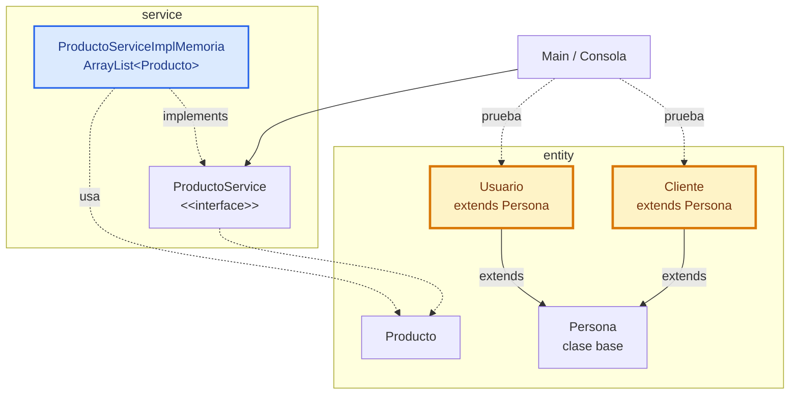

# Taller POO 01 - Construir el producto U1 en consola

Este taller guía la construcción del producto de la Unidad 1 en `comarket-cli`: una aplicación de consola orientada a objetos, con entidades del dominio, herencia, servicio CRUD, `ArrayList`, validaciones básicas y menú de ejecución.

## 1. Objetivo del taller

Al finalizar, el estudiante tendrá un producto U1 ejecutable desde consola con esta arquitectura:



## 2. Carpeta de trabajo

Trabajar dentro de:

```text
comarket-cli/
```

Estructura esperada:

```text
comarket-cli/
├── pom.xml
└── src/
    └── main/
        └── java/
            └── com/upeu/comarket/
                ├── app/Main.java
                ├── entity/Persona.java
                ├── entity/Cliente.java
                ├── entity/Usuario.java
                ├── entity/Producto.java
                ├── service/ProductoService.java
                └── service/ProductoServiceImplMemoria.java
```

## 3. Crear el proyecto Maven

El proyecto usa Java 17 y ejecuta `com.upeu.comarket.app.Main`.

Desde `comarket-cli`:

```bash
mvn compile
mvn exec:java
```

Para generar primero el JAR ejecutable:

```bash
mvn clean package
java -jar target/comarket-cli-1.0-SNAPSHOT.jar
```

## 4. Compilar a ejecutable nativo

Requisito: tener GraalVM JDK instalado y `native-image` disponible en la terminal.

### 4.1 Instalar GraalVM

En Windows no se necesita SDKMAN. Se puede instalar GraalVM descargando el ZIP oficial y configurando `JAVA_HOME`:

```powershell
$version="17"
$zip="$env:TEMP\graalvm-jdk-$version.zip"
$dest="C:\java"
New-Item -ItemType Directory -Force -Path $dest
Invoke-WebRequest -Uri "https://download.oracle.com/graalvm/$version/latest/graalvm-jdk-$version`_windows-x64_bin.zip" -OutFile $zip
Expand-Archive -Path $zip -DestinationPath $dest -Force
$graalHome=(Get-ChildItem $dest -Directory | Where-Object Name -Like "graalvm-jdk-$version*").FullName
[Environment]::SetEnvironmentVariable("JAVA_HOME", $graalHome, "User")
[Environment]::SetEnvironmentVariable("Path", "$graalHome\bin;" + [Environment]::GetEnvironmentVariable("Path", "User"), "User")
```

Después de ejecutar esos comandos, cerrar y abrir una terminal nueva.

En Windows, `native-image` también necesita las herramientas de compilación C++ de Visual Studio. Si aparece un error relacionado con compilador C/C++, instalar **Build Tools for Visual Studio** con la carga **Desktop development with C++** y volver a abrir la terminal.

En Linux/macOS o WSL, SDKMAN sí puede usarse:

```bash
curl -s "https://get.sdkman.io" | bash
source "$HOME/.sdkman/bin/sdkman-init.sh"
sdk list java
sdk install java <version>-graal
sdk default java <version>-graal
```

Reemplazar `<version>-graal` por una versión mostrada por `sdk list java`.

### 4.2 Verificar instalación

Verificar:

```bash
java -version
native-image --version
```

Si aparece el error `native-image no se reconoce`, la terminal todavía no está usando GraalVM. En Windows se puede probar temporalmente así:

```powershell
$env:JAVA_HOME="C:\ruta\a\graalvm-jdk-17"
$env:Path="$env:JAVA_HOME\bin;$env:Path"
java -version
native-image --version
```

Para configurarlo de forma permanente:

1. Instalar GraalVM JDK.
2. Crear o actualizar la variable `JAVA_HOME` con la ruta de GraalVM.
3. Agregar `%JAVA_HOME%\bin` al inicio de `Path`.
4. Cerrar y abrir una terminal nueva.
5. Ejecutar nuevamente `native-image --version`.

### 4.3 Generar el ejecutable

Generar el ejecutable nativo desde `comarket-cli`:

```bash
native-image -jar target/comarket-cli-1.0-SNAPSHOT.jar comarket-cli
```

Ejecutar en Windows:

```bash
.\comarket-cli.exe
```

Ejecutar en Linux/macOS:

```bash
./comarket-cli
```

## 5. Entidades del dominio

El modelo mínimo tiene cuatro clases:

| Clase | Responsabilidad |
|---|---|
| `Persona` | Reúne datos comunes: DNI, nombre y email. |
| `Cliente` | Hereda de `Persona` y representa al cliente del negocio. |
| `Usuario` | Hereda de `Persona` y representa al usuario interno del sistema. |
| `Producto` | Entidad principal para registrar, listar, buscar, actualizar y eliminar. |

## 6. Servicio CRUD

`ProductoService` define el contrato:

```java
void registrar(Producto producto);
List<Producto> listar();
Producto buscarPorCodigo(String codigo);
boolean actualizar(Producto producto);
boolean eliminar(String codigo);
```

`ProductoServiceImplMemoria` implementa el contrato usando:

```java
private final List<Producto> productos = new ArrayList<>();
```

Reglas mínimas:

1. No registrar códigos repetidos.
2. No permitir nombre vacío.
3. No permitir precio negativo.
4. No permitir stock negativo.
5. Buscar, actualizar y eliminar por código.

## 7. Menú de consola

`Main` debe usar el contrato, no depender directamente de la implementación:

```java
ProductoService service = new ProductoServiceImplMemoria();
```

Opciones mínimas:

```text
1. Registrar producto
2. Listar productos
3. Buscar producto
4. Actualizar producto
5. Eliminar producto
6. Ver personas de prueba
0. Salir
```

## 8. Pruebas mínimas

Registrar:

```text
Codigo: P001
Nombre: Arroz
Precio: 4.50
Stock: 20
```

Probar:

1. Listar productos.
2. Buscar `P001`.
3. Actualizar precio y stock.
4. Eliminar `P001`.
5. Intentar registrar un código repetido.
6. Intentar registrar precio negativo.

## 9. Evidencia de entrega

Entregar un PDF con:

1. Captura de estructura de paquetes.
2. Captura de `Producto`, `Persona`, `Cliente` y `Usuario`.
3. Captura de `ProductoService`.
4. Captura de `ProductoServiceImplMemoria`.
5. Captura del menú ejecutándose.
6. Evidencia de registrar, listar, buscar, actualizar y eliminar.
7. Explicación breve de dónde se aplica encapsulamiento, herencia, interface, polimorfismo y `ArrayList`.

Nombre sugerido:

```text
Taller01_Equipo##_ApellidoNombre.pdf
```

## 10. Criterios de revisión

| Criterio | Logro esperado |
|---|---|
| Entidades | `Producto`, `Persona`, `Cliente` y `Usuario` están encapsuladas. |
| Herencia | `Cliente` y `Usuario` extienden de `Persona`. |
| Servicio | `ProductoService` define el contrato CRUD. |
| Polimorfismo | `Main` usa `ProductoService`, no la implementación directamente. |
| Memoria | `ProductoServiceImplMemoria` usa `ArrayList<Producto>`. |
| Menú | El CRUD se prueba desde consola. |
| Validación | Hay controles básicos de datos obligatorios, precio, stock y código repetido. |
