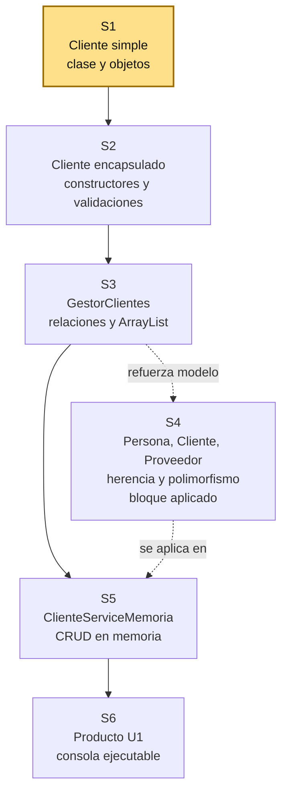
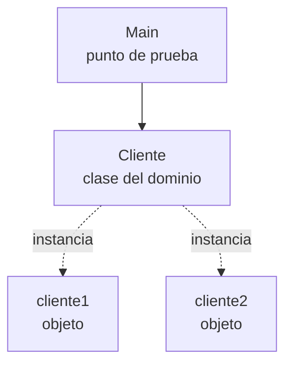

# S1 - Clases, objetos y responsabilidad de clase

## 1. Introduccion

Tiempo: 20 min.

### 1.1 Proposito

Iniciar una aplicacion de consola mediante clases simples del dominio, objetos creados desde `Main` y pruebas por salida de texto.

### 1.2 Resultado de aprendizaje

El estudiante diferencia clase y objeto, define atributos y metodos, crea instancias y explica la responsabilidad basica de una clase del dominio.

### 1.3 Producto de sesion

Proyecto Java simple en VS Code con una primera clase del dominio, objetos instanciados desde `Main` y salida por consola.

### 1.4 Motivacion de la sesion

#### 1.4.1 Caso: sistema de dominio inicial

Una organizacion necesita ordenar la informacion de un proceso de negocio. Puede tratarse de ventas, biblioteca, reservas, inventario, matriculas, atencion de clientes u otro contexto definido por el docente.

Antes de construir pantallas, base de datos o reportes, el sistema necesita representar objetos del dominio. En POO, esos objetos nacen a partir de clases.

Preguntas para los estudiantes:

1. Que objetos reales aparecen en el dominio elegido?
2. Que datos necesita guardar uno de esos objetos?
3. Que comportamiento podria tener ese objeto?
4. Por que no conviene escribir todo directamente en `Main`?

En esta sesion se inicia el proyecto creando el primer objeto del dominio y probandolo desde consola.

### 1.5 Ubicacion en el curso

- Unidad: U1 - Fundamentos de la Programacion Orientada a Objetos.
- Producto de unidad: aplicacion de consola en memoria con entidades, relaciones, colecciones y CRUD.
- Avance del producto en esta sesion: primeras clases del dominio probadas desde `Main`.

Roadmap para elaborar el producto de la unidad:



Hoy se construye el primer componente real de la U1: una clase `Cliente` simple con objetos creados desde `Main`. La ruta principal avanza hacia encapsulamiento, gestor con colecciones y CRUD en memoria. La herencia y el polimorfismo se trabajan como bloque aplicado entre S3 y S5: refuerzan el modelo y preparan el contrato `ClienteService`, pero no deben sentirse como un adorno aislado.

## 2. Explica

Tiempo: 25 min.

### 2.1 Conceptos clave

Una clase es un molde para crear objetos. Un objeto es una instancia concreta que tiene estado y comportamiento.

Ejemplo base: `Cliente` puede representar una persona atendida por el sistema. El docente puede cambiarlo por `Libro`, `Reserva`, `Estudiante`, `Proveedor` u otra entidad segun el proyecto elegido. Sus atributos describen el estado y sus metodos expresan comportamiento.

Conceptos de la sesion:

- Clase como molde.
- Objeto como instancia.
- Atributos como estado.
- Metodos como comportamiento.
- Responsabilidad de clase.
- `Main` como punto de prueba inicial.
- Salida por consola como evidencia de ejecucion.

### 2.2 Arquitectura de la sesion



Regla practica:

- `Main` se usa para probar.
- La clase del dominio representa una responsabilidad del negocio.
- Los objetos son instancias concretas de la clase.
- Los atributos guardan estado.
- Los metodos muestran o procesan comportamiento propio del objeto.

### 2.3 Flujo de trabajo

1. Preparar VS Code y Java.
2. Crear un proyecto Java simple.
3. Crear la clase del dominio.
4. Definir atributos y metodos basicos.
5. Crear objetos desde `Main`.
6. Ejecutar el programa por consola.
7. Registrar evidencia y explicar responsabilidades.

### 2.4 Errores frecuentes y diagnostico

| Problema | Causa probable | Solucion |
|---|---|---|
| No ejecuta `Main` | Falta metodo `public static void main` | Revisar firma del metodo |
| No reconoce la clase | Archivo, clase o paquete no coincide | Revisar nombre de archivo y paquete |
| Los datos salen en cero o `null` | No se asignaron valores al objeto | Inicializar atributos antes de imprimir |
| Todo esta en `Main` | No se separo la responsabilidad | Mover datos y comportamiento a una clase |
| Salida poco clara | Falta metodo para mostrar informacion | Crear un metodo como `mostrarInformacion` |

## 3. Aplica: actividad practica guiada

En el laboratorio, el docente guia la creacion del primer objeto del dominio y los estudiantes verifican el resultado ejecutando el programa desde VS Code.

Tiempo: 2h.

### 3.1 Preparar ambiente local: Java 17, Maven y VS Code

**Producto del paso:** ambiente local con Java 17, Maven y VS Code verificados, listo para crear y ejecutar clases Java desde consola.

Herramientas necesarias:

- Java 17.
- Maven 3.x.
- VS Code.
- Extension Pack for Java.
- Terminal integrada de VS Code.

En esta sesion se usa un proyecto Java simple. Maven se verifica desde el inicio porque sera necesario para organizar la entrega de la U1 en sesiones posteriores.

#### 3.1.1 Instalar gestor de paquetes, si hace falta

Windows PowerShell, si no tienes Chocolatey:

```powershell
Set-ExecutionPolicy Bypass -Scope Process -Force; [System.Net.ServicePointManager]::SecurityProtocol = [System.Net.ServicePointManager]::SecurityProtocol -bor 3072; iex ((New-Object System.Net.WebClient).DownloadString('https://community.chocolatey.org/install.ps1'))
```

Luego cierra y vuelve a abrir PowerShell.

macOS bash/zsh, si no tienes Homebrew:

```bash
/bin/bash -c "$(curl -fsSL https://raw.githubusercontent.com/Homebrew/install/HEAD/install.sh)"
```

Luego cierra y vuelve a abrir Terminal.

#### 3.1.2 Instalar Java 17

Windows PowerShell con Chocolatey:

```powershell
choco install temurin17 -y
```

macOS bash/zsh con Homebrew:

```bash
brew install --cask temurin@17
```

Linux Debian/Ubuntu bash:

```bash
sudo apt update
sudo apt install -y openjdk-17-jdk
```

#### 3.1.3 Instalar Maven 3.x

Windows PowerShell con Chocolatey:

```powershell
choco install maven -y
```

macOS bash/zsh con Homebrew:

```bash
brew install maven
```

Linux Debian/Ubuntu bash:

```bash
sudo apt update
sudo apt install -y maven
```

#### 3.1.4 Instalar VS Code y Extension Pack for Java

Windows PowerShell con Chocolatey:

```powershell
choco install vscode -y
```

macOS bash/zsh con Homebrew:

```bash
brew install --cask visual-studio-code
```

Linux Debian/Ubuntu bash:

```bash
sudo snap install code --classic
```

En VS Code, instalar la extension:

```text
Extension Pack for Java
```

#### 3.1.5 Verificar instalacion

Verificar Java 17:

```bash
java -version
```

Resultado esperado:

```text
version 17
```

Verificar Maven:

```bash
mvn -version
```

Resultado esperado:

```text
Apache Maven 3.x
```

### 3.2 Crear proyecto Java simple

**Producto del paso:** carpeta de trabajo con estructura inicial.

1. Crear una carpeta para el proyecto.
2. Abrir la carpeta en VS Code.
3. Crear una carpeta `src`.
4. Crear el archivo `Main.java`.
5. Ejecutar un mensaje simple para comprobar el entorno.

Ejemplo:

```java
public class Main {
    public static void main(String[] args) {
        System.out.println("Proyecto iniciado");
    }
}
```

### 3.3 Crear la primera clase del dominio

**Producto del paso:** clase del dominio con estado y comportamiento basico.

Crear una clase del dominio. En este ejemplo se usa `Cliente.java`, pero puede reemplazarse por la entidad del proyecto elegido:

```java
public class Cliente {
    String nombre;
    String documento;
    String telefono;

    void mostrarInformacion() {
        System.out.println(nombre + " - Doc: " + documento + " - Tel: " + telefono);
    }
}
```

### 3.4 Crear objetos desde Main

**Producto del paso:** objetos instanciados y visibles por consola.

Actualizar `Main.java`:

```java
public class Main {
    public static void main(String[] args) {
        Cliente cliente1 = new Cliente();
        cliente1.nombre = "Ana Torres";
        cliente1.documento = "76543210";
        cliente1.telefono = "987654321";

        Cliente cliente2 = new Cliente();
        cliente2.nombre = "Luis Ramos";
        cliente2.documento = "71234567";
        cliente2.telefono = "912345678";

        cliente1.mostrarInformacion();
        cliente2.mostrarInformacion();
    }
}
```

### 3.5 Verificar responsabilidad de clase

**Producto del paso:** explicacion breve de que hace cada clase.

Completar una tabla simple:

| Clase | Responsabilidad |
|---|---|
| `Main` | Crear objetos y probar la ejecucion |
| `Cliente` o entidad elegida | Representar un objeto principal del dominio |

## 4. Crea: actividad autonoma

Tiempo: 2h fuera del aula.

Extiende el modelo inicial creando otra entidad del dominio, por ejemplo `Proveedor`, `Empleado` o `Usuario`.

Entrega evidencia breve con:

- Codigo de la clase creada.
- Codigo de prueba desde `Main`.
- Captura o salida de consola.
- Explicacion de la responsabilidad de cada clase.

## 5. Cierre evaluativo

Tiempo: 20 min.

### 5.1 Resultados esperados

- El proyecto ejecuta desde VS Code.
- Existe al menos una clase del dominio.
- Se crean objetos desde `Main`.
- La salida por consola demuestra el estado del objeto.
- El estudiante explica que responsabilidad tiene cada clase.

### 5.2 Preguntas de defensa

1. Cual es la diferencia entre clase y objeto?
2. Que representa el estado de un objeto?
3. Por que una clase debe tener una responsabilidad clara?
4. Que parte del codigo crea los objetos?
5. Que responsabilidad tiene `Main` en esta primera sesion?
