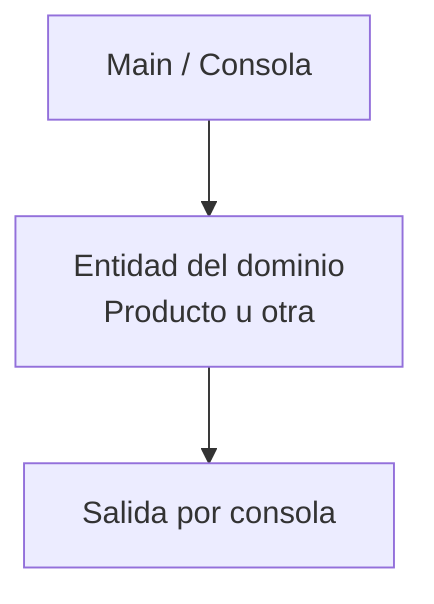

# S1 - Clases, objetos y responsabilidad de clase

## 1. Introducción

Tiempo: 20 min.

### 1.1 Propósito

Iniciar CoMarket en memoria mediante clases simples del dominio, objetos creados desde `Main` y pruebas por consola.

### 1.2 Resultado de aprendizaje

El estudiante diferencia clase y objeto, define atributos y métodos, crea instancias y explica la responsabilidad básica de una clase del dominio.

### 1.3 Producto de sesión

Proyecto Java simple en VS Code con una entidad inicial, objetos instanciados desde `Main` y salida por consola.

### 1.4 Motivación de la sesión

CoMarket inicia como una pequeña aplicación de consola. Antes de pensar en pantallas o base de datos, el sistema necesita representar objetos reales del negocio, por ejemplo productos, clientes, ventas o proveedores.

Pregunta guía:

```text
¿Qué información y comportamiento debe tener un objeto para representar una parte del negocio?
```

### 1.5 Ubicación en el curso

- Unidad: U1 - Fundamentos de la Programación Orientada a Objetos.
- Producto de unidad: aplicación de consola en memoria con entidades, relaciones, colecciones y CRUD.
- Avance de sesión: primeras clases del dominio probadas desde `Main`.

## 2. Explica

Tiempo: 25 min.

### 2.1 Conceptos clave

- Clase como molde.
- Objeto como instancia.
- Atributos como estado.
- Métodos como comportamiento.
- Responsabilidad de clase.
- Método `main` como punto de prueba inicial.

### 2.2 Arquitectura de la sesión



## 3. Aplica: actividad práctica guiada

Tiempo: 2h.

1. Crear un proyecto Java simple en VS Code.
2. Crear el paquete base del proyecto.
3. Crear una clase del dominio, por ejemplo `Producto`.
4. Agregar atributos básicos: nombre, precio y stock.
5. Agregar métodos para mostrar información del objeto.
6. Crear objetos desde `Main`.
7. Imprimir resultados por consola.

## 4. Crea: actividad autónoma

Tiempo: 2h fuera del aula.

Extiende el modelo inicial creando otra entidad del dominio, por ejemplo `Cliente`, `Proveedor` o `Usuario`.

Entrega evidencia breve con:

- Código de la clase.
- Código de prueba desde `Main`.
- Captura o salida de consola.
- Explicación de la responsabilidad de cada clase.

## 5. Cierre evaluativo

Tiempo: 20 min.

### 5.1 Resultados esperados

- El proyecto ejecuta desde VS Code.
- Existe al menos una clase del dominio.
- Se crean objetos desde `Main`.
- La salida por consola demuestra el estado del objeto.
- El estudiante explica qué responsabilidad tiene cada clase.

### 5.2 Preguntas de defensa

1. ¿Cuál es la diferencia entre clase y objeto?
2. ¿Qué representa el estado de un objeto?
3. ¿Por qué una clase debe tener una responsabilidad clara?
4. ¿Qué parte del código crea los objetos?

