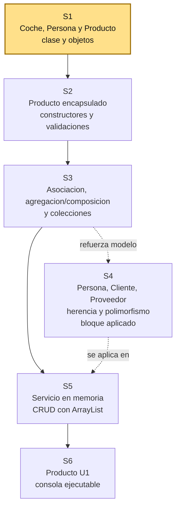
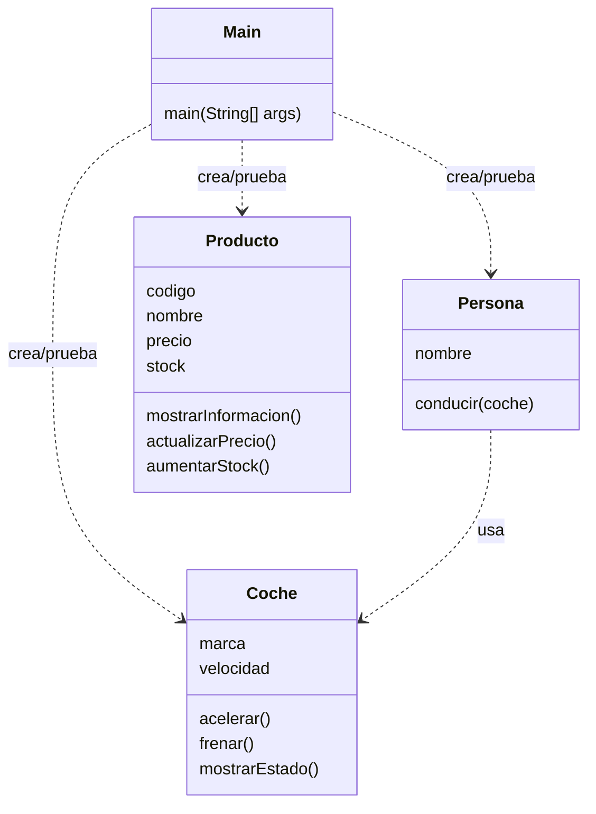

# S1 - Clases, objetos y responsabilidad de clase

## 1. Introduccion

Tiempo: 20 min.

### 1.1 Proposito

Iniciar una aplicacion de consola mediante clases simples del dominio, objetos creados desde `Main` y pruebas por salida de texto.

### 1.2 Resultado de aprendizaje

El estudiante diferencia clase y objeto, define atributos y metodos, crea instancias y explica la responsabilidad basica de una clase del dominio.

### 1.3 Producto de sesion

Proyecto Java simple en VS Code con una primera clase del dominio, objetos instanciados desde `Main` y salida por consola.

### 1.4 Motivacion de la sesion

#### 1.4.1 Caso: sistema de dominio inicial

Una organizacion necesita ordenar la informacion de un proceso de negocio. Puede tratarse de ventas, biblioteca, reservas, inventario, matriculas, atencion de clientes u otro contexto definido por el docente.

Antes de construir pantallas, base de datos o reportes, el sistema necesita representar objetos del dominio. En POO, esos objetos nacen a partir de clases.

Preguntas para los estudiantes:

1. Que objetos reales aparecen en el dominio elegido?
2. Que datos necesita guardar uno de esos objetos?
3. Que comportamiento podria tener ese objeto?
4. Por que no conviene escribir todo directamente en `Main`?

En esta sesion se inicia el proyecto creando el primer objeto del dominio y probandolo desde consola.

### 1.5 Ubicacion en el curso

- Unidad: U1 - Fundamentos de la Programacion Orientada a Objetos.
- Producto de unidad: aplicacion de consola en memoria con entidades, relaciones, colecciones y CRUD.
- Avance del producto en esta sesion: primeras clases del dominio probadas desde `Main`.

Roadmap para elaborar el producto de la unidad:



Hoy se inicia con objetos tangibles del mundo real: `Coche` y `Persona`. Luego se trabaja `Producto` como segundo ejemplo preparatorio para S2. La ruta principal avanza hacia encapsulamiento, servicios con colecciones y CRUD en memoria. La herencia y el polimorfismo se trabajan como bloque aplicado entre S3 y S5: refuerzan el modelo y preparan el contrato de servicio, pero no deben sentirse como un adorno aislado.

## 2. Explica

Tiempo: 25 min.

### 2.1 Conceptos clave

Una clase es un molde para crear objetos. Un objeto es una instancia concreta que tiene estado y comportamiento.

Ejemplo base: `Coche` y `Persona` permiten iniciar desde objetos tangibles. Un coche tiene marca y velocidad; una persona tiene nombre y puede conducir. Luego se usa `Producto` para observar cambios naturales de estado como precio y stock, preparando la S2.

Conceptos de la sesion:

- Clase como molde.
- Objeto como instancia.
- Atributos como estado.
- Metodos como comportamiento.
- Abstraccion inicial del dominio.
- Responsabilidad de clase.
- `Main` como punto de prueba inicial.
- Salida por consola como evidencia de ejecucion.

Alcance metodologico de S1:

```text
En S1 se llega hasta clase, objeto, atributos, metodos, estado,
comportamiento, abstraccion inicial y responsabilidad de clase.

El constructor no se desarrolla como tema fuerte en esta sesion.
Se puede mencionar que existe, pero su uso formal queda para S2,
cuando se trabaje encapsulamiento y control del estado.
```

### 2.2 Arquitectura de la sesion



Convencion del diagrama: cada clase muestra sus atributos y metodos principales; `..>` indica dependencia o uso temporal desde la prueba.

Regla practica:

- `Main` se usa para probar.
- La clase representa caracteristicas y acciones de un objeto del mundo real.
- Los objetos son instancias concretas de la clase.
- Los atributos guardan estado.
- Los metodos muestran o procesan comportamiento propio del objeto.
- La abstraccion consiste en elegir solo los datos y comportamientos necesarios para esta primera version.

### 2.3 Flujo de trabajo

1. Preparar VS Code y Java.
2. Crear un proyecto Java simple.
3. Abstraer objetos tangibles del mundo real.
4. Definir la responsabilidad inicial de la clase.
5. Elegir atributos y metodos coherentes con sus caracteristicas y acciones.
6. Crear `Coche` y `Persona` para observar colaboracion simple.
7. Crear `Producto` como ejemplo puente hacia S2.
8. Ejecutar el programa por consola.
9. Registrar evidencia y explicar responsabilidades.

### 2.4 Errores frecuentes y diagnostico

| Problema | Causa probable | Solucion |
|---|---|---|
| No ejecuta `Main` | Falta metodo `public static void main` | Revisar firma del metodo |
| No reconoce la clase | Archivo, clase o paquete no coincide | Revisar nombre de archivo y paquete |
| Los datos salen en cero o `null` | No se asignaron valores al objeto | Inicializar atributos antes de imprimir |
| Todo esta en `Main` | No se separo la responsabilidad | Mover datos y comportamiento a una clase |
| Salida poco clara | `Main` no imprime datos suficientes | Mejorar la salida desde `Main` sin meter consola en la entidad |
| La clase tiene metodos de muchas cosas | No se identificaron bien sus caracteristicas y acciones | Volver a la abstraccion inicial del objeto |
| Se usan constructores o `private` antes de tiempo | Se adelanto contenido de S2 | En S1 usar clases simples; el control del estado queda para S2 |

## 3. Aplica: actividad practica guiada

En el laboratorio, el docente guia la creacion del primer objeto del dominio y los estudiantes verifican el resultado ejecutando el programa desde VS Code.

Tiempo: 2h.

### 3.1 Preparar ambiente local: Java 17, Maven y VS Code

**Producto del paso:** ambiente local con Java 17, Maven y VS Code verificados, listo para crear y ejecutar clases Java desde consola.

Herramientas necesarias:

- Java 17.
- Maven 3.x.
- VS Code.
- Extension Pack for Java.
- Terminal integrada de VS Code.

En esta sesion se usa un proyecto Java simple. Maven se verifica desde el inicio porque sera necesario para organizar la entrega de la U1 en sesiones posteriores.

#### 3.1.1 Instalar gestor de paquetes, si hace falta

Windows PowerShell, si no tienes Chocolatey:

```powershell
Set-ExecutionPolicy Bypass -Scope Process -Force; [System.Net.ServicePointManager]::SecurityProtocol = [System.Net.ServicePointManager]::SecurityProtocol -bor 3072; iex ((New-Object System.Net.WebClient).DownloadString('https://community.chocolatey.org/install.ps1'))
```

Luego cierra y vuelve a abrir PowerShell.

macOS bash/zsh, si no tienes Homebrew:

```bash
/bin/bash -c "$(curl -fsSL https://raw.githubusercontent.com/Homebrew/install/HEAD/install.sh)"
```

Luego cierra y vuelve a abrir Terminal.

#### 3.1.2 Instalar Java 17

Windows PowerShell con Chocolatey:

```powershell
choco install temurin17 -y
```

macOS bash/zsh con Homebrew:

```bash
brew install --cask temurin@17
```

Linux Debian/Ubuntu bash:

```bash
sudo apt update
sudo apt install -y openjdk-17-jdk
```

#### 3.1.3 Instalar Maven 3.x

Windows PowerShell con Chocolatey:

```powershell
choco install maven -y
```

macOS bash/zsh con Homebrew:

```bash
brew install maven
```

Linux Debian/Ubuntu bash:

```bash
sudo apt update
sudo apt install -y maven
```

#### 3.1.4 Instalar VS Code y Extension Pack for Java

Windows PowerShell con Chocolatey:

```powershell
choco install vscode -y
```

macOS bash/zsh con Homebrew:

```bash
brew install --cask visual-studio-code
```

Linux Debian/Ubuntu bash:

```bash
sudo snap install code --classic
```

En VS Code, instalar la extension:

```text
Extension Pack for Java
```

#### 3.1.5 Verificar instalacion

Verificar Java 17:

```bash
java -version
```

Resultado esperado:

```text
version 17
```

Verificar Maven:

```bash
mvn -version
```

Resultado esperado:

```text
Apache Maven 3.x
```

### 3.2 Crear proyecto Java simple

**Producto del paso:** carpeta de trabajo con estructura inicial.

1. Crear una carpeta para el proyecto.
2. Abrir la carpeta en VS Code.
3. Crear una carpeta `src`.
4. Crear el archivo `Main.java`.
5. Ejecutar un mensaje simple para comprobar el entorno.

Ejemplo:

```java
public class Main {
    public static void main(String[] args) {
        System.out.println("Proyecto iniciado");
    }
}
```

### 3.3 Abstraer objetos tangibles: Coche y Persona

**Producto del paso:** dos clases candidatas identificadas desde el mundo real.

Antes de escribir codigo, observar objetos tangibles. Para iniciar, se usan `Coche` y `Persona` porque permiten distinguir caracteristicas, acciones y colaboracion entre objetos.

Completar una tabla de abstraccion inicial:

| Clase | Caracteristicas | Acciones |
|---|---|---|
| `Coche` | marca, velocidad | acelerar, frenar, mostrar estado |
| `Persona` | nombre | conducir |

En S1, responsabilidad de clase no significa responsabilidad legal, vial o moral. Significa identificar que caracteristicas y que acciones le corresponden a una clase dentro del programa.

Ejemplo:

```text
La Persona decide conducir.
El Coche ejecuta acelerar o frenar y cambia su propia velocidad.
```

Nota metodologica:

```text
En S1 todavia no se aplica SOLID de manera formal.
Tampoco se trabaja encapsulamiento ni constructores como tema fuerte.

El objetivo es entender clase, objeto, atributos, metodos, estado,
comportamiento, responsabilidad inicial y abstraccion.
```

### 3.4 Crear la clase Coche

**Producto del paso:** clase tangible con atributos, estado y metodos.

Crear `Coche.java`:

```java
public class Coche {
    String marca;
    int velocidad;

    void acelerar() {
        velocidad = velocidad + 10;
    }

    void frenar() {
        velocidad = velocidad - 10;
    }

    void mostrarEstado() {
        System.out.println(marca + " - Velocidad: " + velocidad);
    }
}
```

En este punto ya aparecen los primeros conceptos:

| Elemento del codigo | Concepto POO |
|---|---|
| `public class Coche` | Clase |
| `marca`, `velocidad` | Atributos |
| Valor actual de `velocidad` | Estado |
| `acelerar()` y `frenar()` | Metodos |
| Cambiar la velocidad | Comportamiento |

### 3.5 Crear la clase Persona

**Producto del paso:** segunda clase tangible que usa un objeto `Coche`.

Crear `Persona.java`:

```java
public class Persona {
    String nombre;

    void conducir(Coche coche) {
        System.out.println(nombre + " conduce el coche");
        coche.acelerar();
        coche.frenar();
    }
}
```

Lectura metodologica:

```text
Persona no cambia directamente la velocidad.
Persona usa acciones disponibles del Coche.
Coche modifica su propio estado.
```

La idea de pedales o volante puede usarse como analogia: la persona no manipula todo el motor; interactua mediante acciones visibles. La interface formal de Java se trabajara despues, en S4.

### 3.6 Crear objetos desde Main

**Producto del paso:** objetos `coche1` y `persona1` instanciados y visibles por consola.

Actualizar `Main.java`:

```java
public class Main {
    public static void main(String[] args) {
        Coche coche1 = new Coche();
        coche1.marca = "Toyota";
        coche1.velocidad = 0;

        Persona persona1 = new Persona();
        persona1.nombre = "Ana";

        coche1.mostrarEstado();
        persona1.conducir(coche1);
        coche1.mostrarEstado();
    }
}
```

En este punto se observa la diferencia entre clase y objeto:

| Elemento | Explicacion |
|---|---|
| `Coche` | Molde o definicion general |
| `coche1` | Objeto creado desde la clase `Coche` |
| `Persona` | Molde o definicion general |
| `persona1` | Objeto creado desde la clase `Persona` |
| Estado de `coche1` | Toyota, velocidad actual |

### 3.7 Identificar estado, comportamiento y responsabilidad inicial

**Producto del paso:** explicacion de como los objetos guardan datos, ejecutan acciones y colaboran.

Analizar el codigo creado:

```text
El estado de coche1 cambia cuando se ejecuta acelerar o frenar.
El comportamiento esta en los metodos de cada clase.
La responsabilidad inicial se entiende como caracteristicas y acciones
que le corresponden a cada clase.
```

Completar:

| Clase | Sabe | Puede |
|---|---|---|
| `Coche` | marca, velocidad | acelerar, frenar, mostrar estado |
| `Persona` | nombre | conducir un coche |

### 3.8 Ejemplo 2: Producto como preparacion para S2

**Producto del paso:** clase `Producto` simple con estado cambiante.

Ahora se usa `Producto` como segundo ejemplo porque en S2 se convertira en una clase encapsulada.

Crear `Producto.java`:

```java
public class Producto {
    String codigo;
    String nombre;
    double precio;
    int stock;

    void mostrarInformacion() {
        System.out.println(codigo + " - " + nombre + " - S/ " + precio + " - Stock: " + stock);
    }

    void actualizarPrecio(double nuevoPrecio) {
        precio = nuevoPrecio;
    }

    void aumentarStock(int cantidad) {
        stock = stock + cantidad;
    }
}
```

Probar desde `Main`:

```java
Producto producto1 = new Producto();
producto1.codigo = "P001";
producto1.nombre = "Teclado";
producto1.precio = 80.0;
producto1.stock = 10;

producto1.mostrarInformacion();
producto1.actualizarPrecio(75.0);
producto1.aumentarStock(5);
producto1.mostrarInformacion();
```

Lectura esperada:

```text
producto1 sigue siendo el mismo objeto.
Lo que cambio fue su estado: precio y stock.
En S2 se controlara mejor este cambio con encapsulamiento,
constructor, validaciones e invariantes simples.
```

## 4. Crea: actividad autonoma

Tiempo: 2h fuera del aula.

Extiende el modelo inicial creando otro par de clases tangibles que colaboren entre si, por ejemplo `Estudiante` y `Cuaderno`, `Jugador` y `Pelota`, o `Cliente` y `Carrito`. Luego crea una clase simple similar a `Producto` que pueda prepararse para encapsulamiento en S2.

Entrega evidencia breve con:

- Codigo de dos clases tangibles.
- Codigo de una clase puente similar a `Producto`.
- Codigo de prueba desde `Main`.
- Captura o salida de consola.
- Explicacion de la responsabilidad de cada clase.

## 5. Cierre evaluativo

Tiempo: 20 min.

### 5.1 Resultados esperados

- El proyecto ejecuta desde VS Code.
- Existen clases tangibles como `Coche` y `Persona`.
- Existe una clase puente como `Producto`.
- Se crean objetos desde `Main`.
- La clase tiene atributos que representan estado.
- La clase tiene metodos que representan comportamiento basico.
- La salida por consola demuestra el estado y comportamiento del objeto.
- El estudiante explica que datos y comportamientos fueron elegidos por abstraccion inicial.
- El estudiante explica que responsabilidad tiene cada clase.
- Los metodos implementados corresponden a las acciones iniciales de la clase.
- No se usan constructores ni atributos `private` como tema central; eso queda para S2.

### 5.2 Preguntas de defensa

1. Cual es la diferencia entre clase y objeto?
2. Que representa el estado de un objeto?
3. Que significa responsabilidad de clase en S1?
4. Que metodo representa comportamiento en tu clase?
5. Que datos dejaste fuera por abstraccion inicial?
6. Que caracteristicas y acciones identificaste en tu clase?
7. Que responsabilidad tiene `Main` en esta primera sesion?
