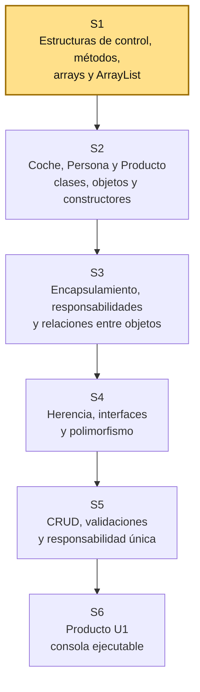

# S1 - Entorno de programación, estructuras de control, métodos y estructuras de datos lineales

## 1. Introducción

Tiempo: 20 min.

### 1.1 Propósito

Preparar el entorno de programación y recuperar los fundamentos necesarios para el curso mediante estructuras de control, métodos, arrays y colecciones con `ArrayList`.

### 1.2 Resultado de aprendizaje

El estudiante configura y verifica su entorno, organiza un programa mediante métodos y utiliza condicionales, ciclos, arrays y `ArrayList` para registrar, recorrer, buscar, actualizar y eliminar datos simples.

### 1.3 Producto de sesión

Programa de consola organizado mediante métodos que administra datos simples con arrays y `ArrayList`, e identifica las limitaciones de representar una entidad mediante datos separados.

### 1.4 Motivación de la sesión

Los estudiantes llegan al curso después de trabajar variables, condicionales, ciclos, métodos y arrays. Antes de iniciar la Programación Orientada a Objetos, se recuperan esos conocimientos usando una estructura dinámica: `ArrayList`.

En esta sesión todavía no se crean clases propias del dominio. Primero se observa cómo se administran datos simples y qué dificultades aparecen cuando los datos que representan una misma entidad quedan separados.

Pregunta guía:

```text
¿Cómo organizamos y procesamos varios datos cuando la cantidad de elementos
puede cambiar durante la ejecución del programa?
```

Pregunta de enlace con S2:

```text
¿Cómo podemos mantener juntos el código, nombre, precio y stock
que pertenecen a un mismo producto?
```

### 1.5 Ubicación en el curso

- Unidad: U1 - Fundamentos de la Programación Orientada a Objetos.
- Producto de unidad: aplicación de consola en memoria con entidades, relaciones, colecciones y operaciones CRUD.
- Carpeta de trabajo: `comarket-cli`.
- Avance de sesión: entorno preparado y fundamentos recuperados mediante estructuras de datos lineales.

Roadmap para elaborar el producto de la unidad:



## 2. Explica

Tiempo: 25 min.

### 2.1 Conceptos clave

| Concepto | Idea central | Ejemplo |
|---|---|---|
| Variable | Almacena un dato durante la ejecución. | `int stock = 10;` |
| Condicional | Permite decidir según una condición. | `if`, `else`, `switch` |
| Ciclo | Repite instrucciones mientras se cumpla una condición. | `for`, `while` |
| Método | Agrupa instrucciones para resolver una tarea. | `buscarProducto()` |
| Array | Estructura lineal de tamaño fijo. | `String[] nombres` |
| Colección | Estructura que administra varios elementos. | Lista de nombres |
| `ArrayList` | Lista dinámica que puede crecer o disminuir. | `ArrayList<String>` |
| Índice | Posición de un elemento dentro de una estructura lineal. | `nombres.get(0)` |

### 2.2 Arrays y `ArrayList`

Un array tiene un tamaño definido al crearse:

```java
String[] nombres = new String[3];
```

Un `ArrayList` permite agregar y eliminar elementos durante la ejecución:

```java
ArrayList<String> nombres = new ArrayList<>();
nombres.add("Teclado");
nombres.add("Mouse");
```

Comparación:

| Característica | Array | `ArrayList` |
|---|---|---|
| Tamaño | Fijo | Dinámico |
| Acceso por índice | Sí | Sí |
| Agregar elementos | Limitado al tamaño creado | `add()` |
| Actualizar elementos | Asignación por índice | `set()` |
| Eliminar elementos | Requiere reorganización manual | `remove()` |
| Cantidad de elementos | `length` | `size()` |

### 2.3 Operaciones principales de `ArrayList`

```java
ArrayList<String> nombres = new ArrayList<>();

nombres.add("Teclado");
nombres.add("Mouse");

String primero = nombres.get(0);
nombres.set(1, "Mouse inalámbrico");
nombres.remove(0);
int cantidad = nombres.size();
boolean existe = nombres.contains("Mouse inalámbrico");
```

En esta sesión se usan datos simples:

- `String`
- `Integer`
- `Double`

Las colecciones de objetos se trabajarán desde S2, después de definir clases y crear objetos.

### 2.4 Organización mediante métodos

El programa debe separar las operaciones principales:

```text
mostrarMenu()
registrar()
listar()
buscar()
actualizar()
eliminar()
```

Todavía no se aplican capas ni clases propias del dominio. El objetivo es recuperar la descomposición de problemas mediante métodos.

### 2.5 Limitación de los datos separados

Un producto podría representarse temporalmente mediante listas paralelas:

```java
ArrayList<String> codigos = new ArrayList<>();
ArrayList<String> nombres = new ArrayList<>();
ArrayList<Double> precios = new ArrayList<>();
ArrayList<Integer> stocks = new ArrayList<>();
```

Los datos de un producto dependen de conservar el mismo índice:

```text
codigos[0]  nombres[0]  precios[0]  stocks[0]
```

Si una lista se modifica incorrectamente, los datos dejan de corresponder. Esta limitación prepara la necesidad de clases y objetos en S2.

### 2.6 Errores frecuentes y diagnóstico

| Problema | Causa probable | Solución |
|---|---|---|
| `IndexOutOfBoundsException` | Se accede a una posición inexistente | Verificar el índice con `size()` |
| El ciclo no termina | La condición no cambia | Revisar la variable de control |
| La búsqueda no encuentra el texto | Se comparan cadenas con `==` | Usar `equals()` o `equalsIgnoreCase()` |
| Los datos quedan desalineados | Se modificó una lista paralela y otra no | Aplicar la operación en todas las listas |
| El menú repite una opción incorrecta | La lectura de datos quedó desordenada | Revisar el uso de `Scanner` |
| Todo está dentro de `main` | No se descompuso el problema | Crear métodos para cada operación |

## 3. Aplica: actividad práctica guiada

Tiempo: 2h.

### 3.1 Preparar ambiente local: Java 17, Maven y VS Code

**Producto del paso:** ambiente local con Java 17, Maven y VS Code verificados, listo para crear y ejecutar programas Java desde consola.

Herramientas necesarias:

- Java 17.
- Maven 3.x.
- VS Code.
- Extension Pack for Java.
- Terminal integrada de VS Code.

En esta sesión se usa un proyecto Java simple. Maven se verifica desde el inicio porque será necesario para organizar la entrega de la U1 en sesiones posteriores.

#### 3.1.1 Instalar gestor de paquetes, si hace falta

Windows PowerShell, si no tienes Chocolatey:

```powershell
Set-ExecutionPolicy Bypass -Scope Process -Force; [System.Net.ServicePointManager]::SecurityProtocol = [System.Net.ServicePointManager]::SecurityProtocol -bor 3072; iex ((New-Object System.Net.WebClient).DownloadString('https://community.chocolatey.org/install.ps1'))
```

Luego cierra y vuelve a abrir PowerShell.

macOS bash/zsh, si no tienes Homebrew:

```bash
/bin/bash -c "$(curl -fsSL https://raw.githubusercontent.com/Homebrew/install/HEAD/install.sh)"
```

Luego cierra y vuelve a abrir Terminal.

#### 3.1.2 Instalar Java 17

Windows PowerShell con Chocolatey:

```powershell
choco install temurin17 -y
```

macOS bash/zsh con Homebrew:

```bash
brew install --cask temurin@17
```

Linux Debian/Ubuntu bash:

```bash
sudo apt update
sudo apt install -y openjdk-17-jdk
```

#### 3.1.3 Instalar Maven 3.x

Windows PowerShell con Chocolatey:

```powershell
choco install maven -y
```

macOS bash/zsh con Homebrew:

```bash
brew install maven
```

Linux Debian/Ubuntu bash:

```bash
sudo apt update
sudo apt install -y maven
```

#### 3.1.4 Instalar VS Code y Extension Pack for Java

Windows PowerShell con Chocolatey:

```powershell
choco install vscode -y
```

macOS bash/zsh con Homebrew:

```bash
brew install --cask visual-studio-code
```

Linux Debian/Ubuntu bash:

```bash
sudo snap install code --classic
```

En VS Code, instalar la extensión:

```text
Extension Pack for Java
```

#### 3.1.5 Verificar instalación

Verificar Java 17:

```bash
java -version
```

Resultado esperado:

```text
version 17
```

Verificar el compilador:

```bash
javac -version
```

Verificar Maven:

```bash
mvn -version
```

Resultado esperado:

```text
Apache Maven 3.x
```

### 3.2 Crear y ejecutar un programa Java simple

**Producto del paso:** programa Java ejecutado correctamente desde VS Code.

1. Crear una carpeta para el proyecto.
2. Abrir la carpeta en VS Code.
3. Crear una carpeta `src`.
4. Crear el archivo `Main.java`.
5. Ejecutar un mensaje desde consola.

```java
public class Main {
    public static void main(String[] args) {
        System.out.println("Repaso de Fundamentos de Programación");
    }
}
```

### 3.3 Repasar estructuras de control

**Producto del paso:** menú repetitivo controlado mediante condicionales y ciclos.

```java
Scanner scanner = new Scanner(System.in);
int opcion;

do {
    System.out.println("1. Registrar");
    System.out.println("2. Listar");
    System.out.println("3. Salir");
    opcion = scanner.nextInt();

    switch (opcion) {
        case 1:
            System.out.println("Registrar");
            break;
        case 2:
            System.out.println("Listar");
            break;
        case 3:
            System.out.println("Fin");
            break;
        default:
            System.out.println("Opción inválida");
    }
} while (opcion != 3);
```

### 3.4 Comparar un array con un `ArrayList`

**Producto del paso:** evidencia de la diferencia entre tamaño fijo y tamaño dinámico.

Array:

```java
String[] nombresArray = new String[3];
nombresArray[0] = "Teclado";
nombresArray[1] = "Mouse";
```

`ArrayList`:

```java
ArrayList<String> nombres = new ArrayList<>();
nombres.add("Teclado");
nombres.add("Mouse");
nombres.add("Monitor");
nombres.add("Audífonos");
```

### 3.5 Organizar operaciones mediante métodos

**Producto del paso:** programa dividido en operaciones pequeñas.

```java
public static void registrar(ArrayList<String> nombres, Scanner scanner) {
    System.out.print("Nombre: ");
    String nombre = scanner.nextLine();
    nombres.add(nombre);
}

public static void listar(ArrayList<String> nombres) {
    for (int i = 0; i < nombres.size(); i++) {
        System.out.println(i + " - " + nombres.get(i));
    }
}

public static int buscar(ArrayList<String> nombres, String nombreBuscado) {
    for (int i = 0; i < nombres.size(); i++) {
        if (nombres.get(i).equalsIgnoreCase(nombreBuscado)) {
            return i;
        }
    }
    return -1;
}
```

### 3.6 Completar operaciones sobre datos simples

**Producto del paso:** registro, listado, búsqueda, actualización y eliminación sobre un `ArrayList`.

Operaciones mínimas:

1. Registrar un nombre.
2. Listar nombres.
3. Buscar un nombre.
4. Actualizar un nombre por posición.
5. Eliminar un nombre.
6. Salir.

En esta sesión estas operaciones sirven para recuperar estructuras de control y métodos. El CRUD organizado por capas se desarrollará en S5.

### 3.7 Representar productos mediante listas paralelas

**Producto del paso:** datos de productos registrados sin utilizar clases propias.

```java
ArrayList<String> codigos = new ArrayList<>();
ArrayList<String> nombres = new ArrayList<>();
ArrayList<Double> precios = new ArrayList<>();
ArrayList<Integer> stocks = new ArrayList<>();

codigos.add("P001");
nombres.add("Teclado");
precios.add(80.0);
stocks.add(10);
```

Recorrido:

```java
for (int i = 0; i < codigos.size(); i++) {
    System.out.println(
            codigos.get(i) + " - " +
            nombres.get(i) + " - S/ " +
            precios.get(i) + " - Stock: " +
            stocks.get(i)
    );
}
```

### 3.8 Identificar la necesidad de agrupar datos

**Producto del paso:** explicación del problema que será resuelto en S2.

Responder:

1. ¿Qué ocurre si se elimina un nombre, pero no su código, precio y stock?
2. ¿Por qué las cuatro listas deben conservar el mismo tamaño?
3. ¿Qué representa el índice `i`?
4. ¿Cómo podríamos mantener juntos los datos de cada producto?

Conclusión:

```text
Las listas paralelas permiten repasar programación, pero resultan frágiles
cuando varios datos representan una sola entidad.

En S2 se definirá la clase Producto y cada producto se representará
mediante un objeto.
```

## 4. Crea: actividad autónoma

Tiempo: 2h fuera del aula.

### 4.1 Plantilla de evidencia individual

Entrega un PDF con el siguiente nombre:

```text
S01_Equipo##_ApellidoNombre.pdf
```

### 4.1.1 Datos del estudiante

- Nombre:
- Equipo:
- Sesión: S01 - Entorno de programación, estructuras de control, métodos y estructuras de datos lineales
- Rol o aporte realizado:
- Link de GitHub:

### 4.1.2 Trabajo autónomo realizado

1. Verificar Java 17, Maven y VS Code.
2. Crear un menú con `do-while` y `switch`.
3. Separar las operaciones mediante métodos.
4. Utilizar un array de tamaño fijo.
5. Utilizar un `ArrayList` de datos simples.
6. Registrar, listar, buscar, actualizar y eliminar elementos.
7. Representar al menos tres productos mediante listas paralelas.
8. Explicar dos limitaciones de las listas paralelas.

### 4.1.3 Evidencia técnica

- Versiones de Java y Maven.
- Código del menú.
- Código de los métodos.
- Comparación entre array y `ArrayList`.
- Salida de registro, búsqueda, actualización y eliminación.
- Código de las listas paralelas.
- Explicación de la necesidad de agrupar los datos de un producto.

### 4.1.4 Error o hallazgo

Describe:

- Qué ocurrió.
- Cómo lo diagnosticaste.
- Cómo lo corregiste o qué aprendiste.

### 4.1.5 Reflexión técnica breve

Responde en 5 a 8 líneas:

```text
¿Por qué representar productos mediante listas paralelas puede producir
errores cuando el programa crece?
```

### 4.2 Criterios mínimos de aceptación

- El archivo respeta el nombre `S01_Equipo##_ApellidoNombre.pdf`.
- El ambiente local está verificado.
- El programa utiliza estructuras de control.
- Las operaciones están separadas mediante métodos.
- Se evidencia el uso de un array.
- Se evidencia el uso de `ArrayList`.
- Se realizan recorridos y búsquedas.
- Se muestran listas paralelas con datos de productos.
- Se explican sus limitaciones.
- No se utilizan todavía clases propias del dominio.

## 5. Cierre evaluativo

Tiempo: 20 min.

### 5.1 Resultados esperados

Al finalizar la sesión, el estudiante debe demostrar que:

- El entorno ejecuta programas Java.
- Distingue una estructura de control de una estructura de datos.
- Organiza operaciones mediante métodos.
- Diferencia un array de un `ArrayList`.
- Utiliza las operaciones principales de `ArrayList`.
- Recorre y busca datos mediante ciclos.
- Reconoce el problema de representar una entidad mediante listas paralelas.
- Explica por qué las clases y los objetos serán necesarios en S2.

### 5.2 Evidencia del producto de sesión

Cada estudiante entrega un PDF individual siguiendo la plantilla de la sección 4.1.

### 5.3 Preguntas de defensa y reflexión

1. ¿Cuál es la diferencia entre una estructura de control y una estructura de datos?
2. ¿Qué diferencia existe entre un array y un `ArrayList`?
3. ¿Para qué sirve `size()`?
4. ¿Por qué una búsqueda puede devolver `-1`?
5. ¿Qué ventaja aporta separar las operaciones mediante métodos?
6. ¿Qué problema presentan las listas paralelas?
7. ¿Por qué todavía no usamos `ArrayList<Producto>`?
8. ¿Qué contenido de S2 permitirá agrupar los datos de un producto?

### 5.4 Rúbrica de evaluación

| Dimensión | Peso | 3 - Logro destacado | 2 - Logro | 1 - Proceso | 0 - Inicio | Puntuación obtenida |
|---|---:|---|---|---|---|---:|
| 1. Entorno y ejecución | 1 | Verifica las herramientas y ejecuta el programa sin errores. | Ejecuta el programa correctamente. | Presenta dificultades de configuración o ejecución. | No logra ejecutar el programa. | |
| 2. Estructuras de control | 2 | Usa condicionales y ciclos con flujo claro y controlado. | Usa estructuras de control funcionales. | Uso parcial o con errores. | No evidencia estructuras de control. | |
| 3. Métodos | 2 | Descompone correctamente las operaciones y usa parámetros con claridad. | Organiza las operaciones principales mediante métodos. | La separación es parcial. | Todo permanece en `main`. | |
| 4. Arrays y `ArrayList` | 2 | Compara y utiliza ambas estructuras correctamente. | Utiliza array y `ArrayList`. | Uso incompleto o confuso. | No evidencia estructuras lineales. | |
| 5. Operaciones y búsqueda | 2 | Registra, lista, busca, actualiza y elimina datos correctamente. | Implementa las operaciones principales. | Operaciones incompletas. | No administra los datos. | |
| 6. Análisis y evidencia | 1 | Explica claramente las limitaciones de las listas paralelas con evidencias ordenadas. | Identifica la limitación principal. | Explicación superficial o evidencia incompleta. | No identifica el problema. | |

Puntuación acumulada = suma de (`Peso` * `Puntuación obtenida`) = ____.

Nota final = (`Puntuación acumulada` / 30) * 20 = ____.
