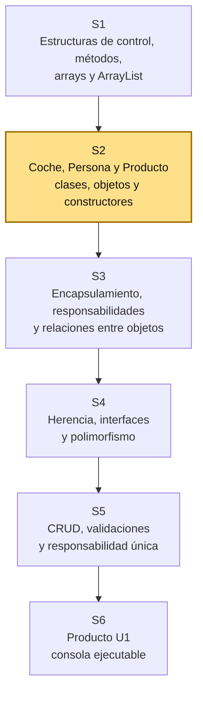
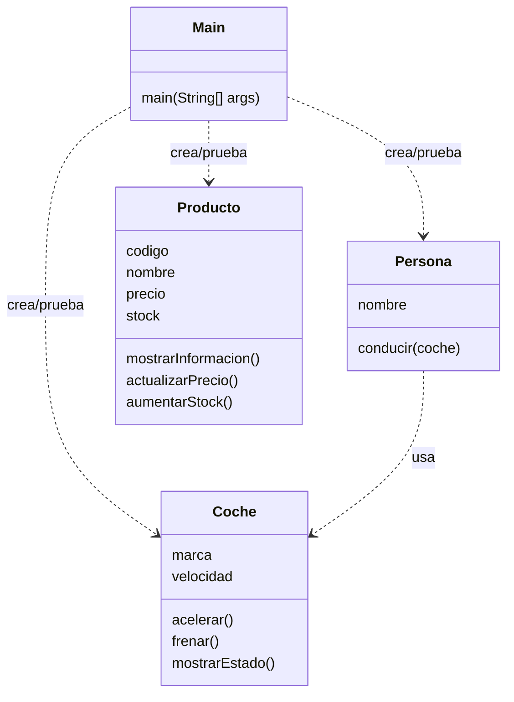

# S2 - Clases, objetos, constructores y comunicación entre objetos

## 1. Introducción

Tiempo: 20 min.

### 1.1 Propósito

Construir clases simples del dominio, crear objetos mediante constructores, reconocer su estado y comportamiento, y observar la comunicación básica entre objetos desde una aplicación de consola.

### 1.2 Resultado de aprendizaje

El estudiante diferencia clase y objeto, define atributos, métodos y constructores, crea instancias, explica la responsabilidad básica de una clase del dominio y reconoce cómo un objeto puede colaborar con otro.

### 1.3 Producto de sesión

Proyecto Java simple con clases del dominio, objetos instanciados mediante constructores, comunicación básica entre objetos y salida por consola.

### 1.4 Motivación de la sesión

#### 1.4.1 Caso: sistema de dominio inicial

Una organización necesita ordenar la información de un proceso de negocio. Puede tratarse de ventas, biblioteca, reservas, inventario, matriculas, atencion de clientes u otro contexto definido por el docente.

Antes de construir pantallas, base de datos o reportes, el sistema necesita representar objetos del dominio. En POO, esos objetos nacen a partir de clases.

Preguntas para los estudiantes:

1. Qué objetos reales aparecen en el dominio elegido?
2. Qué datos necesita guardar uno de esos objetos?
3. Qué comportamiento podría tener ese objeto?
4. Por qué no conviene escribir todo directamente en `Main`?

En esta sesión se retoman las estructuras trabajadas en S1 y se reorganizan como objetos del dominio, probandolos desde consola.

### 1.5 Ubicación en el curso

- Unidad: U1 - Fundamentos de la Programación Orientada a Objetos.
- Producto de unidad: aplicación de consola en memoria con entidades, relaciones, colecciones y CRUD.
- Carpeta de trabajo: `comarket-cli`.
- Avance del producto en esta sesión: primeras clases del dominio, constructores y comunicación básica entre objetos probadas desde `Main`.

Roadmap para elaborar el producto de la unidad:



Hoy se trabaja con objetos tangibles del mundo real: `Coche` y `Persona`. Luego se usa `Producto` cómo ejemplo puente hacia el dominio de CoMarket. La ruta principal avanza hacia encapsulamiento, separación de responsabilidades, relaciones entre objetos y CRUD en memoria. La herencia, las interfaces y el polimorfismo se trabajan después, cuando el modelo ya tenga más contexto.

## 2. Explica

Tiempo: 25 min.

### 2.1 Conceptos clave

Una clase es un molde para crear objetos. Un objeto es una instancia concreta qué tiene estado y comportamiento.

Ejemplo base: `Coche` y `Persona` permiten iniciar desde objetos tangibles. Un coche tiene marca y velocidad; una persona tiene nombre y puede conducir. Luego se usa `Producto` para observar cambios naturales de estado cómo precio y stock, preparando el trabajo de encapsulamiento y relaciones de S3.

Conceptos de la sesión:

- Clase cómo molde.
- Objeto cómo instancia.
- Atributos cómo estado.
- Métodos cómo comportamiento.
- Constructores cómo forma inicial de crear objetos con datos.
- Abstracción inicial del dominio.
- Responsabilidad de clase.
- Comunicación entre objetos.
- `Main` cómo punto de prueba inicial.
- Salida por consola cómo evidencia de ejecución.

Alcance métodologico de S2:

```text
En S2 se llega hasta clase, objeto, atributos, métodos, constructores,
estado, comportamiento, abstracción inicial, responsabilidad de clase
y comunicación básica entre objetos.

El encapsulamiento formal, las validaciones internas y la separación
por responsabilidades se desarrollan en S3.
```

### 2.2 Arquitectura de la sesión



Convención del diagrama: cada clase muestra sus atributos y métodos principales; `..>` indica dependencia o uso temporal desde la prueba.

Regla practica:

- `Main` se usa para probar.
- La clase representa caracteristicas y acciones de un objeto del mundo real.
- Los objetos son instancias concretas de la clase.
- Los atributos guardan estado.
- Los métodos muestran o procesan comportamiento propio del objeto.
- La abstracción consiste en elegir solo los datos y comportamientos necesarios para está primera versión.

### 2.3 Flujo de trabajo

1. Retomar el proyecto Java simple preparado en S1.
2. Abstraer objetos tangibles del mundo real.
3. Definir la responsabilidad inicial de la clase.
4. Elegir atributos y métodos coherentes con sus caracteristicas y acciones.
5. Crear constructores para inicializar objetos.
6. Crear `Coche` y `Persona` para observar colaboracion simple.
7. Crear `Producto` cómo ejemplo puente hacia el dominio.
8. Ejecutar el programa por consola.
9. Registrar evidencia y explicar responsabilidades.

### 2.4 Errores frecuentes y diagnóstico

| Problema | Causa probable | Solución |
|---|---|---|
| No ejecuta `Main` | Falta método `public static void main` | Revisar firma del método |
| No reconoce la clase | Archivo, clase o paquete no coincide | Revisar nombre de archivo y paquete |
| Los datos salen en cero o `null` | No se asignaron valores al objeto | Inicializar atributos antes de imprimir |
| Todo está en `Main` | No se separo la responsabilidad | Mover datos y comportamiento a una clase |
| Salida poco clara | `Main` no imprime datos suficientes | Mejorar la salida desde `Main` sin meter consola en la entidad |
| La clase tiene métodos de muchas cosas | No se identificaron bien sus caracteristicas y acciones | Volver a la abstracción inicial del objeto |
| Se usan `private`, getters/setters o validaciones complejas antes de tiempo | Se adelanto contenido de S3 | En S2 usar constructores simples; el encapsulamiento formal queda para S3 |

## 3. Aplica: actividad práctica guiada

En el laboratorio, el docente guía la creacion de objetos del dominio y los estudiantes verifican el resultado ejecutando el programa desde consola.

Tiempo: 2h.

### 3.1 Retomar el proyecto Java simple

**Producto del paso:** carpeta de trabajo con estructura inicial.

1. Crear una carpeta para el proyecto.
2. Abrir la carpeta en VS Code.
3. Crear una carpeta `src`.
4. Crear el archivo `Main.java`.
5. Ejecutar un mensaje simple para comprobar el entorno.

Ejemplo:

```java
public class Main {
    public static void main(String[] args) {
        System.out.println("Proyecto iniciado");
    }
}
```

### 3.2 Abstraer objetos tangibles: Coche y Persona

**Producto del paso:** dos clases candidatas identificadas desde el mundo real.

Antes de escribir código, observar objetos tangibles. Para iniciar, se usan `Coche` y `Persona` porque permiten distinguir caracteristicas, acciones y colaboracion entre objetos.

Completar una tabla de abstracción inicial:

| Clase | Caracteristicas | Acciones |
|---|---|---|
| `Coche` | marca, velocidad | acelerar, frenar, mostrar estado |
| `Persona` | nombre | conducir |

En S2, responsabilidad de clase no significa responsabilidad legal, vial o moral. Significa identificar qué caracteristicas y qué acciones le corresponden a una clase dentro del programa.

Ejemplo:

```text
La Persona decide conducir.
El Coche ejecuta acelerar o frenar y cambia su propia velocidad.
```

Nota metodológica:

```text
En S2 todavía no se aplica SOLID de manera formal.
Tampoco se trabaja encapsulamiento como tema fuerte.

El objetivo es entender clase, objeto, atributos, métodos, estado,
comportamiento, constructores, responsabilidad inicial y abstracción.
```

### 3.3 Crear la clase Coche

**Producto del paso:** clase tangible con atributos, estado y métodos.

Crear `Coche.java`:

```java
public class Coche {
    String marca;
    int velocidad;

    Coche(String marca, int velocidadInicial) {
        this.marca = marca;
        this.velocidad = velocidadInicial;
    }

    void acelerar() {
        velocidad = velocidad + 10;
    }

    void frenar() {
        velocidad = velocidad - 10;
    }

    void mostrarEstado() {
        System.out.println(marca + " - Velocidad: " + velocidad);
    }
}
```

En este punto ya aparecen los primeros conceptos:

| Elemento del código | Concepto POO |
|---|---|
| `public class Coche` | Clase |
| `marca`, `velocidad` | Atributos |
| `Coche(String marca, int velocidadInicial)` | Constructor |
| Valor actual de `velocidad` | Estado |
| `acelerar()` y `frenar()` | Métodos |
| Cambiar la velocidad | Comportamiento |

### 3.4 Crear la clase Persona

**Producto del paso:** segunda clase tangible qué usa un objeto `Coche`.

Crear `Persona.java`:

```java
public class Persona {
    String nombre;

    Persona(String nombre) {
        this.nombre = nombre;
    }

    void conducir(Coche coche) {
        System.out.println(nombre + " conduce el coche");
        coche.acelerar();
        coche.frenar();
    }
}
```

Lectura metodológica:

```text
Persona no cambia directamente la velocidad.
Persona usa acciones disponibles del Coche.
Coche modifica su propio estado.
```

La idea de pedales o volante puede usarse cómo analogia: la persona no manipula todo el motor; interactua mediante acciones visibles. La interface formal de Java se trabajara después, en S4.

### 3.5 Crear objetos desde Main

**Producto del paso:** objetos `coche1` y `persona1` instanciados y visibles por consola.

Actualizar `Main.java`:

```java
public class Main {
    public static void main(String[] args) {
        Coche coche1 = new Coche("Toyota", 0);
        Persona persona1 = new Persona("Ana");

        coche1.mostrarEstado();
        persona1.conducir(coche1);
        coche1.mostrarEstado();
    }
}
```

En este punto se observa la diferencia entre clase y objeto:

| Elemento | Explicacion |
|---|---|
| `Coche` | Molde o definicion general |
| `coche1` | Objeto creado desde la clase `Coche` mediante constructor |
| `Persona` | Molde o definicion general |
| `persona1` | Objeto creado desde la clase `Persona` mediante constructor |
| Estado de `coche1` | Toyota, velocidad actual |

### 3.6 Identificar estado, comportamiento y responsabilidad inicial

**Producto del paso:** explicacion de cómo los objetos guardan datos, ejecutan acciones y colaboran.

Analizar el código creado:

```text
El estado de coche1 cambia cuando se ejecuta acelerar o frenar.
El comportamiento está en los métodos de cada clase.
La responsabilidad inicial se entiende como características y acciones
que le corresponden a cada clase.
```

Completar:

| Clase | Sabe | Puede |
|---|---|---|
| `Coche` | marca, velocidad | acelerar, frenar, mostrar estado |
| `Persona` | nombre | conducir un coche |

### 3.7 Ejemplo 2: Producto cómo puente hacia el dominio

**Producto del paso:** clase `Producto` simple con constructor, estado cambiante y comportamiento propio.

Ahora se usa `Producto` cómo segundo ejemplo porque conecta los objetos tangibles con el dominio comercial de CoMarket.

Crear `Producto.java`:

```java
public class Producto {
    String codigo;
    String nombre;
    double precio;
    int stock;

    Producto(String codigo, String nombre, double precio, int stock) {
        this.codigo = codigo;
        this.nombre = nombre;
        this.precio = precio;
        this.stock = stock;
    }

    void mostrarInformacion() {
        System.out.println(codigo + " - " + nombre + " - S/ " + precio + " - Stock: " + stock);
    }

    void actualizarPrecio(double nuevoPrecio) {
        precio = nuevoPrecio;
    }

    void aumentarStock(int cantidad) {
        stock = stock + cantidad;
    }
}
```

Probar desde `Main`:

```java
Producto producto1 = new Producto("P001", "Teclado", 80.0, 10);

producto1.mostrarInformacion();
producto1.actualizarPrecio(75.0);
producto1.aumentarStock(5);
producto1.mostrarInformacion();
```

Lectura esperada:

```text
producto1 sigue siendo el mismo objeto.
Lo que cambió fue su estado: precio y stock.
En S3 se controlara mejor este cambio con encapsulamiento,
validaciones e invariantes simples.
```

## 4. Crea: actividad autónoma

Fuera del aula, cada estudiante consolida el aprendizaje creando clases propias del dominio y preparando una evidencia individual.

Tiempo: 2h fuera del aula.

### 4.1 Plantilla de evidencia individual

Entrega un PDF con el siguiente nombre:

```text
S02_Equipo##_ApellidoNombre.pdf
```

Ejemplo:

```text
S02_Equipo03_QuispeAna.pdf
```

El PDF debe usar esta estructura. La primera sección define el trabajo autónomo; completa las demás con tus evidencias.

#### 4.1.1 Datos del estudiante

- Nombre:
- Equipo:
- Sesión: S02 - Clases, objetos, constructores y comunicación entre objetos
- Rol o aporte realizado:
- Link de GitHub:

#### 4.1.2 Trabajo autónomo realizado

Completa y evidencia estas tareas:

1. Crear otro par de clases tangibles que colaboren entre sí, por ejemplo `Estudiante` y `Cuaderno`, `Jugador` y `Pelota`, o `Vendedor` y `Pedido`.
2. Crear una clase simple similar a `Producto` que pueda prepararse para encapsulamiento en S3.
3. Instanciar objetos desde `Main`.
4. Mostrar por consola el estado inicial de al menos un objeto.
5. Ejecutar métodos que cambien o muestren comportamiento.
6. Explicar qué datos y acciones pertenecen a cada clase.
7. Explicar qué parte del código demuestra abstracción inicial.

#### 4.1.3 Evidencia técnica

Incluye capturas o salidas de consola con una breve explicación debajo de cada una:

- Código de dos clases tangibles.
- Código de una clase puente similar a `Producto`.
- Código de prueba desde `Main`.
- Salida de consola antes y después de ejecutar un método.
- Tabla breve con clase, atributos, métodos y responsabilidad inicial.

#### 4.1.4 Error o hallazgo

Describe al menos un error, diferencia o hallazgo técnico:

- Qué ocurrió.
- Cómo lo diagnosticaste.
- Cómo lo corregiste o qué aprendiste.

Ejemplos válidos:

- El archivo no coincidía con el nombre de la clase.
- `Main` no encontraba una clase.
- Un atributo salía `null` o `0` porque no fue inicializado.
- Un método no cambiaba el estado esperado.

#### 4.1.5 Reflexión técnica breve

Responde en 5 a 8 líneas:

```text
Por qué una clase no debe ser solo una lista de variables?
```

### 4.2 Criterios mínimos de aceptación

La evidencia individual se considera completa si:

- El archivo respeta el nombre `S02_Equipo##_ApellidoNombre.pdf`.
- Incluye evidencias técnicas legibles.
- Muestra al menos dos clases tangibles que colaboran.
- Muestra una clase puente preparada para S3.
- Muestra objetos creados desde `Main`.
- Muestra salida de consola.
- Explica responsabilidad inicial, estado y comportamiento.
- No contiene solo pantallazos: cada evidencia tiene una descripción breve.

## 5. Cierre evaluativo

Tiempo: 20 min.

Esta sección conecta el resultado de aprendizaje de la sesión con el producto que debe evidenciar cada estudiante.

### 5.1 Resultados esperados

Al finalizar la sesión, el estudiante debe demostrar que:

- El proyecto ejecuta desde VS Code.
- Existen clases tangibles como `Coche` y `Persona`, o equivalentes del dominio elegido.
- Existe una clase puente como `Producto`, preparada para S3.
- Se crean objetos desde `Main`.
- La clase tiene atributos que representan estado.
- La clase tiene métodos que representan comportamiento básico.
- La salida por consola demuestra estado y comportamiento del objeto.
- El estudiante explica qué datos y comportamientos fueron elegidos por abstracción inicial.
- El estudiante explica qué responsabilidad tiene cada clase.
- Los métodos implementados corresponden a las acciones iniciales de la clase.
- No se usan atributos `private`, getters/setters ni validaciones complejas como tema central; eso queda para S3.

### 5.2 Evidencia del producto de sesión

Cada estudiante entrega un PDF individual siguiendo la plantilla de la sección 4.1.

Nombre del archivo:

```text
S02_Equipo##_ApellidoNombre.pdf
```

La evidencia debe demostrar:

- Producto de sesión construido.
- Aporte individual verificable.
- Pruebas por consola realizadas.
- Reflexión técnica breve.

La revisión se realiza con los criterios mínimos de aceptación de la sección 4.2 y la rúbrica de la sección 5.4.

### 5.3 Preguntas de defensa y reflexión

1. Cuál es la diferencia entre clase y objeto?
2. Qué representa el estado de un objeto?
3. Qué significa responsabilidad de clase en S2?
4. Qué método representa comportamiento en tu clase?
5. Qué datos dejaste fuera por abstracción inicial?
6. Qué características y acciones identificaste en tu clase?
7. Qué responsabilidad tiene `Main` en esta sesión?
8. Qué cambiará en S3 cuando aparezca encapsulamiento?

### 5.4 Rúbrica de evaluación

| Dimensión | Peso | 3 - Logro destacado | 2 - Logro | 1 - Proceso | 0 - Inicio | Puntuación obtenida |
|---|---:|---|---|---|---|---:|
| 1. Clases y objetos | 2 | Define clases claras, crea objetos y explica la diferencia con precisión. | Define clases y crea objetos funcionales. | Presenta clases incompletas o confunde clase con objeto. | No evidencia clases y objetos funcionales. | |
| 2. Estado y comportamiento | 2 | Atributos y métodos representan correctamente estado y comportamiento. | Atributos y métodos principales son coherentes. | Hay atributos o métodos poco claros. | No evidencia estado ni comportamiento. | |
| 3. Responsabilidad y abstracción | 2 | Explica qué pertenece a cada clase y qué se dejó fuera por abstracción. | Explica responsabilidad básica de las clases. | Explicación parcial o confusa. | No explica responsabilidad ni abstracción. | |
| 4. Prueba desde `Main` | 2 | `Main` crea objetos, ejecuta métodos y muestra salida clara. | `Main` prueba el flujo principal. | Prueba incompleta o salida poco clara. | No hay prueba desde `Main`. | |
| 5. Error o hallazgo | 1 | Analiza error/hallazgo, causa, solución y aprendizaje técnico. | Explica un problema y una solución. | Menciona un problema sin análisis. | No presenta error ni hallazgo. | |
| 6. Reflexión y orden | 1 | PDF ordenado, evidencias legibles y reflexión precisa. | Evidencias suficientes y reflexión clara. | Evidencias incompletas o reflexión superficial. | PDF desordenado o sin reflexión. | |

Puntuación acumulada = suma de (`Peso` * `Puntuación obtenida`) = ____.

Nota final = (`Puntuación acumulada` / 30) * 20 = ____.

Para usar la rúbrica con IA, solicita:

```text
Evalúa el PDF usando la rúbrica de la sesión.
Para cada dimensión selecciona la puntuación obtenida usando la escala Inicio=0, Proceso=1, Logro=2, Logro destacado=3.
Justifica brevemente cada puntuación.
Calcula la puntuación acumulada con la fórmula: suma de (Peso * Puntuación obtenida).
Calcula la nota final sobre 20 con la fórmula: (Puntuación acumulada / 30) * 20.
Indica 2 fortalezas y 2 recomendaciones.
```

