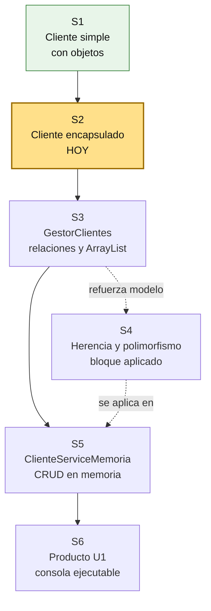
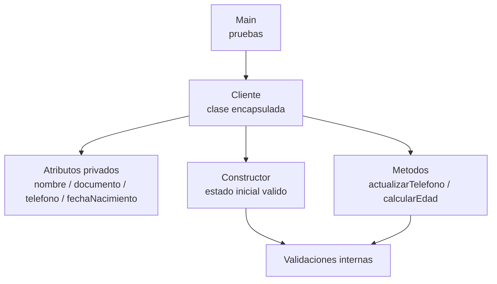

# S2 - Encapsulamiento, constructores y control del estado

## 1. Introduccion

Tiempo: 20 min.

### 1.1 Proposito

Proteger el estado de los objetos mediante atributos privados, constructores, validaciones basicas y metodos de comportamiento.

### 1.2 Resultado de aprendizaje

El estudiante aplica modificadores de acceso, crea constructores, usa getters y setters con criterio, valida datos simples y mueve reglas desde `Main` hacia la clase del dominio.

### 1.3 Producto de sesion

Clase `Cliente` encapsulada con constructor, validaciones, metodo `calcularEdad` y pruebas desde `Main`.

### 1.4 Motivacion de la sesion

#### 1.4.1 Caso: datos invalidos en objetos del dominio

En la sesion anterior se creo una clase simple y se asignaron valores directamente desde `Main`. Esa forma permite aprender rapido, pero tambien deja abierta la puerta a estados invalidos.

Ejemplos de problemas:

- Un cliente sin nombre.
- Un documento vacio.
- Un telefono con muy pocos digitos.
- Una fecha de nacimiento futura.
- Una edad calculada manualmente y desactualizada.

La pregunta que guia esta sesion es:

```text
Como hacemos que un objeto proteja su propio estado y no dependa de Main para corregir datos?
```

### 1.5 Ubicacion en el curso

- Unidad: U1 - Fundamentos de la Programacion Orientada a Objetos.
- Producto de unidad: aplicacion de consola en memoria con entidades, relaciones, colecciones y CRUD.
- Avance del producto en esta sesion: `Cliente` deja de ser una bolsa de datos y empieza a controlar su estado.

Roadmap para elaborar el producto de la unidad:



## 2. Explica

Tiempo: 25 min.

### 2.1 Conceptos clave

El encapsulamiento evita que cualquier parte del programa modifique directamente el estado interno de un objeto. La clase controla como se crea, como cambia y que reglas debe cumplir.

Conceptos de la sesion:

- `private` para proteger atributos.
- Constructor para crear objetos validos.
- Getters para consultar estado.
- Setters con validacion cuando el cambio es permitido.
- Invariante simple del dominio.
- Metodo de comportamiento.
- Responsabilidad de clase.

Ejemplo de responsabilidad:

```text
Cliente no solo guarda nombre, documento, telefono y fechaNacimiento.
Cliente tambien valida esos datos y calcula su edad.
```

### 2.2 Arquitectura de la sesion



Regla practica:

- `Main` prueba escenarios.
- `Cliente` protege su estado.
- El constructor evita crear objetos incompletos.
- Los setters no deben ser automaticos: solo existen si el cambio tiene sentido.
- La edad no se guarda manualmente; se calcula desde `fechaNacimiento`.

### 2.3 Flujo de trabajo

1. Partir de la clase `Cliente` creada en S1.
2. Cambiar atributos publicos o de paquete por `private`.
3. Crear constructor parametrizado.
4. Agregar getters necesarios.
5. Agregar setters solo para cambios permitidos.
6. Validar nombre, documento, telefono y fecha de nacimiento.
7. Crear `calcularEdad`.
8. Probar casos validos e invalidos desde `Main`.

### 2.4 Errores frecuentes y diagnostico

| Problema | Causa probable | Solucion |
|---|---|---|
| No se puede acceder al atributo | El atributo ahora es `private` | Usar getter o metodo de comportamiento |
| El objeto se crea con datos vacios | Constructor sin validacion | Validar dentro del constructor |
| La edad queda desactualizada | Se guardo edad como atributo editable | Calcularla desde `fechaNacimiento` |
| Setter permite datos invalidos | Setter sin reglas | Validar antes de asignar |
| `Main` contiene demasiadas reglas | No se movio la responsabilidad a la clase | Llevar validaciones simples a `Cliente` |

## 3. Aplica: actividad practica guiada

En el laboratorio, el docente guia la transformacion de `Cliente` desde una clase con atributos expuestos hacia una clase encapsulada que controla su propio estado.

Tiempo: 2h.

### 3.1 Revisar la clase Cliente creada en S1

**Producto del paso:** clase `Cliente` inicial identificada.

Punto de partida esperado:

```java
public class Cliente {
    String nombre;
    String documento;
    String telefono;

    void mostrarInformacion() {
        System.out.println(nombre + " - Doc: " + documento + " - Tel: " + telefono);
    }
}
```

### 3.2 Encapsular atributos

**Producto del paso:** atributos protegidos con `private`.

```java
import java.time.LocalDate;

public class Cliente {
    private String nombre;
    private String documento;
    private String telefono;
    private LocalDate fechaNacimiento;
}
```

### 3.3 Crear constructor con validaciones

**Producto del paso:** objetos creados con estado inicial valido.

```java
public Cliente(String nombre, String documento, String telefono, LocalDate fechaNacimiento) {
    if (nombre == null || nombre.isBlank()) {
        throw new IllegalArgumentException("El nombre es obligatorio");
    }
    if (documento == null || documento.isBlank()) {
        throw new IllegalArgumentException("El documento es obligatorio");
    }
    if (fechaNacimiento == null || fechaNacimiento.isAfter(LocalDate.now())) {
        throw new IllegalArgumentException("La fecha de nacimiento no es valida");
    }

    this.nombre = nombre;
    this.documento = documento;
    this.telefono = telefono;
    this.fechaNacimiento = fechaNacimiento;
}
```

### 3.4 Agregar getters y metodos de comportamiento

**Producto del paso:** consulta controlada del estado y comportamiento dentro de la clase.

```java
public String getNombre() {
    return nombre;
}

public String getDocumento() {
    return documento;
}

public int calcularEdad() {
    return java.time.Period.between(fechaNacimiento, LocalDate.now()).getYears();
}

public void actualizarTelefono(String nuevoTelefono) {
    if (nuevoTelefono == null || nuevoTelefono.length() < 6) {
        throw new IllegalArgumentException("El telefono no es valido");
    }
    this.telefono = nuevoTelefono;
}

public void mostrarInformacion() {
    System.out.println(nombre + " - Doc: " + documento + " - Edad: " + calcularEdad());
}
```

### 3.5 Probar desde Main

**Producto del paso:** casos validos e invalidos ejecutados desde consola.

```java
import java.time.LocalDate;

public class Main {
    public static void main(String[] args) {
        Cliente cliente = new Cliente(
                "Ana Torres",
                "76543210",
                "987654321",
                LocalDate.of(2000, 5, 10)
        );

        cliente.mostrarInformacion();
        cliente.actualizarTelefono("912345678");

        // Caso invalido para observar la validacion
        // Cliente invalido = new Cliente("", "", "123", LocalDate.now().plusDays(1));
    }
}
```

### 3.6 Registrar decisiones de encapsulamiento

**Producto del paso:** explicacion breve de por que cada dato se protege.

Completar una tabla simple:

| Elemento | Decision |
|---|---|
| `nombre` | Se valida en constructor porque identifica al cliente |
| `documento` | Se valida en constructor y no se cambia libremente |
| `telefono` | Puede cambiar mediante `actualizarTelefono` |
| `fechaNacimiento` | Se usa para calcular edad; no se reemplaza por un atributo edad |

## 4. Crea: actividad autonoma

Tiempo: 2h fuera del aula.

Mejora otra entidad del dominio aplicando encapsulamiento, constructor y validaciones. Puede ser `Proveedor`, `Empleado`, `Usuario` u otra entidad del proyecto elegido.

Entrega evidencia breve con:

- Clase encapsulada.
- Constructor con validaciones.
- Getters o metodos necesarios.
- Un metodo de comportamiento.
- Prueba valida desde `Main`.
- Prueba invalida controlada.

## 5. Cierre evaluativo

Tiempo: 20 min.

### 5.1 Resultados esperados

- Las clases no exponen atributos publicos.
- Los constructores inicializan objetos validos.
- Las validaciones basicas estan dentro de la clase.
- `Main` se usa para probar, no para controlar todas las reglas.
- El estudiante explica que comportamiento pertenece a la entidad.

### 5.2 Preguntas de defensa

1. Por que los atributos deben ser privados?
2. Que ventaja tiene validar dentro del constructor?
3. Cuando usarias un setter?
4. Por que la edad se calcula y no se guarda manualmente?
5. Que responsabilidad no deberia tener `Main`?
