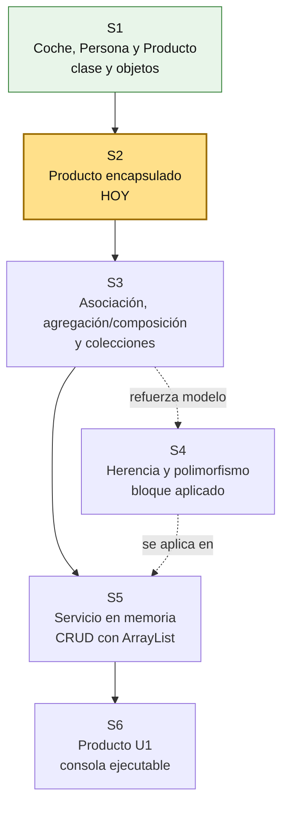
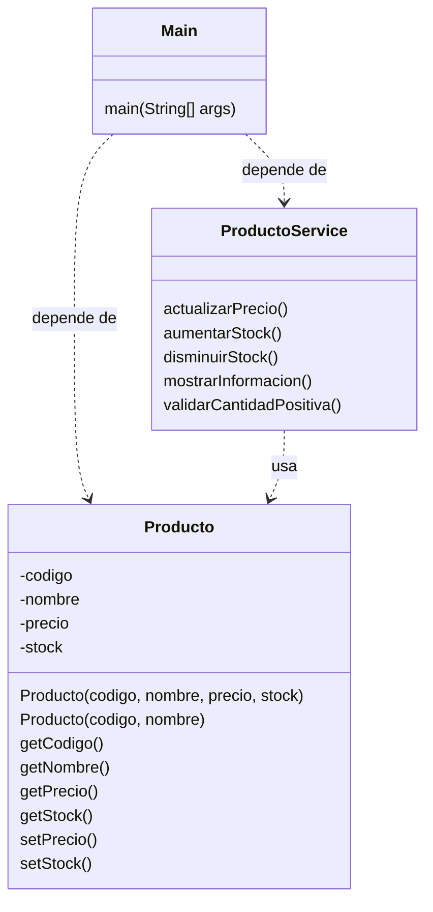

# S2 - Encapsulamiento, constructores y control del estado

## 1. Introducción

Tiempo: 20 min.

### 1.1 Propósito

Proteger el estado de los objetos mediante atributos privados, constructores y getters/setters limpios, e introducir la separacion básica de responsabilidades con `ProductoService`.

### 1.2 Resultado de aprendizaje

El estudiante aplica encapsulamiento, crea constructores simples y sobrecargados, consulta datos mediante getters, usa setters limpios para asignaciones directas, separa operaciones en un servicio inicial y prueba el flujo desde `Main`.

### 1.3 Producto de sesión

Clase `Producto` encapsulada con constructores y getters/setters limpios, más `ProductoService` inicial con operaciones sobre productos.

### 1.4 Motivación de la sesión

#### 1.4.1 Caso: estado inválido en objetos del dominio

En S1 se creo una clase simple para entender clase, objeto, atributos, métodos, estado, comportamiento, responsabilidad inicial y abstracción. Esa versión permite aprender rapido, pero también permite qué `Main` cambie los datos sin control.

Ejemplos de problemas:

- Un producto creado solo con los datos iniciales disponibles.
- Un producto al qué luego se le completa precio y stock.
- Un precio negativo.
- Un stock negativo.
- Un cambio de precio sin ninguna regla.

Pregunta guía:

```text
Cómo hacemos que un objeto proteja su propio estado y no dependa de Main para corregir datos?
```

### 1.5 Ubicación en el curso

- Unidad: U1 - Fundamentos de la Programación Orientada a Objetos.
- Producto de unidad: aplicación de consola en memoria con entidades, relaciones, colecciones y CRUD.
- Avance del producto en esta sesión: `Producto` deja de ser una clase con datos expuestos y empieza a controlar su estado.

Roadmap para elaborar el producto de la unidad:



## 2. Explica

Tiempo: 25 min.

### 2.1 Conceptos clave

El encapsulamiento evita qué cualquier parte del programa modifique directamente el estado interno de un objeto. La clase controla cómo se crea, cómo cambia y qué reglas debe cumplir.

En S1, "responsabilidad" se entendio como características y acciones qué corresponden a una clase. En S2 esa idea se mejora: la clase también debe proteger sus datos para no quedar en un estado inválido.

Conceptos de la sesión:

- `private` para proteger atributos.
- Constructor para inicializar objetos.
- Getters para consultar estado.
- Getters y setters limpios.
- Métodos de cambio con nombre de acción.
- Validaciones básicas.
- Invariantes simples.
- Método de comportamiento.

Nota métodológica:

```text
S1 permite ver estado y comportamiento de forma directa.
S2 empieza a controlar el estado con encapsulamiento.

Todavía no se trabajan interfaces como contrato.
Eso queda para S4.
```

Ejemplo de responsabilidad mejorada:

```text
Producto guarda codigo, nombre, precio y stock.
ProductoService agrupa operaciones sobre productos.
Main no debe modificar los atributos directamente ni concentrar las reglas.
```

Nota sobre getters/setters:

```text
Los getters y setters deben quedar simples.
Más adelante, en U2 o U3, este código mecánico podría reemplazarse
con Lombok usando anotaciones cómo @Getter y @Setter.

Las reglas importantes no deben esconderse en getters/setters.
Esas reglas se expresan mejor en métodos con nombre de acción,
por ejemplo dentro de ProductoService.
```

### 2.2 S de SOLID: una responsabilidad principal

La S de SOLID se conoce cómo principio de responsabilidad única. En esta sesión se aplica de forma básica:

```text
Producto sabe qué datos tiene.
ProductoService sabe qué operaciones se hacen sobre un producto.
Main solo prueba el flujo.
```

No se busca una arquitectura completa todavía. Solo se evita qué `Producto` y `Main` hagan todo.

### 2.3 Arquitectura de la sesión



Convencion del diagrama: cada clase muestra sus atributos y métodos principales; `-` indica atributo privado y `..>` indica dependencia o uso temporal desde la prueba.

Regla practica:

- `Main` prueba escenarios.
- `Producto` protege su estado.
- El constructor inicializa el objeto.
- La sobrecarga de constructores permite crear objetos con distintos datos iniciales.
- Los atributos no se modifican directamente desde fuera.
- Los getters y setters se mantienen limpios.
- Los cambios con regla pasan por `ProductoService`.
- El precio y el stock no deben ser negativos.

### 2.4 Flujo de trabajo

1. Partir de la clase `Producto` creada en S1.
2. Cambiar atributos de acceso directo a `private`.
3. Crear constructores simples y sobrecargados.
4. Agregar getters y setters limpios.
5. Crear `ProductoService`.
6. Mover operaciones con regla hacia `ProductoService`.
7. Probar casos validos e inválidos desde `Main`.

### 2.5 Errores frecuentes y diagnóstico

| Problema | Causa probable | Solución |
|---|---|---|
| No se puede acceder al atributo | El atributo ahora es `private` | Usar getter o método de comportamiento |
| El objeto se crea con datos incompletos | No se eligio bien el constructor | Usar sobrecarga de constructores segun el caso |
| Precio negativo | No se valido el dato | Rechazar valores negativos |
| Stock negativo | No se valido el dato | Rechazar valores negativos |
| Setter contiene demasiada lógica | Se mezclo código mecánico con reglas | Dejar setter limpio y mover la regla a `ProductoService` |
| `Main` contiene demasiadas reglas | No se separo la operación | Llevar operaciones simples a `ProductoService` |

## 3. Aplica: actividad practica guíada

En el laboratorio, el docente guía la transformacion de `Producto` desde una clase con atributos expuestos hacia una clase encapsulada qué controla su propio estado.

Tiempo: 2h.

### 3.1 Revisar la clase Producto creada en S1

**Producto del paso:** clase `Producto` inicial identificada.

Punto de partida esperado:

```java
public class Producto {
    String codigo;
    String nombre;
    double precio;
    int stock;

    void mostrarInformacion() {
        System.out.println(codigo + " - " + nombre + " - S/ " + precio + " - Stock: " + stock);
    }

    void actualizarPrecio(double nuevoPrecio) {
        precio = nuevoPrecio;
    }

    void aumentarStock(int cantidad) {
        stock = stock + cantidad;
    }
}
```

### 3.2 Encapsular atributos

**Producto del paso:** atributos protegidos con `private`.

```java
public class Producto {
    private String codigo;
    private String nombre;
    private double precio;
    private int stock;

    void mostrarInformacion() {
        System.out.println(codigo + " - " + nombre + " - S/ " + precio + " - Stock: " + stock);
    }

    void actualizarPrecio(double nuevoPrecio) {
        precio = nuevoPrecio;
    }

    void aumentarStock(int cantidad) {
        stock = stock + cantidad;
    }
}
```

### 3.3 Probar el código de S1 y observar el error

**Producto del paso:** evidencia de qué `private` protege el acceso directo al estado.

Volver a probar el código usado en S1:

```java
Producto producto1 = new Producto();
producto1.codigo = "P001";
producto1.nombre = "Teclado";
producto1.precio = 80.0;
producto1.stock = 10;

producto1.mostrarInformacion();
producto1.actualizarPrecio(75.0);
producto1.aumentarStock(5);
producto1.mostrarInformacion();
```

Resultado esperado:

```text
El codigo ya no compila porque codigo, nombre, precio y stock
ahora son atributos private.
```

Lectura métodológica:

```text
Eso es encapsulamiento:
el estado interno ya no se modifica directamente desde Main.

Para crear el objeto se usara constructor.
Para consultar datos se usarán getters.
Para asignar datos simples se usarán setters.
Para cambios con regla se usarán métodos con nombre de acción.
```

### 3.4 Crear constructores

**Producto del paso:** objetos creados con distintos datos iniciales.

El constructor sirve para inicializar el objeto. En la practica no siempre se reciben todos los campos al crear un objeto; por eso se puede usar sobrecarga de constructores y completar algunos datos después con setters o métodos con nombre de acción.

```java
public Producto(String codigo, String nombre, double precio, int stock) {
    this.codigo = codigo;
    this.nombre = nombre;
    this.precio = precio;
    this.stock = stock;
}

public Producto(String codigo, String nombre) {
    this.codigo = codigo;
    this.nombre = nombre;
    this.precio = 0;
    this.stock = 0;
}
```

Nota métodológica:

```text
Esto se llama sobrecarga de constructores:
una misma clase puede tener varios constructores con parametros diferentes.

No es polimorfismo todavía; el polimorfismo se trabaja en S4.
```

### 3.5 Agregar getters y setters limpios

**Producto del paso:** consulta y asignacion controlada por acceso, sin lógica pesada.

```java
public String getCodigo() {
    return codigo;
}

public String getNombre() {
    return nombre;
}

public double getPrecio() {
    return precio;
}

public int getStock() {
    return stock;
}

public void setPrecio(double precio) {
    this.precio = precio;
}

public void setStock(int stock) {
    this.stock = stock;
}
```

Regla métodológica:

```text
Getter devuelve.
Setter asigna.

Si hay una regla importante, se crea un método con nombre de acción.
```

### 3.6 Probar constructores, getters y setters limpios

**Producto del paso:** evidencia de qué el objeto se crea con constructor y se consulta/modifica mediante métodos publicos.

Probar desde `Main`:

```java
public class Main {
    public static void main(String[] args) {
        Producto producto1 = new Producto("P001", "Teclado", 80.0, 10);
        Producto producto2 = new Producto("P002", "Mouse");

        producto2.setPrecio(45.0);
        producto2.setStock(20);

        System.out.println(producto1.getCodigo() + " - " + producto1.getNombre());
        System.out.println("Precio: " + producto1.getPrecio());
        System.out.println("Stock: " + producto1.getStock());

        System.out.println(producto2.getCodigo() + " - " + producto2.getNombre());
        System.out.println("Precio: " + producto2.getPrecio());
        System.out.println("Stock: " + producto2.getStock());
    }
}
```

Lectura métodológica:

```text
Ya no se usa producto.codigo ni producto.precio directamente.
El constructor inicializa.
Los getters consultan.
Los setters completan datos simples.
```

### 3.7 Segunda parte: crear ProductoService

**Producto del paso:** operaciones sobre productos separadas de la entidad.

Antes de crear el servicio, retirar de `Producto` las operaciones qué ahora pasaran a otra responsabilidad:

```text
Salen de Producto:
- mostrarInformacion()
- actualizarPrecio()
- aumentarStock()
```

`Producto` queda cómo clase de datos encapsulada: atributos privados, constructores, getters y setters limpios. Las operaciones pasan a `ProductoService`.

Crear `ProductoService.java`:

```java
public class ProductoService {
    public void actualizarPrecio(Producto producto, double nuevoPrecio) {
        if (nuevoPrecio < 0) {
            throw new IllegalArgumentException("El precio no puede ser negativo");
        }
        producto.setPrecio(nuevoPrecio);
    }

    public void aumentarStock(Producto producto, int cantidad) {
        validarCantidadPositiva(cantidad);
        producto.setStock(producto.getStock() + cantidad);
    }

    public void disminuirStock(Producto producto, int cantidad) {
        validarCantidadPositiva(cantidad);
        if (cantidad > producto.getStock()) {
            throw new IllegalArgumentException("No hay stock suficiente");
        }
        producto.setStock(producto.getStock() - cantidad);
    }

    public void mostrarInformacion(Producto producto) {
        System.out.println(
                producto.getCodigo() + " - " +
                producto.getNombre() + " - S/ " +
                producto.getPrecio() + " - Stock: " +
                producto.getStock()
        );
    }

    private void validarCantidadPositiva(int cantidad) {
        if (cantidad <= 0) {
            throw new IllegalArgumentException("La cantidad debe ser positiva");
        }
    }
}
```

Regla métodológica:

```text
Producto conserva sus datos.
ProductoService realiza operaciones sobre Producto.
Main coordina la prueba.

En esta sesión, Main no debe llamar setters para aplicar reglas del negocio.
Para eso usa ProductoService.
```

### 3.8 Agregar validaciones básicas en ProductoService

**Producto del paso:** reglas simples ubicadas fuera de getters/setters.

Ejemplo:

```java
public void actualizarPrecio(Producto producto, double nuevoPrecio) {
    if (nuevoPrecio < 0) {
        throw new IllegalArgumentException("El precio no puede ser negativo");
    }
    producto.setPrecio(nuevoPrecio);
}
```

### 3.9 Probar desde Main

**Producto del paso:** casos validos e inválidos ejecutados desde consola.

```java
public class Main {
    public static void main(String[] args) {
        Producto producto = new Producto("P001", "Teclado", 80.0, 10);
        Producto productoNuevo = new Producto("P002", "Mouse");
        ProductoService productoService = new ProductoService();

        productoNuevo.setPrecio(45.0);
        productoNuevo.setStock(20);

        productoService.mostrarInformacion(producto);
        productoService.actualizarPrecio(producto, 75.0);
        productoService.aumentarStock(producto, 5);
        productoService.disminuirStock(producto, 3);
        productoService.mostrarInformacion(producto);

        // Caso inválido para observar la validación
        // productoService.actualizarPrecio(producto, -10.0);
    }
}
```

### 3.10 Registrar decisiónes de encapsulamiento y responsabilidad

**Producto del paso:** explicacion breve de qué sabe cada clase y qué hace cada clase.

Completar una tabla simple:

| Elemento | Decisión |
|---|---|
| `código` | Se inicializa en constructor porque identifica al producto |
| `nombre` | Se inicializa en constructor porque describe al producto |
| `Producto` | Sabe sus datos y expone getters/setters limpios |
| `ProductoService` | Realiza operaciones cómo actualizar precio y mover stock |
| `Main` | Crea objetos y prueba el flujo |

Reglas simples:

```text
El constructor inicializa.
Los getters consultan.
Los setters asignan datos de forma simple.
ProductoService contiene métodos con nombre de acción.
```

## 4. Crea: actividad autónoma

Tiempo: 2h fuera del aula.

Mejora otra entidad del dominio aplicando encapsulamiento, constructores sobrecargados, getters/setters limpios y una clase service inicial. Puede ser `Proveedor`, `Empleado`, `Usuario`, `Cliente` u otra entidad del proyecto elegido.

Entrega evidencia breve con:

- Clase encapsulada.
- Constructores sobrecargados.
- Getters o métodos necesarios.
- Setters limpios.
- Clase service con al menos dos operaciones.
- Prueba valida desde `Main`.
- Prueba invalida controlada.

## 5. Cierre evaluativo

Tiempo: 20 min.

### 5.1 Resultados esperados

- Las clases no exponen atributos publicos.
- Los constructores inicializan objetos.
- Hay sobrecarga de constructores cuándo se necesita crear objetos con distintos datos iniciales.
- Los getters/setters se mantienen simples.
- Existe una clase `ProductoService` o equivalente.
- Las validaciones básicas están en el service.
- Los cambios importantes de estado pasan por métodos del service.
- `Main` se usa para probar, no para controlar todas las reglas.
- El estudiante explica qué reglas simples protege su clase mediante setters o métodos.

### 5.2 Preguntas de defensa

1. Por qué los atributos deben ser privados?
2. Para qué sirve la sobrecarga de constructores?
3. Por qué los getters/setters deben quedar limpios?
4. Qué responsabilidad tiene `Producto`?
5. Qué responsabilidad tiene `ProductoService`?
6. Qué responsabilidad no deberia tener `Main`?
