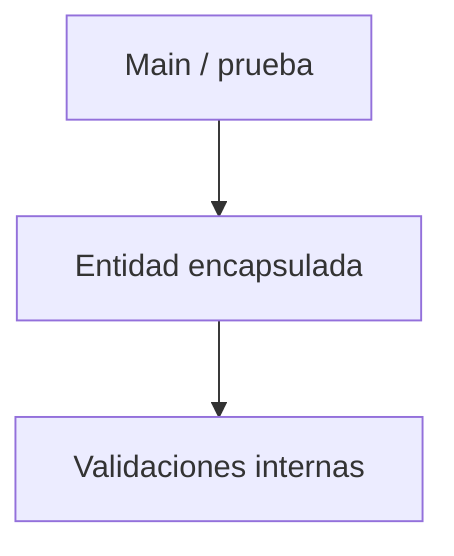

# S2 - Encapsulamiento, constructores y control del estado

## 1. Introducción

Tiempo: 20 min.

### 1.1 Propósito

Proteger el estado de los objetos mediante encapsulamiento, constructores, validaciones básicas y métodos de comportamiento.

### 1.2 Resultado de aprendizaje

El estudiante aplica modificadores de acceso, crea constructores, usa getters y setters con criterio, y mueve reglas simples desde `Main` hacia las clases.

### 1.3 Producto de sesión

Entidades encapsuladas con constructores, validaciones básicas y métodos de comportamiento probados desde `Main`.

### 1.4 Motivación de la sesión

Si cualquier parte del programa puede cambiar directamente el precio o el stock de un producto, el objeto puede quedar en un estado inválido. El encapsulamiento permite controlar esos cambios.

Pregunta guía:

```text
¿Cómo evitamos que un objeto quede con datos inválidos?
```

### 1.5 Ubicación en el curso

- Unidad: U1 - Fundamentos de la Programación Orientada a Objetos.
- Avance de sesión: las entidades dejan de ser contenedores de datos y empiezan a controlar su propio estado.

## 2. Explica

Tiempo: 25 min.

### 2.1 Conceptos clave

- `private`, `public` y responsabilidad de acceso.
- Constructor por defecto y constructor parametrizado.
- Getters y setters.
- Validación de datos.
- Métodos de comportamiento.
- Invariantes simples del dominio.
- Separación de responsabilidades: `Main` prueba, la entidad protege su estado.
- Principio de responsabilidad única como base inicial de SOLID.

Regla metodológica de la sesión:

```text
Main no debe corregir todo.
La entidad debe impedir quedar en estado inválido.
```

### 2.2 Arquitectura de la sesión



## 3. Aplica: actividad práctica guiada

Tiempo: 2h.

1. Encapsular los atributos de una entidad.
2. Crear constructores para estados válidos.
3. Agregar validaciones para valores vacíos, negativos o incoherentes.
4. Crear métodos de comportamiento, por ejemplo `actualizarStock` o `aplicarDescuento`.
5. Probar casos válidos e inválidos desde `Main`.
6. Identificar qué validación pertenece a la entidad y cuál quedará para el gestor en sesiones posteriores.

## 4. Crea: actividad autónoma

Tiempo: 2h fuera del aula.

Mejora otra entidad del dominio aplicando encapsulamiento, constructores y validaciones.

Entrega evidencia breve con:

- Clase encapsulada.
- Pruebas desde `Main`.
- Un caso válido.
- Un caso inválido controlado.

## 5. Cierre evaluativo

Tiempo: 20 min.

### 5.1 Resultados esperados

- Las clases no exponen atributos públicos.
- Los constructores inicializan objetos válidos.
- Las validaciones básicas están dentro de las clases.
- `Main` se usa para probar, no para controlar todas las reglas.

### 5.2 Preguntas de defensa

1. ¿Por qué los atributos deben ser privados?
2. ¿Qué ventaja tiene validar dentro de la clase?
3. ¿Cuándo usarías un setter?
4. ¿Qué comportamiento moviste desde `Main` hacia la entidad?
5. ¿Qué responsabilidad no debería tener `Main`?
