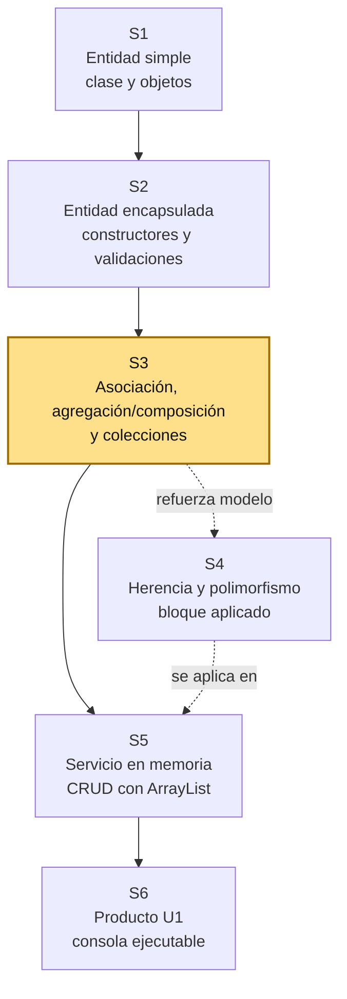
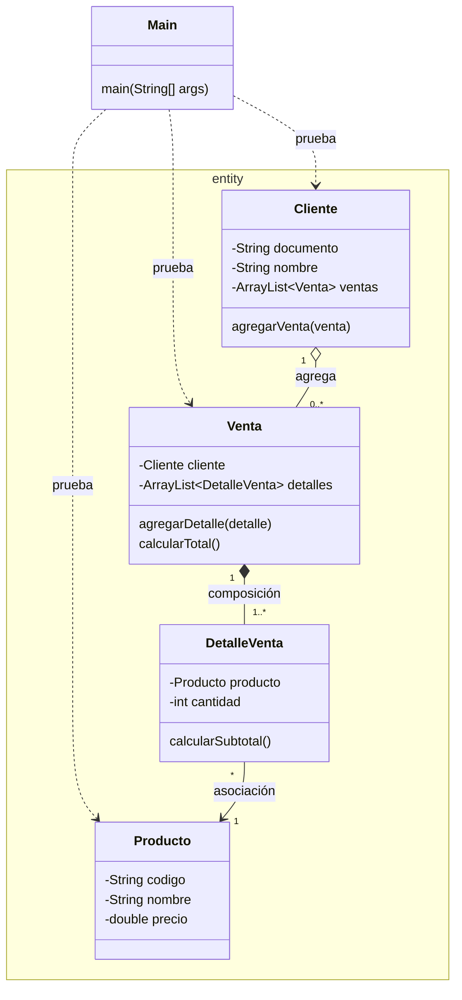

# S3 - Asociación, agregación/composición y colecciones

## 1. Introducción

Tiempo: 20 min.

### 1.1 Propósito

Representar relaciones básicas entre objetos mediante asociación, agregación/composición y colecciones en memoria, antes de convertir esas ideas en operaciones CRUD.

### 1.2 Resultado de aprendizaje

El estudiante identifica entidades del dominio, representa asociaciónes, agregación y composición, y usa `ArrayList` para manejar grupos de objetos relacionados.

### 1.3 Producto de sesión

Modelo inicial con varias entidades relacionadas, asociaciones, agregación, composición, colecciones y pruebas desde `Main`.

### 1.4 Motivación de la sesión

En un sistema real no existe una sola clase. Un cliente puede tener ventas, una venta puede estar compuesta por detalles, y cada detalle referencia un producto. La Programación Orientada a Objetos ayuda a convertir esas relaciones del problema en clases conectadas.

Pregunta guía:

```text
Cómo pasamos de clases aisladas a un modelo de dominio con objetos relacionados?
```

### 1.5 Ubicación en el curso

- Unidad: U1.
- Producto de unidad: aplicación de consola en memoria con entidades, relaciones, colecciones y operaciones principales.
- Avance de sesión: se construye el mapa inicial del dominio y se prepara la base para herencia, polimorfismo y CRUD.



Hoy no se busca terminar todo el sistema. Se busca que el estudiante entienda qué el dominio se arma con varias clases, cada una con una responsabilidad, y qué las relaciones deben aparecer en el código de manera clara.

## 2. Explica

Tiempo: 25 min.

### 2.1 Conceptos clave

| Concepto | Idea central | Ejemplo |
|---|---|---|
| Entidad | Clase qué representa un elemento importante del dominio. | `Cliente`, `Producto`, `Venta`, `DetalleVenta` |
| Asociación | Un objeto conoce o usa a otro objeto. | `DetalleVenta` usa un `Producto` |
| Agregación | Un objeto agrupa otros, pero esos objetos pueden existir por separado. | `Cliente` relacionado con varias `Venta` |
| Composición | Un objeto contiene partes qué dependen de el. | `Venta` contiene `DetalleVenta` |
| Colección | Estructura para manejar varios objetos del mismo tipo. | `ArrayList<Producto>` |

Regla métodológica de la sesión:

```text
Las entidades representan información y comportamiento del dominio.
Las relaciones muestran cómo colaboran los objetos.
Las colecciones administran grupos de objetos.
Main solo crea escenarios de prueba.
Todavía no se separan servicios ni controladores.
La asociación, agregación, composición y multiplicidad se representan en las entidades.
```

### 2.2 Arquitectura de la sesión



Convencion del diagrama: `-->` representa asociación, `o--` representa agregación, `*--` representa composición y `..>` representa dependencia de prueba o uso temporal. En esta sesión la multiplicidad se trabaja dentro de las entidades; no se agregan services ni controllers al diagrama.

### 2.3 Tipos de relación

Asociación:

```java
public class Venta {
    private Cliente cliente;
}
```

La venta conoce al cliente que realiza la operación. Esta asociación ayuda a preparar el modelo para consultar ventas por cliente.

Agregación:

```java
public class Cliente {
    private ArrayList<Venta> ventas;
}
```

El cliente agrupa ventas. Para la practica inicial se entiende cómo una relación de agrupación: las ventas son objetos del sistema y pueden consultarse desde el cliente.

Composición:

```java
public class Venta {
    private ArrayList<DetalleVenta> detalles;
}
```

Los detalles existen para explicar una venta. Si se elimina la venta, sus detalles ya no tienen sentido dentro del sistema.

### 2.4 Errores frecuentes

| Error | Corrección esperada |
|---|---|
| Poner todas las variables en `Main`. | Crear entidades con responsabilidades claras. |
| Usar solo una clase para todo el dominio. | Separar `Cliente`, `Producto`, `Venta`, `DetalleVenta` y otros conceptos necesarios. |
| Confundir una lista con una entidad. | La lista administra varios objetos; la entidad representa un objeto del dominio. |
| Crear relaciones sin sentido. | Cada relación debe responder a una regla del problema. |
| Hacer CRUD completo antes de modelar. | Primero se entiende el dominio; luego se agregan operaciones. |

## 3. Aplica: actividad práctica guiada

Tiempo: 2h.

### 3.1 Identificar entidades del dominio

Parte de un caso simple de comercio:

```text
Un sistema registra clientes, productos y ventas.
Cada venta pertenece a un cliente.
Cada venta tiene uno o más detalles.
Cada detalle indica un producto, cantidad y precio.
```

Entidades iniciales:

- `Cliente`
- `Producto`
- `Venta`
- `DetalleVenta`

Ubicación sugerida:

```text
src/main/java/entity/Cliente.java
src/main/java/entity/Producto.java
src/main/java/entity/Venta.java
src/main/java/entity/DetalleVenta.java
```

### 3.2 Crear entidades base

Ejemplo de `Producto`:

```java
public class Producto {
    private String codigo;
    private String nombre;
    private double precio;

    public Producto(String codigo, String nombre, double precio) {
        this.codigo = codigo;
        this.nombre = nombre;
        this.precio = precio;
    }

    public String getCodigo() {
        return codigo;
    }

    public String getNombre() {
        return nombre;
    }

    public double getPrecio() {
        return precio;
    }
}
```

Ejemplo de `Cliente` con agregación:

```java
import java.util.ArrayList;

public class Cliente {
    private String documento;
    private String nombre;
    private ArrayList<Venta> ventas;

    public Cliente(String documento, String nombre) {
        this.documento = documento;
        this.nombre = nombre;
        this.ventas = new ArrayList<>();
    }

    public void agregarVenta(Venta venta) {
        ventas.add(venta);
    }

    public ArrayList<Venta> getVentas() {
        return ventas;
    }
}
```

### 3.3 Representar una venta con composición

`DetalleVenta` representa una parte de la venta:

```java
public class DetalleVenta {
    private Producto producto;
    private int cantidad;

    public DetalleVenta(Producto producto, int cantidad) {
        this.producto = producto;
        this.cantidad = cantidad;
    }

    public double calcularSubtotal() {
        return producto.getPrecio() * cantidad;
    }
}
```

`Venta` contiene sus detalles:

```java
import java.util.ArrayList;

public class Venta {
    private Cliente cliente;
    private ArrayList<DetalleVenta> detalles;

    public Venta(Cliente cliente) {
        this.cliente = cliente;
        this.detalles = new ArrayList<>();
    }

    public void agregarDetalle(DetalleVenta detalle) {
        detalles.add(detalle);
    }

    public double calcularTotal() {
        double total = 0;
        for (DetalleVenta detalle : detalles) {
            total += detalle.calcularSubtotal();
        }
        return total;
    }
}
```

### 3.4 Probar desde Main

```java
public class Main {
    public static void main(String[] args) {
        Cliente cliente = new Cliente("DNI001", "Ana Torres");

        Producto teclado = new Producto("P001", "Teclado", 80.0);
        Producto mouse = new Producto("P002", "Mouse", 45.0);

        Venta venta = new Venta(cliente);
        venta.agregarDetalle(new DetalleVenta(teclado, 1));
        venta.agregarDetalle(new DetalleVenta(mouse, 2));
        cliente.agregarVenta(venta);

        System.out.println("Total: " + venta.calcularTotal());
        System.out.println("Ventas del cliente: " + cliente.getVentas().size());
    }
}
```

### 3.5 Preguntas durante la practica

1. Qué clases son entidades del dominio?
2. Qué relación existe entre `Venta` y `DetalleVenta`?
3. Por qué `DetalleVenta` depende de `Venta`?
4. Dónde se ubica la colección en este modelo?
5. Qué relación se representa con `ArrayList`?

## 4. Crea: actividad autónoma

Fuera del aula, cada estudiante consolida el aprendizaje ampliando el modelo del dominio y preparando una evidencia individual.

Tiempo: 2h fuera del aula.

### 4.1 Plantilla de evidencia individual

Entrega un PDF con el siguiente nombre:

```text
S03_Equipo##_ApellidoNombre.pdf
```

Ejemplo:

```text
S03_Equipo03_QuispeAna.pdf
```

El PDF debe usar esta estructura. La primera sección define el trabajo autónomo; completa las demás con tus evidencias.

#### 4.1.1 Datos del estudiante

- Nombre:
- Equipo:
- Sesión: S03 - Asociación, agregación/composición y colecciones
- Rol o aporte realizado:
- Link de GitHub:

#### 4.1.2 Trabajo autónomo realizado

Completa y evidencia estas tareas:

1. Ampliar el modelo con una relación adicional.
2. Crear o mejorar al menos tres entidades relacionadas.
3. Representar una asociación, agregación o composición.
4. Usar `ArrayList` para una relación de uno a muchos.
5. Probar desde `Main` la creación de objetos relacionados.
6. Explicar qué relación existe entre las clases.

Puedes elegir una de estas opciones:

- `Categoria` relacionada con varios `Producto`.
- `Empleado` relacionado con varias `Venta`.
- `Cliente` relacionado con varias `Venta`.
- `Venta` relacionada con varios `DetalleVenta`.

#### 4.1.3 Evidencia técnica

Incluye capturas o salidas de consola con una breve explicación debajo de cada una:

- Diagrama simple del modelo.
- Código de al menos tres entidades relacionadas.
- Uso de una colección con `ArrayList`.
- Salida de consola mostrando objetos relacionados.
- Explicación de la relación modelada.

#### 4.1.4 Error o hallazgo

Describe al menos un error, diferencia o hallazgo técnico:

- Qué ocurrió.
- Cómo lo diagnosticaste.
- Cómo lo corregiste o qué aprendiste.

Ejemplos válidos:

- Una relación no tenía sentido en el dominio.
- Se confundió una colección con una entidad.
- Una lista no fue inicializada antes de usarla.

#### 4.1.5 Reflexión técnica breve

Responde en 5 a 8 líneas:

```text
Por qué un sistema orientado a objetos necesita relaciones entre clases y no solo clases aisladas?
```

### 4.2 Criterios mínimos de aceptación

La evidencia individual se considera completa si:

- El archivo respeta el nombre `S03_Equipo##_ApellidoNombre.pdf`.
- Incluye evidencias técnicas legibles.
- Muestra al menos tres entidades relacionadas.
- Usa `ArrayList` para administrar varios objetos.
- Representa una relación de uno a muchos.
- Incluye una prueba desde `Main`.
- Explica si la relación es asociación, agregación o composición.
- No contiene solo pantallazos: cada evidencia tiene una descripción breve.

## 5. Cierre evaluativo

Tiempo: 20 min.

Esta sección conecta el resultado de aprendizaje de la sesión con el producto que debe evidenciar cada estudiante.

### 5.1 Resultados esperados

Al finalizar la sesión, el estudiante debe demostrar que:

- El modelo tiene varias entidades del dominio.
- Las relaciones no están sueltas; aparecen representadas en atributos o colecciones.
- Hay al menos una relación de uno a muchos.
- Se usa `ArrayList` para administrar varios objetos.
- La colección está ubicada dentro de una entidad del dominio.
- `Main` solo arma escenarios de prueba y no concentra toda la lógica.

### 5.2 Evidencia del producto de sesión

Cada estudiante entrega un PDF individual siguiendo la plantilla de la sección 4.1.

Nombre del archivo:

```text
S03_Equipo##_ApellidoNombre.pdf
```

La evidencia debe demostrar:

- Producto de sesión construido.
- Aporte individual verificable.
- Modelo con entidades relacionadas.
- Pruebas por consola realizadas.
- Reflexión técnica breve.

La revisión se realiza con los criterios mínimos de aceptación de la sección 4.2 y la rúbrica de la sección 5.4.

### 5.3 Preguntas de defensa y reflexión

1. Qué diferencia hay entre entidad y colección?
2. Qué relación modelaste como asociación?
3. Qué relación modelaste como agregación o composición?
4. Por qué una venta necesita detalles?
5. En qué entidad está ubicada la colección?
6. Qué parte de este modelo se podría convertir en CRUD en S5?

### 5.4 Rúbrica de evaluación

| Dimensión | Peso | 3 - Logro destacado | 2 - Logro | 1 - Proceso | 0 - Inicio | Puntuación obtenida |
|---|---:|---|---|---|---|---:|
| 1. Modelo de dominio | 2 | Presenta entidades coherentes y relacionadas con claridad. | Presenta entidades principales correctas. | Modelo incompleto o poco claro. | No evidencia modelo de dominio. | |
| 2. Relaciones entre objetos | 2 | Distingue y justifica asociación, agregación o composición. | Representa al menos una relación correcta. | Relación parcial o confusa. | No evidencia relaciones. | |
| 3. Colecciones | 2 | Usa `ArrayList` correctamente en una relación de uno a muchos. | Usa colección funcional. | Uso parcial o mal ubicado. | No usa colecciones. | |
| 4. Prueba desde `Main` | 2 | `Main` crea un escenario claro sin reemplazar el modelo. | Prueba funcional básica. | Prueba parcial o confusa. | No prueba el modelo. | |
| 5. Error o hallazgo | 1 | Analiza error/hallazgo, causa, solución y aprendizaje técnico. | Explica un problema y una solución. | Menciona un problema sin análisis. | No presenta error ni hallazgo. | |
| 6. Reflexión y orden | 1 | PDF ordenado, evidencias legibles y reflexión precisa. | Evidencias suficientes y reflexión clara. | Evidencias incompletas o reflexión superficial. | PDF desordenado o sin reflexión. | |

Puntuación acumulada = suma de (`Peso` * `Puntuación obtenida`) = ____.

Nota final = (`Puntuación acumulada` / 30) * 20 = ____.

Para usar la rúbrica con IA, solicita:

```text
Evalúa el PDF usando la rúbrica de la sesión.
Para cada dimensión selecciona la puntuación obtenida usando la escala Inicio=0, Proceso=1, Logro=2, Logro destacado=3.
Justifica brevemente cada puntuación.
Calcula la puntuación acumulada con la fórmula: suma de (Peso * Puntuación obtenida).
Calcula la nota final sobre 20 con la fórmula: (Puntuación acumulada / 30) * 20.
Indica 2 fortalezas y 2 recomendaciones.
```

