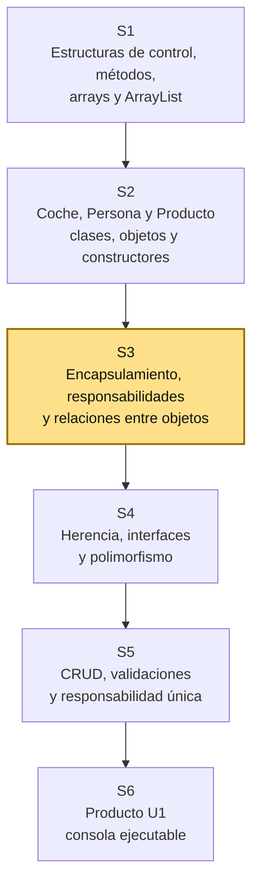
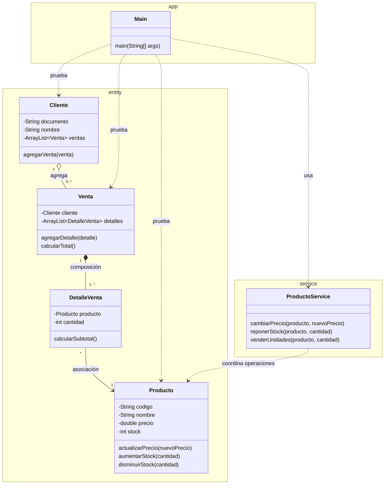

# S3 - Encapsulamiento, separación de responsabilidades y relaciones entre objetos

## 1. Introducción

Tiempo: 20 min.

### 1.1 Propósito

Aplicar encapsulamiento en entidades del dominio, separar responsabilidades básicas entre `Main`, servicio y entidades, y representar relaciones entre objetos mediante asociación, agregación/composición y colecciones dentro del modelo.

### 1.2 Resultado de aprendizaje

El estudiante encapsula entidades del dominio, diferencia responsabilidades entre `Main`, servicio y entidades, representa relaciones entre objetos y usa `ArrayList` para manejar grupos de objetos relacionados.

### 1.3 Producto de sesión

Modelo de dominio encapsulado, organizado por responsabilidades y con relaciones entre entidades, colecciones dentro del modelo y pruebas desde `Main`.

### 1.4 Motivación de la sesión

En S2 se crearon clases, objetos, constructores y comunicación básica entre objetos. Esa primera versión permite entender estado y comportamiento, pero todavía falta proteger los datos y organizar mejor el código.

En un sistema real no existe una sola clase. Un cliente puede tener ventas, una venta puede estar compuesta por detalles, y cada detalle referencia un producto. La Programación Orientada a Objetos ayuda a convertir esas relaciones del problema en clases conectadas y con responsabilidades claras.

Pregunta guía:

```text
Cómo protegemos el estado de los objetos y cómo pasamos de clases aisladas
a un modelo de dominio con objetos relacionados?
```

### 1.5 Ubicación en el curso

- Unidad: U1 - Fundamentos de la Programación Orientada a Objetos.
- Producto de unidad: aplicación de consola en memoria con entidades, relaciones, colecciones y operaciones CRUD.
- Carpeta de trabajo: `comarket-cli`.
- Avance de sesión: modelo de dominio encapsulado, organizado por responsabilidades y con relaciones entre entidades.

Roadmap para elaborar el producto de la unidad:



Hoy no se busca terminar todo el sistema. Se busca que el estudiante entienda que el dominio se arma con entidades encapsuladas, responsabilidades separadas y relaciones claras entre objetos.

## 2. Explica

Tiempo: 25 min.

### 2.1 Conceptos clave

| Concepto | Idea central | Ejemplo |
|---|---|---|
| Entidad | Clase qué representa un elemento importante del dominio. | `Cliente`, `Producto`, `Venta`, `DetalleVenta` |
| Encapsulamiento | Protege el estado interno de un objeto. | Atributos `private` |
| Modificador de acceso | Define desde dónde puede usarse un atributo o método. | `private`, `public` |
| Getter | Permite consultar un dato encapsulado. | `getNombre()` |
| Setter limpio | Permite asignar un dato simple sin mezclar demasiada lógica. | `setNombre(String nombre)` |
| `service` | Capa o paquete con clases que coordinan operaciones del dominio sin reemplazar a las entidades. | `ProductoService`, `VentaService` |
| Asociación | Un objeto conoce o usa a otro objeto. | `DetalleVenta` usa un `Producto` |
| Agregación | Un objeto agrupa otros, pero esos objetos pueden existir por separado. | `Cliente` relacionado con varias `Venta` |
| Composición | Un objeto contiene partes qué dependen de el. | `Venta` contiene `DetalleVenta` |
| Colección | Estructura para manejar varios objetos del mismo tipo. | `ArrayList<Producto>` |

Regla métodológica de la sesión:

```text
Las entidades representan información y comportamiento del dominio.
Las relaciones muestran cómo colaboran los objetos.
Las colecciones administran grupos de objetos dentro de una entidad.
Main solo crea escenarios de prueba.
El service coordina operaciones simples, pero no reemplaza a las entidades.
Todavía no se introducen interfaces ni implementaciones.
La asociación, agregación, composición y multiplicidad se representan en las entidades.
```

### 2.2 Separación inicial de responsabilidades

En esta sesión se usa una separación simple:

```text
app      -> Main: prueba el flujo desde consola.
entity   -> Producto, Cliente, Venta, DetalleVenta: representan el dominio.
service  -> ProductoService o VentaService: coordina operaciones simples.
```

La regla práctica es:

| Componente | Sí debe hacer | No debe hacer |
|---|---|---|
| `Main` | Crear objetos y probar escenarios | Concentrar todas las reglas |
| Entidad | Guardar estado y exponer comportamiento propio | Resolver menús o flujos completos |
| Service | Coordinar operaciones simples entre objetos | Convertirse todavía en interface/implementación |

### 2.3 Arquitectura de la sesión



Convencion del diagrama: `-->` representa asociación, `o--` representa agregación, `*--` representa composición y `..>` representa dependencia de prueba o uso temporal. En esta sesión la multiplicidad se trabaja dentro de las entidades; el service aparece solo como separación inicial de responsabilidades. Las interfaces se dejan para S4.

### 2.4 Encapsulamiento y comportamiento básico

Una entidad encapsulada protege su estado:

```java
public class Producto {
    private String codigo;
    private String nombre;
    private double precio;
    private int stock;
}
```

La entidad puede tener métodos de comportamiento que cambian su propio estado:

```java
public void actualizarPrecio(double nuevoPrecio) {
    this.precio = nuevoPrecio;
}
```

Esto evita que `Main` manipule directamente los atributos. El service puede llamar este método, pero el cambio sigue ocurriendo mediante el comportamiento público de la entidad.

### 2.5 Tipos de relación

Asociación:

```java
public class Venta {
    private Cliente cliente;
}
```

La venta conoce al cliente que realiza la operación. Esta asociación ayuda a preparar el modelo para consultar ventas por cliente.

Agregación:

```java
public class Cliente {
    private ArrayList<Venta> ventas;
}
```

El cliente agrupa ventas. Para la practica inicial se entiende cómo una relación de agrupación: las ventas son objetos del sistema y pueden consultarse desde el cliente.

Composición:

```java
public class Venta {
    private ArrayList<DetalleVenta> detalles;
}
```

Los detalles existen para explicar una venta. Si se elimina la venta, sus detalles ya no tienen sentido dentro del sistema.

### 2.6 Errores frecuentes

| Error | Corrección esperada |
|---|---|
| Poner todas las variables en `Main`. | Crear entidades con responsabilidades claras. |
| Usar solo una clase para todo el dominio. | Separar `Cliente`, `Producto`, `Venta`, `DetalleVenta` y otros conceptos necesarios. |
| Confundir una lista con una entidad. | La lista administra varios objetos; la entidad representa un objeto del dominio. |
| Crear relaciones sin sentido. | Cada relación debe responder a una regla del problema. |
| Hacer CRUD completo antes de modelar. | Primero se entiende el dominio; luego se agregan operaciones. |
| Poner todos los cambios directamente en `Main`. | Usar métodos de entidad o métodos del service según la responsabilidad. |
| Meter interfaces antes de tiempo. | Usar service simple en S3; dejar interface/implementación para S4 y S5. |

## 3. Aplica: actividad práctica guiada

Tiempo: 2h.

### 3.1 Identificar entidades del dominio

Parte de un caso simple de comercio:

```text
Un sistema registra clientes, productos y ventas.
Cada venta pertenece a un cliente.
Cada venta tiene uno o más detalles.
Cada detalle indica un producto, cantidad y precio.
```

Entidades iniciales:

- `Cliente`
- `Producto`
- `Venta`
- `DetalleVenta`

Ubicación sugerida con separación inicial:

```text
src/main/java/app/Main.java
src/main/java/entity/Cliente.java
src/main/java/entity/Producto.java
src/main/java/entity/Venta.java
src/main/java/entity/DetalleVenta.java
src/main/java/service/ProductoService.java
```

### 3.2 Encapsular Producto y proteger su estado

Ejemplo de `Producto` con atributos privados, constructor y getters/setters limpios:

```java
package entity;

public class Producto {
    private String codigo;
    private String nombre;
    private double precio;
    private int stock;

    public Producto(String codigo, String nombre, double precio, int stock) {
        this.codigo = codigo;
        this.nombre = nombre;
        this.precio = precio;
        this.stock = stock;
    }

    public String getCodigo() {
        return codigo;
    }

    public String getNombre() {
        return nombre;
    }

    public double getPrecio() {
        return precio;
    }

    public int getStock() {
        return stock;
    }

    public void setNombre(String nombre) {
        this.nombre = nombre;
    }

    public void actualizarPrecio(double nuevoPrecio) {
        this.precio = nuevoPrecio;
    }

    public void aumentarStock(int cantidad) {
        this.stock = this.stock + cantidad;
    }

    public void disminuirStock(int cantidad) {
        this.stock = this.stock - cantidad;
    }
}
```

Lectura esperada:

```text
Producto protege su estado.
Main ya no modifica directamente los atributos.
Los getters consultan datos.
Los métodos con nombre de acción cambian el estado de forma más clara.
```

Prueba rápida en `Main`:

```java
package app;

import entity.Producto;

public class Main {
    public static void main(String[] args) {
        Producto producto = new Producto("P001", "Teclado", 80.0, 10);

        producto.actualizarPrecio(75.0);
        producto.aumentarStock(5);

        System.out.println("Código: " + producto.getCodigo());
        System.out.println("Nombre: " + producto.getNombre());
        System.out.println("Precio: " + producto.getPrecio());
        System.out.println("Stock: " + producto.getStock());
    }
}
```

Lectura de la prueba:

```text
Main no usa producto.precio ni producto.stock directamente.
Main crea el objeto y llama métodos públicos.
El estado se consulta mediante getters.
```

### 3.3 Crear ProductoService como separación inicial

`ProductoService` no reemplaza a `Producto`. Solo coordina operaciones que `Main` no debería hacer directamente.

```java
package service;

import entity.Producto;

public class ProductoService {

    public void cambiarPrecio(Producto producto, double nuevoPrecio) {
        producto.actualizarPrecio(nuevoPrecio);
    }

    public void reponerStock(Producto producto, int cantidad) {
        producto.aumentarStock(cantidad);
    }

    public void venderUnidades(Producto producto, int cantidad) {
        producto.disminuirStock(cantidad);
    }
}
```

Prueba rápida en `Main`:

```java
package app;

import entity.Producto;
import service.ProductoService;

public class Main {
    public static void main(String[] args) {
        Producto producto = new Producto("P001", "Teclado", 80.0, 10);
        ProductoService productoService = new ProductoService();

        productoService.cambiarPrecio(producto, 75.0);
        productoService.reponerStock(producto, 5);
        productoService.venderUnidades(producto, 3);

        System.out.println("Precio: " + producto.getPrecio());
        System.out.println("Stock: " + producto.getStock());
    }
}
```

Lectura de la prueba:

```text
Main ya no coordina directamente todos los cambios.
ProductoService recibe la solicitud.
Producto mantiene los datos y los métodos que cambian su estado.
```

### 3.4 Crear Cliente con agregación

Ejemplo de `Cliente` con una colección de ventas:

```java
package entity;

import java.util.ArrayList;

public class Cliente {
    private String documento;
    private String nombre;
    private ArrayList<Venta> ventas;

    public Cliente(String documento, String nombre) {
        this.documento = documento;
        this.nombre = nombre;
        this.ventas = new ArrayList<>();
    }

    public void agregarVenta(Venta venta) {
        ventas.add(venta);
    }

    public String getDocumento() {
        return documento;
    }

    public String getNombre() {
        return nombre;
    }

    public ArrayList<Venta> getVentas() {
        return ventas;
    }
}
```

Prueba rápida de la idea:

```java
Cliente cliente = new Cliente("DNI001", "Ana Torres");
System.out.println("Cliente: " + cliente.getNombre());
System.out.println("Ventas registradas: " + cliente.getVentas().size());
```

Nota: esta prueba se ejecuta dentro de `Main` después de tener creada la clase `Venta`, porque `Cliente` declara una colección `ArrayList<Venta>`.

Lectura de la prueba:

```text
Cliente inicia con una lista de ventas vacía.
La colección pertenece a Cliente porque representa una relación del dominio.
```

### 3.5 Representar una venta con composición

`DetalleVenta` representa una parte de la venta:

```java
package entity;

public class DetalleVenta {
    private Producto producto;
    private int cantidad;

    public DetalleVenta(Producto producto, int cantidad) {
        this.producto = producto;
        this.cantidad = cantidad;
    }

    public Producto getProducto() {
        return producto;
    }

    public int getCantidad() {
        return cantidad;
    }

    public double calcularSubtotal() {
        return producto.getPrecio() * cantidad;
    }
}
```

`Venta` contiene sus detalles:

```java
package entity;

import java.util.ArrayList;

public class Venta {
    private Cliente cliente;
    private ArrayList<DetalleVenta> detalles;

    public Venta(Cliente cliente) {
        this.cliente = cliente;
        this.detalles = new ArrayList<>();
    }

    public void agregarDetalle(DetalleVenta detalle) {
        detalles.add(detalle);
    }

    public Cliente getCliente() {
        return cliente;
    }

    public ArrayList<DetalleVenta> getDetalles() {
        return detalles;
    }

    public double calcularTotal() {
        double total = 0;
        for (DetalleVenta detalle : detalles) {
            total += detalle.calcularSubtotal();
        }
        return total;
    }
}
```

Prueba rápida en `Main`:

```java
package app;

import entity.Cliente;
import entity.DetalleVenta;
import entity.Producto;
import entity.Venta;

public class Main {
    public static void main(String[] args) {
        Cliente cliente = new Cliente("DNI001", "Ana Torres");
        Producto teclado = new Producto("P001", "Teclado", 80.0, 10);

        Venta venta = new Venta(cliente);
        DetalleVenta detalle = new DetalleVenta(teclado, 2);

        venta.agregarDetalle(detalle);
        cliente.agregarVenta(venta);

        System.out.println("Cliente: " + venta.getCliente().getNombre());
        System.out.println("Detalles: " + venta.getDetalles().size());
        System.out.println("Total: " + venta.calcularTotal());
        System.out.println("Ventas del cliente: " + cliente.getVentas().size());
    }
}
```

Lectura de la prueba:

```text
Venta contiene detalles.
DetalleVenta referencia un Producto.
Cliente agrupa ventas.
ArrayList aparece dentro de entidades, no como lista suelta en Main.
```

### 3.6 Probar desde Main

Esta prueba integra los conceptos anteriores en un solo flujo.

```java
package app;

import entity.Cliente;
import entity.DetalleVenta;
import entity.Producto;
import entity.Venta;
import service.ProductoService;

public class Main {
    public static void main(String[] args) {
        ProductoService productoService = new ProductoService();

        Cliente cliente = new Cliente("DNI001", "Ana Torres");

        Producto teclado = new Producto("P001", "Teclado", 80.0, 10);
        Producto mouse = new Producto("P002", "Mouse", 45.0, 20);

        productoService.cambiarPrecio(teclado, 75.0);
        productoService.venderUnidades(teclado, 1);

        Venta venta = new Venta(cliente);
        venta.agregarDetalle(new DetalleVenta(teclado, 1));
        venta.agregarDetalle(new DetalleVenta(mouse, 2));
        cliente.agregarVenta(venta);

        System.out.println("Total: " + venta.calcularTotal());
        System.out.println("Ventas del cliente: " + cliente.getVentas().size());
    }
}
```

### 3.7 Registrar decisiones de encapsulamiento, responsabilidad y relación

Completar una tabla breve:

| Decisión | Justificación |
|---|---|
| `Producto` usa atributos `private` | Su estado no debe modificarse directamente desde `Main` |
| `Producto` cambia su precio y stock mediante métodos | El estado no se modifica directamente desde `Main` |
| `ProductoService` coordina operaciones | Evita que `Main` concentre acciones del dominio |
| `Cliente` tiene `ArrayList<Venta>` | Un cliente puede agrupar varias ventas |
| `Venta` tiene `ArrayList<DetalleVenta>` | Una venta se compone de varios detalles |
| `DetalleVenta` tiene `Producto` | Cada detalle referencia el producto vendido |

### 3.8 Preguntas durante la practica

1. Qué clases son entidades del dominio?
2. Qué atributos quedaron protegidos con `private`?
3. Qué responsabilidad tiene `ProductoService`?
4. Qué relación existe entre `Venta` y `DetalleVenta`?
5. Por qué `DetalleVenta` referencia un `Producto`?
6. Dónde se ubica la colección en este modelo?
7. Qué relación se representa con `ArrayList`?

## 4. Crea: actividad autónoma

Fuera del aula, cada estudiante consolida el aprendizaje ampliando el modelo del dominio y preparando una evidencia individual.

Tiempo: 2h fuera del aula.

### 4.1 Plantilla de evidencia individual

Entrega un PDF con el siguiente nombre:

```text
S03_Equipo##_ApellidoNombre.pdf
```

Ejemplo:

```text
S03_Equipo03_QuispeAna.pdf
```

El PDF debe usar esta estructura. La primera sección define el trabajo autónomo; completa las demás con tus evidencias.

#### 4.1.1 Datos del estudiante

- Nombre:
- Equipo:
- Sesión: S03 - Encapsulamiento, separación de responsabilidades y relaciones entre objetos
- Rol o aporte realizado:
- Link de GitHub:

#### 4.1.2 Trabajo autónomo realizado

Completa y evidencia estas tareas:

1. Encapsular al menos una entidad usando atributos `private`.
2. Crear constructor, getters y setters limpios cuando correspondan.
3. Crear o mejorar al menos tres entidades relacionadas.
4. Representar una asociación, agregación o composición.
5. Usar `ArrayList` dentro de una entidad para una relación de uno a muchos.
6. Crear una clase service simple para coordinar operaciones.
7. Probar desde `Main` la creación de objetos relacionados.
8. Explicar qué responsabilidad tiene `Main`, qué responsabilidad tienen las entidades y qué responsabilidad tiene el service.

Puedes elegir una de estas opciones:

- `Categoria` relacionada con varios `Producto`.
- `Empleado` relacionado con varias `Venta`.
- `Cliente` relacionado con varias `Venta`.
- `Venta` relacionada con varios `DetalleVenta`.

#### 4.1.3 Evidencia técnica

Incluye capturas o salidas de consola con una breve explicación debajo de cada una:

- Diagrama simple del modelo.
- Código de una entidad encapsulada.
- Código de un service simple.
- Código de al menos tres entidades relacionadas.
- Uso de una colección con `ArrayList`.
- Salida de consola mostrando objetos relacionados.
- Explicación de la relación modelada y de la separación de responsabilidades.

#### 4.1.4 Error o hallazgo

Describe al menos un error, diferencia o hallazgo técnico:

- Qué ocurrió.
- Cómo lo diagnosticaste.
- Cómo lo corregiste o qué aprendiste.

Ejemplos válidos:

- Un cambio de estado quedó inicialmente en `Main` y luego se movió a la entidad o al service.
- Una relación no tenía sentido en el dominio.
- Se confundió una colección con una entidad.
- Una lista no fue inicializada antes de usarla.

#### 4.1.5 Reflexión técnica breve

Responde en 5 a 8 líneas:

```text
Por qué un sistema orientado a objetos necesita entidades encapsuladas,
responsabilidades separadas y relaciones entre clases?
```

### 4.2 Criterios mínimos de aceptación

La evidencia individual se considera completa si:

- El archivo respeta el nombre `S03_Equipo##_ApellidoNombre.pdf`.
- Incluye evidencias técnicas legibles.
- Muestra al menos una entidad encapsulada.
- Muestra una separación inicial entre `Main`, entidades y service.
- Muestra al menos tres entidades relacionadas.
- Usa `ArrayList` para administrar varios objetos.
- Representa una relación de uno a muchos.
- Incluye una prueba desde `Main`.
- Explica si la relación es asociación, agregación o composición.
- No contiene solo pantallazos: cada evidencia tiene una descripción breve.

## 5. Cierre evaluativo

Tiempo: 20 min.

Esta sección conecta el resultado de aprendizaje de la sesión con el producto que debe evidenciar cada estudiante.

### 5.1 Resultados esperados

Al finalizar la sesión, el estudiante debe demostrar que:

- El modelo tiene varias entidades del dominio.
- Las entidades principales están encapsuladas.
- Existe separación inicial entre `Main`, entidades y service.
- Las relaciones no están sueltas; aparecen representadas en atributos o colecciones.
- Hay al menos una relación de uno a muchos.
- Se usa `ArrayList` para administrar varios objetos.
- La colección está ubicada dentro de una entidad del dominio.
- `Main` solo arma escenarios de prueba y no concentra toda la lógica.

### 5.2 Evidencia del producto de sesión

Cada estudiante entrega un PDF individual siguiendo la plantilla de la sección 4.1.

Nombre del archivo:

```text
S03_Equipo##_ApellidoNombre.pdf
```

La evidencia debe demostrar:

- Producto de sesión construido.
- Aporte individual verificable.
- Modelo con entidades relacionadas.
- Encapsulamiento y responsabilidades separadas.
- Pruebas por consola realizadas.
- Reflexión técnica breve.

La revisión se realiza con los criterios mínimos de aceptación de la sección 4.2 y la rúbrica de la sección 5.4.

### 5.3 Preguntas de defensa y reflexión

1. Qué diferencia hay entre entidad y colección?
2. Por qué no conviene dejar atributos públicos?
3. Qué cambio de estado dejaste como método de una entidad?
4. Qué responsabilidad tiene el service?
5. Qué relación modelaste como asociación?
6. Qué relación modelaste como agregación o composición?
7. Por qué una venta necesita detalles?
8. En qué entidad está ubicada la colección?
9. Qué parte de este modelo se podría convertir en CRUD en S5?

### 5.4 Rúbrica de evaluación

| Dimensión | Peso | 3 - Logro destacado | 2 - Logro | 1 - Proceso | 0 - Inicio | Puntuación obtenida |
|---|---:|---|---|---|---|---:|
| 1. Encapsulamiento | 2 | Protege el estado y expone métodos claros para consultarlo o modificarlo. | Usa atributos privados y acceso controlado. | Encapsulamiento parcial. | No evidencia encapsulamiento. | |
| 2. Separación de responsabilidades | 2 | Distingue claramente `Main`, entidades y service. | Presenta separación funcional. | Mezcla algunas responsabilidades. | Toda la lógica queda en `Main`. | |
| 3. Relaciones entre objetos | 2 | Distingue y justifica asociación, agregación o composición. | Representa al menos una relación correcta. | Relación parcial o confusa. | No evidencia relaciones. | |
| 4. Colecciones dentro del modelo | 2 | Usa `ArrayList` correctamente dentro de una entidad. | Usa colección funcional. | Uso parcial o mal ubicado. | No usa colecciones. | |
| 5. Prueba desde `Main` | 1 | `Main` crea un escenario claro sin reemplazar el modelo. | Prueba funcional básica. | Prueba parcial o confusa. | No prueba el modelo. | |
| 6. Reflexión y orden | 1 | PDF ordenado, evidencias legibles y reflexión precisa. | Evidencias suficientes y reflexión clara. | Evidencias incompletas o reflexión superficial. | PDF desordenado o sin reflexión. | |

Puntuación acumulada = suma de (`Peso` * `Puntuación obtenida`) = ____.

Nota final = (`Puntuación acumulada` / 30) * 20 = ____.

Para usar la rúbrica con IA, solicita:

```text
Evalúa el PDF usando la rúbrica de la sesión.
Para cada dimensión selecciona la puntuación obtenida usando la escala Inicio=0, Proceso=1, Logro=2, Logro destacado=3.
Justifica brevemente cada puntuación.
Calcula la puntuación acumulada con la fórmula: suma de (Peso * Puntuación obtenida).
Calcula la nota final sobre 20 con la fórmula: (Puntuación acumulada / 30) * 20.
Indica 2 fortalezas y 2 recomendaciones.
```

