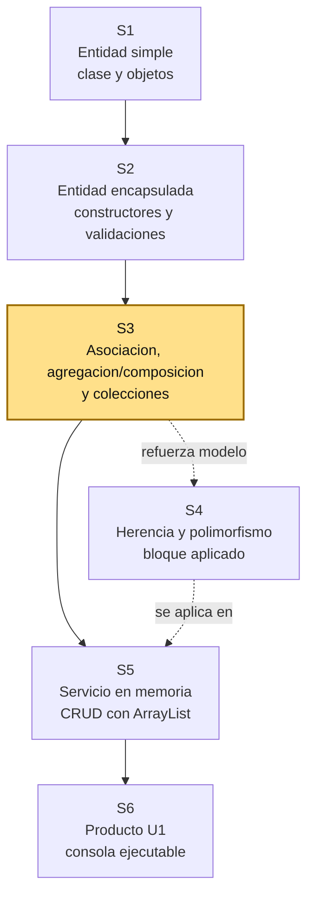
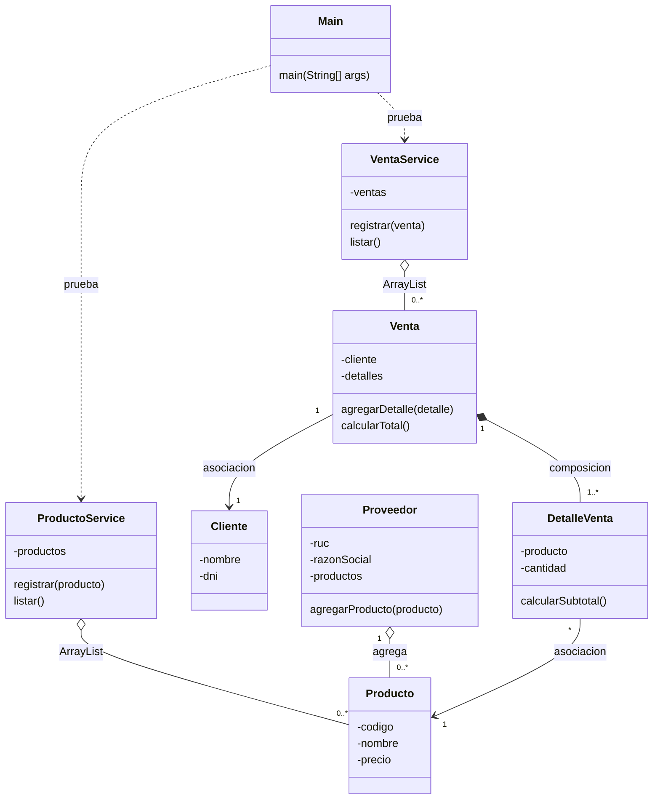

# S3 - Asociacion, agregacion/composicion y colecciones

## 1. Introduccion

Tiempo: 20 min.

### 1.1 Proposito

Representar relaciones basicas entre objetos mediante asociacion, agregacion/composicion y colecciones en memoria, antes de convertir esas ideas en operaciones CRUD.

### 1.2 Resultado de aprendizaje

El estudiante identifica entidades del dominio, representa asociaciones, agregacion y composicion, y usa `ArrayList` para manejar grupos de objetos relacionados.

### 1.3 Producto de sesion

Modelo inicial con varias entidades relacionadas, colecciones administradas desde un servicio inicial y pruebas desde `Main`.

### 1.4 Motivacion de la sesion

En un sistema real no existe una sola clase. Una venta se relaciona con un cliente, un proveedor puede estar asociado a productos, y una venta puede estar compuesta por detalles. La Programacion Orientada a Objetos ayuda a convertir esas relaciones del problema en clases conectadas.

Pregunta guia:

```text
Como pasamos de clases aisladas a un modelo de dominio con objetos relacionados?
```

### 1.5 Ubicacion en el curso

- Unidad: U1.
- Producto de unidad: aplicacion de consola en memoria con entidades, relaciones, colecciones y operaciones principales.
- Avance de sesion: se construye el mapa inicial del dominio y se prepara la base para herencia, polimorfismo y CRUD.



Hoy no se busca terminar todo el sistema. Se busca que el estudiante entienda que el dominio se arma con varias clases, cada una con una responsabilidad, y que las relaciones deben aparecer en el codigo de manera clara.

## 2. Explica

Tiempo: 25 min.

### 2.1 Conceptos clave

| Concepto | Idea central | Ejemplo |
|---|---|---|
| Entidad | Clase que representa un elemento importante del dominio. | `Cliente`, `Proveedor`, `Producto`, `Venta` |
| Asociacion | Un objeto conoce o usa a otro objeto. | `Venta` tiene un `Cliente` |
| Agregacion | Un objeto agrupa otros, pero esos objetos pueden existir por separado. | `Proveedor` relacionado con varios `Producto` |
| Composicion | Un objeto contiene partes que dependen de el. | `Venta` contiene `DetalleVenta` |
| Coleccion | Estructura para manejar varios objetos del mismo tipo. | `ArrayList<Producto>` |
| Servicio inicial | Clase que administra una coleccion y evita cargar toda la logica en `Main`. | `ProductoService`, `VentaService` |

Regla metodologica de la sesion:

```text
Las entidades representan informacion y comportamiento del dominio.
Las relaciones muestran como colaboran los objetos.
Las colecciones administran grupos de objetos.
Main solo crea escenarios de prueba.
```

### 2.2 Arquitectura de la sesion



Convencion del diagrama: `-->` representa asociacion, `o--` representa agregacion, `*--` representa composicion y `..>` representa dependencia de prueba o uso temporal. En esta sesion no se implementa todavia la arquitectura completa de servicio; solo se prepara el dominio para que S5 pueda convertir las operaciones en un CRUD en memoria.

### 2.3 Tipos de relacion

Asociacion:

```java
public class Venta {
    private Cliente cliente;
}
```

La venta se relaciona con un cliente. El cliente puede existir aunque no tenga ventas registradas.

Agregacion:

```java
public class Proveedor {
    private ArrayList<Producto> productos;
}
```

El proveedor agrupa productos. Para la practica inicial se entiende como una relacion de agrupacion: los productos son parte del modelo y pueden administrarse tambien desde un servicio.

Composicion:

```java
public class Venta {
    private ArrayList<DetalleVenta> detalles;
}
```

Los detalles existen para explicar una venta. Si se elimina la venta, sus detalles ya no tienen sentido dentro del sistema.

### 2.4 Errores frecuentes

| Error | Correccion esperada |
|---|---|
| Poner todas las variables en `Main`. | Crear entidades con responsabilidades claras. |
| Usar solo una clase para todo el dominio. | Separar `Cliente`, `Producto`, `Venta`, `DetalleVenta` y otros conceptos. |
| Confundir una lista con una entidad. | La lista administra varios objetos; la entidad representa un objeto del dominio. |
| Crear relaciones sin sentido. | Cada relacion debe responder a una regla del problema. |
| Hacer CRUD completo antes de modelar. | Primero se entiende el dominio; luego se agregan operaciones. |

## 3. Aplica: actividad practica guiada

Tiempo: 2h.

### 3.1 Identificar entidades del dominio

Parte de un caso simple de comercio:

```text
Un sistema registra clientes, proveedores, productos y ventas.
Cada venta pertenece a un cliente.
Cada venta tiene uno o mas detalles.
Cada detalle indica un producto, cantidad y precio.
Un proveedor puede estar asociado a varios productos.
```

Entidades iniciales:

- `Cliente`
- `Proveedor`
- `Producto`
- `Venta`
- `DetalleVenta`

### 3.2 Crear entidades base

Ejemplo de `Producto`:

```java
public class Producto {
    private String codigo;
    private String nombre;
    private double precio;

    public Producto(String codigo, String nombre, double precio) {
        this.codigo = codigo;
        this.nombre = nombre;
        this.precio = precio;
    }

    public String getCodigo() {
        return codigo;
    }

    public String getNombre() {
        return nombre;
    }

    public double getPrecio() {
        return precio;
    }
}
```

Ejemplo de `Proveedor` con agregacion:

```java
import java.util.ArrayList;

public class Proveedor {
    private String ruc;
    private String razonSocial;
    private ArrayList<Producto> productos;

    public Proveedor(String ruc, String razonSocial) {
        this.ruc = ruc;
        this.razonSocial = razonSocial;
        this.productos = new ArrayList<>();
    }

    public void agregarProducto(Producto producto) {
        productos.add(producto);
    }

    public ArrayList<Producto> getProductos() {
        return productos;
    }
}
```

### 3.3 Representar una venta con composicion

`DetalleVenta` representa una parte de la venta:

```java
public class DetalleVenta {
    private Producto producto;
    private int cantidad;

    public DetalleVenta(Producto producto, int cantidad) {
        this.producto = producto;
        this.cantidad = cantidad;
    }

    public double calcularSubtotal() {
        return producto.getPrecio() * cantidad;
    }
}
```

`Venta` contiene sus detalles:

```java
import java.util.ArrayList;

public class Venta {
    private Cliente cliente;
    private ArrayList<DetalleVenta> detalles;

    public Venta(Cliente cliente) {
        this.cliente = cliente;
        this.detalles = new ArrayList<>();
    }

    public void agregarDetalle(DetalleVenta detalle) {
        detalles.add(detalle);
    }

    public double calcularTotal() {
        double total = 0;
        for (DetalleVenta detalle : detalles) {
            total += detalle.calcularSubtotal();
        }
        return total;
    }
}
```

### 3.4 Crear un servicio inicial

El servicio inicial administra una coleccion. Todavia no implementa un contrato CRUD formal; eso se completa en S5.

```java
import java.util.ArrayList;

public class ProductoService {
    private ArrayList<Producto> productos;

    public ProductoService() {
        this.productos = new ArrayList<>();
    }

    public void registrar(Producto producto) {
        productos.add(producto);
    }

    public void listar() {
        for (Producto producto : productos) {
            System.out.println(producto.getCodigo() + " - " + producto.getNombre());
        }
    }
}
```

### 3.5 Probar desde Main

```java
public class Main {
    public static void main(String[] args) {
        Cliente cliente = new Cliente(
                "Ana Torres",
                "71234567",
                "999888777",
                java.time.LocalDate.of(2000, 5, 10)
        );

        Producto teclado = new Producto("P001", "Teclado", 80.0);
        Producto mouse = new Producto("P002", "Mouse", 45.0);

        Proveedor proveedor = new Proveedor("20456789123", "Tecno Peru SAC");
        proveedor.agregarProducto(teclado);
        proveedor.agregarProducto(mouse);

        Venta venta = new Venta(cliente);
        venta.agregarDetalle(new DetalleVenta(teclado, 1));
        venta.agregarDetalle(new DetalleVenta(mouse, 2));

        System.out.println("Total: " + venta.calcularTotal());
    }
}
```

### 3.6 Preguntas durante la practica

1. Que clases son entidades del dominio?
2. Que relacion existe entre `Venta` y `Cliente`?
3. Por que `DetalleVenta` depende de `Venta`?
4. Que clase administra una coleccion?
5. Que logica ya no deberia quedarse en `Main`?

## 4. Crea: actividad autonoma

Tiempo: 2h fuera del aula.

Amplia el modelo con una relacion adicional. Puedes elegir una de estas opciones:

- `Categoria` relacionada con varios `Producto`.
- `Empleado` relacionado con varias `Venta`.
- `Proveedor` relacionado con varios `Producto`.
- `Cliente` relacionado con varias `Venta`.

Entrega evidencia breve con:

- Diagrama simple del modelo.
- Codigo de al menos tres entidades relacionadas.
- Uso de una coleccion con `ArrayList`.
- Una clase de servicio inicial.
- Salida de consola mostrando objetos relacionados.

## 5. Cierre evaluativo

Tiempo: 20 min.

### 5.1 Resultados esperados

- El modelo tiene varias entidades del dominio.
- Las relaciones no estan sueltas; aparecen representadas en atributos o colecciones.
- Hay al menos una relacion de uno a muchos.
- Se usa `ArrayList` para administrar varios objetos.
- `Main` solo arma escenarios de prueba y no concentra toda la logica.

### 5.2 Preguntas de defensa

1. Que diferencia hay entre entidad y coleccion?
2. Que relacion modelaste como asociacion?
3. Que relacion modelaste como agregacion o composicion?
4. Por que una venta necesita detalles?
5. Que parte de este modelo se podria convertir en CRUD en S5?
