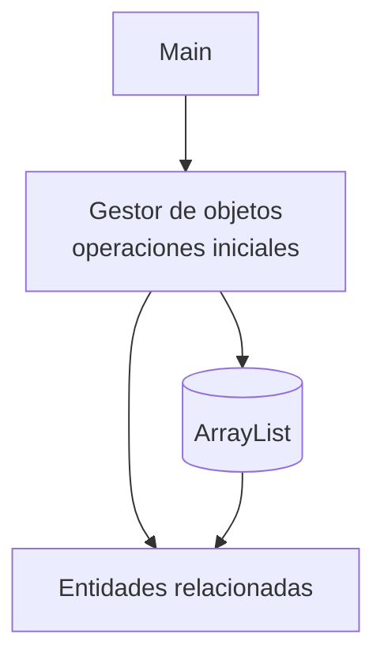

# S3 - Modelado del dominio, asociaciones y colecciones

## 1. Introducción

Tiempo: 20 min.

### 1.1 Propósito

Modelar relaciones entre objetos e introducir una clase gestora que administre colecciones en memoria.

### 1.2 Resultado de aprendizaje

El estudiante representa asociaciones, agregación o composición, usa `ArrayList` y separa parte de la lógica de colección en un gestor.

### 1.3 Producto de sesión

Modelo inicial con entidades relacionadas y gestor básico sobre una colección.

### 1.4 Motivación de la sesión

Un sistema de dominio no trabaja con objetos aislados. Un cliente puede tener ventas, un proveedor puede estar asociado a productos, y un gestor puede administrar varios objetos en memoria.

Pregunta guía:

```text
¿Cómo representamos varios objetos relacionados sin cargar todo en Main?
```

### 1.5 Ubicación en el curso

- Unidad: U1.
- Avance de sesión: aparece el flujo `Main -> Gestor -> Entidades -> ArrayList`.

## 2. Explica

Tiempo: 25 min.

### 2.1 Conceptos clave

- Asociación.
- Agregación.
- Composición.
- Relaciones uno a muchos.
- `ArrayList`.
- Clase gestora.
- Navegación entre objetos.
- Separación inicial entre entrada del programa, gestor y entidades.

Regla metodológica de la sesión:

```text
Main coordina pruebas.
El gestor administra la colección.
Las entidades representan el dominio.
```

### 2.2 Arquitectura de la sesión



## 3. Aplica: actividad práctica guiada

Tiempo: 2h.

1. Crear dos entidades relacionadas.
2. Representar una relación uno a muchos con `ArrayList`.
3. Crear una clase gestora, por ejemplo `GestorClientes`.
4. Agregar métodos para registrar y listar objetos.
5. Probar el flujo desde `Main`.
6. Evitar que `Main` acceda directamente a todos los detalles de la colección.

## 4. Crea: actividad autónoma

Tiempo: 2h fuera del aula.

Agrega una relación adicional al modelo y usa una clase gestora para administrar la colección.

Entrega evidencia breve con:

- Diagrama simple o explicación de la relación.
- Código de entidades.
- Código del gestor.
- Salida de consola.

## 5. Cierre evaluativo

Tiempo: 20 min.

### 5.1 Resultados esperados

- Hay al menos dos entidades relacionadas.
- La colección se administra con `ArrayList`.
- Existe una clase gestora inicial.
- `Main` solo coordina pruebas básicas.

### 5.2 Preguntas de defensa

1. ¿Qué relación existe entre tus clases?
2. ¿Por qué usaste `ArrayList`?
3. ¿Qué responsabilidad tiene el gestor?
4. ¿Qué lógica ya no está en `Main`?
5. ¿Qué operaciones deberían pasar al gestor en S5?
