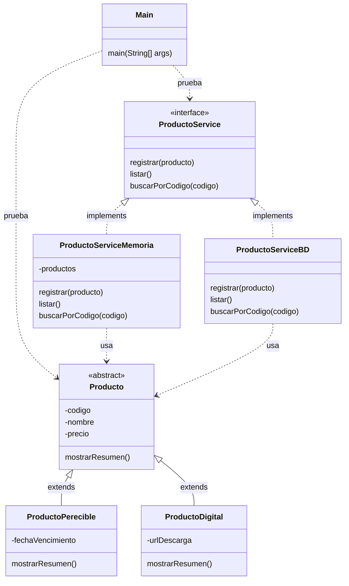

# S4 - Herencia y polimorfismo

## 1. Introducción

Tiempo: 20 min.

### 1.1 Propósito

Diferenciar dos mecanismos de POO qué suelen confundirse: herencia para especializar entidades del dominio y polimorfismo con interfaces para programar contra contratos.

### 1.2 Resultado de aprendizaje

El estudiante crea una clase base abstracta con subclases mediante `extends`, define una interface de servicio y crea dos implementaciones mediante `implements`.

### 1.3 Producto de sesión

Modelo con una jerarquía simple de productos, más un contrato `ProductoService` con `ProductoServiceMemoria` y `ProductoServiceBD` cómo preparación para memoria y persistencia.

### 1.4 Motivación de la sesión

En POO no toda reutilización se resuelve con herencia. Una entidad puede especializarse porque existe una relación es-un, mientras que un servicio puede tener varias implementaciones porque se quiere conservar el mismo contrato aunque cambie la forma de ejecutar la operación.

Pregunta guía:

```text
Cuándo usamos extends en entidades y cuándo usamos implements en servicios?
```

### 1.5 Ubicación en el curso

- Unidad: U1.
- Producto de unidad: aplicación de consola en memoria.
- Avance de sesión: se formaliza la diferencia entre entidades con herencia y servicios polimorficos.

## 2. Explica

Tiempo: 25 min.

### 2.1 Conceptos clave

| Concepto | Idea central | Ejemplo |
|---|---|---|
| Herencia | Una clase especializada hereda de una clase base. | `ProductoPerecible extends Producto` |
| Clase abstracta | Clase base qué organiza atributos o comportamiento comun. | `abstract class Producto` |
| Sobrescritura | Una subclase redefine un comportamiento heredado. | `mostrarResumen()` |
| Interface | Contrato de operaciones, sin decidir la implementación concreta. | `ProductoService` |
| Implements | Una clase cumple el contrato de una interface. | `ProductoServiceMemoria implements ProductoService` |
| Polimorfismo | Una misma referencia puede apuntar a implementaciones distintas. | `ProductoService service = new ProductoServiceMemoria()` |

Regla métodológica de la sesión:

```text
Herencia: se aplica en entidades cuando existe relación es-un.
Interface: se aplica en servicios para declarar operaciones esperadas.
Implementación: ejecuta el contrato, en memoria o con base de datos.
Las entidades no implementan contratos de servicio.
```

### 2.2 Arquitectura de la sesión



Convencion del diagrama: flecha continua con triangulo representa `extends`; flecha punteada con triangulo representa `implements`; flecha punteada simple representa dependencia o uso.

## 3. Aplica: actividad práctica guiada

Tiempo: 2h.

### 3.1 Identificar una relación es-un

Usa una relación natural del dominio:

```text
ProductoPerecible es un Producto.
ProductoDigital es un Producto.
DetalleVenta no es un Producto.
Venta no es un Producto.
```

La herencia se usa solo cuándo la frase "es un/a" tiene sentido real.

### 3.2 Crear la clase base abstracta

```java
public abstract class Producto {
    private String codigo;
    private String nombre;
    private double precio;

    public Producto(String codigo, String nombre, double precio) {
        this.codigo = codigo;
        this.nombre = nombre;
        this.precio = precio;
    }

    public String getCodigo() {
        return codigo;
    }

    public String getNombre() {
        return nombre;
    }

    public double getPrecio() {
        return precio;
    }

    public abstract void mostrarResumen();
}
```

### 3.3 Crear subclases con extends

```java
public class ProductoPerecible extends Producto {
    private String fechaVencimiento;

    public ProductoPerecible(String codigo, String nombre, double precio, String fechaVencimiento) {
        super(codigo, nombre, precio);
        this.fechaVencimiento = fechaVencimiento;
    }

    @Override
    public void mostrarResumen() {
        System.out.println(getCodigo() + " - " + getNombre() + " - vence: " + fechaVencimiento);
    }
}
```

```java
public class ProductoDigital extends Producto {
    private String urlDescarga;

    public ProductoDigital(String codigo, String nombre, double precio, String urlDescarga) {
        super(codigo, nombre, precio);
        this.urlDescarga = urlDescarga;
    }

    @Override
    public void mostrarResumen() {
        System.out.println(getCodigo() + " - " + getNombre() + " - descarga: " + urlDescarga);
    }
}
```

### 3.4 Probar herencia desde Main

```java
public class Main {
    public static void main(String[] args) {
        Producto leche = new ProductoPerecible("P001", "Leche", 4.50, "2026-08-10");
        Producto curso = new ProductoDigital("P002", "Curso Java", 40.00, "https://descarga.local/java");

        leche.mostrarResumen();
        curso.mostrarResumen();
    }
}
```

### 3.5 Definir el contrato del servicio

```java
import java.util.ArrayList;

public interface ProductoService {
    void registrar(Producto producto);
    ArrayList<Producto> listar();
    Producto buscarPorCodigo(String codigo);
}
```

### 3.6 Crear dos implementaciones

Implementación en memoria:

```java
import java.util.ArrayList;

public class ProductoServiceMemoria implements ProductoService {
    private ArrayList<Producto> productos = new ArrayList<>();

    @Override
    public void registrar(Producto producto) {
        productos.add(producto);
    }

    @Override
    public ArrayList<Producto> listar() {
        return productos;
    }

    @Override
    public Producto buscarPorCodigo(String codigo) {
        for (Producto producto : productos) {
            if (producto.getCodigo().equals(codigo)) {
                return producto;
            }
        }
        return null;
    }
}
```

Implementación con base de datos, aun cómo preparación conceptual:

```java
import java.util.ArrayList;

public class ProductoServiceBD implements ProductoService {
    @Override
    public void registrar(Producto producto) {
        System.out.println("Luego guardara usando DAO");
    }

    @Override
    public ArrayList<Producto> listar() {
        return new ArrayList<>();
    }

    @Override
    public Producto buscarPorCodigo(String codigo) {
        return null;
    }
}
```

### 3.7 Probar polimorfismo con interface

```java
public class Main {
    public static void main(String[] args) {
        ProductoService service = new ProductoServiceMemoria();

        service.registrar(new ProductoPerecible("P001", "Leche", 4.50, "2026-08-10"));
        service.registrar(new ProductoDigital("P002", "Curso Java", 40.00, "https://descarga.local/java"));

        for (Producto producto : service.listar()) {
            producto.mostrarResumen();
        }
    }
}
```

## 4. Crea: actividad autónoma

Fuera del aula, cada estudiante consolida el aprendizaje aplicando herencia e interfaces en una parte del dominio y preparando una evidencia individual.

Tiempo: 2h fuera del aula.

### 4.1 Plantilla de evidencia individual

Entrega un PDF con el siguiente nombre:

```text
S04_Equipo##_ApellidoNombre.pdf
```

Ejemplo:

```text
S04_Equipo03_QuispeAna.pdf
```

El PDF debe usar esta estructura. La primera sección define el trabajo autónomo; completa las demás con tus evidencias.

#### 4.1.1 Datos del estudiante

- Nombre:
- Equipo:
- Sesión: S04 - Herencia y polimorfismo
- Rol o aporte realizado:
- Link de GitHub:

#### 4.1.2 Trabajo autónomo realizado

Completa y evidencia estas tareas:

1. Elegir una relación `es-un` del dominio.
2. Crear una clase base abstracta.
3. Crear dos subclases con `extends`.
4. Sobrescribir al menos un método con `@Override`.
5. Crear una interface de servicio.
6. Crear dos implementaciones con `implements`.
7. Probar desde `Main` usando una referencia de la clase base.
8. Probar desde `Main` usando una referencia de la interface.

#### 4.1.3 Evidencia técnica

Incluye capturas o salidas de consola con una breve explicación debajo de cada una:

- Una clase base abstracta.
- Dos subclases con `extends`.
- Un método sobrescrito con `@Override`.
- Una interface de servicio.
- Dos implementaciones con `implements`.
- Prueba desde `Main` usando una referencia de la clase base y una referencia de la interface.
- Explicación de por qué `extends` e `implements` resuelven problemas distintos.

#### 4.1.4 Error o hallazgo

Describe al menos un error, diferencia o hallazgo técnico:

- Qué ocurrió.
- Cómo lo diagnosticaste.
- Cómo lo corregiste o qué aprendiste.

Ejemplos válidos:

- Se intentó usar herencia sin relación `es-un`.
- Se confundió clase abstracta con interface.
- Una implementación no cumplía todos los métodos del contrato.
- La prueba no evidenciaba polimorfismo.

#### 4.1.5 Reflexión técnica breve

Responde en 5 a 8 líneas:

```text
Por qué las entidades usan herencia con cuidado y los servicios pueden usar interfaces para cambiar implementación?
```

### 4.2 Criterios mínimos de aceptación

La evidencia individual se considera completa si:

- El archivo respeta el nombre `S04_Equipo##_ApellidoNombre.pdf`.
- Incluye evidencias técnicas legibles.
- Muestra una jerarquía con `extends`.
- Muestra una interface y dos implementaciones con `implements`.
- Incluye prueba de herencia y prueba de polimorfismo.
- Justifica por qué la herencia tiene sentido en el dominio.
- No contiene solo pantallazos: cada evidencia tiene una descripción breve.

## 5. Cierre evaluativo

Tiempo: 20 min.

Esta sección conecta el resultado de aprendizaje de la sesión con el producto que debe evidenciar cada estudiante.

### 5.1 Resultados esperados

Al finalizar la sesión, el estudiante debe demostrar que:

- La herencia responde a una relación `es-un`.
- La clase base no reemplaza a las entidades concretas.
- Hay sobrescritura de comportamiento cuando corresponde.
- La interface declara operaciones y no guarda datos.
- Las implementaciones cumplen el contrato con `implements`.
- El estudiante diferencia `extends` de `implements`.

### 5.2 Evidencia del producto de sesión

Cada estudiante entrega un PDF individual siguiendo la plantilla de la sección 4.1.

Nombre del archivo:

```text
S04_Equipo##_ApellidoNombre.pdf
```

La evidencia debe demostrar:

- Producto de sesión construido.
- Aporte individual verificable.
- Herencia aplicada con sentido.
- Interface con dos implementaciones.
- Reflexión técnica breve.

La revisión se realiza con los criterios mínimos de aceptación de la sección 4.2 y la rúbrica de la sección 5.4.

### 5.3 Preguntas de defensa y reflexión

1. Por qué `ProductoPerecible` puede heredar de `Producto`?
2. Por qué `ProductoService` debe ser interface?
3. Qué clase implementa el contrato en memoria?
4. Qué ventaja da declarar `ProductoService service = new ProductoServiceMemoria()`?
5. Por qué no conviene que una entidad implemente un contrato de servicio?
6. Cuándo no conviene usar herencia?

### 5.4 Rúbrica de evaluación

| Dimensión | Peso | 3 - Logro destacado | 2 - Logro | 1 - Proceso | 0 - Inicio | Puntuación obtenida |
|---|---:|---|---|---|---|---:|
| 1. Herencia en entidades | 2 | Aplica herencia con relación `es-un` clara y clase base adecuada. | Herencia funcional y razonable. | Herencia parcial o forzada. | No evidencia herencia. | |
| 2. Sobrescritura | 1 | Usa `@Override` con comportamiento especializado. | Usa sobrescritura funcional. | Sobrescritura poco clara. | No evidencia sobrescritura. | |
| 3. Interface y contrato | 2 | Interface declara operaciones coherentes y no mezcla datos. | Interface funcional. | Contrato incompleto o confuso. | No evidencia interface. | |
| 4. Polimorfismo con implementaciones | 2 | Dos implementaciones probadas con referencia de interface. | Implementación principal funcional. | Implementaciones incompletas. | No evidencia polimorfismo. | |
| 5. Error o hallazgo | 1 | Analiza error/hallazgo, causa, solución y aprendizaje técnico. | Explica un problema y una solución. | Menciona un problema sin análisis. | No presenta error ni hallazgo. | |
| 6. Reflexión y orden | 2 | PDF ordenado, evidencias legibles y reflexión precisa sobre `extends` vs `implements`. | Evidencias suficientes y reflexión clara. | Evidencias incompletas o reflexión superficial. | PDF desordenado o sin reflexión. | |

Puntuación acumulada = suma de (`Peso` * `Puntuación obtenida`) = ____.

Nota final = (`Puntuación acumulada` / 30) * 20 = ____.

Para usar la rúbrica con IA, solicita:

```text
Evalúa el PDF usando la rúbrica de la sesión.
Para cada dimensión selecciona la puntuación obtenida usando la escala Inicio=0, Proceso=1, Logro=2, Logro destacado=3.
Justifica brevemente cada puntuación.
Calcula la puntuación acumulada con la fórmula: suma de (Peso * Puntuación obtenida).
Calcula la nota final sobre 20 con la fórmula: (Puntuación acumulada / 30) * 20.
Indica 2 fortalezas y 2 recomendaciones.
```


