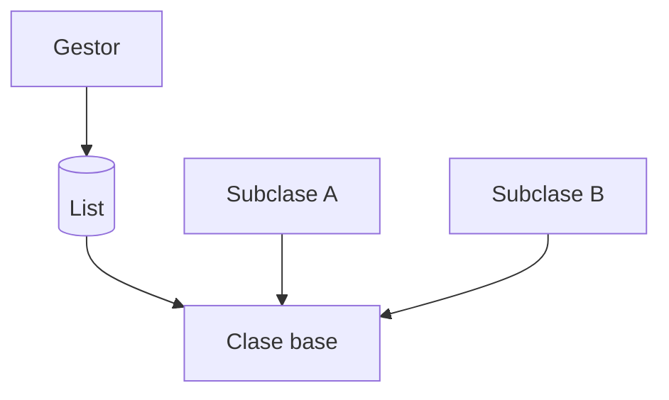

# S4 - Herencia, reutilización y polimorfismo

## 1. Introducción

Tiempo: 20 min.

### 1.1 Propósito

Aplicar herencia y polimorfismo en el modelo de dominio cuando el caso lo justifique, reforzando la separación de responsabilidades.

### 1.2 Resultado de aprendizaje

El estudiante crea jerarquías simples, usa sobrescritura de métodos y evita cargar toda la lógica en `Main`.

### 1.3 Producto de sesión

Jerarquía aplicada al dominio, probada desde un gestor y desde `Main`.

### 1.4 Motivación de la sesión

Cuando varias clases comparten datos o comportamiento, conviene reutilizar código. Cuando varias clases deben responder a una misma operación, conviene usar polimorfismo.

Pregunta guía:

```text
¿Cuándo conviene usar extends y cuándo es mejor mantener responsabilidades separadas?
```

### 1.5 Ubicación en el curso

- Unidad: U1.
- Avance de sesión: el gestor trabaja con entidades relacionadas por herencia sin absorber responsabilidades del dominio.

## 2. Explica

Tiempo: 25 min.

### 2.1 Conceptos clave

- Relación es-un.
- Relación tiene-un.
- Clase base.
- Subclase.
- `extends`.
- Sobrescritura de métodos.
- Polimorfismo.
- Separación de responsabilidades.
- Principio de responsabilidad única como idea base de SOLID.

Regla metodológica de la sesión:

```text
La herencia se usa en entidades cuando existe una relación es-un.
El gestor usa las entidades, pero no debe absorber su comportamiento propio.
```

### 2.2 Arquitectura de la sesión



## 3. Aplica: actividad práctica guiada

Tiempo: 2h.

1. Identificar clases con atributos o comportamiento común.
2. Crear una clase base.
3. Crear dos clases derivadas.
4. Sobrescribir un método relevante.
5. Usar una lista o gestor con referencias polimórficas.
6. Probar el comportamiento desde `Main`.
7. Verificar que la herencia no se use solo para reutilizar código sin relación de dominio.

## 4. Crea: actividad autónoma

Tiempo: 2h fuera del aula.

Aplica herencia en otra parte del dominio, solo si el caso lo justifica.

Entrega evidencia breve con:

- Clases involucradas.
- Justificación de `extends`.
- Prueba polimórfica.
- Salida de consola.

## 5. Cierre evaluativo

Tiempo: 20 min.

### 5.1 Resultados esperados

- La herencia tiene sentido en el dominio.
- Hay sobrescritura o comportamiento especializado.
- El gestor puede trabajar con referencias generales.
- El estudiante evita herencia artificial.

### 5.2 Preguntas de defensa

1. ¿Qué clases participan en la jerarquía?
2. ¿Qué comportamiento se reutiliza?
3. ¿Dónde se evidencia el polimorfismo?
4. ¿Por qué no bastaba una relación tiene-un?
5. ¿Qué responsabilidad queda en la entidad y qué responsabilidad queda en el gestor?
