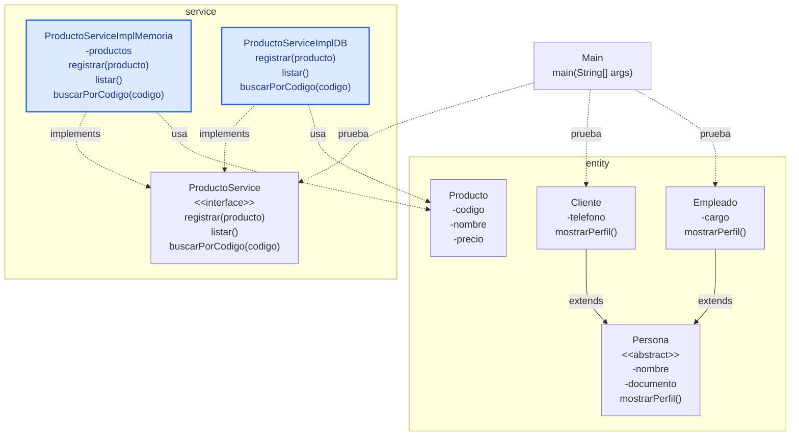

# S4 - Herencia, interfaces y polimorfismo

## 1. Introducción

Tiempo: 20 min.

### 1.1 Propósito

Diferenciar dos mecanismos de POO qué suelen confundirse: herencia para especializar entidades del dominio y polimorfismo con interfaces para programar contra contratos.

### 1.2 Resultado de aprendizaje

El estudiante crea una clase base abstracta con subclases mediante `extends`, define una interface de servicio y crea dos implementaciones mediante `implements`.

### 1.3 Producto de sesión

Modelo con `Persona`, `Cliente` y `Empleado` para herencia, más un contrato `ProductoService` con `ProductoServiceImplMemoria` y `ProductoServiceImplDB` cómo preparación para memoria y persistencia.

### 1.4 Motivación de la sesión

En POO no toda reutilización se resuelve con herencia. Una entidad puede especializarse porque existe una relación es-un, mientras que un servicio puede tener varias implementaciones porque se quiere conservar el mismo contrato aunque cambie la forma de ejecutar la operación.

Pregunta guía:

```text
Cuándo usamos extends en entidades y cuándo usamos implements en servicios?
```

### 1.5 Ubicación en el curso

- Unidad: U1.
- Producto de unidad: aplicación de consola en memoria.
- Carpeta de trabajo: `comarket-cli`.
- Avance de sesión: se formaliza la diferencia entre entidades con herencia y servicios polimórficos.

## 2. Explica

Tiempo: 25 min.

### 2.1 Conceptos clave

| Concepto | Idea central | Ejemplo |
|---|---|---|
| Herencia | Una clase especializada hereda de una clase base. | `Cliente extends Persona` |
| Clase abstracta | Clase base que organiza atributos o comportamiento común. | `abstract class Persona` |
| Sobrescritura | Una subclase redefine un comportamiento heredado. | `mostrarPerfil()` |
| Interface | Contrato de operaciones, sin decidir la implementación concreta. | `ProductoService` |
| Implements | Una clase cumple el contrato de una interface. | `ProductoServiceImplMemoria implements ProductoService` |
| Polimorfismo | Una misma referencia puede apuntar a implementaciones distintas. | `ProductoService service = new ProductoServiceImplMemoria()` |

Regla metodológica de la sesión:

```text
Herencia: se aplica en entidades cuando existe relación es-un.
En herencia, el trabajo funcional suele hacerse con clases concretas/hijas.
Si Persona es abstracta, no se registra "una Persona"; se trabaja con Cliente o Empleado.
La herencia no es una asociación normal uno a uno entre dos objetos separados.
En memoria, un Cliente es una Persona especializada; no son dos objetos independientes.
Interface: se aplica en servicios para declarar operaciones esperadas.
Implementación: ejecuta el contrato, en memoria o con base de datos.
Las entidades no implementan contratos de servicio.
En polimorfismo, el código consumidor accede por el padre/contrato.
Si una implementación agrega métodos propios, esos métodos no forman parte del contrato y no deben ser necesarios para el flujo principal.
```

### 2.2 Arquitectura de la sesión



Convención del diagrama: flecha continua con triángulo representa `extends`; flecha punteada con triángulo representa `implements`; flecha punteada simple representa dependencia o uso.

Lectura importante del diagrama:

```text
Herencia:
Persona organiza lo común, pero el sistema crea objetos concretos: Cliente y Empleado.
Main prueba Cliente y Empleado; no instancia Persona cuando Persona es abstracta.
Si se hiciera CRUD de personas, normalmente se haria sobre las clases hijas o casos de uso concretos.
En base de datos puede mapearse parecido a una relación uno a uno, pero no significa lo mismo.
Si se usa tabla padre y tabla hija, la fila hija depende de la fila padre: al eliminar el hijo normalmente se elimina también su parte padre.

Polimorfismo:
Main usa ProductoService, no ProductoServiceImplMemoria directamente.
El contrato define qué operaciones se pueden llamar.
Las implementaciones pueden cambiar, pero el flujo principal no debe depender de métodos que no estén en la interface.
```

## 3. Aplica: actividad práctica guiada

Tiempo: 2h.

### 3.1 Identificar una relación es-un

Usa una relación natural del dominio:

```text
Cliente es una Persona.
Empleado es una Persona.
Producto no es una Persona.
Venta no es una Persona.
```

La herencia se usa solo cuándo la frase "es un/a" tiene sentido real.

Nota de diseño:

```text
Persona es una clase base para compartir datos y comportamiento común.
Cliente y Empleado son clases concretas.
El servicio se diseña para el módulo que se va a operar. En esta ruta se usa ProductoService para mantener continuidad con el CRUD del curso.
```

Importante para no confundir con base de datos:

```text
Herencia en POO:
Cliente es una Persona especializada.
No representa dos objetos separados relacionados uno a uno.

Asociación uno a uno:
Dos objetos existen con identidad propia.
Si eliminas uno, el otro podría seguir existiendo según la regla del negocio.

Herencia mapeada a BD con tabla padre + tabla hija:
persona(id, nombre, documento)
cliente(id_persona, telefono)

Aquí la tabla hija extiende a la tabla padre.
Si eliminas el cliente, también debe eliminarse la parte persona que le pertenece.
Por eso se parece a uno a uno en tablas, pero conceptualmente sigue siendo herencia.
```

### 3.2 Crear la clase base abstracta

```java
public abstract class Persona {
    private String nombre;
    private String documento;

    public Persona(String nombre, String documento) {
        this.nombre = nombre;
        this.documento = documento;
    }

    public String getNombre() {
        return nombre;
    }

    public String getDocumento() {
        return documento;
    }

    public abstract void mostrarPerfil();
}
```

### 3.3 Crear subclases con extends

```java
public class Cliente extends Persona {
    private String telefono;

    public Cliente(String nombre, String documento, String telefono) {
        super(nombre, documento);
        this.telefono = telefono;
    }

    @Override
    public void mostrarPerfil() {
        System.out.println("Cliente: " + getNombre() + " - " + telefono);
    }
}
```

```java
public class Empleado extends Persona {
    private String cargo;

    public Empleado(String nombre, String documento, String cargo) {
        super(nombre, documento);
        this.cargo = cargo;
    }

    @Override
    public void mostrarPerfil() {
        System.out.println("Empleado: " + getNombre() + " - " + cargo);
    }
}
```

### 3.4 Probar herencia desde Main

```java
public class Main {
    public static void main(String[] args) {
        Persona cliente = new Cliente("Ana Torres", "71234567", "999888777");
        Persona empleado = new Empleado("Luis Ramos", "73456789", "Vendedor");

        cliente.mostrarPerfil();
        empleado.mostrarPerfil();
    }
}
```

### 3.5 Definir el contrato del servicio

```java
import java.util.ArrayList;

public interface ProductoService {
    void registrar(Producto producto);
    ArrayList<Producto> listar();
    Producto buscarPorCodigo(String codigo);
}
```

En polimorfismo se programa contra el contrato. Eso significa que el resto del sistema conoce `ProductoService` y no necesita saber si la implementación trabaja en memoria o con base de datos.

Regla práctica:

```text
Si un método no está declarado en ProductoService, Main no debe depender de ese método.
Así se puede cambiar ProductoServiceImplMemoria por ProductoServiceImplDB sin romper el flujo principal.
```

### 3.6 Crear dos implementaciones

Implementación en memoria:

```java
import java.util.ArrayList;

public class ProductoServiceImplMemoria implements ProductoService {
    private ArrayList<Producto> productos = new ArrayList<>();

    @Override
    public void registrar(Producto producto) {
        productos.add(producto);
    }

    @Override
    public ArrayList<Producto> listar() {
        return productos;
    }

    @Override
    public Producto buscarPorCodigo(String codigo) {
        for (Producto producto : productos) {
            if (producto.getCodigo().equals(codigo)) {
                return producto;
            }
        }
        return null;
    }
}
```

Implementación con base de datos, aun cómo preparación conceptual:

```java
import java.util.ArrayList;

public class ProductoServiceImplDB implements ProductoService {
    @Override
    public void registrar(Producto producto) {
        System.out.println("Luego guardara usando DAO");
    }

    @Override
    public ArrayList<Producto> listar() {
        return new ArrayList<>();
    }

    @Override
    public Producto buscarPorCodigo(String codigo) {
        return null;
    }
}
```

### 3.7 Probar polimorfismo con interface

```java
public class Main {
    public static void main(String[] args) {
        ProductoService service = new ProductoServiceImplMemoria();

        service.registrar(new Producto("P001", "Teclado", 80.0, 10));
        service.registrar(new Producto("P002", "Mouse", 45.0, 15));

        for (Producto producto : service.listar()) {
            producto.mostrarInformacion();
        }
    }
}
```

Observa que la variable es de tipo `ProductoService`:

```java
ProductoService service = new ProductoServiceImplMemoria();
```

La implementación concreta es `ProductoServiceImplMemoria`, pero el acceso se hace por el contrato. Esta es la idea central del polimorfismo con interfaces.

## 4. Crea: actividad autónoma

Fuera del aula, cada estudiante consolida el aprendizaje aplicando herencia e interfaces en una parte del dominio y preparando una evidencia individual.

Tiempo: 2h fuera del aula.

### 4.1 Plantilla de evidencia individual

Entrega un PDF con el siguiente nombre:

```text
S04_Equipo##_ApellidoNombre.pdf
```

Ejemplo:

```text
S04_Equipo03_QuispeAna.pdf
```

El PDF debe usar esta estructura. La primera sección define el trabajo autónomo; completa las demás con tus evidencias.

#### 4.1.1 Datos del estudiante

- Nombre:
- Equipo:
- Sesión: S04 - Herencia, interfaces y polimorfismo
- Rol o aporte realizado:
- Link de GitHub:

#### 4.1.2 Trabajo autónomo realizado

Completa y evidencia estas tareas:

1. Elegir una relación `es-un` del dominio.
2. Crear una clase base abstracta.
3. Crear dos subclases con `extends`.
4. Sobrescribir al menos un método con `@Override`.
5. Crear una interface de servicio.
6. Crear dos implementaciones con `implements`.
7. Probar desde `Main` usando una referencia de la clase base.
8. Probar desde `Main` usando una referencia de la interface.

#### 4.1.3 Evidencia técnica

Incluye capturas o salidas de consola con una breve explicación debajo de cada una:

- Una clase base abstracta.
- Dos subclases con `extends`.
- Un método sobrescrito con `@Override`.
- Una interface de servicio.
- Dos implementaciones con `implements`.
- Prueba desde `Main` usando una referencia de la clase base y una referencia de la interface.
- Explicación de por qué `extends` e `implements` resuelven problemas distintos.

#### 4.1.4 Error o hallazgo

Describe al menos un error, diferencia o hallazgo técnico:

- Qué ocurrió.
- Cómo lo diagnosticaste.
- Cómo lo corregiste o qué aprendiste.

Ejemplos válidos:

- Se intentó usar herencia sin relación `es-un`.
- Se confundió clase abstracta con interface.
- Una implementación no cumplía todos los métodos del contrato.
- La prueba no evidenciaba polimorfismo.

#### 4.1.5 Reflexión técnica breve

Responde en 5 a 8 líneas:

```text
Por qué las entidades usan herencia con cuidado y los servicios pueden usar interfaces para cambiar implementación?
```

### 4.2 Criterios mínimos de aceptación

La evidencia individual se considera completa si:

- El archivo respeta el nombre `S04_Equipo##_ApellidoNombre.pdf`.
- Incluye evidencias técnicas legibles.
- Muestra una jerarquía con `extends`.
- Muestra una interface y dos implementaciones con `implements`.
- Incluye prueba de herencia y prueba de polimorfismo.
- Justifica por qué la herencia tiene sentido en el dominio.
- No contiene solo pantallazos: cada evidencia tiene una descripción breve.

## 5. Cierre evaluativo

Tiempo: 20 min.

Esta sección conecta el resultado de aprendizaje de la sesión con el producto que debe evidenciar cada estudiante.

### 5.1 Resultados esperados

Al finalizar la sesión, el estudiante debe demostrar que:

- La herencia responde a una relación `es-un`.
- La clase base no reemplaza a las entidades concretas.
- En herencia, los casos funcionales se trabajan sobre clases concretas cuándo la clase base es abstracta.
- El estudiante diferencia herencia de una asociación uno a uno.
- Comprende que la estrategia tabla padre + tabla hija es una forma de persistir herencia, no una asociación común.
- Hay sobrescritura de comportamiento cuando corresponde.
- La interface declara operaciones y no guarda datos.
- Las implementaciones cumplen el contrato con `implements`.
- En polimorfismo, el acceso se realiza por el contrato y no por métodos propios de una implementación.
- El estudiante diferencia `extends` de `implements`.

### 5.2 Evidencia del producto de sesión

Cada estudiante entrega un PDF individual siguiendo la plantilla de la sección 4.1.

Nombre del archivo:

```text
S04_Equipo##_ApellidoNombre.pdf
```

La evidencia debe demostrar:

- Producto de sesión construido.
- Aporte individual verificable.
- Herencia aplicada con sentido.
- Interface con dos implementaciones.
- Reflexión técnica breve.

La revisión se realiza con los criterios mínimos de aceptación de la sección 4.2 y la rúbrica de la sección 5.4.

### 5.3 Preguntas de defensa y reflexión

1. Por qué `Cliente` puede heredar de `Persona`?
2. Por qué `ProductoService` debe ser interface?
3. Qué clase implementa el contrato en memoria?
4. Qué ventaja da declarar `ProductoService service = new ProductoServiceImplMemoria()`?
5. Por qué no conviene que una entidad implemente un contrato de servicio?
6. Por qué `Main` no debe depender de métodos que solo existan en `ProductoServiceImplMemoria`?
7. Por qué herencia no es igual que una asociación uno a uno?
8. Qué pasaría en BD si se elimina un `Cliente` guardado con tabla padre `persona` y tabla hija `cliente`?
9. Cuándo no conviene usar herencia?

### 5.4 Rúbrica de evaluación

| Dimensión | Peso | 3 - Logro destacado | 2 - Logro | 1 - Proceso | 0 - Inicio | Puntuación obtenida |
|---|---:|---|---|---|---|---:|
| 1. Herencia en entidades | 2 | Aplica herencia con relación `es-un` clara y clase base adecuada. | Herencia funcional y razonable. | Herencia parcial o forzada. | No evidencia herencia. | |
| 2. Sobrescritura | 1 | Usa `@Override` con comportamiento especializado. | Usa sobrescritura funcional. | Sobrescritura poco clara. | No evidencia sobrescritura. | |
| 3. Interface y contrato | 2 | Interface declara operaciones coherentes y no mezcla datos. | Interface funcional. | Contrato incompleto o confuso. | No evidencia interface. | |
| 4. Polimorfismo con implementaciones | 2 | Dos implementaciones probadas con referencia de interface. | Implementación principal funcional. | Implementaciones incompletas. | No evidencia polimorfismo. | |
| 5. Error o hallazgo | 1 | Analiza error/hallazgo, causa, solución y aprendizaje técnico. | Explica un problema y una solución. | Menciona un problema sin análisis. | No presenta error ni hallazgo. | |
| 6. Reflexión y orden | 2 | PDF ordenado, evidencias legibles y reflexión precisa sobre `extends` vs `implements`. | Evidencias suficientes y reflexión clara. | Evidencias incompletas o reflexión superficial. | PDF desordenado o sin reflexión. | |

Puntuación acumulada = suma de (`Peso` * `Puntuación obtenida`) = ____.

Nota final = (`Puntuación acumulada` / 30) * 20 = ____.

Para usar la rúbrica con IA, solicita:

```text
Evalúa el PDF usando la rúbrica de la sesión.
Para cada dimensión selecciona la puntuación obtenida usando la escala Inicio=0, Proceso=1, Logro=2, Logro destacado=3.
Justifica brevemente cada puntuación.
Calcula la puntuación acumulada con la fórmula: suma de (Peso * Puntuación obtenida).
Calcula la nota final sobre 20 con la fórmula: (Puntuación acumulada / 30) * 20.
Indica 2 fortalezas y 2 recomendaciones.
```


