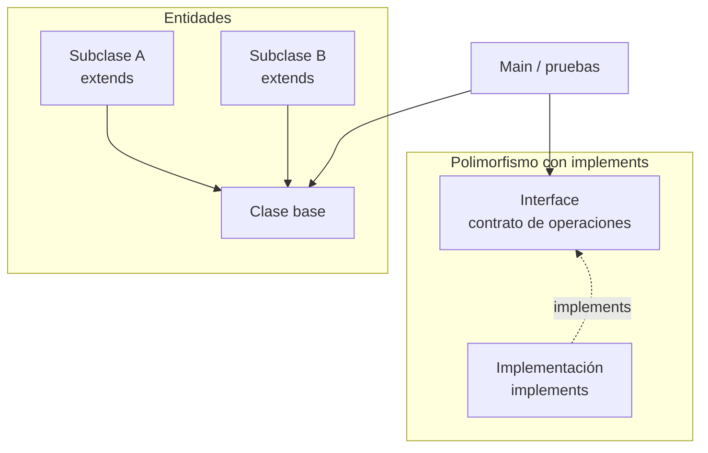

# S4 - Herencia y polimorfismo

## 1. Introducción

Tiempo: 20 min.

### 1.1 Propósito

Desarrollar dos mecanismos distintos de POO: herencia con entidades del dominio e interfaces con `implements` para aplicar polimorfismo.

### 1.2 Resultado de aprendizaje

El estudiante crea jerarquías simples con `extends`, define una interface como contrato de operaciones y crea una implementación con `implements`.

### 1.3 Producto de sesión

Entidades con herencia y un primer contrato polimórfico con interface e implementación, probados desde `Main`.

### 1.4 Motivación de la sesión

Cuando varias entidades tienen una relación es-un, puede tener sentido usar herencia. Cuando queremos programar contra un contrato y permitir distintas implementaciones, usamos polimorfismo con interface e `implements`.

Pregunta guía:

```text
¿Cuándo usamos extends en entidades y cuándo usamos implements para trabajar con un contrato?
```

### 1.5 Ubicación en el curso

- Unidad: U1.
- Avance de sesión: las entidades incorporan herencia y el gestor/servicio se prepara para usar contratos con implementaciones.

## 2. Explica

Tiempo: 25 min.

### 2.1 Conceptos clave

- Herencia en entidades.
- Relación es-un.
- Clase base y subclases.
- `extends`.
- Sobrescritura de métodos en entidades.
- Polimorfismo con interface.
- `implements`.
- Contrato e implementación.
- Separación de responsabilidades.
- Principio de responsabilidad única como idea base de SOLID.

Regla metodológica de la sesión:

```text
Tema 1: Herencia se trabaja en entidades cuando existe una relación es-un.
Tema 2: Polimorfismo se trabaja con interface e implements para programar contra un contrato.
Las entidades no implementan contratos de servicio; representan el dominio.
```

### 2.2 Arquitectura de la sesión



## 3. Aplica: actividad práctica guiada

Tiempo: 2h.

1. Identificar entidades con relación es-un.
2. Crear una clase base del dominio.
3. Crear dos subclases con `extends`.
4. Sobrescribir un método relevante en las subclases.
5. Probar herencia desde `Main` usando una referencia de la clase base.
6. Definir una interface como contrato de operaciones.
7. Crear una clase que implemente el contrato con `implements`.
8. Probar polimorfismo desde `Main` usando una referencia de la interface.
9. Verificar que herencia e interface resuelven problemas distintos.

## 4. Crea: actividad autónoma

Tiempo: 2h fuera del aula.

Aplica herencia en una parte del dominio y define una interface sencilla con una implementación.

Entrega evidencia breve con:

- Clases involucradas.
- Justificación de `extends`.
- Interface creada.
- Clase que usa `implements`.
- Prueba polimórfica con referencia a la interface.
- Salida de consola.

## 5. Cierre evaluativo

Tiempo: 20 min.

### 5.1 Resultados esperados

- La herencia tiene sentido en el dominio.
- Hay sobrescritura o comportamiento especializado.
- El estudiante diferencia herencia de polimorfismo con interfaces.
- Existe una implementación que usa `implements`.
- El estudiante evita herencia artificial.

### 5.2 Preguntas de defensa

1. ¿Qué clases participan en la jerarquía?
2. ¿Por qué esa relación sí justifica `extends`?
3. ¿Qué declara la interface?
4. ¿Qué clase usa `implements`?
5. ¿Dónde se evidencia el polimorfismo?
