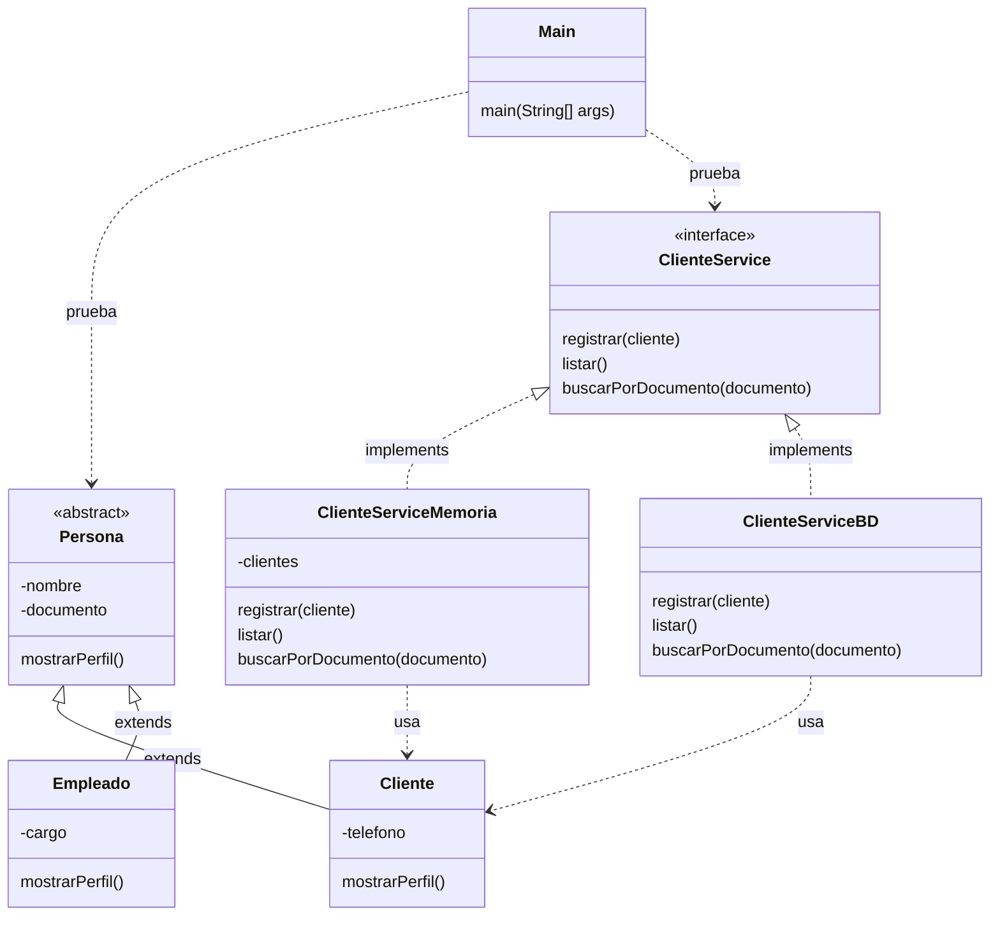

# S4 - Herencia y polimorfismo

## 1. Introduccion

Tiempo: 20 min.

### 1.1 Proposito

Diferenciar dos mecanismos de POO que suelen confundirse: herencia para especializar entidades del dominio y polimorfismo con interfaces para programar contra contratos.

### 1.2 Resultado de aprendizaje

El estudiante crea una clase base abstracta con subclases mediante `extends`, define una interface de servicio y crea dos implementaciones mediante `implements`.

### 1.3 Producto de sesion

Modelo con `Persona`, `Cliente` y `Empleado`, mas un contrato `ClienteService` con `ClienteServiceMemoria` y `ClienteServiceBD` como preparacion para memoria y persistencia.

### 1.4 Motivacion de la sesion

En POO no toda reutilizacion se resuelve con herencia. Una entidad puede especializarse porque existe una relacion es-un, mientras que un servicio puede tener varias implementaciones porque se quiere conservar el mismo contrato aunque cambie la forma de ejecutar la operacion.

Pregunta guia:

```text
Cuando usamos extends en entidades y cuando usamos implements en servicios?
```

### 1.5 Ubicacion en el curso

- Unidad: U1.
- Producto de unidad: aplicacion de consola en memoria.
- Avance de sesion: se formaliza la diferencia entre entidades con herencia y servicios polimorficos.

## 2. Explica

Tiempo: 25 min.

### 2.1 Conceptos clave

| Concepto | Idea central | Ejemplo |
|---|---|---|
| Herencia | Una clase especializada hereda de una clase base. | `Cliente extends Persona` |
| Clase abstracta | Clase base que organiza atributos o comportamiento comun. | `abstract class Persona` |
| Sobrescritura | Una subclase redefine un comportamiento heredado. | `mostrarPerfil()` |
| Interface | Contrato de operaciones, sin decidir la implementacion concreta. | `ClienteService` |
| Implements | Una clase cumple el contrato de una interface. | `ClienteServiceMemoria implements ClienteService` |
| Polimorfismo | Una misma referencia puede apuntar a implementaciones distintas. | `ClienteService service = new ClienteServiceMemoria()` |

Regla metodologica de la sesion:

```text
Herencia: se aplica en entidades cuando existe relacion es-un.
Interface: se aplica en servicios para declarar operaciones esperadas.
Implementacion: ejecuta el contrato, en memoria o con base de datos.
Las entidades no implementan contratos de servicio.
```

### 2.2 Arquitectura de la sesion



Convencion del diagrama: flecha continua con triangulo representa `extends`; flecha punteada con triangulo representa `implements`; flecha punteada simple representa dependencia o uso.

## 3. Aplica: actividad practica guiada

Tiempo: 2h.

### 3.1 Identificar una relacion es-un

Usa una relacion natural del dominio:

```text
Cliente es una Persona.
Empleado es una Persona.
Producto no es una Persona.
Venta no es una Persona.
```

La herencia se usa solo cuando la frase "es un/a" tiene sentido real.

### 3.2 Crear la clase base abstracta

```java
public abstract class Persona {
    private String nombre;
    private String documento;

    public Persona(String nombre, String documento) {
        this.nombre = nombre;
        this.documento = documento;
    }

    public String getNombre() {
        return nombre;
    }

    public String getDocumento() {
        return documento;
    }

    public abstract void mostrarPerfil();
}
```

### 3.3 Crear subclases con extends

```java
public class Cliente extends Persona {
    private String telefono;

    public Cliente(String nombre, String documento, String telefono) {
        super(nombre, documento);
        this.telefono = telefono;
    }

    @Override
    public void mostrarPerfil() {
        System.out.println("Cliente: " + getNombre() + " - " + telefono);
    }
}
```

```java
public class Empleado extends Persona {
    private String cargo;

    public Empleado(String nombre, String documento, String cargo) {
        super(nombre, documento);
        this.cargo = cargo;
    }

    @Override
    public void mostrarPerfil() {
        System.out.println("Empleado: " + getNombre() + " - " + cargo);
    }
}
```

### 3.4 Probar herencia desde Main

```java
public class Main {
    public static void main(String[] args) {
        Persona cliente = new Cliente("Ana Torres", "71234567", "999888777");
        Persona empleado = new Empleado("Luis Ramos", "73456789", "Vendedor");

        cliente.mostrarPerfil();
        empleado.mostrarPerfil();
    }
}
```

### 3.5 Definir el contrato del servicio

```java
import java.util.ArrayList;

public interface ClienteService {
    void registrar(Cliente cliente);
    ArrayList<Cliente> listar();
    Cliente buscarPorDocumento(String documento);
}
```

### 3.6 Crear dos implementaciones

Implementacion en memoria:

```java
import java.util.ArrayList;

public class ClienteServiceMemoria implements ClienteService {
    private ArrayList<Cliente> clientes = new ArrayList<>();

    @Override
    public void registrar(Cliente cliente) {
        clientes.add(cliente);
    }

    @Override
    public ArrayList<Cliente> listar() {
        return clientes;
    }

    @Override
    public Cliente buscarPorDocumento(String documento) {
        for (Cliente cliente : clientes) {
            if (cliente.getDocumento().equals(documento)) {
                return cliente;
            }
        }
        return null;
    }
}
```

Implementacion con base de datos, aun como preparacion conceptual:

```java
import java.util.ArrayList;

public class ClienteServiceBD implements ClienteService {
    @Override
    public void registrar(Cliente cliente) {
        System.out.println("Luego guardara usando DAO");
    }

    @Override
    public ArrayList<Cliente> listar() {
        return new ArrayList<>();
    }

    @Override
    public Cliente buscarPorDocumento(String documento) {
        return null;
    }
}
```

### 3.7 Probar polimorfismo con interface

```java
public class Main {
    public static void main(String[] args) {
        ClienteService service = new ClienteServiceMemoria();

        service.registrar(new Cliente("Ana Torres", "71234567", "999888777"));
        service.registrar(new Cliente("Marco Ruiz", "72345678", "988777666"));

        for (Cliente cliente : service.listar()) {
            cliente.mostrarPerfil();
        }
    }
}
```

## 4. Crea: actividad autonoma

Tiempo: 2h fuera del aula.

Aplica herencia e interfaces en una parte del dominio.

Entrega evidencia breve con:

- Una clase base abstracta.
- Dos subclases con `extends`.
- Un metodo sobrescrito con `@Override`.
- Una interface de servicio.
- Dos implementaciones con `implements`.
- Prueba desde `Main` usando una referencia de la clase base y una referencia de la interface.

## 5. Cierre evaluativo

Tiempo: 20 min.

### 5.1 Resultados esperados

- La herencia responde a una relacion es-un.
- La clase base no reemplaza a las entidades concretas.
- La interface declara operaciones y no guarda datos.
- Las implementaciones cumplen el contrato con `implements`.
- El estudiante diferencia `extends` de `implements`.

### 5.2 Preguntas de defensa

1. Por que `Cliente` puede heredar de `Persona`?
2. Por que `ClienteService` debe ser interface?
3. Que clase implementa el contrato en memoria?
4. Que ventaja da declarar `ClienteService service = new ClienteServiceMemoria()`?
5. Por que no conviene que una entidad implemente un contrato de servicio?
