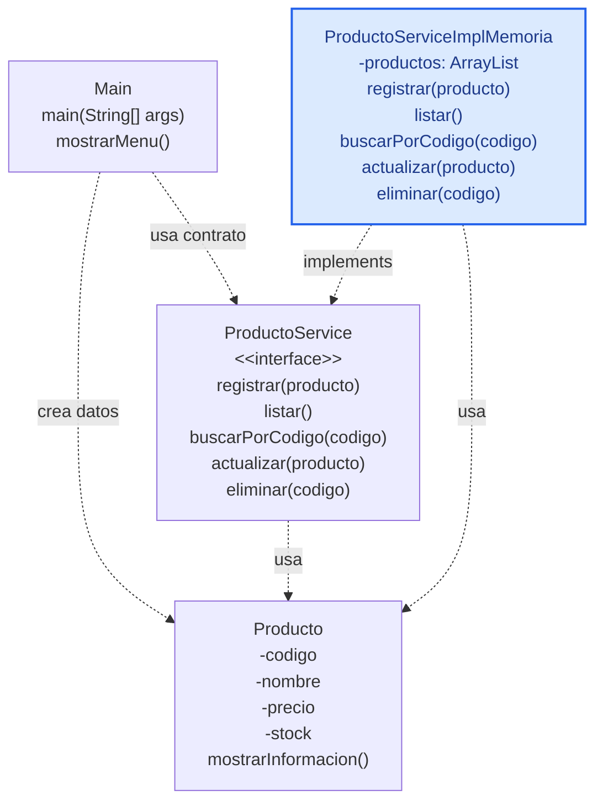

# S5 - Operaciones CRUD, validaciones y responsabilidad única

## 1. Introducción

Tiempo: 20 min.

### 1.1 Propósito

Implementar operaciones CRUD en memoria usando `ArrayList`, validaciones de flujo y responsabilidad única, mediante una interface de servicio y una implementación concreta, sin cargar toda la lógica en `Main`.

### 1.2 Resultado de aprendizaje

El estudiante implementa registro, listado, búsqueda, actualización y eliminación en memoria, aplica validaciones básicas y consolida la separación de responsabilidades entre `Main`, contrato de servicio, implementación y entidades.

### 1.3 Producto de sesión

CRUD en consola con `ProductoService`, `ProductoServiceImplMemoria`, entidades encapsuladas, validaciones, búsqueda por código, menú de consola y preparación de entrega con Maven/GraalVM.

### 1.4 Motivación de la sesión

Después de modelar clases, relaciones, herencia e interfaces, el producto necesita operaciones reales. El objetivo es que el menú de consola use un servicio, que el servicio administre la colección y que cada clase mantenga una responsabilidad principal.

Pregunta guía:

```text
Cómo hacemos un CRUD en memoria sin convertir Main en una clase gigante?
```

### 1.5 Ubicación en el curso

- Unidad: U1.
- Producto de unidad: aplicación de consola en memoria.
- Carpeta de trabajo: `comarket-cli`.
- Avance de sesión: versión funcional previa a la evaluación U1.

## 2. Explica

Tiempo: 25 min.

### 2.1 Conceptos clave

| Concepto | Idea central |
|---|---|
| CRUD | Crear, leer, actualizar y eliminar datos. |
| Interface de servicio | Contrato qué define las operaciones esperadas. |
| Implementación en memoria | Clase qué cumple el contrato usando `ArrayList`. |
| Busqueda | Recorrido de la colección para ubicar un objeto. |
| Validaciones básicas | Reglas simples antes de registrar o actualizar. |
| Responsabilidad única | Cada clase debe tener un motivo principal para cambiar. |
| Maven | Organiza compilación y estructura del proyecto. |
| GraalVM | Permite preparar un ejecutable nativo cómo cierre de U1. |

Regla metodológica de la sesión:

```text
Main muestra el menu y recibe opciones.
La interface declara operaciones CRUD.
La implementación en memoria administra el ArrayList.
Las entidades representan datos y comportamiento del dominio.
La responsabilidad única se consolida evitando que Main, service y entidades hagan el mismo trabajo.
Maven/GraalVM son parte de la entrega, no del flujo CRUD.
```

### 2.2 Arquitectura de la sesión



En S5, la arquitectura U1 se concreta con `Producto`, `ProductoService` y `ProductoServiceImplMemoria`. Este ejemplo guiado sirve como patrón para que luego cada equipo adapte el CRUD a la entidad principal de su propio proyecto.

## 3. Aplica: actividad práctica guiada

Tiempo: 2h.

### 3.1 Definir contrato CRUD

```java
import java.util.ArrayList;

public interface ProductoService {
    void registrar(Producto producto);
    ArrayList<Producto> listar();
    Producto buscarPorCodigo(String codigo);
    void actualizar(Producto producto);
    void eliminar(String codigo);
}
```

### 3.2 Crear implementación en memoria

```java
import java.util.ArrayList;

public class ProductoServiceImplMemoria implements ProductoService {
    private ArrayList<Producto> productos = new ArrayList<>();

    @Override
    public void registrar(Producto producto) {
        productos.add(producto);
    }

    @Override
    public ArrayList<Producto> listar() {
        return productos;
    }

    @Override
    public Producto buscarPorCodigo(String codigo) {
        for (Producto producto : productos) {
            if (producto.getCodigo().equals(codigo)) {
                return producto;
            }
        }
        return null;
    }

    @Override
    public void actualizar(Producto productoActualizado) {
        Producto producto = buscarPorCodigo(productoActualizado.getCodigo());
        if (producto != null) {
            producto.setNombre(productoActualizado.getNombre());
            producto.setPrecio(productoActualizado.getPrecio());
            producto.setStock(productoActualizado.getStock());
        }
    }

    @Override
    public void eliminar(String codigo) {
        Producto producto = buscarPorCodigo(codigo);
        if (producto != null) {
            productos.remove(producto);
        }
    }
}
```

### 3.3 Probar operaciones desde Main

```java
public class Main {
    public static void main(String[] args) {
        ProductoService service = new ProductoServiceImplMemoria();

        service.registrar(new Producto("P001", "Teclado", 80.0, 10));
        service.registrar(new Producto("P002", "Mouse", 45.0, 15));

        Producto encontrado = service.buscarPorCodigo("P001");
        if (encontrado != null) {
            encontrado.mostrarInformacion();
        }

        service.eliminar("P002");
        System.out.println("Total productos: " + service.listar().size());
    }
}
```

### 3.4 Agregar menu de consola

El menu debe llamar al contrato `ProductoService`, no directamente al `ArrayList`.

Opciones mínimas:

1. Registrar producto.
2. Listar productos.
3. Buscar producto.
4. Actualizar producto.
5. Eliminar producto.
6. Salir.

### 3.5 Organizar con Maven

La migración a Maven se realiza al cierre de la unidad para preparar compilación ordenada.

Estructura mínima:

```text
src/main/java/
    Main.java
    entity/Producto.java
    service/ProductoService.java
    service/ProductoServiceImplMemoria.java
pom.xml
```

### 3.6 Preparar entrega con GraalVM

En esta sesión no se ensena GraalVM cómo arquitectura del sistema. Se usa cómo mecanismo de entrega para cerrar U1 con un ejecutable demostrable.

## 4. Crea: actividad autónoma

Fuera del aula, cada estudiante consolida el aprendizaje completando un CRUD en memoria y preparando una evidencia individual.

Tiempo: 3h fuera del aula.

### 4.1 Plantilla de evidencia individual

Entrega un PDF con el siguiente nombre:

```text
S05_Equipo##_ApellidoNombre.pdf
```

Ejemplo:

```text
S05_Equipo03_QuispeAna.pdf
```

El PDF debe usar esta estructura. La primera sección define el trabajo autónomo; completa las demás con tus evidencias.

#### 4.1.1 Datos del estudiante

- Nombre:
- Equipo:
- Sesión: S05 - Operaciones CRUD, validaciones y responsabilidad única
- Rol o aporte realizado:
- Link de GitHub:

#### 4.1.2 Trabajo autónomo realizado

Completa y evidencia estas tareas:

1. Completar el CRUD de una entidad del dominio.
2. Definir o ajustar una interface CRUD.
3. Implementar el CRUD en memoria con `ArrayList`.
4. Probar registro, listado, búsqueda, actualización y eliminación.
5. Agregar al menos una validación básica.
6. Mostrar un menú de consola o flujo equivalente desde `Main`.
7. Organizar el proyecto para la evaluación de U1.

#### 4.1.3 Evidencia técnica

Incluye capturas o salidas de consola con una breve explicación debajo de cada una:

- Interface CRUD.
- Implementación en memoria.
- Menú de consola.
- Salida de registrar, listar, buscar, actualizar y eliminar.
- Evidencia de proyecto organizado con Maven.
- Evidencia de preparación o generación de ejecutable nativo si corresponde.
- Explicación del flujo `Main -> Interface -> Implementación en memoria -> Entidades`, indicando que el `ArrayList` es un atributo interno de la implementación.

#### 4.1.4 Error o hallazgo

Describe al menos un error, diferencia o hallazgo técnico:

- Qué ocurrió.
- Cómo lo diagnosticaste.
- Cómo lo corregiste o qué aprendiste.

Ejemplos válidos:

- La búsqueda no encontraba objetos por usar mal el criterio.
- La actualización modificaba el objeto incorrecto.
- La eliminación fallaba al recorrer la lista.
- `Main` terminó concentrando lógica que debía estar en el service.

#### 4.1.5 Reflexión técnica breve

Responde en 5 a 8 líneas:

```text
Por qué un CRUD en memoria debe estar separado de Main aunque todavía no exista base de datos?
```

### 4.2 Criterios mínimos de aceptación

La evidencia individual se considera completa si:

- El archivo respeta el nombre `S05_Equipo##_ApellidoNombre.pdf`.
- Incluye evidencias técnicas legibles.
- Muestra una interface CRUD.
- Muestra una implementación en memoria con `ArrayList`.
- Demuestra registrar, listar, buscar, actualizar y eliminar.
- Muestra al menos una validación básica.
- Explica el flujo de responsabilidades.
- No contiene solo pantallazos: cada evidencia tiene una descripción breve.

## 5. Cierre evaluativo

Tiempo: 20 min.

Esta sección conecta el resultado de aprendizaje de la sesión con el producto que debe evidenciar cada estudiante.

### 5.1 Resultados esperados

Al finalizar la sesión, el estudiante debe demostrar que:

- Existe CRUD funcional en memoria.
- `Main` no contiene el `ArrayList` principal.
- La interface declara el contrato.
- La implementación en memoria administra la colección.
- Las entidades se mantienen encapsuladas.
- El proyecto queda listo para evaluación U1.

### 5.2 Evidencia del producto de sesión

Cada estudiante entrega un PDF individual siguiendo la plantilla de la sección 4.1.

Nombre del archivo:

```text
S05_Equipo##_ApellidoNombre.pdf
```

La evidencia debe demostrar:

- Producto de sesión construido.
- Aporte individual verificable.
- CRUD en memoria probado.
- Reflexión técnica breve.

La revisión se realiza con los criterios mínimos de aceptación de la sección 4.2 y la rúbrica de la sección 5.4.

### 5.3 Preguntas de defensa y reflexión

1. Qué responsabilidad tiene `Main`?
2. Qué responsabilidad tiene `ProductoService`?
3. Dónde se almacena temporalmente la información?
4. Por qué `ArrayList` no debe estar como variable principal en `Main`?
5. Qué cambiaría cuando el almacenamiento sea SQLite?
6. Qué evidencia demuestra que el CRUD está completo?

### 5.4 Rúbrica de evaluación

| Dimensión | Peso | 3 - Logro destacado | 2 - Logro | 1 - Proceso | 0 - Inicio | Puntuación obtenida |
|---|---:|---|---|---|---|---:|
| 1. Contrato CRUD | 2 | Interface clara, completa y coherente con la entidad. | Interface funcional. | Interface incompleta o poco clara. | No evidencia contrato. | |
| 2. Implementación en memoria | 2 | `ArrayList` bien encapsulado en la implementación. | Implementación funcional. | Implementación parcial. | No evidencia implementación. | |
| 3. Operaciones CRUD | 2 | Registrar, listar, buscar, actualizar y eliminar funcionan y están evidenciados. | Operaciones principales funcionan. | CRUD incompleto. | No evidencia CRUD. | |
| 4. Separación de responsabilidades | 2 | `Main`, interface, implementación y entidades tienen roles claros. | Separación suficiente. | Lógica mezclada. | No separa responsabilidades. | |
| 5. Error o hallazgo | 1 | Analiza error/hallazgo, causa, solución y aprendizaje técnico. | Explica un problema y una solución. | Menciona un problema sin análisis. | No presenta error ni hallazgo. | |
| 6. Reflexión y orden | 1 | PDF ordenado, evidencias legibles y reflexión precisa. | Evidencias suficientes y reflexión clara. | Evidencias incompletas o reflexión superficial. | PDF desordenado o sin reflexión. | |

Puntuación acumulada = suma de (`Peso` * `Puntuación obtenida`) = ____.

Nota final = (`Puntuación acumulada` / 30) * 20 = ____.

Para usar la rúbrica con IA, solicita:

```text
Evalúa el PDF usando la rúbrica de la sesión.
Para cada dimensión selecciona la puntuación obtenida usando la escala Inicio=0, Proceso=1, Logro=2, Logro destacado=3.
Justifica brevemente cada puntuación.
Calcula la puntuación acumulada con la fórmula: suma de (Peso * Puntuación obtenida).
Calcula la nota final sobre 20 con la fórmula: (Puntuación acumulada / 30) * 20.
Indica 2 fortalezas y 2 recomendaciones.
```

