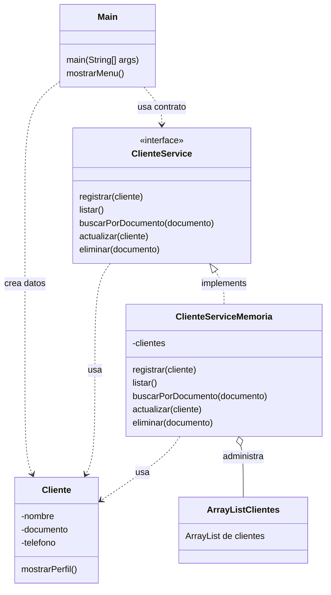

# S5 - CRUD en memoria con ArrayList

## 1. Introduccion

Tiempo: 20 min.

### 1.1 Proposito

Implementar operaciones CRUD en memoria usando `ArrayList`, una interface de servicio y una implementacion concreta, sin cargar toda la logica en `Main`.

### 1.2 Resultado de aprendizaje

El estudiante implementa registro, listado, busqueda, actualizacion y eliminacion en memoria, separando `Main`, contrato de servicio, implementacion y entidades.

### 1.3 Producto de sesion

CRUD en consola con `ClienteService`, `ClienteServiceMemoria`, entidades encapsuladas, busqueda por documento y preparacion de entrega con Maven/GraalVM.

### 1.4 Motivacion de la sesion

Despues de modelar clases, relaciones, herencia e interfaces, el producto necesita operaciones reales. El objetivo es que el menu de consola use un servicio, y que el servicio sea quien administre la coleccion.

Pregunta guia:

```text
Como hacemos un CRUD en memoria sin convertir Main en una clase gigante?
```

### 1.5 Ubicacion en el curso

- Unidad: U1.
- Producto de unidad: aplicacion de consola en memoria.
- Avance de sesion: version funcional previa a la evaluacion U1.

## 2. Explica

Tiempo: 25 min.

### 2.1 Conceptos clave

| Concepto | Idea central |
|---|---|
| CRUD | Crear, leer, actualizar y eliminar datos. |
| Interface de servicio | Contrato que define las operaciones esperadas. |
| Implementacion en memoria | Clase que cumple el contrato usando `ArrayList`. |
| Busqueda | Recorrido de la coleccion para ubicar un objeto. |
| Validaciones basicas | Reglas simples antes de registrar o actualizar. |
| Maven | Organiza compilacion y estructura del proyecto. |
| GraalVM | Permite preparar un ejecutable nativo como cierre de U1. |

Regla metodologica de la sesion:

```text
Main muestra el menu y recibe opciones.
La interface declara operaciones CRUD.
La implementacion en memoria administra el ArrayList.
Las entidades representan datos y comportamiento del dominio.
Maven/GraalVM son parte de la entrega, no del flujo CRUD.
```

### 2.2 Arquitectura de la sesion



## 3. Aplica: actividad practica guiada

Tiempo: 2h.

### 3.1 Definir contrato CRUD

```java
import java.util.ArrayList;

public interface ClienteService {
    void registrar(Cliente cliente);
    ArrayList<Cliente> listar();
    Cliente buscarPorDocumento(String documento);
    void actualizar(Cliente cliente);
    void eliminar(String documento);
}
```

### 3.2 Crear implementacion en memoria

```java
import java.util.ArrayList;

public class ClienteServiceMemoria implements ClienteService {
    private ArrayList<Cliente> clientes = new ArrayList<>();

    @Override
    public void registrar(Cliente cliente) {
        clientes.add(cliente);
    }

    @Override
    public ArrayList<Cliente> listar() {
        return clientes;
    }

    @Override
    public Cliente buscarPorDocumento(String documento) {
        for (Cliente cliente : clientes) {
            if (cliente.getDocumento().equals(documento)) {
                return cliente;
            }
        }
        return null;
    }

    @Override
    public void actualizar(Cliente clienteActualizado) {
        Cliente cliente = buscarPorDocumento(clienteActualizado.getDocumento());
        if (cliente != null) {
            cliente.setNombre(clienteActualizado.getNombre());
            cliente.setTelefono(clienteActualizado.getTelefono());
        }
    }

    @Override
    public void eliminar(String documento) {
        Cliente cliente = buscarPorDocumento(documento);
        if (cliente != null) {
            clientes.remove(cliente);
        }
    }
}
```

### 3.3 Probar operaciones desde Main

```java
public class Main {
    public static void main(String[] args) {
        ClienteService service = new ClienteServiceMemoria();

        service.registrar(new Cliente("Ana Torres", "71234567", "999888777"));
        service.registrar(new Cliente("Marco Ruiz", "72345678", "988777666"));

        Cliente encontrado = service.buscarPorDocumento("71234567");
        if (encontrado != null) {
            encontrado.mostrarPerfil();
        }

        service.eliminar("72345678");
        System.out.println("Total clientes: " + service.listar().size());
    }
}
```

### 3.4 Agregar menu de consola

El menu debe llamar al contrato `ClienteService`, no directamente al `ArrayList`.

Opciones minimas:

1. Registrar cliente.
2. Listar clientes.
3. Buscar cliente.
4. Actualizar cliente.
5. Eliminar cliente.
6. Salir.

### 3.5 Organizar con Maven

La migracion a Maven se realiza al cierre de la unidad para preparar compilacion ordenada.

Estructura minima:

```text
src/main/java/
    Main.java
    entidad/Cliente.java
    servicio/ClienteService.java
    servicio/ClienteServiceMemoria.java
pom.xml
```

### 3.6 Preparar entrega con GraalVM

En esta sesion no se ensena GraalVM como arquitectura del sistema. Se usa como mecanismo de entrega para cerrar U1 con un ejecutable demostrable.

## 4. Crea: actividad autonoma

Tiempo: 3h fuera del aula.

Completa el CRUD de una entidad del dominio.

Entrega evidencia breve con:

- Interface CRUD.
- Implementacion en memoria.
- Menu de consola.
- Salida de registrar, listar, buscar, actualizar y eliminar.
- Evidencia de proyecto organizado con Maven.
- Evidencia de preparacion o generacion de ejecutable nativo si corresponde.

## 5. Cierre evaluativo

Tiempo: 20 min.

### 5.1 Resultados esperados

- CRUD funcional en memoria.
- `Main` no contiene el `ArrayList` principal.
- La interface declara el contrato.
- La implementacion en memoria administra la coleccion.
- Las entidades se mantienen encapsuladas.
- El proyecto queda listo para evaluacion U1.

### 5.2 Preguntas de defensa

1. Que responsabilidad tiene `Main`?
2. Que responsabilidad tiene `ClienteService`?
3. Donde se almacena temporalmente la informacion?
4. Por que `ArrayList` no debe estar como variable principal en `Main`?
5. Que cambiaria cuando el almacenamiento sea SQLite?
