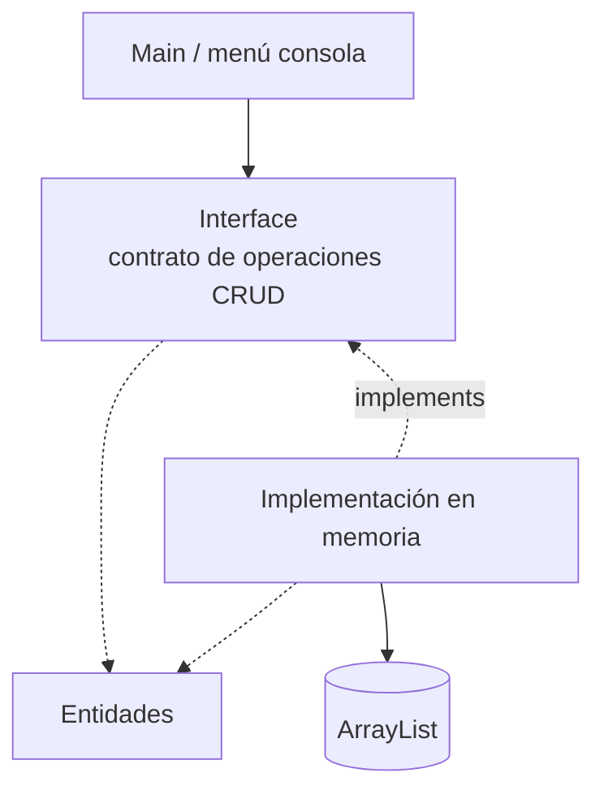

# S5 - CRUD en memoria con ArrayList

## 1. Introducción

Tiempo: 20 min.

### 1.1 Propósito

Formalizar el flujo `Main -> Interface -> Implementación en memoria -> Entidades -> ArrayList` para implementar operaciones CRUD en memoria y preparar la entrega con Maven y GraalVM.

### 1.2 Resultado de aprendizaje

El estudiante implementa alta, consulta, actualización, eliminación, búsqueda y ordenamiento en memoria, separando responsabilidades entre `Main`, gestor y entidades.

### 1.3 Producto de sesión

CRUD en memoria organizado con gestor, entidades y `ArrayList`, preparado para empaquetado o ejecutable nativo.

### 1.4 Motivación de la sesión

El modelo ya tiene clases, validaciones, relaciones y polimorfismo. Ahora necesita operaciones completas para manejar datos en memoria sin que `Main` concentre todo el código.

Pregunta guía:

```text
¿Cómo organizamos un CRUD en memoria sin convertir Main en una clase gigante?
```

### 1.5 Ubicación en el curso

- Unidad: U1.
- Avance de sesión: consolidación funcional del producto U1 antes de la evaluación.

## 2. Explica

Tiempo: 25 min.

### 2.1 Conceptos clave

- CRUD.
- Búsqueda por código, nombre u otro criterio.
- Ordenamiento básico.
- Separación de responsabilidades.
- Gestor o servicio en memoria.
- Reutilización de interface e `implements` vistos en S4.
- Interface como contrato de operaciones CRUD.
- Implementación en memoria del contrato.
- Validaciones y excepciones básicas del flujo.
- Maven para organizar compilación.
- GraalVM para ejecutable nativo.

Regla metodológica de la sesión:

```text
Main muestra el menú.
La interface declara las operaciones CRUD.
La implementación en memoria ejecuta las operaciones sobre ArrayList.
Las entidades no almacenan; representan datos y comportamiento del dominio.
```

### 2.2 Arquitectura de la sesión



## 3. Aplica: actividad práctica guiada

Tiempo: 2h.

1. Crear un menú simple en consola.
2. Definir o reutilizar una interface con operaciones CRUD.
3. Crear una implementación en memoria con `implements`.
4. Implementar registrar.
5. Implementar listar.
6. Implementar buscar.
7. Implementar actualizar.
8. Implementar eliminar.
9. Agregar ordenamiento básico.
10. Manejar validaciones y excepciones básicas del flujo.
11. Organizar el proyecto con Maven como preparación de entrega.
12. Preparar la compilación nativa con GraalVM fuera del flujo CRUD.

## 4. Crea: actividad autónoma

Tiempo: 3h fuera del aula.

Completa el CRUD de una entidad del dominio y prepara evidencia de ejecución.

Entrega evidencia breve con:

- Flujo `Main -> Interface -> Implementación en memoria -> Entidades -> ArrayList`.
- Capturas o salidas de cada operación CRUD.
- Evidencia de compilación o preparación con Maven/GraalVM.

## 5. Cierre evaluativo

Tiempo: 20 min.

### 5.1 Resultados esperados

- CRUD funcional en memoria.
- Interface e implementación en memoria separadas de `Main`.
- Entidades encapsuladas.
- Búsqueda y ordenamiento básicos.
- Proyecto preparado para entrega ejecutable.

### 5.2 Preguntas de defensa

1. ¿Qué responsabilidad tiene `Main`?
2. ¿Qué responsabilidad tiene la interface?
3. ¿Qué responsabilidad tiene la implementación en memoria?
4. ¿Dónde se almacenan los datos?
5. ¿Por qué Maven y GraalVM son parte de la entrega y no del flujo CRUD?
