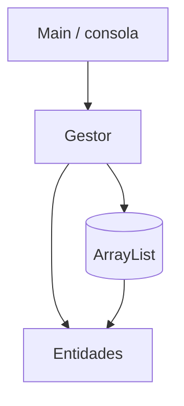

# S6 - Evaluación de la unidad 1

## 1. Introducción

Tiempo: 15 min.

### 1.1 Propósito

Evaluar el producto U1: aplicación de consola en memoria con modelo orientado a objetos, gestor, colecciones y CRUD.

### 1.2 Resultado de aprendizaje

El estudiante demuestra que puede modelar entidades, aplicar encapsulamiento, relaciones, herencia o interfaces, y ejecutar operaciones CRUD en memoria.

### 1.3 Producto de sesión

Producto U1 ejecutable y sustentado: modelo de dominio, gestor, `ArrayList`, CRUD y evidencia de ejecución.

### 1.4 Ubicación en el curso

- Cierre de U1.
- Base para iniciar U2 con interfaz gráfica.

## 2. Explica

Tiempo: 15 min.

### 2.1 Criterios de revisión

- Claridad del modelo de dominio.
- Encapsulamiento y constructores.
- Validaciones básicas.
- Relaciones entre objetos.
- Uso de herencia o interfaces cuando corresponde.
- Gestor separado de `Main`.
- CRUD en memoria.
- Evidencia de ejecución.

### 2.2 Producto esperado

## 3. Aplica: evaluación práctica

Tiempo: 2h.

El estudiante ejecuta su producto y demuestra:

1. Registro de datos.
2. Listado de datos.
3. Búsqueda.
4. Actualización.
5. Eliminación.
6. Validación de datos.
7. Separación entre `Main`, gestor y entidades.

## 4. Crea: evidencia individual

Tiempo: fuera del aula, si corresponde.

Entrega un PDF o documento breve con:

- Nombre del estudiante.
- Enlace al repositorio.
- Descripción del modelo.
- Capturas o salidas de consola.
- Explicación de una decisión técnica.
- Error encontrado y cómo se corrigió.

## 5. Cierre evaluativo

Tiempo: 30 min.

### 5.1 Preguntas de defensa

1. ¿Qué entidad consideras principal y por qué?
2. ¿Cómo separaste responsabilidades?
3. ¿Dónde aplicaste encapsulamiento?
4. ¿Dónde usaste colección?
5. ¿Qué cambiarías antes de pasar a GUI?

### 5.2 Rúbrica breve

| Criterio | Peso |
|---|---:|
| Modelo orientado a objetos | 4 |
| Encapsulamiento, relaciones y polimorfismo | 4 |
| CRUD en memoria | 5 |
| Separación Main-Gestor-Entidades | 4 |
| Evidencia y sustentación | 3 |

