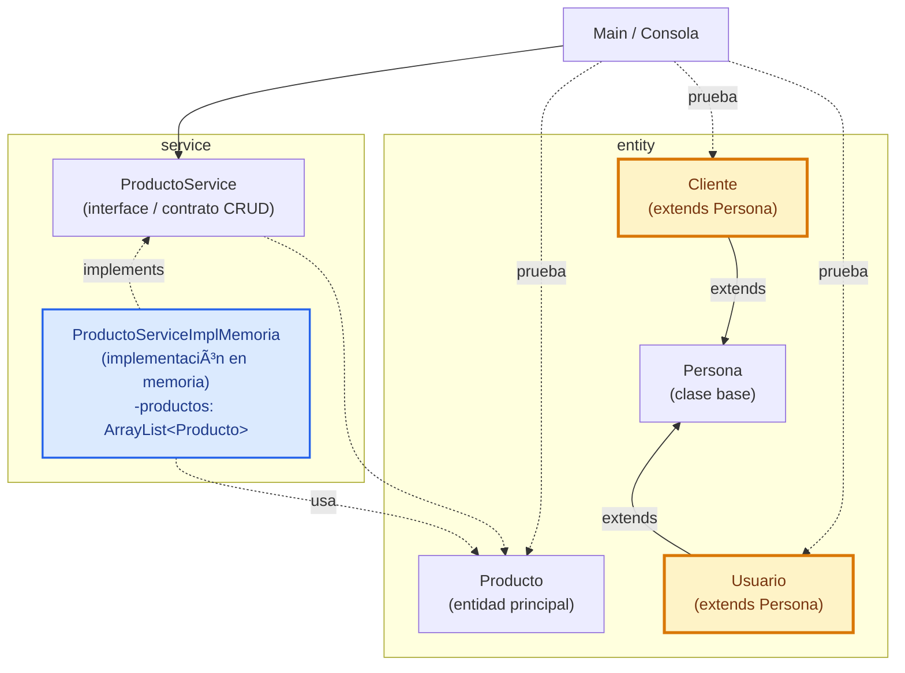

# S6 - Modelado orientado a objetos y gestión de datos en memoria (Evaluación U1)

## 1. Introducción

Tiempo: 20 min.

### 1.1 Propósito

Validar el producto de la Unidad 1: aplicación de consola en memoria con modelo orientado a objetos, encapsulamiento, relaciones, herencia o interfaces, servicio CRUD, gestión de datos en memoria y evidencia de ejecución.

### 1.2 Resultado de aprendizaje

El estudiante demuestra que puede construir, ejecutar, explicar y defender una aplicación de consola usando modelado orientado a objetos, separación de responsabilidades y gestión de datos en memoria.

### 1.3 Producto de sesión

Producto U1 integrado: entidades, relaciones, servicios, `ArrayList`, CRUD en memoria, menú de consola, proyecto Maven y evidencia de entrega ejecutable.

### 1.4 Motivación de la sesión

La evaluación no revisa clases sueltas ni el repaso de S1 como tema central. Revisa si el estudiante puede explicar cómo las clases colaboran, dónde se guardan los datos en memoria, cómo se aplica la separación de responsabilidades y qué evidencia demuestra que el producto funciona.

Preguntas para los estudiantes:

1. Qué evidencia demuestra qué tu producto U1 funciona?
2. Qué parte puedes defender individualmente?
3. Qué revisarias si una operación CRUD falla?

### 1.5 Ubicación en el curso

- Unidad: U1 - Fundamentos de la Programación Orientada a Objetos.
- Producto de unidad: aplicación de consola funcional en memoria con clases, relaciones entre objetos, colecciones, operaciones principales del dominio y preparación para ejecutable nativo.
- Carpeta de trabajo: `comarket-cli`.
- Avance de sesión: evaluación integradora antes de iniciar JavaFX.

## 2. Explica

Tiempo: 15 min.

### 2.1 Conceptos clave

- Integración: las clases funcionan coordinadamente.
- Evidencia individual: prueba verificable del aporte de cada estudiante.
- Diagnóstico: capacidad de ubicar fallos en `Main`, entidades, servicio o colección.
- Defensa técnica: explicacion clara de decisiónes de modelado y separacion de responsabilidades.

### 2.2 Arquitectura del producto U1



En la evaluación, cada equipo adapta esta arquitectura a su propio proyecto. Si el dominio no usa productos, reemplaza `Producto`, `ProductoService`, `ProductoServiceImplMemoria` y `ArrayList<Producto>` por la entidad principal de su sistema, por ejemplo `Libro`, `Reserva`, `Mascota`, `Paciente` u otra. Lo importante es evidenciar la separación entre consola, contrato de `service`, implementación en memoria, clases de `entity` y colección interna.

Las validaciones básicas se revisan dentro del flujo CRUD, ubicadas en el servicio o en los métodos de la entidad según la responsabilidad definida por el equipo.

### 2.3 Criterios mínimos de revisión

- Clases de `entity` encapsuladas.
- Constructores y getters/setters limpios.
- Relaciones entre objetos cuándo corresponde.
- Herencia o interface aplicada con sentido.
- `service` separado de `Main`.
- CRUD en memoria completo.
- Validaciones básicas.
- Evidencia de ejecución por consola.
- Proyecto organizado para entrega.

## 3. Aplica: evaluación practica

Tiempo: 3h.

### 3.1 Preparar demostracion

Orden recomendado:

1. Abrir el proyecto.
2. Verificar que el producto U1 está en `comarket-cli`.
3. Mostrar estructura de paquetes.
4. Ejecutar el programa.
5. Demostrar flujo CRUD completo.
6. Mostrar código clave de entidades y servicio.
7. Explicar una decisión técnica.

### 3.2 Ejecutar pruebas base

El estudiante demuestra:

1. Registro de datos.
2. Listado de datos.
3. Busqueda por criterio.
4. Actualizacion.
5. Eliminación.
6. Validación básica.
7. Separacion entre `Main`, servicio, entidades y colección.

### 3.3 Demostracion individual

Cada integrante debe poder responder:

- Qué parte implemento.
- Qué clase modifico.
- Qué prueba ejecuto.
- Qué error encontro y cómo lo corrigio.

## 4. Crea: evidencia individual

Tiempo: 4h fuera del aula.

### 4.1 Plantilla de evidencia individual

Entrega un PDF con el siguiente nombre:

```text
S06_Equipo##_ApellidoNombre.pdf
```

#### 4.1.1 Datos del estudiante

- Nombre:
- Equipo:
- Sesión: S06 - Modelado orientado a objetos y gestión de datos en memoria (Evaluación U1)
- Rol o aporte realizado:
- Link de GitHub:

#### 4.1.2 Trabajo autonomo realizado

1. Ordenar evidencias de U1.
2. Corregir observaciones detectadas.
3. Completar README o descripción breve del producto.
4. Preparar defensa individual.
5. Registrar comandos, capturas o salidas de consola.

#### 4.1.3 Evidencia técnica

- `entity`.
- Encapsulamiento.
- Relaciones, herencia o interfaces.
- `service` CRUD.
- `ArrayList`.
- Menu de consola.
- Ejecución del producto.
- Aporte individual.

#### 4.1.4 Error o hallazgo

Describe un problema encontrado en U1 y cómo lo diagnosticaste.

#### 4.1.5 Reflexión técnica breve

Explica cómo las clases de tu producto forman una aplicación orientada a objetos y no solo un conjunto de variables en `Main`.

### 4.2 Criterios mínimos de aceptación

- PDF con nombre correcto.
- Evidencia del producto U1 funcionando.
- Evidencia de aporte individual.
- Pruebas por consola.
- Explicacion técnica breve.

## 5. Cierre evaluativo

Tiempo: 20 min.

### 5.1 Resultados esperados

- Producto U1 ejecutado.
- CRUD en memoria demostrado.
- Separacion de responsabilidades explicada.
- Evidencia individual entregada.
- Base lista para iniciar JavaFX en U2.

### 5.2 Evidencia del producto de sesión

Cada estudiante entrega un PDF individual siguiendo la plantilla de la seccion 4.1.

Nombre del archivo:

```text
S06_Equipo##_ApellidoNombre.pdf
```

### 5.3 Preguntas de defensa y reflexión

1. Cuál fue tu aporte concreto en U1?
2. Cómo se ejecuta el producto?
3. Dónde se almacenan los datos en memoria?
4. Cómo separaste `Main`, servicio y entidades?
5. Qué cambiaria al pasar a GUI en U2?

### 5.4 Rúbrica de evaluación

| Dimension | Peso | 3 - Logro destacado | 2 - Logro | 1 - Proceso | 0 - Inicio | Puntuacion obtenida |
|---|---:|---|---|---|---|---:|
| 1. Modelo orientado a objetos | 2 | Clases de `entity` claras, encapsuladas y coherentes con el dominio. | Entidades principales correctas. | Entidades incompletas o mezcladas. | No evidencia modelo OO. | |
| 2. Relaciones, herencia o interfaces | 2 | Aplica relaciones y contratos con criterio. | Aplica al menos un mecanismo correctamente. | Aplicación parcial o forzada. | No aplica mecanismos OO. | |
| 3. CRUD en memoria | 2 | CRUD completo, probado y separado de `Main`. | CRUD principal funcional. | CRUD incompleto. | No hay CRUD funcional. | |
| 4. Separacion de responsabilidades | 2 | `Main`, servicio, entidades y colección tienen roles claros. | Separacion suficiente. | Lógica mezclada en varias partes. | Todo está concentrado sin criterio. | |
| 5. Evidencia individual | 1 | Evidencia clara, ordenada y verificable. | Evidencia suficiente. | Evidencia incompleta. | No entrega evidencia. | |
| 6. Defensa técnica | 1 | Responde con precision y criterio. | Responde adecuadamente. | Responde parcialmente. | No sustenta. | |

Puntuacion acumulada = suma de (`Peso` * `Puntuacion obtenida`) = ____.

Nota final = (`Puntuacion acumulada` / 30) * 20 = ____.

Para usar la rúbrica con IA, solicita:

```text
Evalua el PDF usando la rúbrica de la sesión.
Para cada dimension selecciona la puntuacion obtenida usando la escala Inicio=0, Proceso=1, Logro=2, Logro destacado=3.
Justifica brevemente cada puntuacion.
Calcula la puntuacion acumulada con la formula: suma de (Peso * Puntuacion obtenida).
Calcula la nota final sobre 20 con la formula: (Puntuacion acumulada / 30) * 20.
Indica 2 fortalezas y 2 recomendaciones.
```

