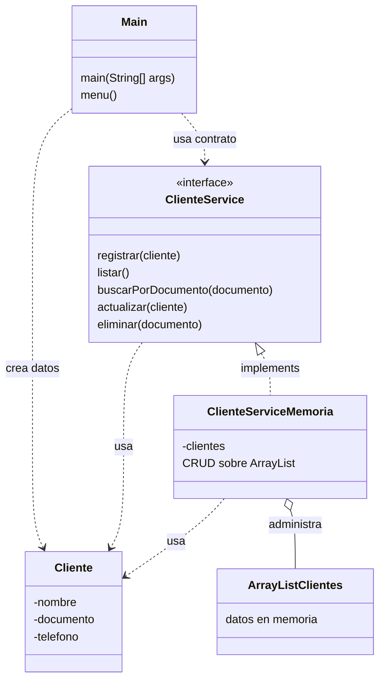

# S6 - Evaluación de la unidad 1

## 1. Introducción

Tiempo: 20 min.

### 1.1 Propósito

Validar el producto de la Unidad 1: aplicación de consola en memoria con modelo orientado a objetos, encapsulamiento, relaciones, herencia o interfaces, servicio CRUD y evidencia de ejecución.

### 1.2 Resultado de aprendizaje

El estudiante demuestra qué puede construir, ejecutar, explicar y defender una aplicación de consola usando fundamentos de Programación Orientada a Objetos.

### 1.3 Producto de sesión

Producto U1 integrado: entidades, servicios, `ArrayList`, CRUD en memoria, menu de consola, proyecto Maven y evidencia de entrega ejecutable.

### 1.4 Motivación de la sesión

La evaluación no revisa clases sueltas. Revisa si el estudiante puede explicar cómo las clases colaboran, dónde se guardan los datos en memoria, cómo se aplica la separacion de responsabilidades y qué evidencia demuestra que el producto funcióna.

Preguntas para los estudiantes:

1. Qué evidencia demuestra qué tu producto U1 funcióna?
2. Qué parte puedes defender individualmente?
3. Qué revisarias si una operación CRUD falla?

### 1.5 Ubicación en el curso

- Unidad: U1 - Fundamentos de la Programación Orientada a Objetos.
- Producto de unidad: aplicación de consola en memoria.
- Avance de sesión: evaluación integradora antes de iniciar JavaFX.

## 2. Explica

Tiempo: 15 min.

### 2.1 Conceptos clave

- Integración: las clases funciónan coordinadamente.
- Evidencia individual: prueba verificable del aporte de cada estudiante.
- Diagnóstico: capacidad de ubicar fallos en `Main`, entidades, servicio o colección.
- Defensa técnica: explicacion clara de decisiónes de modelado y separacion de responsabilidades.

### 2.2 Arquitectura del producto U1



### 2.3 Criterios mínimos de revisión

- Entidades encapsuladas.
- Constructores y getters/setters limpios.
- Relaciones entre objetos cuándo corresponde.
- Herencia o interface aplicada con sentido.
- Servicio separado de `Main`.
- CRUD en memoria completo.
- Validaciones básicas.
- Evidencia de ejecución por consola.
- Proyecto organizado para entrega.

## 3. Aplica: evaluación practica

Tiempo: 3h.

### 3.1 Preparar demostracion

Orden recomendado:

1. Abrir el proyecto.
2. Mostrar estructura de paquetes.
3. Ejecutar el programa.
4. Demostrar flujo CRUD completo.
5. Mostrar código clave de entidades y servicio.
6. Explicar una decisión técnica.

### 3.2 Ejecutar pruebas base

El estudiante demuestra:

1. Registro de datos.
2. Listado de datos.
3. Busqueda por criterio.
4. Actualizacion.
5. Eliminación.
6. Validación básica.
7. Separacion entre `Main`, servicio, entidades y colección.

### 3.3 Demostracion individual

Cada integrante debe poder responder:

- Qué parte implemento.
- Qué clase modifico.
- Qué prueba ejecuto.
- Qué error encontro y cómo lo corrigio.

## 4. Crea: evidencia individual

Tiempo: 4h fuera del aula.

### 4.1 Plantilla de evidencia individual

Entrega un PDF con el siguiente nombre:

```text
S06_Equipo##_ApellidoNombre.pdf
```

#### 4.1.1 Datos del estudiante

- Nombre:
- Equipo:
- Sesión: S06 - Evaluación U1
- Rol o aporte realizado:
- Link de GitHub:

#### 4.1.2 Trabajo autonomo realizado

1. Ordenar evidencias de U1.
2. Corregir observaciones detectadas.
3. Completar README o descripción breve del producto.
4. Preparar defensa individual.
5. Registrar comandos, capturas o salidas de consola.

#### 4.1.3 Evidencia técnica

- Entidades.
- Encapsulamiento.
- Relaciones, herencia o interfaces.
- Servicio CRUD.
- `ArrayList`.
- Menu de consola.
- Ejecución del producto.
- Aporte individual.

#### 4.1.4 Error o hallazgo

Describe un problema encontrado en U1 y cómo lo diagnosticaste.

#### 4.1.5 Reflexión técnica breve

Explica cómo las clases de tu producto forman una aplicación orientada a objetos y no solo un conjunto de variables en `Main`.

### 4.2 Criterios mínimos de aceptacion

- PDF con nombre correcto.
- Evidencia del producto U1 funciónando.
- Evidencia de aporte individual.
- Pruebas por consola.
- Explicacion técnica breve.

## 5. Cierre evaluativo

Tiempo: 20 min.

### 5.1 Resultados esperados

- Producto U1 ejecutado.
- CRUD en memoria demostrado.
- Separacion de responsabilidades explicada.
- Evidencia individual entregada.
- Base lista para iniciar JavaFX en U2.

### 5.2 Evidencia del producto de sesión

Cada estudiante entrega un PDF individual siguiendo la plantilla de la seccion 4.1.

Nombre del archivo:

```text
S06_Equipo##_ApellidoNombre.pdf
```

### 5.3 Preguntas de defensa y reflexión

1. Cuál fue tu aporte concreto en U1?
2. Cómo se ejecuta el producto?
3. Dónde se almacenan los datos en memoria?
4. Cómo separaste `Main`, servicio y entidades?
5. Qué cambiaria al pasar a GUI en U2?

### 5.4 Rúbrica de evaluación

| Dimension | Peso | 3 - Logro destacado | 2 - Logro | 1 - Proceso | 0 - Inicio | Puntuacion obtenida |
|---|---:|---|---|---|---|---:|
| 1. Modelo orientado a objetos | 2 | Entidades claras, encapsuladas y coherentes con el dominio. | Entidades principales correctas. | Entidades incompletas o mezcladas. | No evidencia modelo OO. | |
| 2. Relaciones, herencia o interfaces | 2 | Aplica relaciones y contratos con criterio. | Aplica al menos un mecanismo correctamente. | Aplicación parcial o forzada. | No aplica mecanismos OO. | |
| 3. CRUD en memoria | 2 | CRUD completo, probado y separado de `Main`. | CRUD principal funcional. | CRUD incompleto. | No hay CRUD funcional. | |
| 4. Separacion de responsabilidades | 2 | `Main`, servicio, entidades y colección tienen roles claros. | Separacion suficiente. | Lógica mezclada en varias partes. | Todo está concentrado sin criterio. | |
| 5. Evidencia individual | 1 | Evidencia clara, ordenada y verificable. | Evidencia suficiente. | Evidencia incompleta. | No entrega evidencia. | |
| 6. Defensa técnica | 1 | Responde con precision y criterio. | Responde adecuadamente. | Responde parcialmente. | No sustenta. | |

Puntuacion acumulada = suma de (`Peso` * `Puntuacion obtenida`) = ____.

Nota final = (`Puntuacion acumulada` / 30) * 20 = ____.

Para usar la rúbrica con IA, solicita:

```text
Evalua el PDF usando la rúbrica de la sesión.
Para cada dimension selecciona la puntuacion obtenida usando la escala Inicio=0, Proceso=1, Logro=2, Logro destacado=3.
Justifica brevemente cada puntuacion.
Calcula la puntuacion acumulada con la formula: suma de (Peso * Puntuacion obtenida).
Calcula la nota final sobre 20 con la formula: (Puntuacion acumulada / 30) * 20.
Indica 2 fortalezas y 2 recomendaciones.
```
