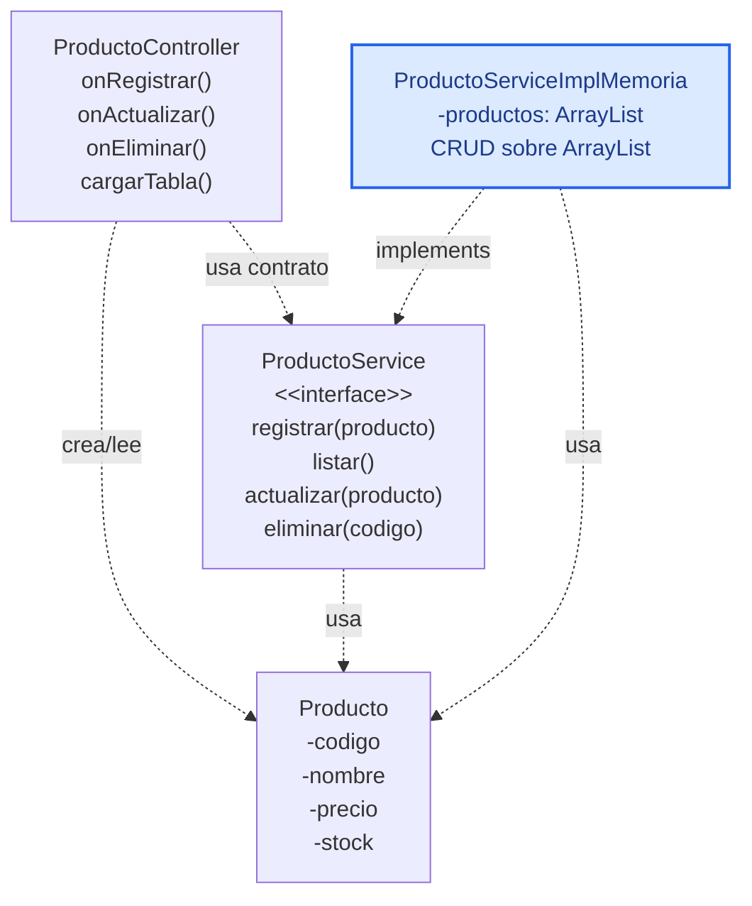

# S7 - Interfaz gráfica y CRUD desde GUI en memoria

## 1. Introducción

Tiempo: 20 min.

### 1.1 Propósito

Iniciar una aplicación de escritorio con JavaFX, FXML, Scene Builder y controladores, conectando un CRUD en memoria desde la GUI.

### 1.2 Resultado de aprendizaje

El estudiante crea una ventana JavaFX, diseña una vista FXML, conecta controles con un controlador y ejecuta operaciones CRUD en memoria usando el servicio trabajado en U1.

### 1.3 Producto de sesión

Proyecto JavaFX con Maven, vista FXML, controlador, formulario, tabla y CRUD en memoria de una entidad simple.

### 1.4 Motivación de la sesión

La aplicación deja la consola y empieza a operar como aplicación de escritorio. La GUI no reemplaza la POO construida en U1; reutiliza el contrato de servicio y la implementación en memoria desde una pantalla.

Pregunta guía:

```text
Cómo conectamos una pantalla JavaFX con el servicio en memoria sin duplicar el CRUD en el controlador?
```

### 1.5 Ubicación en el curso

- Unidad: U2.
- Carpeta de trabajo: `comarket-desk`.
- Avance de sesión: transición de consola a GUI con CRUD en memoria.

## 2. Explica

Tiempo: 25 min.

### 2.1 Conceptos clave

| Concepto | Idea central |
|---|---|
| JavaFX | Librería para construir interfaces gráficas en Java. |
| FXML | Archivo qué describe la estructura visual de la pantalla. |
| Scene Builder | Herramienta visual para editar FXML. |
| Controller | Clase Java qué recibe eventos de la vista. |
| `fx:id` | Nombre qué permite conectar un control FXML con Java. |
| `TableView` | Control para mostrar listas de objetos. |
| Servicio en memoria | Implementación que conserva datos temporalmente durante la ejecución. |

Regla metodológica de la sesión:

```text
La vista muestra controles.
El controlador atiende eventos.
El controlador delega operaciones al contrato del servicio.
La implementación en memoria conserva los datos durante la ejecución.
El ArrayList no va en el controlador; vive dentro de la implementación en memoria.
La persistencia con DAO y SQLite se trabaja en S8.
```

### 2.2 Arquitectura de la sesión



## 3. Aplica: actividad práctica guiada

Tiempo: 2h.

### 3.1 Crear proyecto JavaFX con Maven

Usa un IDE que soporte JavaFX, Maven y Scene Builder. Para U2 se recomienda IntelliJ IDEA o un entorno equivalente con Maven configurado. En este repositorio el proyecto de escritorio se trabaja en `comarket-desk`.

Producto del paso: proyecto JavaFX/Maven creado o verificado en `comarket-desk`, con estructura inicial, carpetas base y clase `Main` preparada para cargar una vista FXML.

Estructura base:

```text
src/main/java/
    app/
        ProductoApplication.java
    controller/
        ProductoController.java
    entity/
        Producto.java
    service/
        ProductoService.java
        ProductoServiceImplMemoria.java

src/main/resources/
    view/
        ProductoView.fxml
```

La persistencia (`repository`, `util`, SQLite) se trabajará en S8. En S7 el foco es abrir una ventana, cargar FXML, conectar eventos y ejecutar CRUD en memoria desde la GUI.

### 3.2 Crear vista FXML

Controles mínimos:

- `TextField` para código.
- `TextField` para nombre.
- `TextField` para precio.
- `TextField` para stock.
- `Button` para registrar.
- `Button` para actualizar.
- `Button` para eliminar.
- `Button` para limpiar.
- `TableView` para listar productos.

### 3.3 Conectar controles con `fx:id`

Cada control que el controlador necesita manipular debe tener `fx:id`.

Ejemplo:

```xml
<TextField fx:id="txtNombre" />
<Button text="Registrar" onAction="#onRegistrar" />
```

### 3.4 Crear controlador

```java
public class ProductoController {
    @FXML
    private TextField txtCodigo;

    @FXML
    private TextField txtNombre;

    @FXML
    private TextField txtPrecio;

    @FXML
    private TextField txtStock;

    private ProductoService productoService = new ProductoServiceImplMemoria();

    @FXML
    private void onRegistrar() {
        // Leer formulario, crear Producto y delegar al servicio.
    }
}
```

### 3.5 Conectar CRUD en memoria

Flujo mínimo:

1. Leer datos del formulario.
2. Crear un objeto `Producto`.
3. Llamar a `productoService.registrar(producto)`.
4. Refrescar la tabla con `productoService.listar()`.
5. Cargar el producto seleccionado al formulario.
6. Actualizar usando el servicio.
7. Eliminar con confirmación.

### 3.6 Probar eventos y validaciones

La prueba de esta sesión busca comprobar que:

- La ventana abre.
- El FXML carga.
- El botón ejecuta el método del controlador.
- El controlador delega el CRUD al servicio.
- La tabla se refresca después de registrar, editar o eliminar.
- Se validan campos obligatorios, precio y stock.

## 4. Crea: actividad autónoma

Fuera del aula, cada estudiante consolida el CRUD desde GUI en memoria y prepara una evidencia individual.

Tiempo: 2h fuera del aula.

### 4.1 Plantilla de evidencia individual

Entrega un PDF con el siguiente nombre:

```text
S07_Equipo##_ApellidoNombre.pdf
```

#### 4.1.1 Datos del estudiante

- Nombre:
- Equipo:
- Sesión: S07 - Interfaz gráfica y CRUD desde GUI en memoria
- Rol o aporte realizado:
- Link de GitHub:

#### 4.1.2 Trabajo autónomo realizado

1. Diseñar una vista inicial para una entidad del dominio.
2. Crear controles con `fx:id`.
3. Conectar botones con métodos del controlador.
4. Registrar, listar, actualizar y eliminar desde GUI.
5. Usar el contrato de servicio.
6. Mantener el `ArrayList` dentro de la implementación en memoria.
7. Validar campos obligatorios y datos numéricos.
8. Explicar qué responsabilidad tiene FXML, controlador y servicio.

#### 4.1.3 Evidencia técnica

- Captura de Scene Builder.
- Captura de la aplicación ejecutando.
- Código del controlador.
- Código o referencia del servicio en memoria.
- Capturas de registrar, listar, actualizar y eliminar.
- Evidencia de validación.
- Fragmento FXML con `fx:id` y `onAction`.

#### 4.1.4 Error o hallazgo

Describe un error técnico y cómo lo corregiste.

#### 4.1.5 Reflexión técnica breve

Responde en 5 a 8 líneas:

```text
Por qué el controlador debe delegar el CRUD al servicio aunque la aplicación todavía use memoria?
```

### 4.2 Criterios mínimos de aceptación

- PDF con nombre correcto.
- Vista en Scene Builder.
- Aplicación ejecutando.
- Registro, listado, edición y eliminación desde GUI.
- Servicio en memoria usado desde el controlador.
- Validaciones básicas.
- Separación entre vista, controlador, servicio y entidad.

## 5. Cierre evaluativo

Tiempo: 20 min.

### 5.1 Resultados esperados

- Proyecto JavaFX ejecuta correctamente.
- La vista FXML abre sin errores.
- Los controles tienen `fx:id`.
- El controlador recibe eventos.
- El CRUD en memoria funciona desde la GUI.
- La GUI queda lista para reemplazar memoria por DAO y SQLite en S8.

### 5.2 Evidencia del producto de sesión

Cada estudiante entrega un PDF individual siguiendo la plantilla de la sección 4.1.

### 5.3 Preguntas de defensa y reflexión

1. Qué función cumple FXML?
2. Qué función cumple Scene Builder?
3. Qué función cumple el controlador?
4. Qué responsabilidad tiene el servicio?
5. Por qué el controlador no debe contener todo el CRUD?
6. Dónde se almacena temporalmente la información?
7. Qué cambiará en S8 cuando se use DAO y SQLite?

### 5.4 Rúbrica de evaluación

| Dimensión | Peso | 3 - Logro destacado | 2 - Logro | 1 - Proceso | 0 - Inicio | Puntuación obtenida |
|---|---:|---|---|---|---|---:|
| 1. Vista FXML | 2 | Vista clara, controles adecuados y estructura coherente. | Vista funcional. | Vista incompleta. | No evidencia vista. | |
| 2. Conexión con controlador | 2 | `fx:id` y eventos conectados correctamente. | Conexión principal funcional. | Conexión parcial. | No conecta controlador. | |
| 3. CRUD en memoria | 2 | Registro, listado, edición y eliminación funcionan desde GUI. | CRUD principal funcional. | CRUD parcial. | No evidencia CRUD. | |
| 4. Separación de responsabilidades | 2 | Explica vista, controlador, servicio y entidad. | Explicación suficiente. | Explicación confusa. | No explica responsabilidades. | |
| 5. Error o hallazgo | 1 | Analiza causa y solución. | Explica un problema. | Menciona un problema. | No presenta. | |
| 6. Orden y reflexión | 1 | Evidencia clara y reflexión precisa. | Evidencia suficiente. | Evidencia incompleta. | No sustenta. | |
