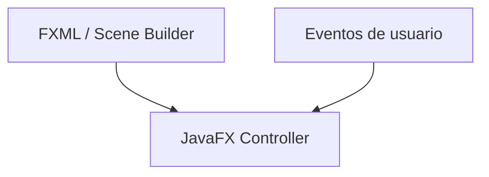

# S7 - Interfaz gráfica de usuario

## 1. Introducción

Tiempo: 20 min.

### 1.1 Propósito

Iniciar la aplicación de escritorio CoMarket con JavaFX, FXML, Scene Builder y controladores.

### 1.2 Resultado de aprendizaje

El estudiante crea una ventana JavaFX, diseña una vista FXML, conecta controles con un controlador y atiende eventos básicos.

### 1.3 Producto de sesión

Proyecto JavaFX/Maven en IntelliJ IDEA con vista FXML, controlador y formulario inicial.

### 1.4 Motivación de la sesión

El producto deja de ser una aplicación de consola y empieza a convertirse en una aplicación de escritorio. La vista permite que el usuario interactúe con formularios, botones y tablas.

Pregunta guía:

```text
¿Cómo conectamos una pantalla JavaFX con código Java sin mezclarlo todo?
```

### 1.5 Ubicación en el curso

- Unidad: U2 - Aplicación de escritorio con persistencia de datos.
- Avance de sesión: base visual del producto CoMarket.

## 2. Explica

Tiempo: 25 min.

### 2.1 Conceptos clave

- JavaFX.
- FXML.
- Scene Builder.
- Controlador.
- Eventos.
- Formularios.
- `TableView`.

### 2.2 Arquitectura de la sesión



## 3. Aplica: actividad práctica guiada

Tiempo: 2h.

1. Crear o revisar un proyecto JavaFX/Maven en IntelliJ IDEA.
2. Abrir la vista FXML con Scene Builder.
3. Crear campos de texto, botones y tabla.
4. Asociar controles con `fx:id`.
5. Crear métodos de evento.
6. Probar la ejecución de la ventana.

## 4. Crea: actividad autónoma

Tiempo: 2h fuera del aula.

Diseña una vista adicional o mejora la vista principal.

Entrega evidencia breve con:

- Captura de Scene Builder.
- Captura de la aplicación ejecutando.
- Código del controlador.
- Explicación de un evento.

## 5. Cierre evaluativo

Tiempo: 20 min.

### 5.1 Resultados esperados

- Proyecto JavaFX ejecuta en IntelliJ IDEA.
- La vista FXML abre correctamente.
- Los controles están conectados al controlador.
- Los botones ejecutan eventos básicos.

### 5.2 Preguntas de defensa

1. ¿Qué función cumple FXML?
2. ¿Qué función cumple el controlador?
3. ¿Para qué sirve Scene Builder?
4. ¿Cómo se conecta un botón con un método Java?

