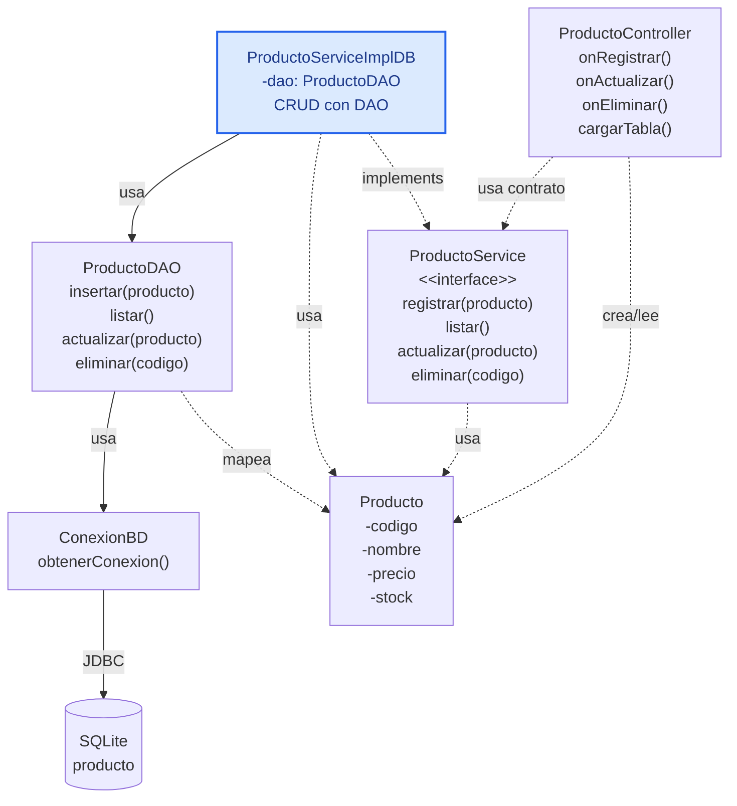

# S8 - Arquitectura por capas, DAO y CRUD persistente desde GUI

## 1. Introducción

Tiempo: 20 min.

### 1.1 Propósito

Implementar una primera versión persistente de la aplicación de escritorio usando arquitectura por capas, patrón DAO, JDBC, SQLite y CRUD desde JavaFX.

### 1.2 Resultado de aprendizaje

El estudiante separa vista, controlador, servicio, entidades y persistencia; crea un DAO para una tabla simple y conecta el CRUD persistente con la interfaz gráfica.

### 1.3 Producto de sesión

CRUD persistente de una entidad simple desde GUI, usando `ProductoServiceImplDB`, `ProductoDAO`, SQLite y validaciones básicas.

### 1.4 Motivación de la sesión

En S7 el CRUD funcionó en memoria. En esta sesión se reemplaza la implementación en memoria por una implementación persistente sin cambiar la responsabilidad del controlador ni de la entidad.

Pregunta guía:

```text
Cómo guardamos datos desde la GUI sin poner SQL en el controlador?
```

### 1.5 Ubicación en el curso

- Unidad: U2.
- Carpeta de trabajo: `comarket-desk`.
- Avance de sesión: primera persistencia real con DAO y una tabla simple.

## 2. Explica

Tiempo: 25 min.

### 2.1 Conceptos clave

- Arquitectura por capas.
- Vista FXML y controlador JavaFX.
- Servicio como contrato de operaciones.
- Implementación persistente del servicio.
- Patrón DAO.
- JDBC como conector.
- SQLite como base de datos local.
- Validaciones básicas y manejo inicial de errores.

Regla metodológica de la sesión:

```text
El controlador no escribe SQL.
El controlador llama al contrato del servicio.
La implementación persistente coordina validaciones y DAO.
El DAO ejecuta SQL y mapea filas a objetos.
JDBC conecta Java con SQLite.
La entidad sigue siendo clase del dominio.
No se usa JPA ni ORM.
La conexión a la base de datos se centraliza en util/ConexionBD.
`dao` cumple el rol de capa de acceso a datos en este curso.
```

### 2.2 Arquitectura de la sesión



## 3. Aplica: actividad práctica guiada

Tiempo: 2h.

1. Revisar el proyecto JavaFX/Maven ubicado en `comarket-desk`.
2. Agregar dependencia SQLite JDBC.
3. Crear o verificar las carpetas de capas.
4. Crear `ConexionBD` dentro de `util`.
5. Crear tabla `producto`.
6. Crear `ProductoDAO` dentro de `dao`.
7. Implementar `insert`, `select`, `update` y `delete`.
8. Crear `ProductoServiceImplDB implements ProductoService`.
9. Hacer que `ProductoController` use `ProductoService`, no el DAO directamente.
10. Cargar `TableView` desde SQLite.
11. Validar campos obligatorios, precio y stock.
12. Mostrar mensajes de error claros.

Estructura sugerida:

```text
src/main/java/
    app/
        ProductoApplication.java
    controller/
        ProductoController.java
    entity/
        Producto.java
    exception/
        ValidacionException.java
        PersistenciaException.java
    dao/
        ProductoDAO.java
    service/
        ProductoService.java
        ProductoServiceImplDB.java
    util/
        ConexionBD.java
src/main/resources/
    view/
        ProductoView.fxml
```

Nota metodológica:

```text
`dao` se usa como carpeta para las clases DAO.
util contiene clases técnicas compartidas, como ConexionBD.
No se agrega mapper, dto ni filter todavía porque no aportan al nivel de esta sesión.
```

Tabla mínima:

```sql
CREATE TABLE producto (
    id INTEGER PRIMARY KEY AUTOINCREMENT,
    codigo TEXT NOT NULL UNIQUE,
    nombre TEXT NOT NULL,
    precio REAL NOT NULL,
    stock INTEGER NOT NULL
);
```

## 4. Crea: actividad autónoma

Fuera del aula, cada estudiante consolida el CRUD persistente y prepara una evidencia individual.

Tiempo: 2h fuera del aula.

### 4.1 Plantilla de evidencia individual

Entrega un PDF con el siguiente nombre:

```text
S08_Equipo##_ApellidoNombre.pdf
```

#### 4.1.1 Datos del estudiante

- Nombre:
- Equipo:
- Sesión: S08 - Arquitectura por capas, DAO y CRUD persistente desde GUI
- Rol o aporte realizado:
- Link de GitHub:

#### 4.1.2 Trabajo autónomo realizado

1. Completar CRUD persistente de producto.
2. Evidenciar estructura por capas.
3. Mostrar `ProductoDAO`.
4. Mostrar `ProductoServiceImplDB`.
5. Ejecutar la GUI y registrar datos.
6. Verificar registros en SQLite.
7. Documentar una validación aplicada.

#### 4.1.3 Evidencia técnica

- Captura de la GUI.
- Código o fragmento de DAO.
- Código o fragmento de servicio persistente.
- Captura de registros en SQLite.
- Evidencia de validación o mensaje de error.
- Explicación del flujo `Vista -> Controlador -> Servicio -> DAO -> SQLite`.

#### 4.1.4 Error o hallazgo

Describe un problema técnico y cómo lo corregiste.

#### 4.1.5 Reflexión técnica breve

Responde en 5 a 8 líneas:

```text
Por qué el controlador no debe ejecutar SQL directamente?
```

### 4.2 Criterios mínimos de aceptación

- PDF con nombre correcto.
- CRUD persistente funcional desde GUI.
- DAO separado del controlador.
- Servicio persistente usando el DAO.
- SQLite con datos verificables.
- Validaciones básicas evidenciadas.

## 5. Cierre evaluativo

Tiempo: 20 min.

### 5.1 Resultados esperados

- El estudiante explica las capas principales.
- El controlador delega al servicio.
- El servicio persistente usa DAO.
- El DAO concentra SQL.
- La tabla se refresca desde SQLite.
- Hay validaciones básicas al registrar o actualizar.

### 5.2 Evidencia del producto de sesión

Cada estudiante entrega un PDF individual siguiendo la plantilla de la sección 4.1.

### 5.3 Preguntas de defensa y reflexión

1. Qué responsabilidad tiene el controlador?
2. Qué responsabilidad tiene el servicio?
3. Qué responsabilidad tiene el DAO?
4. Cómo se conecta Java con SQLite?
5. Qué validación implementaste?
6. Cómo verificas que el dato quedó persistido?

### 5.4 Rúbrica de evaluación

| Dimensión | Peso | 3 - Logro destacado | 2 - Logro | 1 - Proceso | 0 - Inicio | Puntuación obtenida |
|---|---:|---|---|---|---|---:|
| 1. Capas | 2 | Vista, controlador, servicio, entidad y DAO claramente separados. | Capas funcionales. | Separación parcial. | No separa capas. | |
| 2. DAO | 2 | DAO ejecuta SQL y mapea objetos correctamente. | DAO funcional. | DAO incompleto. | No evidencia DAO. | |
| 3. CRUD persistente | 2 | CRUD completo desde GUI y verificado en SQLite. | CRUD principal funcional. | CRUD parcial. | No persiste. | |
| 4. Validaciones | 2 | Valida datos y muestra mensajes claros. | Validaciones básicas. | Validación parcial. | No valida. | |
| 5. Error o hallazgo | 1 | Analiza causa y solución. | Explica un problema. | Menciona un problema. | No presenta. | |
| 6. Orden y reflexión | 1 | Evidencia clara y reflexión precisa. | Evidencia suficiente. | Evidencia incompleta. | No sustenta. | |
