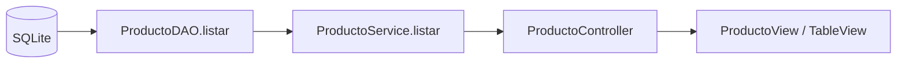

# S8 - Arquitectura por capas, DAO y primer listado persistente desde GUI

## 1. Introducción

Tiempo: 20 min.

### 1.1 Propósito

Transformar el módulo de `Producto` trabajado en memoria en S7 en un primer corte vertical persistente, conectando base de datos, DAO, servicio, controlador y tabla de la interfaz gráfica.

### 1.2 Resultado de aprendizaje

El estudiante organiza el proyecto por capas, configura la conexión, recupera productos mediante JDBC y DAO, y presenta el listado obtenido desde la base de datos en la GUI.

### 1.3 Producto de sesión

Proyecto de escritorio conectado y organizado por capas, con `Producto` almacenado en la base de datos y mostrado en una tabla de la interfaz gráfica.

### 1.4 Motivación de la sesión

En S7 los productos desaparecían al cerrar la aplicación porque se almacenaban en memoria. S8 demuestra, mediante una sola operación completa —listar—, cómo un registro persistente se convierte en objeto y llega hasta la pantalla.

La meta no es completar el CRUD. Registrar, actualizar y eliminar corresponden a S9.

### 1.5 Ubicación en el curso

- S7: GUI y gestión en memoria.
- **S8: arquitectura por capas y primer listado persistente.**
- S9: CRUD persistente completo.
- S10: objetos relacionados `Usuario–Venta`.
- S11: `Venta–DetalleVenta–Producto`.
- S12: evaluación U2.

## 2. Explica

Tiempo: 30 min.

### 2.1 Corte vertical de S8



Responsabilidades:

| Componente | Responsabilidad en S8 |
|---|---|
| `Producto` | Representa el objeto del dominio. |
| Conexión | Abre una conexión configurada con SQLite. |
| `ProductoDAO` | Ejecuta la consulta y convierte filas en objetos. |
| Servicio | Expone el listado y traduce errores técnicos. |
| Controlador | Solicita los datos y actualiza la tabla. |
| Vista | Presenta productos o un mensaje comprensible. |

### 2.2 Alcance y límites

S8 incluye:

- Dependencia JDBC y configuración de SQLite.
- Script proporcionado para crear e inicializar la tabla.
- Entidad `Producto` reutilizada desde U1.
- Consulta parametrizada o consulta fija de listado.
- Conversión de cada fila en un objeto.
- Presentación de la colección en `TableView`.
- Lista vacía y error de conexión.

S8 no incluye:

- Formularios persistentes de registro o edición.
- Eliminación de productos.
- Objetos relacionados.
- Seguridad o sesión.
- Diseño relacional por parte del estudiante.

Como el curso no es de Base de Datos, el docente proporciona el script, la estructura de la tabla y datos iniciales. El estudiante se concentra en objetos, capas y responsabilidades.

### 2.3 Errores frecuentes

| Problema | Causa probable | Acción |
|---|---|---|
| La tabla aparece vacía | No se insertaron datos iniciales | Ejecutar o verificar el script proporcionado. |
| No se abre la base de datos | Ruta o driver incorrecto | Revisar configuración y dependencia JDBC. |
| La vista ejecuta SQL | Responsabilidades mezcladas | Trasladar la consulta al DAO. |
| El DAO devuelve filas o mapas | No se construyen objetos | Convertir cada resultado en `Producto`. |
| Se intenta completar el CRUD | Se adelantó S9 | Mantener el alcance en `listar()`. |

## 3. Aplica: actividad práctica guiada

Tiempo: 3 h.

### 3.1 Verificar el proyecto y la dependencia JDBC

Reutilizar el proyecto de escritorio de S7 y agregar el controlador JDBC requerido. Las credenciales o rutas variables deben quedar fuera del código fuente cuando corresponda.

### 3.2 Preparar la base de datos

El docente entrega un script equivalente a:

```sql
CREATE TABLE IF NOT EXISTS producto (
    id INTEGER PRIMARY KEY AUTOINCREMENT,
    nombre TEXT NOT NULL,
    precio REAL NOT NULL,
    stock INTEGER NOT NULL
);
```

Se cargan al menos tres productos de prueba. El estudiante no diseña el esquema ni normaliza tablas en esta sesión.

### 3.3 Crear el componente de conexión

```java
public final class ConexionSQLite {
    private static final String URL = "jdbc:sqlite:comarket.db";

    private ConexionSQLite() {
    }

    public static Connection abrir() throws SQLException {
        return DriverManager.getConnection(URL);
    }
}
```

### 3.4 Definir el contrato DAO mínimo

```java
public interface ProductoDAO {
    List<Producto> listar();
}
```

### 3.5 Implementar el listado

```java
public class ProductoDAOSQLite implements ProductoDAO {

    @Override
    public List<Producto> listar() {
        String sql = "SELECT id, nombre, precio, stock FROM producto ORDER BY nombre";
        List<Producto> productos = new ArrayList<>();

        try (Connection cn = ConexionSQLite.abrir();
             PreparedStatement ps = cn.prepareStatement(sql);
             ResultSet rs = ps.executeQuery()) {

            while (rs.next()) {
                productos.add(new Producto(
                    rs.getInt("id"),
                    rs.getString("nombre"),
                    rs.getDouble("precio"),
                    rs.getInt("stock")
                ));
            }
            return productos;
        } catch (SQLException ex) {
            throw new AccesoDatosException("No se pudieron listar los productos", ex);
        }
    }
}
```

### 3.6 Conectar servicio, controlador y vista

El servicio delega en el DAO. El controlador solicita el listado al iniciar la vista o al presionar `Actualizar`.

```java
public void cargarProductos() {
    try {
        tablaProductos.getItems().setAll(productoService.listar());
        mensaje.setText(tablaProductos.getItems().isEmpty()
            ? "No existen productos registrados."
            : "");
    } catch (RuntimeException ex) {
        mensaje.setText("No fue posible cargar los productos.");
    }
}
```

### 3.7 Probar el corte vertical

| Caso | Resultado esperado |
|---|---|
| Base con productos | La tabla muestra los registros. |
| Base sin productos | La tabla queda vacía y muestra un mensaje informativo. |
| Ruta de BD incorrecta | Se informa el error sin cerrar abruptamente la aplicación. |
| Botón actualizar | La tabla vuelve a consultar el origen persistente. |

## 4. Crea: actividad autónoma

Tiempo: 2 h fuera del aula.

Entregar:

```text
S08_POO_Equipo##_ApellidoNombre.pdf
```

La evidencia incluye:

1. Estructura de paquetes.
2. Configuración de conexión.
3. Contrato e implementación de `ProductoDAO.listar()`.
4. Flujo servicio–controlador–vista.
5. Tabla con productos obtenidos desde la base de datos.
6. Caso de lista vacía o error controlado.
7. Explicación de por qué registrar, actualizar y eliminar se reservan para S9.

## 5. Cierre evaluativo

### 5.1 Resultados esperados

- Explica las responsabilidades de cada capa.
- Convierte resultados persistentes en objetos `Producto`.
- Presenta el listado desde la GUI.
- Controla lista vacía y errores de acceso.
- Mantiene S8 como un corte vertical pequeño y verificable.

### 5.2 Rúbrica

| Dimensión | Peso | 3 - Destacado | 2 - Logro | 1 - Proceso | 0 - Inicio |
|---|---:|---|---|---|---|
| Arquitectura por capas | 2 | Responsabilidades claramente separadas. | Separación funcional. | Mezcla parcial. | No hay separación. |
| DAO y objetos | 2 | Lista y construye objetos correctamente. | Listado funcional. | Listado incompleto. | No consulta datos. |
| Integración GUI | 2 | Tabla y actualización funcionan correctamente. | Presenta el listado. | Presentación parcial. | No muestra datos. |
| Manejo de casos | 2 | Controla lista vacía y error técnico. | Controla uno de los casos. | Mensajes poco claros. | La aplicación falla. |
| Evidencia y defensa | 2 | Evidencia completa y explicación sólida. | Evidencia suficiente. | Evidencia parcial. | No presenta evidencia. |

