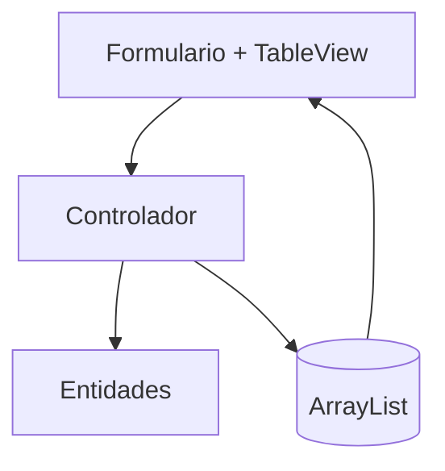

# S8 - CRUD desde GUI en memoria

## 1. Introducción

Tiempo: 20 min.

### 1.1 Propósito

Implementar un CRUD desde JavaFX usando entidades y `ArrayList`, sin base de datos todavía.

### 1.2 Resultado de aprendizaje

El estudiante conecta formularios y tablas con objetos del dominio, valida entradas básicas y actualiza datos en memoria desde la GUI.

### 1.3 Producto de sesión

CRUD funcional desde formularios y `TableView`, usando entidades y almacenamiento en memoria.

### 1.4 Motivación de la sesión

Antes de conectar SQLite, conviene comprobar que la interfaz gráfica puede registrar, mostrar, editar y eliminar objetos en memoria.

Pregunta guía:

```text
¿Cómo pasamos del CRUD de consola al CRUD con formularios y tablas?
```

### 1.5 Ubicación en el curso

- Unidad: U2.
- Avance de sesión: transición de U1 a GUI usando memoria.

## 2. Explica

Tiempo: 25 min.

### 2.1 Conceptos clave

- Flujo Vista-Controlador-Entidades.
- Lectura de datos desde formularios.
- Creación de objetos.
- Carga de datos en `TableView`.
- Selección de filas.
- Actualización y eliminación.

### 2.2 Arquitectura de la sesión



## 3. Aplica: actividad práctica guiada

Tiempo: 2h.

1. Crear campos para datos de producto u otra entidad.
2. Leer datos desde el formulario.
3. Validar campos obligatorios y valores numéricos.
4. Crear objetos.
5. Agregar objetos a un `ArrayList`.
6. Mostrar datos en `TableView`.
7. Editar el elemento seleccionado.
8. Eliminar con confirmación.

## 4. Crea: actividad autónoma

Tiempo: 2h fuera del aula.

Completa el CRUD en memoria desde GUI para otra entidad o mejora el flujo principal.

Entrega evidencia breve con:

- Capturas de registro, edición y eliminación.
- Código del controlador.
- Explicación de cómo se actualiza la tabla.

## 5. Cierre evaluativo

Tiempo: 20 min.

### 5.1 Resultados esperados

- El CRUD funciona desde la interfaz gráfica.
- Los datos se almacenan en memoria.
- La tabla refleja los cambios.
- El controlador usa entidades del dominio.

### 5.2 Preguntas de defensa

1. ¿Dónde se almacenan los datos en esta sesión?
2. ¿Cómo se refresca la tabla?
3. ¿Qué validaciones implementaste?
4. ¿Qué cambiará cuando usemos DAO?

