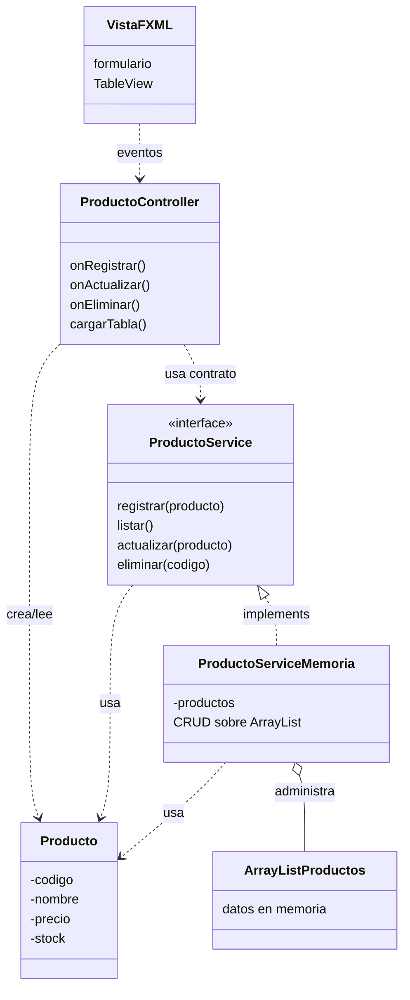

# S8 - CRUD desde GUI en memoria

## 1. Introducción

Tiempo: 20 min.

### 1.1 Propósito

Implementar un CRUD desde JavaFX reutilizando el contrato de servicio y la implementación en memoria, sin base de datos todavía.

### 1.2 Resultado de aprendizaje

El estudiante conecta formularios y tablas con un controlador JavaFX, delega operaciones al servicio CRUD y mantiene los datos en memoria con `ArrayList`.

### 1.3 Producto de sesión

CRUD funcional desde formulario y `TableView`, usando vista, controlador, servicio, entidades y almacenamiento en memoria.

### 1.4 Motivación de la sesión

Antes de conectar SQLite, conviene comprobar qué la interfaz gráfica puede registrar, mostrar, editar y eliminar objetos usando el mismo contrato qué antes se probo desde consola.

Pregunta guía:

```text
Cómo pasamos del CRUD de consola al CRUD con formularios y tablas?
```

### 1.5 Ubicación en el curso

- Unidad: U2.
- Avance de sesión: transicion de consola a GUI usando memoria.

## 2. Explica

Tiempo: 25 min.

### 2.1 Conceptos clave

- Flujo Vista-Controlador-Servicio-Entidades-ArrayList.
- Interface de servicio como contrato de operaciones CRUD.
- Implementación en memoria del contrato.
- Lectura de datos desde formularios.
- Carga de datos en `TableView`.
- Seleccion de filas para editar o eliminar.
- Refresco de tabla después de cada operación.

Regla métodológica de la sesión:

```text
La vista captura datos.
El controlador traduce eventos en llamadas al servicio.
El servicio ejecuta CRUD.
La implementación en memoria administra el ArrayList.
```

### 2.2 Arquitectura de la sesión



## 3. Aplica: actividad práctica guiada

Tiempo: 2h.

1. Crear campos para datos de producto.
2. Crear columnas de `TableView`.
3. Leer datos desde el formulario.
4. Crear objeto `Producto`.
5. Delegar registro a `ProductoService`.
6. Mantener el `ArrayList` dentro de `ProductoServiceMemoria`.
7. Mostrar datos en `TableView`.
8. Cargar datos del elemento seleccionado al formulario.
9. Actualizar el registro seleccionado.
10. Eliminar con confirmación.

## 4. Crea: actividad autónoma

Fuera del aula, cada estudiante consolida el aprendizaje completando un CRUD desde GUI en memoria y preparando una evidencia individual.

Tiempo: 2h fuera del aula.

### 4.1 Plantilla de evidencia individual

Entrega un PDF con el siguiente nombre:

```text
S08_Equipo##_ApellidoNombre.pdf
```

Ejemplo:

```text
S08_Equipo03_QuispeAna.pdf
```

El PDF debe usar esta estructura. La primera sección define el trabajo autónomo; completa las demás con tus evidencias.

#### 4.1.1 Datos del estudiante

- Nombre:
- Equipo:
- Sesión: S08 - CRUD desde GUI en memoria
- Rol o aporte realizado:
- Link de GitHub:

#### 4.1.2 Trabajo autónomo realizado

Completa y evidencia estas tareas:

1. Completar el CRUD en memoria desde GUI para una entidad del dominio.
2. Leer datos desde el formulario.
3. Registrar objetos usando el contrato del servicio.
4. Mostrar datos en `TableView`.
5. Editar el elemento seleccionado.
6. Eliminar con confirmación.
7. Explicar cómo se refresca la tabla sin duplicar el CRUD en el controlador.

#### 4.1.3 Evidencia técnica

Incluye capturas o salidas con una breve explicación debajo de cada una:

- Capturas de registro, listado, edición y eliminación.
- Código del controlador.
- Código o referencia de `ProductoService` y `ProductoServiceMemoria`.
- Explicación de cómo se actualiza la tabla sin duplicar el CRUD en el controlador.
- Evidencia de que el `ArrayList` queda dentro de la implementación en memoria.

#### 4.1.4 Error o hallazgo

Describe al menos un error, diferencia o hallazgo técnico:

- Qué ocurrió.
- Cómo lo diagnosticaste.
- Cómo lo corregiste o qué aprendiste.

Ejemplos válidos:

- La tabla no refrescaba después de registrar.
- La fila seleccionada no cargaba al formulario.
- El controlador empezó a duplicar lógica del service.
- Se perdió información al editar un registro.

#### 4.1.5 Reflexión técnica breve

Responde en 5 a 8 líneas:

```text
Por qué el controlador debe delegar el CRUD al servicio aunque la aplicación todavía use memoria?
```

### 4.2 Criterios mínimos de aceptación

La evidencia individual se considera completa si:

- El archivo respeta el nombre `S08_Equipo##_ApellidoNombre.pdf`.
- Incluye evidencias técnicas legibles.
- Muestra registro, listado, edición y eliminación desde GUI.
- Usa `ProductoService` o contrato equivalente.
- Mantiene `ArrayList` dentro de la implementación en memoria.
- Explica cómo se actualiza `TableView`.
- No contiene solo pantallazos: cada evidencia tiene una descripción breve.

## 5. Cierre evaluativo

Tiempo: 20 min.

Esta sección conecta el resultado de aprendizaje de la sesión con el producto que debe evidenciar cada estudiante.

### 5.1 Resultados esperados

- El CRUD funciona desde la interfaz gráfica.
- El controlador delega operaciones al servicio.
- Los datos se almacenan en memoria dentro de la implementación del servicio.
- Las entidades son las mismas clases del dominio usadas desde U1.
- La tabla refleja los cambios.

### 5.2 Evidencia del producto de sesión

Cada estudiante entrega un PDF individual siguiendo la plantilla de la sección 4.1.

Nombre del archivo:

```text
S08_Equipo##_ApellidoNombre.pdf
```

La evidencia debe demostrar:

- Producto de sesión construido.
- Aporte individual verificable.
- CRUD desde GUI en memoria.
- Reflexión técnica breve.

La revisión se realiza con los criterios mínimos de aceptación de la sección 4.2 y la rúbrica de la sección 5.4.

### 5.3 Preguntas de defensa y reflexión

1. Dónde se almacenan los datos en esta sesión?
2. Qué responsabilidad tiene el controlador?
3. Qué responsabilidad tiene la interface del servicio?
4. Qué responsabilidad tiene la implementación en memoria?
5. Qué cambiará cuando usemos DAO?
6. Cómo se refresca la tabla después de una operación?

### 5.4 Rúbrica de evaluación

| Dimensión | Peso | 3 - Logro destacado | 2 - Logro | 1 - Proceso | 0 - Inicio | Puntuación obtenida |
|---|---:|---|---|---|---|---:|
| 1. CRUD desde GUI | 2 | Registro, listado, edición y eliminación funcionan desde la interfaz. | CRUD principal funcional. | CRUD incompleto. | No evidencia CRUD. | |
| 2. Controlador | 2 | Controlador lee vista y delega sin duplicar lógica. | Controlador funcional. | Controlador mezcla responsabilidades. | No evidencia controlador funcional. | |
| 3. Servicio en memoria | 2 | Contrato e implementación en memoria bien separados. | Servicio funcional. | Servicio parcial. | No usa servicio. | |
| 4. TableView | 2 | Tabla se carga, selecciona y refresca correctamente. | Tabla muestra datos principales. | Tabla incompleta o no refresca. | No evidencia tabla funcional. | |
| 5. Error o hallazgo | 1 | Analiza error/hallazgo, causa, solución y aprendizaje técnico. | Explica un problema y una solución. | Menciona un problema sin análisis. | No presenta error ni hallazgo. | |
| 6. Reflexión y orden | 1 | PDF ordenado, evidencias legibles y reflexión precisa. | Evidencias suficientes y reflexión clara. | Evidencias incompletas o reflexión superficial. | PDF desordenado o sin reflexión. | |

Puntuación acumulada = suma de (`Peso` * `Puntuación obtenida`) = ____.

Nota final = (`Puntuación acumulada` / 30) * 20 = ____.

Para usar la rúbrica con IA, solicita:

```text
Evalúa el PDF usando la rúbrica de la sesión.
Para cada dimensión selecciona la puntuación obtenida usando la escala Inicio=0, Proceso=1, Logro=2, Logro destacado=3.
Justifica brevemente cada puntuación.
Calcula la puntuación acumulada con la fórmula: suma de (Peso * Puntuación obtenida).
Calcula la nota final sobre 20 con la fórmula: (Puntuación acumulada / 30) * 20.
Indica 2 fortalezas y 2 recomendaciones.
```

