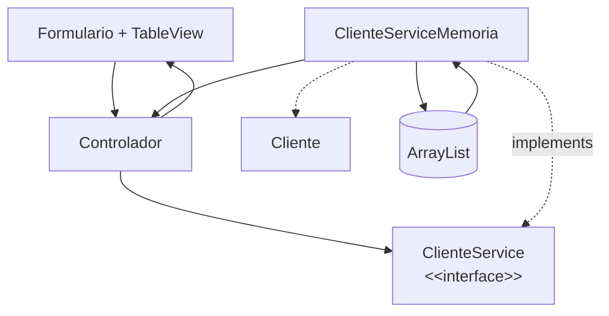

# S8 - CRUD desde GUI en memoria

## 1. Introducción

Tiempo: 20 min.

### 1.1 Propósito

Implementar un CRUD desde JavaFX reutilizando el servicio en memoria construido en U1, sin base de datos todavía.

### 1.2 Resultado de aprendizaje

El estudiante conecta formularios y tablas con un controlador JavaFX, delega operaciones al contrato del servicio CRUD y usa una implementación en memoria basada en `ArrayList`.

### 1.3 Producto de sesión

CRUD funcional desde formularios y `TableView`, usando controlador, servicio, entidades y almacenamiento en memoria.

### 1.4 Motivación de la sesión

Antes de conectar SQLite, conviene comprobar que la interfaz gráfica puede registrar, mostrar, editar y eliminar objetos usando el mismo servicio que antes se probaba desde consola.

Pregunta guía:

```text
¿Cómo pasamos del CRUD de consola al CRUD con formularios y tablas?
```

### 1.5 Ubicación en el curso

- Unidad: U2.
- Avance de sesión: transición de U1 a GUI usando memoria.

## 2. Explica

Tiempo: 25 min.

### 2.1 Conceptos clave

- Flujo Vista-Controlador-Servicio-Entidades-ArrayList.
- Interface de servicio como contrato de operaciones CRUD.
- Implementación en memoria del contrato.
- Lectura de datos desde formularios.
- Delegación de operaciones al servicio CRUD.
- Carga de datos en `TableView`.
- Selección de filas.
- Actualización y eliminación.

### 2.2 Arquitectura de la sesión



## 3. Aplica: actividad práctica guiada

Tiempo: 2h.

1. Crear campos para datos de cliente.
2. Leer datos desde el formulario.
3. Validar campos obligatorios y valores numéricos.
4. Crear objetos o leerlos desde el formulario.
5. Delegar registro, consulta, actualización y eliminación a `ClienteService`.
6. Mantener el `ArrayList` dentro de `ClienteServiceMemoria`.
7. Mostrar datos en `TableView`.
8. Editar el elemento seleccionado.
9. Eliminar con confirmación.

## 4. Crea: actividad autónoma

Tiempo: 2h fuera del aula.

Completa el CRUD en memoria desde GUI para otra entidad o mejora el flujo principal.

Entrega evidencia breve con:

- Capturas de registro, edición y eliminación.
- Código del controlador.
- Código o referencia de `ClienteService` y `ClienteServiceMemoria`.
- Explicación de cómo se actualiza la tabla sin duplicar el CRUD en el controlador.

## 5. Cierre evaluativo

Tiempo: 20 min.

### 5.1 Resultados esperados

- El CRUD funciona desde la interfaz gráfica.
- El controlador delega operaciones al servicio.
- Los datos se almacenan en memoria dentro de la implementación del servicio.
- Las entidades son las mismas clases del dominio usadas desde U1.
- La tabla refleja los cambios.
- El controlador no concentra toda la lógica CRUD.

### 5.2 Preguntas de defensa

1. ¿Dónde se almacenan los datos en esta sesión?
2. ¿Qué responsabilidad tiene el controlador?
3. ¿Qué responsabilidad tiene la interface del servicio?
4. ¿Qué responsabilidad tiene la implementación en memoria?
5. ¿Cómo se refresca la tabla?
6. ¿Qué cambiará cuando usemos DAO?
