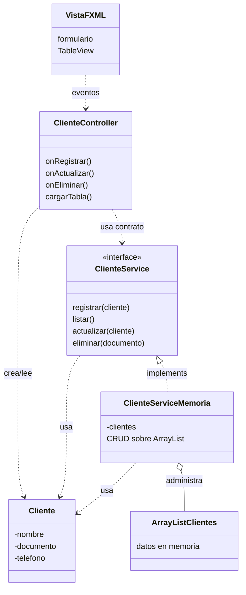

# S8 - CRUD desde GUI en memoria

## 1. Introduccion

Tiempo: 20 min.

### 1.1 Proposito

Implementar un CRUD desde JavaFX reutilizando el contrato de servicio y la implementacion en memoria, sin base de datos todavia.

### 1.2 Resultado de aprendizaje

El estudiante conecta formularios y tablas con un controlador JavaFX, delega operaciones al servicio CRUD y mantiene los datos en memoria con `ArrayList`.

### 1.3 Producto de sesion

CRUD funcional desde formulario y `TableView`, usando vista, controlador, servicio, entidades y almacenamiento en memoria.

### 1.4 Motivacion de la sesion

Antes de conectar SQLite, conviene comprobar que la interfaz grafica puede registrar, mostrar, editar y eliminar objetos usando el mismo contrato que antes se probo desde consola.

Pregunta guia:

```text
Como pasamos del CRUD de consola al CRUD con formularios y tablas?
```

### 1.5 Ubicacion en el curso

- Unidad: U2.
- Avance de sesion: transicion de consola a GUI usando memoria.

## 2. Explica

Tiempo: 25 min.

### 2.1 Conceptos clave

- Flujo Vista-Controlador-Servicio-Entidades-ArrayList.
- Interface de servicio como contrato de operaciones CRUD.
- Implementacion en memoria del contrato.
- Lectura de datos desde formularios.
- Carga de datos en `TableView`.
- Seleccion de filas para editar o eliminar.
- Refresco de tabla despues de cada operacion.

Regla metodologica de la sesion:

```text
La vista captura datos.
El controlador traduce eventos en llamadas al servicio.
El servicio ejecuta CRUD.
La implementacion en memoria administra el ArrayList.
```

### 2.2 Arquitectura de la sesion



## 3. Aplica: actividad practica guiada

Tiempo: 2h.

1. Crear campos para datos de cliente.
2. Crear columnas de `TableView`.
3. Leer datos desde el formulario.
4. Crear objeto `Cliente`.
5. Delegar registro a `ClienteService`.
6. Mantener el `ArrayList` dentro de `ClienteServiceMemoria`.
7. Mostrar datos en `TableView`.
8. Cargar datos del elemento seleccionado al formulario.
9. Actualizar el registro seleccionado.
10. Eliminar con confirmacion.

## 4. Crea: actividad autonoma

Tiempo: 2h fuera del aula.

Completa el CRUD en memoria desde GUI para una entidad del dominio.

Entrega evidencia breve con:

- Capturas de registro, listado, edicion y eliminacion.
- Codigo del controlador.
- Codigo o referencia de `ClienteService` y `ClienteServiceMemoria`.
- Explicacion de como se actualiza la tabla sin duplicar el CRUD en el controlador.

## 5. Cierre evaluativo

Tiempo: 20 min.

### 5.1 Resultados esperados

- El CRUD funciona desde la interfaz grafica.
- El controlador delega operaciones al servicio.
- Los datos se almacenan en memoria dentro de la implementacion del servicio.
- Las entidades son las mismas clases del dominio usadas desde U1.
- La tabla refleja los cambios.

### 5.2 Preguntas de defensa

1. Donde se almacenan los datos en esta sesion?
2. Que responsabilidad tiene el controlador?
3. Que responsabilidad tiene la interface del servicio?
4. Que responsabilidad tiene la implementacion en memoria?
5. Que cambiara cuando usemos DAO?
