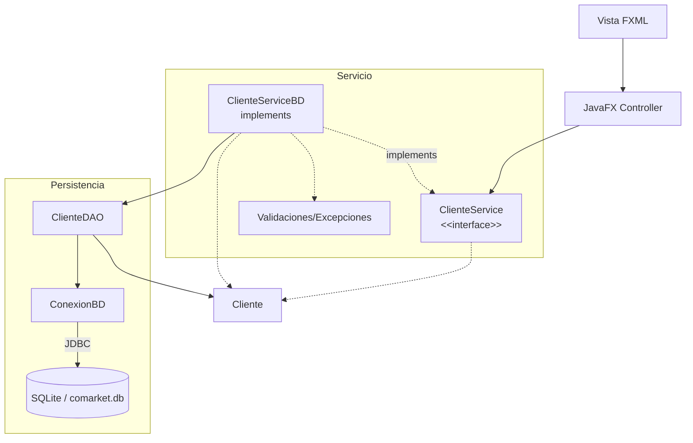

# S9 - Arquitectura por capas y persistencia relacional

## 1. Introduccion

Tiempo: 20 min.

### 1.1 Proposito

Preparar la aplicacion de escritorio para reemplazar almacenamiento en memoria por persistencia relacional con SQLite y JDBC.

### 1.2 Resultado de aprendizaje

El estudiante organiza el proyecto por capas, configura SQLite, comprende JDBC y prepara la estructura para una implementacion persistente del servicio y DAO.

### 1.3 Producto de sesion

Proyecto JavaFX/Maven organizado con vista, controlador, servicio, entidades, persistencia, conexion JDBC y base de datos SQLite.

### 1.4 Motivacion de la sesion

El `ArrayList` se borra al cerrar la aplicacion. Para conservar datos, el producto necesita una base de datos local y una capa de persistencia.

Pregunta guia:

```text
Como hacemos que los datos sobrevivan despues de cerrar la aplicacion?
```

### 1.5 Ubicacion en el curso

- Unidad: U2.
- Avance de sesion: transicion de memoria a persistencia.

## 2. Explica

Tiempo: 25 min.

### 2.1 Conceptos clave

- Arquitectura por capas.
- Vista FXML y controlador JavaFX.
- Servicio como contrato de operaciones.
- Implementacion persistente del servicio.
- Persistencia.
- DAO.
- JDBC como conector.
- SQLite como base de datos local.
- Clase de conexion.

Regla metodologica de la sesion:

```text
El controlador sigue usando el contrato del servicio.
La implementacion persistente coordina reglas y DAO.
El DAO conversa con SQL.
JDBC conecta Java con SQLite.
Las entidades no cambian por usar base de datos.
```

### 2.2 Arquitectura de la sesion



## 3. Aplica: actividad practica guiada

Tiempo: 2h.

1. Revisar dependencias Maven.
2. Agregar SQLite JDBC si hace falta.
3. Crear paquete `persistencia`.
4. Crear archivo `comarket.db`.
5. Crear una tabla inicial.
6. Implementar `ConexionBD`.
7. Probar conexion con una consulta simple.
8. Identificar `ClienteService` como contrato que seguira usando el controlador.
9. Preparar `ClienteServiceBD` como implementacion persistente.
10. Preparar `ClienteDAO` como componente de persistencia.
11. Verificar que `Cliente` no cambia por usar base de datos.

## 4. Crea: actividad autonoma

Tiempo: 2h fuera del aula.

Prepara una tabla adicional o mejora la estructura de persistencia.

Entrega evidencia breve con:

- Estructura de paquetes.
- Script o captura de tabla.
- Prueba de conexion.
- Bosquejo del servicio y su implementacion persistente.
- Explicacion del rol de JDBC.

## 5. Cierre evaluativo

Tiempo: 20 min.

### 5.1 Resultados esperados

- El proyecto mantiene una estructura por capas.
- SQLite esta disponible.
- JDBC conecta con la base de datos.
- El controlador conserva como entrada el contrato del servicio.
- La aplicacion queda preparada para DAO.

### 5.2 Preguntas de defensa

1. Por que `ArrayList` ya no es suficiente?
2. Que funcion cumple JDBC?
3. Donde vive la base de datos?
4. Que capa debe conversar con SQL?
5. Por que no cambiamos las entidades al pasar de memoria a SQLite?
