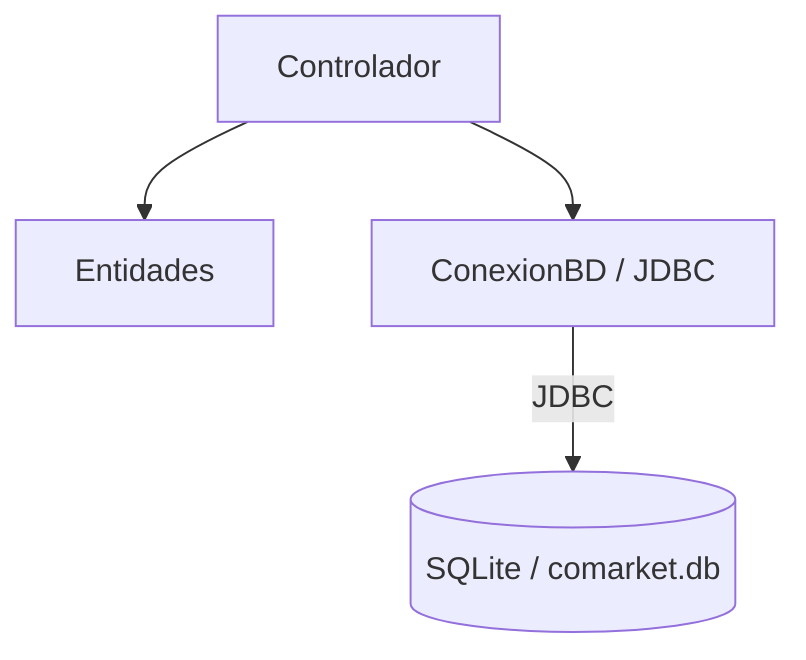

# S9 - Arquitectura por capas y persistencia relacional

## 1. Introducción

Tiempo: 20 min.

### 1.1 Propósito

Preparar CoMarket para reemplazar el almacenamiento en memoria por persistencia relacional con SQLite y JDBC.

### 1.2 Resultado de aprendizaje

El estudiante organiza el proyecto por capas simples, configura SQLite, comprende JDBC y prepara la estructura para implementar DAO.

### 1.3 Producto de sesión

Proyecto JavaFX/Maven organizado con entidades, controladores, paquete de persistencia, conexión JDBC y base de datos SQLite.

### 1.4 Motivación de la sesión

El `ArrayList` se borra al cerrar la aplicación. Para conservar datos, CoMarket necesita una base de datos local.

Pregunta guía:

```text
¿Cómo hacemos que los datos sobrevivan después de cerrar la aplicación?
```

### 1.5 Ubicación en el curso

- Unidad: U2.
- Avance de sesión: transición de memoria a persistencia.

## 2. Explica

Tiempo: 25 min.

### 2.1 Conceptos clave

- Arquitectura por capas.
- Entidades.
- Controladores.
- Persistencia.
- JDBC como conector.
- SQLite como base de datos local.
- Clase de conexión.

### 2.2 Arquitectura de la sesión



## 3. Aplica: actividad práctica guiada

Tiempo: 2h.

1. Revisar dependencias Maven.
2. Agregar SQLite JDBC si hace falta.
3. Crear carpeta o paquete de persistencia.
4. Crear archivo `comarket.db`.
5. Crear una tabla inicial.
6. Implementar una clase de conexión.
7. Probar conexión con una consulta simple.

## 4. Crea: actividad autónoma

Tiempo: 2h fuera del aula.

Prepara una tabla adicional o mejora la estructura de persistencia.

Entrega evidencia breve con:

- Estructura de paquetes.
- Script o captura de tabla.
- Prueba de conexión.
- Explicación del rol de JDBC.

## 5. Cierre evaluativo

Tiempo: 20 min.

### 5.1 Resultados esperados

- El proyecto mantiene una estructura por capas.
- SQLite está disponible.
- JDBC conecta con la base de datos.
- La aplicación está preparada para DAO.

### 5.2 Preguntas de defensa

1. ¿Por qué `ArrayList` ya no es suficiente?
2. ¿Qué función cumple JDBC?
3. ¿Dónde vive la base de datos?
4. ¿Qué capa debe conversar con SQL?

