# S9 - Arquitectura por capas y persistencia relacional

## 1. Introducción

Tiempo: 20 min.

### 1.1 Propósito

Preparar la aplicación de escritorio para reemplazar almacenamiento en memoria por persistencia relacional con SQLite y JDBC.

### 1.2 Resultado de aprendizaje

El estudiante organiza el proyecto por capas, configura SQLite, comprende JDBC y prepara la estructura para una implementación persistente del servicio y DAO.

### 1.3 Producto de sesión

Proyecto JavaFX/Maven organizado con vista, controlador, servicio, entidades, persistencia, conexión JDBC y base de datos SQLite.

### 1.4 Motivación de la sesión

El `ArrayList` se borra al cerrar la aplicación. Para conservar datos, el producto necesita una base de datos local y una capa de persistencia.

Pregunta guía:

```text
Cómo hacemos que los datos sobrevivan después de cerrar la aplicación?
```

### 1.5 Ubicación en el curso

- Unidad: U2.
- Avance de sesión: transicion de memoria a persistencia.

## 2. Explica

Tiempo: 25 min.

### 2.1 Conceptos clave

- Arquitectura por capas.
- Vista FXML y controlador JavaFX.
- Servicio como contrato de operaciones.
- Implementación persistente del servicio.
- Persistencia.
- DAO.
- JDBC cómo conector.
- SQLite cómo base de datos local.
- Clase de conexión.

Regla métodológica de la sesión:

```text
El controlador sigue usando el contrato del servicio.
La implementación persistente coordina reglas y DAO.
El DAO conversa con SQL.
JDBC conecta Java con SQLite.
Las entidades no cambian por usar base de datos.
```

### 2.2 Arquitectura de la sesión

```mermaid
flowchart TB
    Vista["Vista FXML"]
    Controlador["JavaFX Controller"]

    subgraph Servicio["Servicio"]
        Contrato["ClienteService<br/>&lt;&lt;interface&gt;&gt;"]
        Implementación["ClienteServiceBD<br/>implements"]
        Validaciones["Validaciones/Excepciones"]
    end

    Entidades["Cliente"]

    subgraph Persistencia["Persistencia"]
        DAO["ClienteDAO"]
        Conexion["ConexionBD"]
        SQLite[("SQLite / comarket.db")]
    end

    Vista --> Controlador
    Controlador --> Contrato
    Implementación -. implements .-> Contrato
    Contrato -.-> Entidades
    Implementación -.-> Entidades
    Implementación --> DAO
    Implementación -.-> Validaciones
    DAO --> Entidades
    DAO --> Conexion
    Conexion -->|"JDBC"| SQLite
```



## 3. Aplica: actividad práctica guiada

Tiempo: 2h.

1. Revisar dependencias Maven.
2. Agregar SQLite JDBC si hace falta.
3. Crear paquete `persistencia`.
4. Crear archivo `comarket.db`.
5. Crear una tabla inicial.
6. Implementar `ConexionBD`.
7. Probar conexión con una consulta simple.
8. Identificar `ClienteService` como contrato qué seguira usando el controlador.
9. Preparar `ClienteServiceBD` cómo implementación persistente.
10. Preparar `ClienteDAO` cómo componente de persistencia.
11. Verificar qué `Cliente` no cambia por usar base de datos.

## 4. Crea: actividad autónoma

Fuera del aula, cada estudiante consolida el aprendizaje preparando la estructura de persistencia y una evidencia individual.

Tiempo: 2h fuera del aula.

### 4.1 Plantilla de evidencia individual

Entrega un PDF con el siguiente nombre:

```text
S09_Equipo##_ApellidoNombre.pdf
```

Ejemplo:

```text
S09_Equipo03_QuispeAna.pdf
```

El PDF debe usar esta estructura. La primera sección define el trabajo autónomo; completa las demás con tus evidencias.

#### 4.1.1 Datos del estudiante

- Nombre:
- Equipo:
- Sesión: S09 - Arquitectura por capas y persistencia relacional
- Rol o aporte realizado:
- Link de GitHub:

#### 4.1.2 Trabajo autónomo realizado

Completa y evidencia estas tareas:

1. Preparar una tabla adicional o mejorar la estructura de persistencia.
2. Crear o verificar el archivo `comarket.db`.
3. Implementar o ajustar la clase `ConexionBD`.
4. Probar una conexión simple con SQLite.
5. Preparar el paquete de persistencia.
6. Explicar qué parte corresponde a servicio, entidades y persistencia.
7. Explicar por qué las entidades no deben cambiar al pasar de memoria a SQLite.

#### 4.1.3 Evidencia técnica

Incluye capturas o salidas con una breve explicación debajo de cada una:

- Estructura de paquetes.
- Script o captura de tabla.
- Prueba de conexión.
- Bosquejo del servicio y su implementación persistente.
- Explicación del rol de JDBC.
- Evidencia del archivo SQLite o tabla creada.

#### 4.1.4 Error o hallazgo

Describe al menos un error, diferencia o hallazgo técnico:

- Qué ocurrió.
- Cómo lo diagnosticaste.
- Cómo lo corregiste o qué aprendiste.

Ejemplos válidos:

- La ruta de la base de datos no era correcta.
- Faltaba el driver JDBC.
- La tabla no coincidía con la entidad.
- Se intentó poner SQL en el controlador.

#### 4.1.5 Reflexión técnica breve

Responde en 5 a 8 líneas:

```text
Por qué una aplicación necesita una capa de persistencia cuando deja de usar ArrayList?
```

### 4.2 Criterios mínimos de aceptación

La evidencia individual se considera completa si:

- El archivo respeta el nombre `S09_Equipo##_ApellidoNombre.pdf`.
- Incluye evidencias técnicas legibles.
- Muestra estructura por capas.
- Muestra SQLite disponible.
- Muestra prueba de conexión con JDBC.
- Explica el rol de persistencia y DAO.
- No contiene solo pantallazos: cada evidencia tiene una descripción breve.

## 5. Cierre evaluativo

Tiempo: 20 min.

Esta sección conecta el resultado de aprendizaje de la sesión con el producto que debe evidenciar cada estudiante.

### 5.1 Resultados esperados

Al finalizar la sesión, el estudiante debe demostrar que:

- El proyecto mantiene una estructura por capas.
- SQLite está disponible.
- JDBC conecta con la base de datos.
- El controlador conserva como entrada el contrato del servicio.
- La aplicación queda preparada para DAO.

### 5.2 Evidencia del producto de sesión

Cada estudiante entrega un PDF individual siguiendo la plantilla de la sección 4.1.

Nombre del archivo:

```text
S09_Equipo##_ApellidoNombre.pdf
```

La evidencia debe demostrar:

- Producto de sesión construido.
- Aporte individual verificable.
- Estructura de persistencia preparada.
- Reflexión técnica breve.

La revisión se realiza con los criterios mínimos de aceptación de la sección 4.2 y la rúbrica de la sección 5.4.

### 5.3 Preguntas de defensa y reflexión

1. Por qué `ArrayList` ya no es suficiente?
2. Qué función cumple JDBC?
3. Dónde vive la base de datos?
4. Qué capa debe conversar con SQL?
5. Por qué no cambiamos las entidades al pasar de memoria a SQLite?
6. Qué evidencia demuestra que la conexión funciona?

### 5.4 Rúbrica de evaluación

| Dimensión | Peso | 3 - Logro destacado | 2 - Logro | 1 - Proceso | 0 - Inicio | Puntuación obtenida |
|---|---:|---|---|---|---|---:|
| 1. Arquitectura por capas | 2 | Paquetes y responsabilidades claros. | Estructura suficiente. | Estructura parcial. | No evidencia capas. | |
| 2. SQLite | 2 | Base de datos y tabla disponibles y evidenciadas. | SQLite disponible. | Configuración incompleta. | No evidencia base de datos. | |
| 3. JDBC y conexión | 2 | Conexión probada y explicada. | Conexión funcional. | Conexión parcial. | No conecta. | |
| 4. Preparación para DAO | 2 | Servicio, entidad y persistencia quedan listos para DAO. | Preparación suficiente. | Preparación confusa. | No prepara DAO. | |
| 5. Error o hallazgo | 1 | Analiza error/hallazgo, causa, solución y aprendizaje técnico. | Explica un problema y una solución. | Menciona un problema sin análisis. | No presenta error ni hallazgo. | |
| 6. Reflexión y orden | 1 | PDF ordenado, evidencias legibles y reflexión precisa. | Evidencias suficientes y reflexión clara. | Evidencias incompletas o reflexión superficial. | PDF desordenado o sin reflexión. | |

Puntuación acumulada = suma de (`Peso` * `Puntuación obtenida`) = ____.

Nota final = (`Puntuación acumulada` / 30) * 20 = ____.

Para usar la rúbrica con IA, solicita:

```text
Evalúa el PDF usando la rúbrica de la sesión.
Para cada dimensión selecciona la puntuación obtenida usando la escala Inicio=0, Proceso=1, Logro=2, Logro destacado=3.
Justifica brevemente cada puntuación.
Calcula la puntuación acumulada con la fórmula: suma de (Peso * Puntuación obtenida).
Calcula la nota final sobre 20 con la fórmula: (Puntuación acumulada / 30) * 20.
Indica 2 fortalezas y 2 recomendaciones.
```

