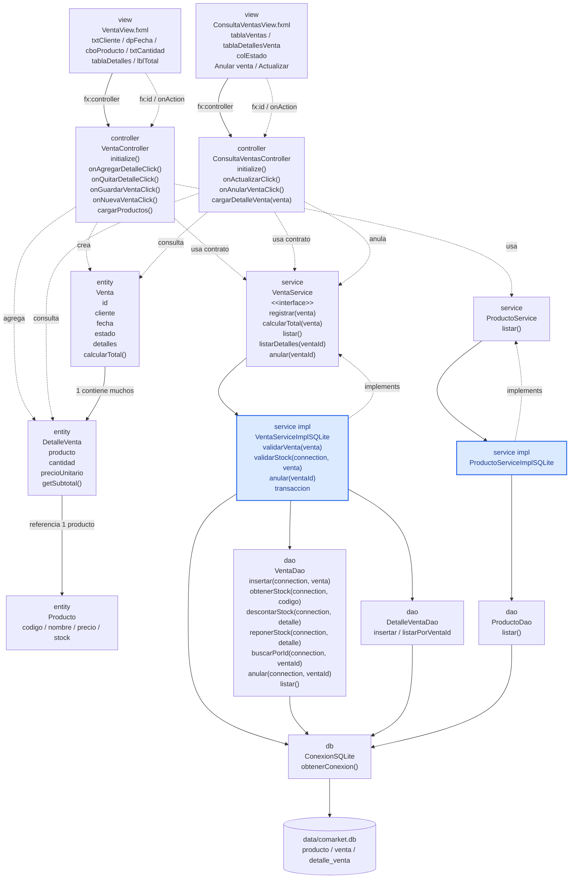

# S9 - Operaciones persistentes con relación muchos a muchos

## 1. Introducción

Tiempo: 20 min.

### 1.1 Propósito

Implementar operaciones persistentes de venta con cabecera y detalle, usando una clase de detalle con atributos propios, productos existentes y anulación de ventas con reposición de stock.

### 1.2 Resultado de aprendizaje

El estudiante modela una operación con cabecera y detalle, persiste datos relacionados mediante DAO y mantiene la separación entre controlador, servicio, entidades y persistencia.

### 1.3 Producto de sesión

Registro persistente de una operación con detalles: cabecera, lista de detalles, entidad relacionada, cálculo de subtotal y total, consulta de ventas registradas y anulación con reposición de stock.

### 1.4 Motivación de la sesión

Después de persistir una tabla simple, el siguiente reto es registrar una operación real donde una cabecera contiene varios detalles y cada detalle referencia una entidad existente.

Pregunta guía:

```text
Cómo guardamos una operación con varios detalles sin perder la separación por capas?
```

### 1.5 Ubicación en el curso

- Unidad: U2.
- Carpeta de trabajo: `comarket-desk`.
- Avance de sesión: persistencia de una relación avanzada muchos a muchos desde objetos.

## 2. Explica

Tiempo: 25 min.

### 2.1 Conceptos clave

- Relación cabecera-detalle desde el modelo de objetos.
- Cabecera y detalle.
- Clase intermedia con atributos propios.
- Composición entre cabecera y detalle.
- Asociación entre detalle y entidad relacionada.
- DAO para cabecera y DAO para detalle.
- Transacción para guardar cabecera, detalles y descuento de stock.
- Anulación lógica de venta mediante estado.
- Reposición de stock al anular.
- Validaciones del flujo.

Regla metodológica de la sesión:

```text
La relación se entiende primero como cabecera-detalle entre objetos.
La base de datos persiste esa relación mediante tablas `venta` y `detalle_venta`.
El detalle no es una pantalla CRUD independiente.
El detalle nace dentro del flujo de la cabecera.
La anulación no elimina la venta ni sus detalles; cambia el estado de la venta y repone el stock.
Los DAO se ubican en `dao` y reutilizan `db/ConexionSQLite` para conectarse a SQLite.
```

### 2.2 Arquitectura de la sesión



Nombres reales del proyecto guía:

```text
com.upeu.comarket.controller.VentaController
com.upeu.comarket.controller.ConsultaVentasController
com.upeu.comarket.entity.Venta
com.upeu.comarket.entity.DetalleVenta
com.upeu.comarket.entity.Producto
com.upeu.comarket.service.VentaService
com.upeu.comarket.service.VentaServiceImplSQLite
com.upeu.comarket.service.ProductoServiceImplSQLite
com.upeu.comarket.dao.VentaDao
com.upeu.comarket.dao.DetalleVentaDao
com.upeu.comarket.dao.ProductoDao
com.upeu.comarket.db.ConexionSQLite
src/main/resources/com/upeu/comarket/view/VentaView.fxml
src/main/resources/com/upeu/comarket/view/ConsultaVentasView.fxml
```

## 3. Aplica: actividad práctica guiada

Tiempo: 2h.

1. Crear o revisar entidades `Venta`, `DetalleVenta` y `Producto`.
2. Diseñar o revisar `VentaView.fxml`.
3. Cargar productos existentes desde la base de datos.
4. Seleccionar producto y cantidad.
5. Crear `DetalleVenta`.
6. Agregar detalles a la venta.
7. Calcular subtotal y total.
8. Crear `VentaDao`.
9. Crear `DetalleVentaDao`.
10. Reutilizar `ConexionSQLite` desde `db`.
11. Crear `VentaServiceImplSQLite`.
12. Guardar primero la cabecera y luego los detalles dentro de una transacción.
13. Descontar stock desde el flujo de venta.
14. Mostrar ventas registradas en `ConsultaVentasView.fxml`.
15. Cargar detalles de la venta seleccionada.
16. Anular una venta desde `ConsultaVentasController`.
17. Cambiar `estado` a `ANULADA` y reponer stock dentro de una transacción.
18. Validar cantidad, stock, venta sin detalles, venta ya anulada y errores de persistencia.

Tablas de referencia:

```sql
CREATE TABLE venta (
    id INTEGER PRIMARY KEY AUTOINCREMENT,
    cliente TEXT NOT NULL,
    fecha TEXT NOT NULL,
    total REAL NOT NULL,
    estado TEXT NOT NULL DEFAULT 'ACTIVA'
);

CREATE TABLE detalle_venta (
    id INTEGER PRIMARY KEY AUTOINCREMENT,
    venta_id INTEGER NOT NULL,
    producto_codigo TEXT NOT NULL,
    cantidad INTEGER NOT NULL,
    precio_unitario REAL NOT NULL,
    subtotal REAL NOT NULL,
    FOREIGN KEY (venta_id) REFERENCES venta(id),
    FOREIGN KEY (producto_codigo) REFERENCES producto(codigo)
);
```

Flujo de anulación:

```text
ConsultaVentasView.fxml
-> ConsultaVentasController.onAnularVentaClick()
-> VentaService.anular(ventaId)
-> VentaServiceImplSQLite.anular(ventaId)
-> VentaDao.buscarPorId(connection, ventaId)
-> DetalleVentaDao.listarPorVentaId(connection, ventaId)
-> VentaDao.reponerStock(connection, detalle)
-> VentaDao.anular(connection, ventaId)
-> venta.estado = 'ANULADA'
```

## 4. Crea: actividad autónoma

Fuera del aula, cada estudiante consolida el registro persistente con detalle y prepara una evidencia individual.

Tiempo: 2h fuera del aula.

### 4.1 Plantilla de evidencia individual

Entrega un PDF con el siguiente nombre:

```text
S09_Equipo##_ApellidoNombre.pdf
```

#### 4.1.1 Datos del estudiante

- Nombre:
- Equipo:
- Sesión: S09 - Operaciones persistentes con relación muchos a muchos
- Rol o aporte realizado:
- Link de GitHub:

#### 4.1.2 Trabajo autónomo realizado

1. Completar registro de cabecera y detalle.
2. Evidenciar `Venta`, `DetalleVenta` y `Producto`.
3. Evidenciar DAO de cabecera y DAO de detalle.
4. Mostrar cálculo de total.
5. Verificar registros en SQLite.
6. Implementar o evidenciar consulta de ventas registradas.
7. Anular una venta y verificar que el stock se repone.
8. Documentar validaciones aplicadas.

#### 4.1.3 Evidencia técnica

- Captura de la pantalla de registro.
- Captura de `ConsultaVentasView.fxml` con ventas registradas.
- Código o fragmento de `VentaServiceImplSQLite`.
- Código o fragmento de `VentaDao` y `DetalleVentaDao`.
- Captura de tablas persistidas.
- Evidencia de anulación de venta y reposición de stock.
- Evidencia de validación de cantidad, stock, venta sin detalles o venta ya anulada.

#### 4.1.4 Error o hallazgo

Describe un problema encontrado al guardar cabecera y detalle.

#### 4.1.5 Reflexión técnica breve

Responde en 5 a 8 líneas:

```text
Por qué DetalleVenta no debe manejarse como un CRUD independiente?
```

### 4.2 Criterios mínimos de aceptación

- PDF con nombre correcto.
- Registro de cabecera y detalles.
- Consulta de ventas registradas.
- Anulación de venta sin eliminar la cabecera ni el detalle.
- Reposición de stock al anular.
- Cálculo de subtotal y total.
- Persistencia en tablas relacionadas.
- Validaciones del flujo.
- Evidencia de separación por capas.

## 5. Cierre evaluativo

Tiempo: 20 min.

### 5.1 Resultados esperados

- El estudiante explica la relación cabecera-detalle.
- El detalle referencia una entidad existente.
- El servicio coordina el guardado.
- El DAO persiste cabecera y detalle.
- La consulta permite revisar ventas y detalles.
- La anulación cambia el estado y repone stock.
- La GUI muestra detalles y total.
- Hay validaciones al cierre de la sesión.

### 5.2 Evidencia del producto de sesión

Cada estudiante entrega un PDF individual siguiendo la plantilla de la sección 4.1.

### 5.3 Preguntas de defensa y reflexión

1. Qué representa la cabecera?
2. Qué representa el detalle?
3. Por qué el detalle tiene atributos propios?
4. Qué DAO guarda la cabecera?
5. Qué DAO guarda los detalles?
6. Qué validación evita vender una cantidad inválida?
7. Qué ocurre con el stock al registrar una venta?
8. Por qué anular no debe eliminar físicamente la venta?
9. Qué método repone el stock al anular?

### 5.4 Rúbrica de evaluación

| Dimensión | Peso | 3 - Logro destacado | 2 - Logro | 1 - Proceso | 0 - Inicio | Puntuación obtenida |
|---|---:|---|---|---|---|---:|
| 1. Modelo cabecera-detalle | 2 | Modelo claro y coherente. | Modelo funcional. | Modelo parcial. | No evidencia modelo. | |
| 2. Persistencia relacionada | 2 | Guarda cabecera y detalles, permite consulta y anula reponiendo stock. | Persistencia principal funcional. | Persistencia parcial. | No persiste relación. | |
| 3. Servicio y DAO | 2 | Servicio coordina y DAO separa SQL. | Separación funcional. | Mezcla responsabilidades. | No separa. | |
| 4. Validaciones | 2 | Valida cantidad, stock, venta sin detalles y venta ya anulada. | Validaciones básicas. | Validaciones parciales. | No valida. | |
| 5. Error o hallazgo | 1 | Analiza causa y solución. | Explica un problema. | Menciona un problema. | No presenta. | |
| 6. Orden y reflexión | 1 | Evidencia clara y reflexión precisa. | Evidencia suficiente. | Evidencia incompleta. | No sustenta. | |
