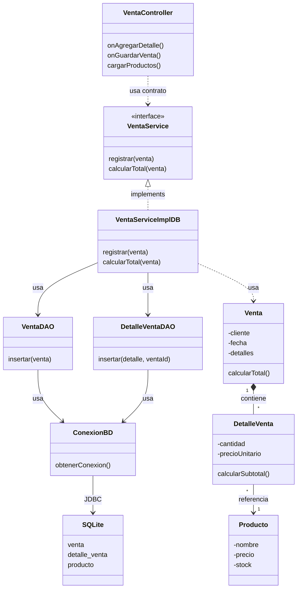

# S9 - Operaciones persistentes con relación muchos a muchos

## 1. Introducción

Tiempo: 20 min.

### 1.1 Propósito

Implementar operaciones persistentes sobre un modelo con relación muchos a muchos usando una clase de detalle con atributos propios.

### 1.2 Resultado de aprendizaje

El estudiante modela una operación con cabecera y detalle, persiste datos relacionados mediante DAO y mantiene la separación entre controlador, servicio, entidades y persistencia.

### 1.3 Producto de sesión

Registro persistente de una operación con detalles: cabecera, lista de detalles, entidad relacionada, cálculo de subtotal y total.

### 1.4 Motivación de la sesión

Después de persistir una tabla simple, el siguiente reto es registrar una operación real donde una cabecera contiene varios detalles y cada detalle referencia una entidad existente.

Pregunta guía:

```text
Cómo guardamos una operación con varios detalles sin perder la separación por capas?
```

### 1.5 Ubicación en el curso

- Unidad: U2.
- Carpeta de trabajo: `comarket-desk`.
- Avance de sesión: persistencia de una relación avanzada muchos a muchos desde objetos.

## 2. Explica

Tiempo: 25 min.

### 2.1 Conceptos clave

- Relación muchos a muchos desde el modelo de objetos.
- Cabecera y detalle.
- Clase intermedia con atributos propios.
- Composición entre cabecera y detalle.
- Asociación entre detalle y entidad relacionada.
- DAO para cabecera y DAO para detalle.
- Transacción o secuencia controlada de guardado.
- Validaciones del flujo.

Regla metodológica de la sesión:

```text
La relación se entiende primero como relación entre objetos.
La base de datos persiste esa relación mediante tablas.
El detalle no es una pantalla CRUD independiente.
El detalle nace dentro del flujo de la cabecera.
Los DAO se ubican en `dao` y reutilizan `util/ConexionBD` para conectarse a SQLite.
```

### 2.2 Arquitectura de la sesión



## 3. Aplica: actividad práctica guiada

Tiempo: 2h.

1. Crear o revisar entidades `Venta`, `DetalleVenta` y `Producto`.
2. Diseñar vista de registro de venta.
3. Cargar productos existentes desde la base de datos.
4. Seleccionar producto y cantidad.
5. Crear `DetalleVenta`.
6. Agregar detalles a la venta.
7. Calcular subtotal y total.
8. Crear `VentaDAO`.
9. Crear `DetalleVentaDAO`.
10. Reutilizar `ConexionBD` desde `util`.
11. Crear `VentaServiceImplDB`.
12. Guardar primero la cabecera y luego los detalles.
13. Validar cantidad, stock, venta sin detalles y errores de persistencia.

Tablas de referencia:

```sql
CREATE TABLE venta (
    id INTEGER PRIMARY KEY AUTOINCREMENT,
    cliente TEXT NOT NULL,
    fecha TEXT NOT NULL,
    total REAL NOT NULL
);

CREATE TABLE detalle_venta (
    id INTEGER PRIMARY KEY AUTOINCREMENT,
    venta_id INTEGER NOT NULL,
    producto_id INTEGER NOT NULL,
    cantidad INTEGER NOT NULL,
    precio_unitario REAL NOT NULL,
    subtotal REAL NOT NULL,
    FOREIGN KEY (venta_id) REFERENCES venta(id),
    FOREIGN KEY (producto_id) REFERENCES producto(id)
);
```

## 4. Crea: actividad autónoma

Fuera del aula, cada estudiante consolida el registro persistente con detalle y prepara una evidencia individual.

Tiempo: 2h fuera del aula.

### 4.1 Plantilla de evidencia individual

Entrega un PDF con el siguiente nombre:

```text
S09_Equipo##_ApellidoNombre.pdf
```

#### 4.1.1 Datos del estudiante

- Nombre:
- Equipo:
- Sesión: S09 - Operaciones persistentes con relación muchos a muchos
- Rol o aporte realizado:
- Link de GitHub:

#### 4.1.2 Trabajo autónomo realizado

1. Completar registro de cabecera y detalle.
2. Evidenciar `Venta`, `DetalleVenta` y `Producto`.
3. Evidenciar DAO de cabecera y DAO de detalle.
4. Mostrar cálculo de total.
5. Verificar registros en SQLite.
6. Documentar validaciones aplicadas.

#### 4.1.3 Evidencia técnica

- Captura de la pantalla de registro.
- Código o fragmento de `VentaServiceImplDB`.
- Código o fragmento de `VentaDAO` y `DetalleVentaDAO`.
- Captura de tablas persistidas.
- Evidencia de validación de cantidad, stock o venta sin detalles.

#### 4.1.4 Error o hallazgo

Describe un problema encontrado al guardar cabecera y detalle.

#### 4.1.5 Reflexión técnica breve

Responde en 5 a 8 líneas:

```text
Por qué DetalleVenta no debe manejarse como un CRUD independiente?
```

### 4.2 Criterios mínimos de aceptación

- PDF con nombre correcto.
- Registro de cabecera y detalles.
- Cálculo de subtotal y total.
- Persistencia en tablas relacionadas.
- Validaciones del flujo.
- Evidencia de separación por capas.

## 5. Cierre evaluativo

Tiempo: 20 min.

### 5.1 Resultados esperados

- El estudiante explica la relación cabecera-detalle.
- El detalle referencia una entidad existente.
- El servicio coordina el guardado.
- El DAO persiste cabecera y detalle.
- La GUI muestra detalles y total.
- Hay validaciones al cierre de la sesión.

### 5.2 Evidencia del producto de sesión

Cada estudiante entrega un PDF individual siguiendo la plantilla de la sección 4.1.

### 5.3 Preguntas de defensa y reflexión

1. Qué representa la cabecera?
2. Qué representa el detalle?
3. Por qué el detalle tiene atributos propios?
4. Qué DAO guarda la cabecera?
5. Qué DAO guarda los detalles?
6. Qué validación evita vender una cantidad inválida?

### 5.4 Rúbrica de evaluación

| Dimensión | Peso | 3 - Logro destacado | 2 - Logro | 1 - Proceso | 0 - Inicio | Puntuación obtenida |
|---|---:|---|---|---|---|---:|
| 1. Modelo cabecera-detalle | 2 | Modelo claro y coherente. | Modelo funcional. | Modelo parcial. | No evidencia modelo. | |
| 2. Persistencia relacionada | 2 | Guarda cabecera y detalles correctamente. | Persistencia principal funcional. | Persistencia parcial. | No persiste relación. | |
| 3. Servicio y DAO | 2 | Servicio coordina y DAO separa SQL. | Separación funcional. | Mezcla responsabilidades. | No separa. | |
| 4. Validaciones | 2 | Valida cantidad, stock y venta sin detalles. | Validaciones básicas. | Validaciones parciales. | No valida. | |
| 5. Error o hallazgo | 1 | Analiza causa y solución. | Explica un problema. | Menciona un problema. | No presenta. | |
| 6. Orden y reflexión | 1 | Evidencia clara y reflexión precisa. | Evidencia suficiente. | Evidencia incompleta. | No sustenta. | |
