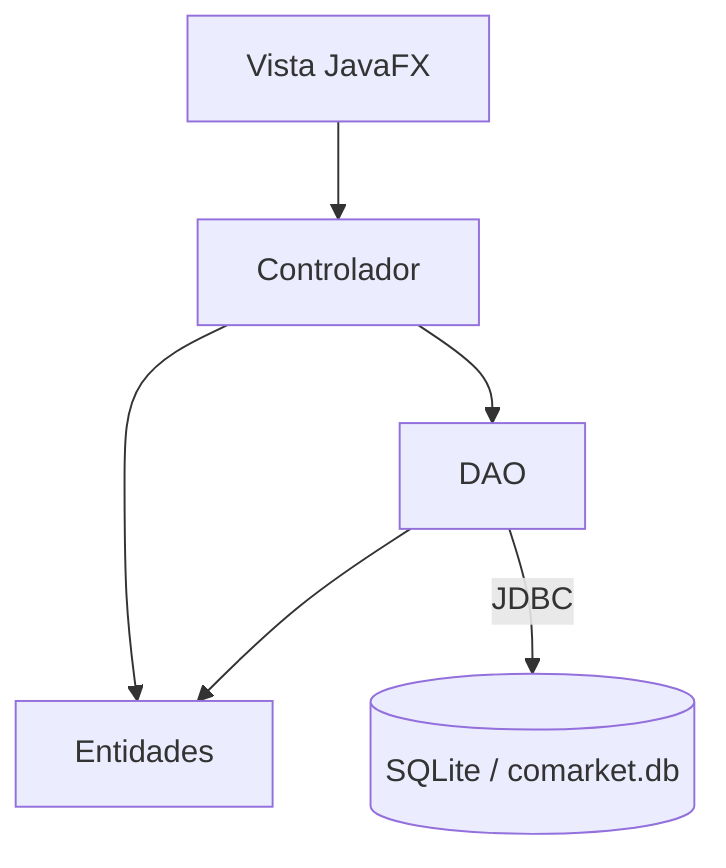

# S10 - Patrón DAO y operaciones CRUD persistentes desde GUI

## 1. Introducción

Tiempo: 20 min.

### 1.1 Propósito

Implementar el patrón DAO para ejecutar CRUD persistente desde la interfaz gráfica.

### 1.2 Resultado de aprendizaje

El estudiante separa el acceso a datos en DAO, mapea entidades a registros, ejecuta consultas SQL y conecta el flujo GUI-Controlador-Entidades-DAO.

### 1.3 Producto de sesión

CRUD persistente funcional desde formularios y tablas JavaFX.

### 1.4 Motivación de la sesión

La GUI ya funciona con memoria y la base de datos ya existe. Ahora toca unir ambos mundos sin poner SQL directamente en el controlador.

Pregunta guía:

```text
¿Cómo guardamos y recuperamos datos desde la GUI sin mezclar SQL con la pantalla?
```

### 1.5 Ubicación en el curso

- Unidad: U2.
- Avance de sesión: integración de GUI con persistencia.

## 2. Explica

Tiempo: 25 min.

### 2.1 Conceptos clave

- Patrón DAO.
- Mapeo objeto-relacional básico.
- `insert`, `select`, `update`, `delete`.
- Confirmación de eliminación.
- Excepciones de persistencia.
- Refresco de `TableView` desde base de datos.

### 2.2 Arquitectura de la sesión



## 3. Aplica: actividad práctica guiada

Tiempo: 2h.

1. Crear una interfaz DAO o clase DAO.
2. Implementar `registrar`.
3. Implementar `listar`.
4. Implementar `actualizar`.
5. Implementar `eliminar`.
6. Cargar la tabla desde la base de datos.
7. Conectar botones de la GUI con el DAO.
8. Confirmar eliminación y manejar errores básicos.

## 4. Crea: actividad autónoma

Tiempo: 2h fuera del aula.

Completa el CRUD persistente para una entidad adicional o mejora el módulo principal.

Entrega evidencia breve con:

- Código DAO.
- Capturas de GUI.
- Registros persistidos en SQLite.
- Explicación del flujo Vista-Controlador-Entidades-DAO.

## 5. Cierre evaluativo

Tiempo: 20 min.

### 5.1 Resultados esperados

- El DAO concentra las consultas SQL.
- El controlador no contiene SQL directo.
- La GUI registra, lista, actualiza y elimina datos persistentes.
- La tabla se recarga desde SQLite.

### 5.2 Preguntas de defensa

1. ¿Qué responsabilidad tiene el DAO?
2. ¿Por qué no poner SQL en el controlador?
3. ¿Cómo conviertes un registro en objeto?
4. ¿Cómo verificas que el dato quedó guardado?

