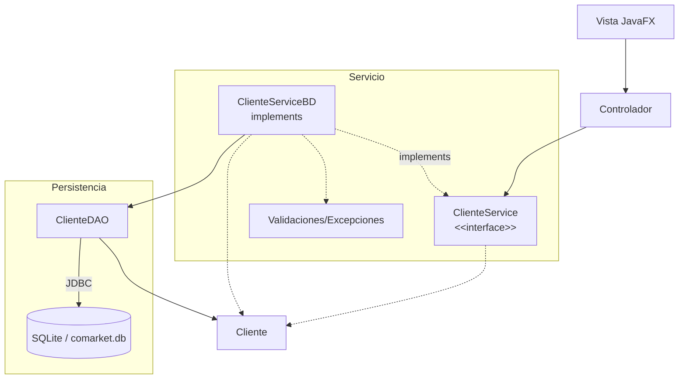

# S10 - Patron DAO y operaciones CRUD persistentes desde GUI

## 1. Introducción

Tiempo: 20 min.

### 1.1 Propósito

Implementar el patron DAO para ejecutar operaciones CRUD persistentes desde la interfaz gráfica.

### 1.2 Resultado de aprendizaje

El estudiante separa el acceso a datos en DAO, mapea entidades a registros, ejecuta SQL básico y agrega una implementacion persistente del mismo contrato de servicio.

### 1.3 Producto de sesión

CRUD persistente funcional desde formularios y tablas JavaFX.

### 1.4 Motivación de la sesión

La GUI ya funcióna con memoria y la base de datos ya existe. Ahora corresponde guardar y recuperar datos desde SQLite sin poner SQL en el controlador.

Pregunta guía:

```text
Cómo guardamos y recuperamos datos desde la GUI sin mezclar SQL con la pantalla?
```

### 1.5 Ubicación en el curso

- Unidad: U2.
- Avance de sesión: integración de GUI con persistencia.

## 2. Explica

Tiempo: 25 min.

### 2.1 Conceptos clave

- Patron DAO.
- Servicio cómo coordinador entre controlador y DAO.
- Implementacion persistente del contrato CRUD.
- Mapeo objeto-relacional básico.
- `insert`, `select`, `update`, `delete`.
- Confirmación de eliminación.
- Excepciones de persistencia.
- Refresco de `TableView` desde base de datos.

Regla métodológica de la sesión:

```text
El controlador no escribe SQL.
El servicio valida y coordina.
El DAO ejecuta SQL.
JDBC conecta con SQLite.
La entidad sigue siendo una clase del dominio.
```

### 2.2 Arquitectura de la sesión



## 3. Aplica: actividad practica guíada

Tiempo: 2h.

1. Crear `ClienteDAO`.
2. Implementar `registrar` con `insert`.
3. Implementar `listar` con `select`.
4. Implementar `actualizar` con `update`.
5. Implementar `eliminar` con `delete`.
6. Mapear cada fila de la base de datos a un objeto `Cliente`.
7. Crear o adaptar `ClienteServiceBD`.
8. Hacer qué `ClienteServiceBD` use `ClienteDAO`.
9. Conectar botones de la GUI con `ClienteService`, no directamente con SQL.
10. Recargar la tabla desde la base de datos después de cada operación.
11. Confirmar eliminación y manejar errores básicos.

## 4. Crea: actividad autónoma

Tiempo: 2h fuera del aula.

Completa el CRUD persistente para una entidad adicional o mejora el módulo principal.

Entrega evidencia breve con:

- Código de `ClienteService`, `ClienteServiceBD` y `ClienteDAO`.
- Capturas de GUI.
- Registros persistidos en SQLite.
- Explicacion del flujo Vista-Controlador-Servicio-Entidades-DAO.

## 5. Cierre evaluativo

Tiempo: 20 min.

### 5.1 Resultados esperados

- El DAO concentra las consultas SQL.
- El controlador no contiene SQL directo.
- El servicio coordina operaciones, validaciones y DAO.
- Las entidades se mantienen cómo clases del dominio.
- La GUI registra, lista, actualiza y elimina datos persistentes.

### 5.2 Preguntas de defensa

1. Qué responsabilidad tiene el DAO?
2. Qué responsabilidad tiene la interface del servicio?
3. Qué responsabilidad tiene la implementacion persistente?
4. Por qué no poner SQL en el controlador?
5. Cómo conviertes un registro en objeto?
6. Cómo verificas qué el dato quedo guardado?
