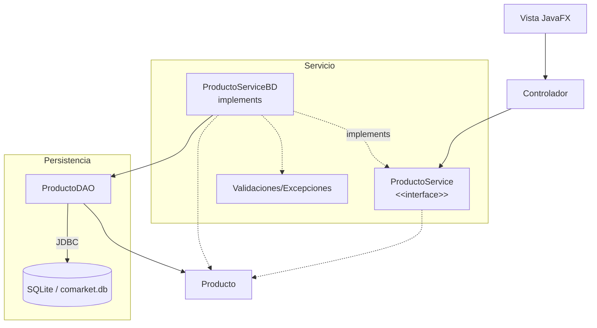

# S10 - Patron DAO y operaciones CRUD persistentes desde GUI

## 1. Introducción

Tiempo: 20 min.

### 1.1 Propósito

Implementar el patron DAO para ejecutar operaciones CRUD persistentes desde la interfaz gráfica.

### 1.2 Resultado de aprendizaje

El estudiante separa el acceso a datos en DAO, mapea entidades a registros, ejecuta SQL básico y agrega una implementación persistente del mismo contrato de servicio.

### 1.3 Producto de sesión

CRUD persistente funcional desde formularios y tablas JavaFX.

### 1.4 Motivación de la sesión

La GUI ya funciona con memoria y la base de datos ya existe. Ahora corresponde guardar y recuperar datos desde SQLite sin poner SQL en el controlador.

Pregunta guía:

```text
Cómo guardamos y recuperamos datos desde la GUI sin mezclar SQL con la pantalla?
```

### 1.5 Ubicación en el curso

- Unidad: U2.
- Avance de sesión: integración de GUI con persistencia.

## 2. Explica

Tiempo: 25 min.

### 2.1 Conceptos clave

- Patron DAO.
- Servicio cómo coordinador entre controlador y DAO.
- Implementación persistente del contrato CRUD.
- Mapeo objeto-relacional básico.
- `insert`, `select`, `update`, `delete`.
- Confirmación de eliminación.
- Excepciones de persistencia.
- Refresco de `TableView` desde base de datos.

Regla métodológica de la sesión:

```text
El controlador no escribe SQL.
El servicio valida y coordina.
El DAO ejecuta SQL.
JDBC conecta con SQLite.
La entidad sigue siendo una clase del dominio.
```

### 2.2 Arquitectura de la sesión



## 3. Aplica: actividad práctica guiada

Tiempo: 2h.

1. Crear `ProductoDAO`.
2. Implementar `registrar` con `insert`.
3. Implementar `listar` con `select`.
4. Implementar `actualizar` con `update`.
5. Implementar `eliminar` con `delete`.
6. Mapear cada fila de la base de datos a un objeto `Producto`.
7. Crear o adaptar `ProductoServiceBD`.
8. Hacer qué `ProductoServiceBD` use `ProductoDAO`.
9. Conectar botones de la GUI con `ProductoService`, no directamente con SQL.
10. Recargar la tabla desde la base de datos después de cada operación.
11. Confirmar eliminación y manejar errores básicos.

## 4. Crea: actividad autónoma

Fuera del aula, cada estudiante consolida el aprendizaje completando un CRUD persistente y preparando una evidencia individual.

Tiempo: 2h fuera del aula.

### 4.1 Plantilla de evidencia individual

Entrega un PDF con el siguiente nombre:

```text
S10_Equipo##_ApellidoNombre.pdf
```

Ejemplo:

```text
S10_Equipo03_QuispeAna.pdf
```

El PDF debe usar esta estructura. La primera sección define el trabajo autónomo; completa las demás con tus evidencias.

#### 4.1.1 Datos del estudiante

- Nombre:
- Equipo:
- Sesión: S10 - Patrón DAO y operaciones CRUD persistentes desde GUI
- Rol o aporte realizado:
- Link de GitHub:

#### 4.1.2 Trabajo autónomo realizado

Completa y evidencia estas tareas:

1. Completar el CRUD persistente para una entidad adicional o mejorar el módulo principal.
2. Implementar operaciones `insert`, `select`, `update` y `delete`.
3. Hacer que la implementación persistente use el DAO.
4. Conectar la GUI con el contrato del servicio.
5. Verificar que el controlador no tenga SQL.
6. Verificar registros en SQLite.
7. Explicar el flujo Vista-Controlador-Servicio-Entidades-DAO.

#### 4.1.3 Evidencia técnica

Incluye capturas o salidas con una breve explicación debajo de cada una:

- Código de `ProductoService`, `ProductoServiceBD` y `ProductoDAO`.
- Capturas de GUI.
- Registros persistidos en SQLite.
- Explicación del flujo Vista-Controlador-Servicio-Entidades-DAO.
- Evidencia de que el controlador no contiene SQL directo.

#### 4.1.4 Error o hallazgo

Describe al menos un error, diferencia o hallazgo técnico:

- Qué ocurrió.
- Cómo lo diagnosticaste.
- Cómo lo corregiste o qué aprendiste.

Ejemplos válidos:

- Un `insert` no guardaba por error de parámetros.
- El `select` no mapeaba bien la entidad.
- La tabla no refrescaba desde SQLite.
- El controlador estaba llamando directamente al DAO.

#### 4.1.5 Reflexión técnica breve

Responde en 5 a 8 líneas:

```text
Por qué el DAO debe concentrar SQL y no el controlador?
```

### 4.2 Criterios mínimos de aceptación

La evidencia individual se considera completa si:

- El archivo respeta el nombre `S10_Equipo##_ApellidoNombre.pdf`.
- Incluye evidencias técnicas legibles.
- Muestra DAO funcional.
- Muestra CRUD persistente desde GUI.
- Muestra registros guardados en SQLite.
- Explica el flujo por capas.
- No contiene solo pantallazos: cada evidencia tiene una descripción breve.

## 5. Cierre evaluativo

Tiempo: 20 min.

Esta sección conecta el resultado de aprendizaje de la sesión con el producto que debe evidenciar cada estudiante.

### 5.1 Resultados esperados

- El DAO concentra las consultas SQL.
- El controlador no contiene SQL directo.
- El servicio coordina operaciones, validaciones y DAO.
- Las entidades se mantienen como clases del dominio.
- La GUI registra, lista, actualiza y elimina datos persistentes.

### 5.2 Evidencia del producto de sesión

Cada estudiante entrega un PDF individual siguiendo la plantilla de la sección 4.1.

Nombre del archivo:

```text
S10_Equipo##_ApellidoNombre.pdf
```

La evidencia debe demostrar:

- Producto de sesión construido.
- Aporte individual verificable.
- CRUD persistente probado.
- Reflexión técnica breve.

La revisión se realiza con los criterios mínimos de aceptación de la sección 4.2 y la rúbrica de la sección 5.4.

### 5.3 Preguntas de defensa y reflexión

1. Qué responsabilidad tiene el DAO?
2. Qué responsabilidad tiene la interface del servicio?
3. Qué responsabilidad tiene la implementación persistente?
4. Por qué no poner SQL en el controlador?
5. Cómo conviertes un registro en objeto?
6. Cómo verificas que el dato quedó guardado?

### 5.4 Rúbrica de evaluación

| Dimensión | Peso | 3 - Logro destacado | 2 - Logro | 1 - Proceso | 0 - Inicio | Puntuación obtenida |
|---|---:|---|---|---|---|---:|
| 1. DAO | 2 | DAO concentra SQL y mapea entidades correctamente. | DAO funcional. | DAO incompleto. | No evidencia DAO. | |
| 2. Servicio persistente | 2 | Implementación persistente coordina DAO y contrato. | Servicio funcional. | Servicio parcial. | No usa servicio persistente. | |
| 3. CRUD persistente | 2 | CRUD completo desde GUI y verificado en SQLite. | CRUD principal funcional. | CRUD incompleto. | No persiste datos. | |
| 4. Separación de capas | 2 | Controlador, servicio, DAO y entidades tienen roles claros. | Separación suficiente. | Mezcla responsabilidades. | No evidencia capas. | |
| 5. Error o hallazgo | 1 | Analiza error/hallazgo, causa, solución y aprendizaje técnico. | Explica un problema y una solución. | Menciona un problema sin análisis. | No presenta error ni hallazgo. | |
| 6. Reflexión y orden | 1 | PDF ordenado, evidencias legibles y reflexión precisa. | Evidencias suficientes y reflexión clara. | Evidencias incompletas o reflexión superficial. | PDF desordenado o sin reflexión. | |

Puntuación acumulada = suma de (`Peso` * `Puntuación obtenida`) = ____.

Nota final = (`Puntuación acumulada` / 30) * 20 = ____.

Para usar la rúbrica con IA, solicita:

```text
Evalúa el PDF usando la rúbrica de la sesión.
Para cada dimensión selecciona la puntuación obtenida usando la escala Inicio=0, Proceso=1, Logro=2, Logro destacado=3.
Justifica brevemente cada puntuación.
Calcula la puntuación acumulada con la fórmula: suma de (Peso * Puntuación obtenida).
Calcula la nota final sobre 20 con la fórmula: (Puntuación acumulada / 30) * 20.
Indica 2 fortalezas y 2 recomendaciones.
```

