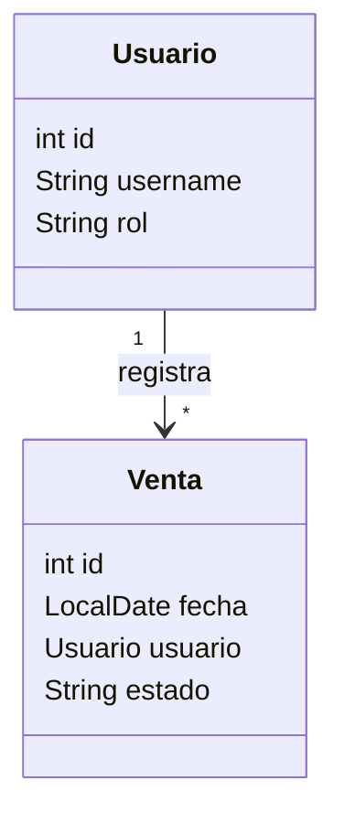

# S10 - Gestión de objetos relacionados Usuario–Venta

## 1. Introducción

Tiempo: 20 min.

### 1.1 Propósito

Incorporar una asociación persistente entre `Usuario` y `Venta` antes de construir el detalle de la operación, reutilizando objetos que permanecerán en el producto final.

### 1.2 Resultado de aprendizaje

El estudiante modela, persiste y presenta ventas asociadas a usuarios, aplicando referencias entre objetos, responsabilidades por capas y validaciones de asociación.

### 1.3 Producto de sesión

Módulo de escritorio que registra una venta inicial asociada a un usuario de prueba y permite listar ventas por usuario.

### 1.4 Alcance metodológico

S10 trabaja la relación del dominio:

```text
Usuario 1 ───── * Venta
```

No implementa todavía:

- Login.
- Verificación de credenciales.
- Clase `Sesion`.
- Roles o permisos.
- Protección de pantallas.
- Colección de detalles de la venta.

En S10 el usuario se selecciona manualmente desde la GUI para probar la asociación. En S13 esa selección se reemplaza por el usuario autenticado conservado en `Sesion`.

### 1.5 Ubicación en el curso

- S8: listado persistente de `Producto`.
- S9: CRUD persistente completo de `Producto`.
- **S10: asociación `Usuario–Venta`.**
- S11: `Venta–DetalleVenta–Producto`.
- S12: evaluación U2.
- S13: login, sesión y permisos.

## 2. Explica

Tiempo: 30 min.

### 2.1 Modelo de objetos



La relación puede implementarse en una sola dirección: `Venta` referencia a `Usuario`. No es obligatorio que `Usuario` almacene una colección de ventas; el servicio puede consultar las ventas asociadas cuando se necesiten.

### 2.2 Responsabilidades

| Componente | Responsabilidad |
|---|---|
| `Usuario` | Representa a quien registra la operación. |
| `Venta` | Conserva fecha, estado y referencia al usuario. |
| `UsuarioDAO` | Lista o busca usuarios de prueba. |
| `VentaDAO` | Registra y consulta ventas con su usuario. |
| Servicio | Valida que el usuario exista y coordina la operación. |
| Controlador | Obtiene la selección de la GUI y construye la venta. |
| Vista | Permite seleccionar usuario y presenta las ventas. |

El docente proporciona el script de las estructuras persistentes. El estudiante no diseña relaciones relacionales ni normaliza tablas.

### 2.3 Preparación para S11 y S13

S11 amplía `Venta` con:

```java
private List<DetalleVenta> detalles;
```

S13 mantiene la misma relación, pero obtiene el usuario de:

```java
Sesion.getUsuarioActual();
```

## 3. Aplica: actividad práctica guiada

Tiempo: 3 h.

### 3.1 Reutilizar Usuario y preparar datos de prueba

Se reutiliza la clase `Usuario` ya conocida en el modelo de POO. Para S10 basta con identificador, nombre de usuario y rol descriptivo. La contraseña no se usa todavía.

El docente proporciona al menos dos usuarios de prueba.

### 3.2 Modelar Venta con referencia a Usuario

```java
public class Venta {
    private int id;
    private LocalDate fecha;
    private Usuario usuario;
    private String estado;

    public Venta(LocalDate fecha, Usuario usuario) {
        if (usuario == null) {
            throw new IllegalArgumentException("La venta requiere un usuario");
        }
        this.fecha = fecha;
        this.usuario = usuario;
        this.estado = "REGISTRADA";
    }
}
```

### 3.3 Definir contratos de acceso

```java
public interface UsuarioDAO {
    List<Usuario> listar();
    Optional<Usuario> buscarPorId(int id);
}

public interface VentaDAO {
    void registrar(Venta venta);
    List<Venta> listarPorUsuario(int usuarioId);
}
```

### 3.4 Construir la GUI de asociación

La vista incluye:

- `ComboBox<Usuario>` con usuarios de prueba.
- Fecha de la venta.
- Botón `Registrar venta`.
- Tabla con identificador, fecha, usuario y estado.
- Filtro opcional por usuario.

El `ComboBox` debe mostrar el nombre, pero conservar el objeto seleccionado.

### 3.5 Coordinar desde el servicio

```java
public void registrarVenta(LocalDate fecha, Usuario usuario) {
    if (usuario == null) {
        throw new ValidacionException("Seleccione un usuario");
    }
    ventaDAO.registrar(new Venta(fecha, usuario));
}
```

La implementación DAO guarda la referencia del usuario y, al consultar, reconstruye ambos objetos. El estudiante recibe la consulta SQL base cuando sea necesario.

### 3.6 Probar la asociación

| Caso | Resultado esperado |
|---|---|
| Usuario válido | La venta se registra asociada al usuario. |
| Usuario no seleccionado | Se muestra una validación y no se registra. |
| Listar por usuario | Solo aparecen sus ventas. |
| Reiniciar la aplicación | La asociación se recupera correctamente. |

### 3.7 Preparar la evolución

No agregar detalles ficticios en S10. Dejar preparado el objeto `Venta` para incorporar la colección en S11 y documentar que el usuario se obtiene manualmente hasta S13.

## 4. Crea: actividad autónoma

Tiempo: 2 h fuera del aula.

Entregar:

```text
S10_POO_Equipo##_ApellidoNombre.pdf
```

Evidencias:

1. Diagrama `Usuario–Venta`.
2. Clase `Venta` con referencia a `Usuario`.
3. Contratos DAO involucrados.
4. GUI con selección de usuario.
5. Venta registrada y recuperada con su usuario.
6. Filtro o listado por usuario.
7. Prueba sin usuario seleccionado.
8. Explicación de qué se pospone para S11 y S13.

## 5. Cierre evaluativo

### 5.1 Resultados esperados

- Modela una asociación entre objetos sin mezclarla con seguridad.
- Persiste y reconstruye `Usuario–Venta`.
- Valida la selección del usuario.
- Presenta ventas por usuario desde la GUI.
- Explica cómo el modelo evolucionará en S11 y S13.

### 5.2 Preguntas de defensa

1. ¿Por qué `Venta` referencia a `Usuario`?
2. ¿Por qué no se implementa login en S10?
3. ¿Es obligatoria una colección de ventas dentro de `Usuario`?
4. ¿Cómo se reconstruye la referencia al consultar?
5. ¿Qué cambiará cuando exista `Sesion`?

### 5.3 Rúbrica

| Dimensión | Peso | 3 - Destacado | 2 - Logro | 1 - Proceso | 0 - Inicio |
|---|---:|---|---|---|---|
| Modelo de objetos | 2 | Asociación clara y responsabilidades correctas. | Asociación funcional. | Asociación incompleta. | No existe relación. |
| Persistencia | 2 | Registra y reconstruye ambos objetos correctamente. | Persistencia funcional. | Recuperación parcial. | No persiste. |
| GUI | 2 | Selección y listado por usuario claros. | GUI funcional. | GUI incompleta. | No integra GUI. |
| Validaciones | 2 | Controla selección y errores con mensajes claros. | Validación suficiente. | Validación parcial. | Permite datos inválidos. |
| Evidencia y defensa | 2 | Evidencia completa y defensa sólida. | Evidencia suficiente. | Evidencia parcial. | No presenta evidencia. |

