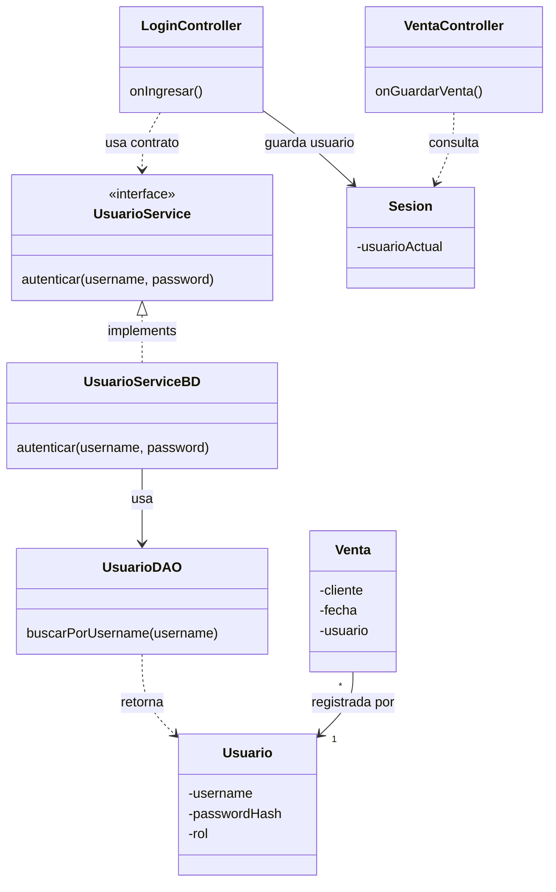

# S10 - Seguridad básica y relación uno a muchos

## 1. Introducción

Tiempo: 20 min.

### 1.1 Propósito

Incorporar seguridad básica mediante usuarios, autenticación simple y operaciones persistentes asociadas a una relación uno a muchos.

### 1.2 Resultado de aprendizaje

El estudiante crea una tabla de usuarios, implementa un login básico, mantiene una sesión activa y asocia operaciones persistentes al usuario autenticado.

### 1.3 Producto de sesión

Autenticación básica y registro de operaciones asociadas a un usuario, usando GUI, servicio, DAO, SQLite y validaciones de acceso.

### 1.4 Motivación de la sesión

Una aplicación de escritorio no solo guarda datos; también debe saber quién realiza una operación. Esta sesión agrega usuario y seguridad básica sin convertir el curso en seguridad avanzada.

Pregunta guía:

```text
Cómo asociamos operaciones persistentes a un usuario autenticado?
```

### 1.5 Ubicación en el curso

- Unidad: U2.
- Avance de sesión: seguridad básica y relación simple uno a muchos.

## 2. Explica

Tiempo: 25 min.

### 2.1 Conceptos clave

- Usuario.
- Autenticación básica.
- Sesión activa.
- Relación uno a muchos.
- Operaciones asociadas al usuario.
- Validación de acceso.
- DAO para usuario.
- Manejo básico de errores.

Regla metodológica de la sesión:

```text
La seguridad se trabaja de forma básica.
Usuario no reemplaza al dominio principal.
Usuario permite asociar operaciones a quien las registra.
La relación uno a muchos se entiende como un usuario con varias operaciones.
Las validaciones de acceso se aplican antes de ejecutar la operación.
```

### 2.2 Arquitectura de la sesión



## 3. Aplica: actividad práctica guiada

Tiempo: 2h.

1. Crear tabla `usuario`.
2. Crear entidad `Usuario`.
3. Crear `UsuarioDAO`.
4. Crear `UsuarioService`.
5. Crear `UsuarioServiceBD`.
6. Crear una clase simple `Sesion`.
7. Diseñar vista de login.
8. Validar usuario y contraseña.
9. Guardar usuario autenticado en sesión.
10. Asociar la venta u operación al usuario actual.
11. Validar que no se pueda operar sin sesión activa.
12. Mostrar mensajes claros de acceso denegado o credenciales incorrectas.

Tablas de referencia:

```sql
CREATE TABLE usuario (
    id INTEGER PRIMARY KEY AUTOINCREMENT,
    username TEXT NOT NULL UNIQUE,
    password_hash TEXT NOT NULL,
    rol TEXT NOT NULL
);

ALTER TABLE venta ADD COLUMN usuario_id INTEGER REFERENCES usuario(id);
```

Nota metodológica:

```text
Para el curso basta seguridad básica.
No se exige implementar seguridad empresarial.
La contraseña no debe guardarse como texto plano en una aplicación real.
```

## 4. Crea: actividad autónoma

Fuera del aula, cada estudiante consolida la autenticación y la relación con operaciones persistentes.

Tiempo: 2h fuera del aula.

### 4.1 Plantilla de evidencia individual

Entrega un PDF con el siguiente nombre:

```text
S10_Equipo##_ApellidoNombre.pdf
```

#### 4.1.1 Datos del estudiante

- Nombre:
- Equipo:
- Sesión: S10 - Seguridad básica y relación uno a muchos
- Rol o aporte realizado:
- Link de GitHub:

#### 4.1.2 Trabajo autónomo realizado

1. Crear usuario de prueba.
2. Implementar login básico.
3. Mantener sesión activa.
4. Asociar una operación al usuario.
5. Evidenciar relación uno a muchos.
6. Validar credenciales incorrectas.
7. Validar operación sin sesión.

#### 4.1.3 Evidencia técnica

- Captura de login.
- Código o fragmento de `UsuarioDAO`.
- Código o fragmento de `UsuarioServiceBD`.
- Evidencia de usuario autenticado.
- Evidencia de operación asociada al usuario.
- Validación de acceso o credenciales.

#### 4.1.4 Error o hallazgo

Describe un problema encontrado al controlar sesión o acceso.

#### 4.1.5 Reflexión técnica breve

Responde en 5 a 8 líneas:

```text
Por qué una operación persistente debe registrar qué usuario la realizó?
```

### 4.2 Criterios mínimos de aceptación

- PDF con nombre correcto.
- Login básico funcional.
- Usuario persistido en SQLite.
- Sesión activa controlada.
- Operación asociada al usuario.
- Validación de acceso.

## 5. Cierre evaluativo

Tiempo: 20 min.

### 5.1 Resultados esperados

- El estudiante explica autenticación básica.
- Usuario se persiste mediante DAO.
- La sesión activa se consulta desde controladores.
- Las operaciones se asocian al usuario.
- Se evidencia relación uno a muchos.
- Se aplican validaciones de acceso.

### 5.2 Evidencia del producto de sesión

Cada estudiante entrega un PDF individual siguiendo la plantilla de la sección 4.1.

### 5.3 Preguntas de defensa y reflexión

1. Qué responsabilidad tiene `UsuarioDAO`?
2. Qué responsabilidad tiene `UsuarioService`?
3. Dónde se guarda el usuario autenticado durante la ejecución?
4. Qué significa relación uno a muchos en esta sesión?
5. Qué validación evita operar sin sesión?
6. Por qué no debe guardarse contraseña en texto plano?

### 5.4 Rúbrica de evaluación

| Dimensión | Peso | 3 - Logro destacado | 2 - Logro | 1 - Proceso | 0 - Inicio | Puntuación obtenida |
|---|---:|---|---|---|---|---:|
| 1. Usuario y login | 2 | Login funcional y usuario persistido correctamente. | Login funcional. | Login parcial. | No evidencia login. | |
| 2. Sesión activa | 2 | Controla sesión y acceso con claridad. | Sesión funcional. | Sesión parcial. | No controla sesión. | |
| 3. Relación uno a muchos | 2 | Operaciones asociadas al usuario correctamente. | Asociación funcional. | Asociación parcial. | No evidencia relación. | |
| 4. Capas | 2 | Controlador, servicio y DAO separados. | Separación suficiente. | Mezcla responsabilidades. | No separa. | |
| 5. Error o hallazgo | 1 | Analiza causa y solución. | Explica un problema. | Menciona un problema. | No presenta. | |
| 6. Orden y reflexión | 1 | Evidencia clara y reflexión precisa. | Evidencia suficiente. | Evidencia incompleta. | No sustenta. | |
