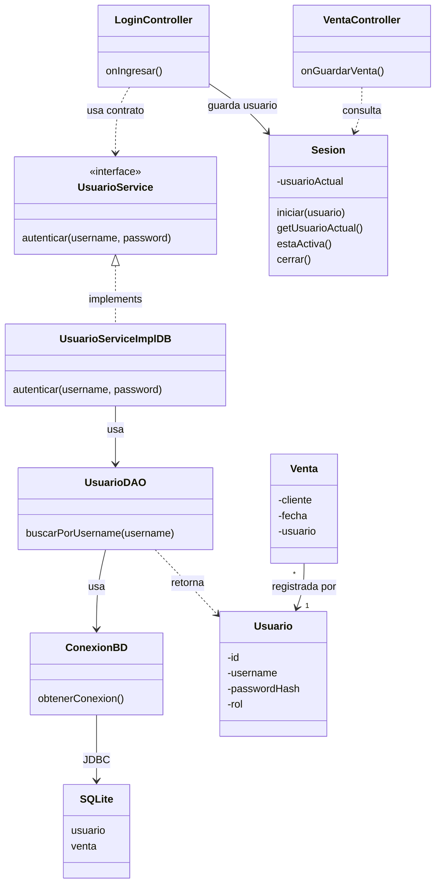

# S10 - Seguridad básica y relación uno a muchos

## 1. Introducción

Tiempo: 20 min.

### 1.1 Propósito

Incorporar seguridad básica mediante usuarios, autenticación simple y operaciones persistentes asociadas a una relación uno a muchos.

### 1.2 Resultado de aprendizaje

El estudiante crea una tabla de usuarios, implementa un login básico, mantiene una sesión activa y asocia operaciones persistentes al usuario autenticado.

### 1.3 Producto de sesión

Autenticación básica y registro de operaciones asociadas a un usuario, usando GUI, servicio, DAO, SQLite y validaciones de acceso.

### 1.4 Motivación de la sesión

Una aplicación de escritorio no solo guarda datos; también debe saber quién realiza una operación. Esta sesión agrega usuario y seguridad básica sin convertir el curso en seguridad avanzada.

Pregunta guía:

```text
Cómo asociamos operaciones persistentes a un usuario autenticado sin consultar la base de datos en cada pantalla?
```

### 1.5 Ubicación en el curso

- Unidad: U2.
- Carpeta de trabajo: `comarket-desk`.
- Avance de sesión: seguridad básica y relación simple uno a muchos.

## 2. Explica

Tiempo: 25 min.

### 2.1 Conceptos clave

- Usuario.
- Autenticación básica.
- Sesión activa en aplicación de escritorio.
- Relación uno a muchos.
- Operaciones asociadas al usuario.
- Validación de acceso.
- DAO para usuario.
- Manejo básico de errores.

Regla metodológica de la sesión:

```text
La seguridad se trabaja de forma básica.
Usuario no reemplaza al dominio principal.
Usuario permite asociar operaciones a quien las registra.
La relación uno a muchos se entiende como un usuario con varias operaciones.
Las validaciones de acceso se aplican antes de ejecutar la operación.
Sesion no es una sesión web.
Sesion es un estado simple de la aplicación de escritorio.
Sesion evita consultar la base de datos cada vez que una pantalla necesita saber qué usuario está autenticado.
`UsuarioDAO` se ubica en `dao` y reutiliza `util/ConexionBD`.
```

### 2.2 Arquitectura de la sesión



## 3. Aplica: actividad práctica guiada

Tiempo: 2h.

### 3.1 Crear tabla `usuario`

```sql
CREATE TABLE usuario (
    id INTEGER PRIMARY KEY AUTOINCREMENT,
    username TEXT NOT NULL UNIQUE,
    password_hash TEXT NOT NULL,
    rol TEXT NOT NULL
);
```

Usuario de prueba:

```sql
INSERT INTO usuario (username, password_hash, rol)
VALUES ('admin', '123456', 'ADMIN');
```

Nota metodológica:

```text
Para la práctica se puede usar texto simple.
En una aplicación real la contraseña debe almacenarse usando hash seguro.
```

### 3.2 Crear entidad `Usuario`

```java
public class Usuario {
    private int id;
    private String username;
    private String passwordHash;
    private String rol;

    public Usuario(int id, String username, String passwordHash, String rol) {
        this.id = id;
        this.username = username;
        this.passwordHash = passwordHash;
        this.rol = rol;
    }

    public int getId() {
        return id;
    }

    public String getUsername() {
        return username;
    }

    public String getPasswordHash() {
        return passwordHash;
    }

    public String getRol() {
        return rol;
    }
}
```

### 3.3 Crear `UsuarioDAO`

`UsuarioDAO` solo conversa con la base de datos.

```java
public class UsuarioDAO {
    public Usuario buscarPorUsername(String username) {
        // SELECT id, username, password_hash, rol
        // FROM usuario
        // WHERE username = ?
        return null;
    }
}
```

### 3.4 Crear `UsuarioService`

```java
public interface UsuarioService {
    Usuario autenticar(String username, String password);
}
```

### 3.5 Crear `UsuarioServiceImplDB`

El servicio decide si las credenciales son válidas. El controlador no debe comparar contraseñas ni ejecutar SQL.

```java
public class UsuarioServiceImplDB implements UsuarioService {
    private UsuarioDAO usuarioDAO = new UsuarioDAO();

    @Override
    public Usuario autenticar(String username, String password) {
        Usuario usuario = usuarioDAO.buscarPorUsername(username);

        if (usuario == null) {
            return null;
        }

        if (!usuario.getPasswordHash().equals(password)) {
            return null;
        }

        return usuario;
    }
}
```

### 3.6 Crear la clase `Sesion`

`Sesion` no reemplaza a la base de datos y no es una sesión web. Es una clase simple que conserva en memoria el usuario autenticado durante la ejecución de la aplicación.

Utilidad:

```text
1. Evita consultar la base de datos en cada pantalla para saber quién está autenticado.
2. Centraliza el estado del usuario actual.
3. Permite asociar operaciones al usuario sin pasar username y password por todo el sistema.
4. Permite validar acceso antes de guardar una operación.
5. Optimiza recursos porque el usuario ya fue validado una vez al iniciar sesión.
```

Implementación simple:

```java
public class Sesion {
    private static Usuario usuarioActual;

    public static void iniciar(Usuario usuario) {
        usuarioActual = usuario;
    }

    public static Usuario getUsuarioActual() {
        return usuarioActual;
    }

    public static boolean estaActiva() {
        return usuarioActual != null;
    }

    public static void cerrar() {
        usuarioActual = null;
    }
}
```

Regla de uso:

```text
LoginController escribe en Sesion después de autenticar.
Los demás controladores solo consultan Sesion.
Ningún controlador debe volver a pedir username/password para cada operación.
```

### 3.7 Diseñar vista de login

Controles mínimos:

- `TextField` para usuario.
- `PasswordField` para contraseña.
- `Button` para ingresar.
- `Label` para mensajes.

### 3.8 Implementar `LoginController`

```java
public class LoginController {
    private UsuarioService usuarioService = new UsuarioServiceImplDB();

    @FXML
    private TextField txtUsername;

    @FXML
    private PasswordField txtPassword;

    @FXML
    private void onIngresar() {
        Usuario usuario = usuarioService.autenticar(
                txtUsername.getText(),
                txtPassword.getText()
        );

        if (usuario == null) {
            // Mostrar mensaje: credenciales incorrectas.
            return;
        }

        Sesion.iniciar(usuario);
        // Abrir ventana principal.
    }
}
```

### 3.9 Asociar una operación al usuario actual

La tabla de operación debe tener una referencia al usuario. En el flujo de venta:

```sql
ALTER TABLE venta ADD COLUMN usuario_id INTEGER REFERENCES usuario(id);
```

Antes de guardar:

```java
if (!Sesion.estaActiva()) {
    // Mostrar mensaje: debe iniciar sesión.
    return;
}

Usuario usuario = Sesion.getUsuarioActual();
venta.setUsuario(usuario);
```

### 3.10 Usar `Sesion` desde `VentaController`

```java
public class VentaController {
    @FXML
    private void onGuardarVenta() {
        if (!Sesion.estaActiva()) {
            // Mostrar alerta: acceso denegado.
            return;
        }

        Usuario usuario = Sesion.getUsuarioActual();

        Venta venta = new Venta();
        venta.setUsuario(usuario);

        // Completar datos de venta y delegar al servicio.
    }
}
```

### 3.11 Validaciones de cierre de sesión

Probar:

1. Login correcto.
2. Login incorrecto.
3. Guardar operación con sesión activa.
4. Intentar guardar operación sin sesión activa.
5. Cerrar sesión y verificar que ya no se pueda operar.
6. Revisar en SQLite que la operación quedó asociada al usuario.

## 4. Crea: actividad autónoma

Fuera del aula, cada estudiante consolida la autenticación y la relación con operaciones persistentes.

Tiempo: 2h fuera del aula.

### 4.1 Plantilla de evidencia individual

Entrega un PDF con el siguiente nombre:

```text
S10_Equipo##_ApellidoNombre.pdf
```

#### 4.1.1 Datos del estudiante

- Nombre:
- Equipo:
- Sesión: S10 - Seguridad básica y relación uno a muchos
- Rol o aporte realizado:
- Link de GitHub:

#### 4.1.2 Trabajo autónomo realizado

1. Crear usuario de prueba.
2. Implementar login básico.
3. Mantener sesión activa.
4. Asociar una operación al usuario.
5. Evidenciar relación uno a muchos.
6. Validar credenciales incorrectas.
7. Validar operación sin sesión.

#### 4.1.3 Evidencia técnica

- Captura de login.
- Código o fragmento de `UsuarioDAO`.
- Código o fragmento de `UsuarioServiceImplDB`.
- Código o fragmento de `Sesion`.
- Evidencia de usuario autenticado.
- Evidencia de operación asociada al usuario.
- Validación de acceso o credenciales.

#### 4.1.4 Error o hallazgo

Describe un problema encontrado al controlar sesión o acceso.

#### 4.1.5 Reflexión técnica breve

Responde en 5 a 8 líneas:

```text
Por qué conviene guardar el usuario autenticado en Sesion en lugar de consultar la base de datos en cada operación?
```

### 4.2 Criterios mínimos de aceptación

- PDF con nombre correcto.
- Login básico funcional.
- Usuario persistido en SQLite.
- Sesión activa controlada.
- Operación asociada al usuario.
- Validación de acceso.

## 5. Cierre evaluativo

Tiempo: 20 min.

### 5.1 Resultados esperados

- El estudiante explica autenticación básica.
- Usuario se persiste mediante DAO.
- La sesión activa se consulta desde controladores.
- Las operaciones se asocian al usuario.
- Se evidencia relación uno a muchos.
- Se aplican validaciones de acceso.
- El estudiante explica por qué `Sesion` evita consultas repetidas a la base de datos.

### 5.2 Evidencia del producto de sesión

Cada estudiante entrega un PDF individual siguiendo la plantilla de la sección 4.1.

### 5.3 Preguntas de defensa y reflexión

1. Qué responsabilidad tiene `UsuarioDAO`?
2. Qué responsabilidad tiene `UsuarioService`?
3. Dónde se guarda el usuario autenticado durante la ejecución?
4. Por qué `Sesion` no es una sesión web?
5. Qué significa relación uno a muchos en esta sesión?
6. Qué validación evita operar sin sesión?
7. Por qué no debe guardarse contraseña en texto plano?

### 5.4 Rúbrica de evaluación

| Dimensión | Peso | 3 - Logro destacado | 2 - Logro | 1 - Proceso | 0 - Inicio | Puntuación obtenida |
|---|---:|---|---|---|---|---:|
| 1. Usuario y login | 2 | Login funcional y usuario persistido correctamente. | Login funcional. | Login parcial. | No evidencia login. | |
| 2. Sesión activa | 2 | Controla sesión y acceso con claridad. | Sesión funcional. | Sesión parcial. | No controla sesión. | |
| 3. Relación uno a muchos | 2 | Operaciones asociadas al usuario correctamente. | Asociación funcional. | Asociación parcial. | No evidencia relación. | |
| 4. Capas | 2 | Controlador, servicio y DAO separados. | Separación suficiente. | Mezcla responsabilidades. | No separa. | |
| 5. Error o hallazgo | 1 | Analiza causa y solución. | Explica un problema. | Menciona un problema. | No presenta. | |
| 6. Orden y reflexión | 1 | Evidencia clara y reflexión precisa. | Evidencia suficiente. | Evidencia incompleta. | No sustenta. | |
