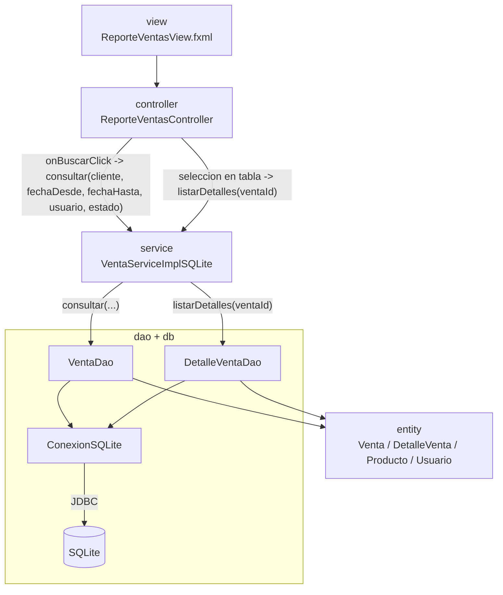

# S11 - Consultas integradas y pruebas

## 1. Introducción

Tiempo: 20 min.

### 1.1 Propósito

Consolidar las consultas de ventas sobre SQLite y validar el flujo principal de CoMarket Desk con evidencias de prueba funcional.

### 1.2 Resultado de aprendizaje

El estudiante consulta datos relacionados (cabecera y detalle), aplica filtros, verifica totales y registra resultados de prueba del flujo principal.

### 1.3 Producto de sesión

Consultas integradas operativas en GUI, verificación de consistencia total cabecera vs detalle y matriz de pruebas S11.

### 1.4 Motivación de la sesión

Registrar ventas no basta. El usuario necesita recuperar informacion con filtros, revisar detalle y validar que los numeros sean consistentes.

Pregunta guia:

```text
Como consultamos informacion relacionada y comprobamos que el flujo completo funciona?
```

### 1.5 Ubicación en el curso

- Unidad: U2.
- Carpeta de trabajo: comarket-desk.
- Avance de sesion: consultas, validaciones y pruebas funcionales antes de la evaluacion.

## 2. Explica

Tiempo: 25 min.

### 2.1 Lo implementado actualmente en el proyecto

- Login previo obligatorio (usuario de prueba: admin / 123456).
- Pestana Consulta de ventas:
  - Lista ventas registradas.
  - Muestra detalle de la venta seleccionada.
  - Permite anular venta activa con confirmacion.
  - Reposicion de stock al anular.
- Pestana Reporte de ventas:
  - Filtro por cliente.
  - Filtro por fecha desde y fecha hasta.
  - Filtro por usuario.
  - Filtro por estado (TODOS, ACTIVA, ANULADA).
  - Vista maestro-detalle.
  - Total mostrado de la consulta.
  - Verificacion de consistencia contra total del detalle.
- Persistencia en SQLite mediante JDBC.
- Validacion de rango de fechas (fecha inicial no mayor a fecha final).

### 2.2 Capas y componentes usados en S11

- Vista (FXML): ConsultaVentasView y ReporteVentasView.
- Controladores: ConsultaVentasController y ReporteVentasController.
- Servicio: VentaService y VentaServiceImplSQLite.
- DAO: VentaDao y DetalleVentaDao.
- Conexion: ConexionSQLite.
- Entidades: Venta, DetalleVenta, Producto, Usuario.

No se uso un ConsultaDAO separado en este avance; la consulta se resuelve en VentaDao con filtros dinamicos.

### 2.3 Arquitectura real de ReporteVentasView



  Flujo implementado en ReporteVentasView:

  1. El usuario aplica filtros (cliente, fecha desde, fecha hasta, usuario, estado) y presiona Buscar.
  2. ReporteVentasController invoca VentaService.consultar(...).
  3. VentaServiceImplSQLite valida el rango de fechas y delega a VentaDao.consultar(...).
  4. VentaDao arma SQL dinamico con los filtros y devuelve la lista de ventas.
  5. Al seleccionar una venta, ReporteVentasController invoca VentaService.listarDetalles(ventaId).
  6. VentaServiceImplSQLite delega a DetalleVentaDao.listarPorVentaId(ventaId) para poblar el detalle.
  7. El controlador calcula total mostrado y consistencia (total cabecera vs suma de detalle).

## 3. Aplica: actividad práctica guiada

Tiempo: 2h.

### 3.1 Preparar datos de prueba

Antes de abrir el reporte, registra ventas con estados y fechas distintas para validar filtros.

Minimo sugerido:

```text
- 1 venta ACTIVA de hoy con usuario admin.
- 1 venta ACTIVA de una fecha anterior.
- 1 venta ANULADA para validar filtro por estado.
```

### 3.2 Diseñar filtros en ReporteVentasView

Controles minimos que debe tener la vista:

- TextField para cliente.
- DatePicker para fecha desde.
- DatePicker para fecha hasta.
- TextField para usuario.
- ComboBox para estado (TODOS, ACTIVA, ANULADA).
- Boton Buscar.
- Boton Limpiar.

### 3.3 Implementar buscar y limpiar en ReporteVentasController

El controlador debe tomar filtros y delegar al servicio.

```java
@FXML
private void onBuscarClick() {
  tablaVentas.getItems().setAll(ventaService.consultar(
      txtFiltroCliente.getText(),
      dpFechaDesde.getValue(),
      dpFechaHasta.getValue(),
      txtFiltroUsuario.getText(),
      cboEstado.getValue()
  ));
}

@FXML
private void onLimpiarFiltrosClick() {
  txtFiltroCliente.clear();
  dpFechaDesde.setValue(null);
  dpFechaHasta.setValue(null);
  txtFiltroUsuario.clear();
  cboEstado.setValue("TODOS");
}
```

### 3.4 Implementar consulta con validacion en el servicio

La validacion de fechas va en servicio, no en la vista.

```java
@Override
public List<Venta> consultar(String cliente, LocalDate fechaDesde,
               LocalDate fechaHasta, String username, String estado) {
  if (fechaDesde != null && fechaHasta != null && fechaDesde.isAfter(fechaHasta)) {
    throw new IllegalArgumentException("La fecha inicial no puede ser mayor que la fecha final.");
  }
  return ventaDao.consultar(cliente, fechaDesde, fechaHasta, username, estado);
}
```

### 3.5 Implementar consulta dinamica en VentaDao

El DAO construye la consulta SQL segun filtros ingresados.

```java
if (!estaVacio(cliente)) {
  sql.append(" AND lower(v.cliente) LIKE lower(?)");
  parametros.add("%" + cliente.trim() + "%");
}
if (fechaDesde != null) {
  sql.append(" AND v.fecha >= ?");
  parametros.add(fechaDesde.toString());
}
if (fechaHasta != null) {
  sql.append(" AND v.fecha <= ?");
  parametros.add(fechaHasta.toString());
}
if (!estaVacio(username)) {
  sql.append(" AND lower(u.username) LIKE lower(?)");
  parametros.add("%" + username.trim() + "%");
}
if (!estaVacio(estado) && !"TODOS".equalsIgnoreCase(estado)) {
  sql.append(" AND v.estado = ?");
  parametros.add(estado);
}
```

### 3.6 Implementar maestro-detalle y consistencia

Al seleccionar una venta, se cargan sus detalles y se compara total de cabecera contra detalle.

```java
tablaVentas.getSelectionModel().selectedItemProperty().addListener(
    (obs, anterior, seleccionado) -> cargarDetalleVenta(seleccionado)
);

private void cargarDetalleVenta(Venta venta) {
  tablaDetallesVenta.getItems().setAll(ventaService.listarDetalles(venta.getId()));
  double totalDetalle = calcularTotalDetalle();
  lblConsistencia.setText(
      "Total detalle: " + formatearMoneda(totalDetalle)
          + " | Diferencia: "
          + formatearMoneda(Math.abs(venta.calcularTotal() - totalDetalle))
  );
}
```

### 3.7 Ejecutar pruebas funcionales de la consulta

Casos obligatorios de prueba manual:

| Caso | Datos | Resultado esperado | Resultado obtenido |
|---|---|---|---|
| Consulta por cliente | Cliente existente | Lista ventas del cliente | |
| Consulta por fecha | Rango con registros | Lista ventas del rango | |
| Consulta por usuario | admin | Lista ventas de admin | |
| Consulta por estado | ACTIVA o ANULADA | Muestra solo ese estado | |
| Rango invalido | fechaDesde mayor que fechaHasta | Mensaje de validacion | |
| Sin resultados | Filtros sin coincidencia | Tabla vacia y total en cero | |
| Ver detalle | Venta seleccionada | Muestra detalle de productos | |
| Consistencia | Venta con detalle | Diferencia igual a S/ 0.00 (o minima) | |

Nota metodologica:

```text
En el estado actual de este proyecto, S11 se valida con pruebas funcionales manuales.
No hay pruebas automatizadas en src/test para este flujo.
```

## 4. Crea: actividad autónoma

Tiempo: 2h fuera del aula.

### 4.1 Evidencia individual solicitada

Entregar PDF con nombre:

```text
S11_Equipo##_ApellidoNombre.pdf
```

Debe incluir:

1. Captura del login y acceso correcto.
2. Captura de Consulta de ventas con detalle seleccionado.
3. Captura de Reporte de ventas aplicando al menos 2 filtros.
4. Captura del resumen de total mostrado.
5. Captura de consistencia total cabecera vs detalle.
6. Registro de una anulacion y su resultado.
7. Matriz de pruebas completa (casos validos e invalidos).
8. Breve explicacion del flujo entre capas.

### 4.2 Criterios mínimos de aceptación

- Consulta maestro-detalle funcional.
- Filtros operativos (cliente, fecha, usuario, estado).
- Totales verificados.
- Prueba de anulacion con reposicion de stock.
- Matriz de pruebas documentada.

## 5. Cierre evaluativo

Tiempo: 20 min.

### 5.1 Resultados esperados

- Consulta de ventas persistentes en GUI.
- Filtros de busqueda aplicados correctamente.
- Detalle visible por seleccion.
- Coherencia de totales comprobada.
- Registro de pruebas funcionales con hallazgos.

### 5.2 Preguntas de defensa

1. Que diferencia existe entre Consulta de ventas y Reporte de ventas en tu implementacion?
2. Que filtros usa Reporte de ventas y donde se aplican?
3. Como se valida el rango de fechas?
4. Como verificas que el total de cabecera coincide con el detalle?
5. Que ocurre al anular una venta y por que?

### 5.3 Rúbrica de evaluación

| Dimension | Peso | 3 - Logro destacado | 2 - Logro | 1 - Proceso | 0 - Inicio | Puntuacion obtenida |
|---|---:|---|---|---|---|---:|
| 1. Consulta integrada | 2 | Consulta y detalle claros, funcionales y consistentes. | Consulta funcional. | Consulta parcial. | No consulta. | |
| 2. Filtros | 2 | Aplica filtros completos y explica su efecto. | Aplica filtros principales. | Filtros incompletos. | No filtra. | |
| 3. Consistencia de datos | 2 | Verifica total cabecera vs detalle sin diferencias relevantes. | Verifica total general. | Verificacion parcial. | No verifica. | |
| 4. Pruebas | 2 | Matriz completa con casos validos e invalidos. | Matriz principal completa. | Matriz parcial. | No presenta pruebas. | |
| 5. Hallazgos y correccion | 1 | Identifica causa y plantea correccion concreta. | Reporta hallazgo con explicacion. | Reporte superficial. | Sin hallazgo. | |
| 6. Sustento tecnico | 1 | Evidencia ordenada y explicacion de capas precisa. | Evidencia suficiente. | Evidencia incompleta. | Sin sustento. | |
