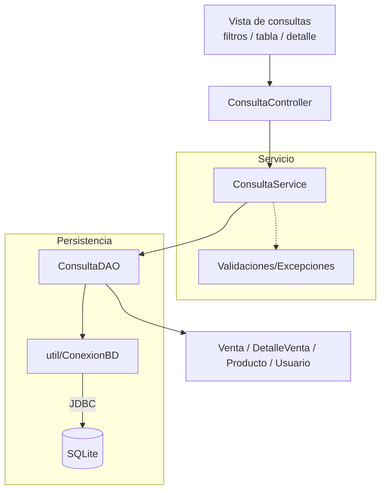

# S11 - Consultas integradas y pruebas

## 1. Introducción

Tiempo: 20 min.

### 1.1 Propósito

Implementar consultas integradas sobre datos persistentes y probar el flujo principal de la aplicación de escritorio.

### 1.2 Resultado de aprendizaje

El estudiante consulta información relacionada, muestra resultados maestro-detalle, filtra datos y documenta pruebas funcionales del flujo principal.

### 1.3 Producto de sesión

Consultas integradas con filtros, vista de detalle, totales y matriz de pruebas del flujo principal.

### 1.4 Motivación de la sesión

Registrar información no es suficiente. Una aplicación debe permitir buscar, revisar, filtrar y explicar los datos que ya fueron guardados.

Pregunta guía:

```text
Cómo consultamos información relacionada y verificamos que el flujo completo funciona?
```

### 1.5 Ubicación en el curso

- Unidad: U2.
- Avance de sesión: consultas, pruebas y correcciones antes de la evaluación.

## 2. Explica

Tiempo: 25 min.

### 2.1 Conceptos clave

- Consulta integrada.
- Búsqueda por criterio.
- Filtro por fecha o usuario.
- Vista maestro-detalle.
- Totales simples.
- Pruebas funcionales.
- Manejo de errores.
- Corrección de observaciones.

Regla metodológica de la sesión:

```text
La validación se aplica en cada sesión.
En S11 no se introduce un patrón nuevo.
S11 consolida consultas y pruebas del flujo principal.
El estudiante debe poder explicar cómo viaja la información entre capas.
Las consultas reutilizan los DAO existentes o un ConsultaDAO, siempre usando util/ConexionBD para conectarse a SQLite.
```

### 2.2 Arquitectura de consulta



## 3. Aplica: actividad práctica guiada

Tiempo: 2h.

1. Crear una vista de consultas.
2. Agregar filtros por fecha, usuario o texto.
3. Crear `ConsultaDAO` o métodos de consulta en DAO existentes.
4. Reutilizar `ConexionBD` desde `util`.
5. Crear `ConsultaService` si el flujo lo requiere.
6. Listar operaciones registradas.
7. Mostrar detalle de la operación seleccionada.
8. Calcular total mostrado.
9. Verificar consistencia entre cabecera y detalle.
10. Probar casos válidos.
11. Probar casos inválidos.
12. Registrar matriz de pruebas.
13. Corregir observaciones encontradas.

Matriz sugerida:

| Caso | Datos | Resultado esperado | Resultado obtenido |
|---|---|---|---|
| Consulta por fecha | Fecha con registros | Lista operaciones | |
| Consulta sin resultados | Fecha sin registros | Mensaje claro | |
| Ver detalle | Operación seleccionada | Muestra detalles | |
| Sin selección | Ninguna fila | Muestra alerta | |
| Total | Operación con detalles | Total correcto | |

## 4. Crea: actividad autónoma

Fuera del aula, cada estudiante consolida consultas y pruebas del flujo principal.

Tiempo: 2h fuera del aula.

### 4.1 Plantilla de evidencia individual

Entrega un PDF con el siguiente nombre:

```text
S11_Equipo##_ApellidoNombre.pdf
```

#### 4.1.1 Datos del estudiante

- Nombre:
- Equipo:
- Sesión: S11 - Consultas integradas y pruebas
- Rol o aporte realizado:
- Link de GitHub:

#### 4.1.2 Trabajo autónomo realizado

1. Implementar al menos una consulta con filtro.
2. Mostrar resultado en tabla.
3. Mostrar detalle del registro seleccionado.
4. Verificar totales.
5. Documentar pruebas.
6. Registrar una corrección aplicada.
7. Explicar el flujo entre capas.

#### 4.1.3 Evidencia técnica

- Captura de consulta.
- Captura de detalle.
- Código o fragmento de consulta.
- Matriz de pruebas.
- Evidencia de corrección aplicada.
- Explicación del flujo `Vista -> Controlador -> Servicio -> DAO -> SQLite`.

#### 4.1.4 Error o hallazgo

Describe un problema encontrado al consultar o mostrar detalle.

#### 4.1.5 Reflexión técnica breve

Responde en 5 a 8 líneas:

```text
Por qué consultar datos relacionados es diferente de listar una sola tabla?
```

### 4.2 Criterios mínimos de aceptación

- PDF con nombre correcto.
- Consulta con filtro.
- Vista maestro-detalle o equivalente.
- Totales verificados.
- Matriz de pruebas.
- Corrección aplicada o hallazgo técnico.

## 5. Cierre evaluativo

Tiempo: 20 min.

### 5.1 Resultados esperados

- El estudiante consulta información persistente relacionada.
- El resultado se muestra en GUI.
- El detalle se muestra al seleccionar un registro.
- Los totales son consistentes.
- Existe matriz de pruebas.
- Las validaciones trabajadas en sesiones previas se mantienen.

### 5.2 Evidencia del producto de sesión

Cada estudiante entrega un PDF individual siguiendo la plantilla de la sección 4.1.

### 5.3 Preguntas de defensa y reflexión

1. Qué consulta implementaste?
2. Qué filtros usaste?
3. Qué DAO participa en la consulta?
4. Cómo muestras el detalle?
5. Cómo verificas el total?
6. Qué corrección aplicaste?

### 5.4 Rúbrica de evaluación

| Dimensión | Peso | 3 - Logro destacado | 2 - Logro | 1 - Proceso | 0 - Inicio | Puntuación obtenida |
|---|---:|---|---|---|---|---:|
| 1. Consulta integrada | 2 | Consulta relacionada, filtrada y funcional. | Consulta funcional. | Consulta parcial. | No consulta. | |
| 2. Vista de resultados | 2 | Tabla y detalle claros. | Resultado funcional. | Vista parcial. | No muestra resultados. | |
| 3. Consistencia | 2 | Totales y detalles coherentes con BD. | Consistencia suficiente. | Inconsistencias menores. | No verifica. | |
| 4. Pruebas | 2 | Matriz cubre casos válidos e inválidos. | Pruebas principales. | Pruebas parciales. | No prueba. | |
| 5. Error o hallazgo | 1 | Analiza causa y solución. | Explica un problema. | Menciona un problema. | No presenta. | |
| 6. Orden y reflexión | 1 | Evidencia clara y reflexión precisa. | Evidencia suficiente. | Evidencia incompleta. | No sustenta. | |
