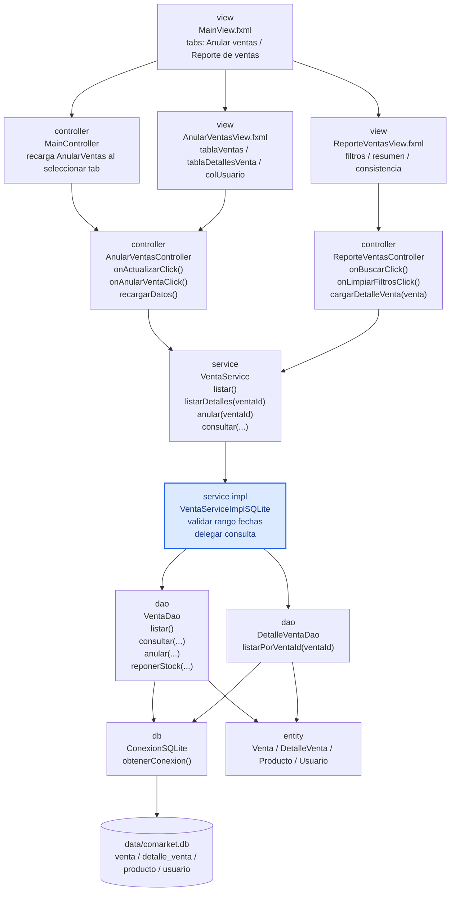

# S11 - Consultas integradas y pruebas

## 1. Introducción

Tiempo: 20 min.

### 1.1 Propósito

Consolidar las consultas de ventas sobre SQLite y validar el flujo principal de CoMarket Desk con evidencias de prueba funcional.

### 1.2 Resultado de aprendizaje

El estudiante consulta datos relacionados (cabecera y detalle), aplica filtros, verifica totales y registra resultados de prueba del flujo principal.

### 1.3 Producto de sesión

Consultas integradas operativas en GUI, verificación de consistencia total cabecera vs detalle y matriz de pruebas S11.

### 1.4 Motivación de la sesión

Registrar ventas no basta. El usuario necesita recuperar información con filtros, revisar detalle y validar que los números sean consistentes.

Pregunta guía:

```text
Cómo consultamos información relacionada y comprobamos que el flujo completo funciona?
```

### 1.5 Ubicación en el curso

- Unidad: U2.
- Carpeta de trabajo: `comarket-desk`.
- Avance de sesión: consultas, validaciones y pruebas funcionales antes de la evaluación.

## 2. Explica

Tiempo: 25 min.

### 2.1 Lo implementado actualmente en el proyecto

- Login previo obligatorio (usuario de prueba: admin / 123456).
- Pestaña Anular ventas:
  - Usa `AnularVentasView.fxml`.
  - Controlador: `AnularVentasController`.
  - Lista ventas registradas.
  - Muestra detalle de la venta seleccionada.
  - Permite anular venta activa con confirmación.
  - Reposición de stock al anular.
  - Muestra el usuario que registró cada venta mediante `colUsuario`.
- Pestaña Reporte de ventas:
  - Usa `ReporteVentasView.fxml`.
  - Controlador: `ReporteVentasController`.
  - Filtro por cliente.
  - Filtro por fecha desde y fecha hasta.
  - Filtro por usuario.
  - Filtro por estado (TODOS, ACTIVA, ANULADA).
  - Vista maestro-detalle.
  - Total mostrado de la consulta.
  - Verificación de consistencia contra total del detalle.
- Persistencia en SQLite mediante JDBC.
- Validación de rango de fechas (fecha inicial no mayor a fecha final).

### 2.2 Capas y componentes usados en S11

- Vista (FXML): `AnularVentasView.fxml` y `ReporteVentasView.fxml`.
- Controladores: `AnularVentasController`, `ReporteVentasController` y `MainController`.
- Servicio: `VentaService` y `VentaServiceImplSQLite`.
- DAO: `VentaDao` y `DetalleVentaDao`.
- Conexión: `ConexionSQLite`.
- Entidades: `Venta`, `DetalleVenta`, `Producto` y `Usuario`.

No se usó un `ConsultaDao` separado en este avance; la consulta se resuelve en `VentaDao.consultar(...)` con filtros dinámicos.

### 2.3 Arquitectura real de S11



Nombres reales del proyecto guía:

```text
com.upeu.comarket.controller.AnularVentasController
com.upeu.comarket.controller.ReporteVentasController
com.upeu.comarket.controller.MainController
com.upeu.comarket.service.VentaService
com.upeu.comarket.service.VentaServiceImplSQLite
com.upeu.comarket.dao.VentaDao
com.upeu.comarket.dao.DetalleVentaDao
com.upeu.comarket.db.ConexionSQLite
src/main/resources/com/upeu/comarket/view/AnularVentasView.fxml
src/main/resources/com/upeu/comarket/view/ReporteVentasView.fxml
```

### 2.4 Flujo implementado en ReporteVentasView

  1. El usuario aplica filtros (cliente, fecha desde, fecha hasta, usuario, estado) y presiona Buscar.
  2. ReporteVentasController invoca VentaService.consultar(...).
  3. VentaServiceImplSQLite valida el rango de fechas y delega a VentaDao.consultar(...).
  4. VentaDao arma SQL dinámico con los filtros y devuelve la lista de ventas.
  5. Al seleccionar una venta, ReporteVentasController invoca VentaService.listarDetalles(ventaId).
  6. VentaServiceImplSQLite delega a DetalleVentaDao.listarPorVentaId(ventaId) para poblar el detalle.
  7. El controlador calcula total mostrado y consistencia (total cabecera vs suma de detalle).

### 2.5 Flujo implementado en AnularVentasView

1. La pestaña carga ventas mediante `ventaService.listar()`.
2. Al seleccionar una venta, se carga el detalle con `ventaService.listarDetalles(ventaId)`.
3. La tabla muestra `estado` y `usuario`.
4. Si el usuario presiona **Anular venta**, `AnularVentasController` valida sesión activa.
5. El controlador pide confirmación.
6. `VentaServiceImplSQLite.anular(ventaId)` repone stock y marca la venta como `ANULADA`.
7. La tabla se refresca después de anular.

## 3. Aplica: actividad práctica guiada

Tiempo: 2h.

### 3.1 Preparar datos de prueba

Antes de abrir el reporte, registra ventas con estados y fechas distintas para validar filtros.

Mínimo sugerido:

```text
- 1 venta ACTIVA de hoy con usuario admin.
- 1 venta ACTIVA de una fecha anterior.
- 1 venta ANULADA para validar filtro por estado.
```

### 3.2 Diseñar filtros en ReporteVentasView

Controles mínimos que debe tener la vista:

- TextField para cliente.
- DatePicker para fecha desde.
- DatePicker para fecha hasta.
- TextField para usuario.
- ComboBox para estado (TODOS, ACTIVA, ANULADA).
- Botón Buscar.
- Botón Limpiar.

### 3.3 Implementar buscar y limpiar en ReporteVentasController

El controlador debe tomar filtros y delegar al servicio.

```java
@FXML
private void onBuscarClick() {
  tablaVentas.getItems().setAll(ventaService.consultar(
      txtFiltroCliente.getText(),
      dpFechaDesde.getValue(),
      dpFechaHasta.getValue(),
      txtFiltroUsuario.getText(),
      cboEstado.getValue()
  ));
}

@FXML
private void onLimpiarFiltrosClick() {
  txtFiltroCliente.clear();
  dpFechaDesde.setValue(null);
  dpFechaHasta.setValue(null);
  txtFiltroUsuario.clear();
  cboEstado.setValue("TODOS");
}
```

### 3.4 Implementar consulta con validación en el servicio

La validación de fechas va en servicio, no en la vista.

```java
@Override
public List<Venta> consultar(String cliente, LocalDate fechaDesde,
               LocalDate fechaHasta, String username, String estado) {
  if (fechaDesde != null && fechaHasta != null && fechaDesde.isAfter(fechaHasta)) {
    throw new IllegalArgumentException("La fecha inicial no puede ser mayor que la fecha final.");
  }
  return ventaDao.consultar(cliente, fechaDesde, fechaHasta, username, estado);
}
```

### 3.5 Implementar consulta dinámica en VentaDao

El DAO construye la consulta SQL según filtros ingresados.

```java
if (!estaVacio(cliente)) {
  sql.append(" AND lower(v.cliente) LIKE lower(?)");
  parametros.add("%" + cliente.trim() + "%");
}
if (fechaDesde != null) {
  sql.append(" AND v.fecha >= ?");
  parametros.add(fechaDesde.toString());
}
if (fechaHasta != null) {
  sql.append(" AND v.fecha <= ?");
  parametros.add(fechaHasta.toString());
}
if (!estaVacio(username)) {
  sql.append(" AND lower(u.username) LIKE lower(?)");
  parametros.add("%" + username.trim() + "%");
}
if (!estaVacio(estado) && !"TODOS".equalsIgnoreCase(estado)) {
  sql.append(" AND v.estado = ?");
  parametros.add(estado);
}
```

### 3.6 Implementar maestro-detalle y consistencia

Al seleccionar una venta, se cargan sus detalles y se compara total de cabecera contra detalle.

```java
tablaVentas.getSelectionModel().selectedItemProperty().addListener(
    (obs, anterior, seleccionado) -> cargarDetalleVenta(seleccionado)
);

private void cargarDetalleVenta(Venta venta) {
  tablaDetallesVenta.getItems().setAll(ventaService.listarDetalles(venta.getId()));
  double totalDetalle = calcularTotalDetalle();
  lblConsistencia.setText(
      "Total detalle: " + formatearMoneda(totalDetalle)
          + " | Diferencia: "
          + formatearMoneda(Math.abs(venta.calcularTotal() - totalDetalle))
  );
}
```

### 3.7 Ejecutar pruebas funcionales de la consulta

Casos obligatorios de prueba manual:

| Caso | Datos | Resultado esperado | Resultado obtenido |
|---|---|---|---|
| Consulta por cliente | Cliente existente | Lista ventas del cliente | |
| Consulta por fecha | Rango con registros | Lista ventas del rango | |
| Consulta por usuario | admin | Lista ventas de admin | |
| Consulta por estado | ACTIVA o ANULADA | Muestra solo ese estado | |
| Rango inválido | fechaDesde mayor que fechaHasta | Mensaje de validación | |
| Sin resultados | Filtros sin coincidencia | Tabla vacía y total en cero | |
| Ver detalle | Venta seleccionada | Muestra detalle de productos | |
| Consistencia | Venta con detalle | Diferencia igual a S/ 0.00 (o mínima) | |
| Anulación | Venta ACTIVA seleccionada | Estado ANULADA y stock repuesto | |

Nota metodológica:

```text
En el estado actual de este proyecto, S11 se valida con pruebas funcionales manuales.
No hay pruebas automatizadas en src/test para este flujo.
```

## 4. Crea: actividad autónoma

Tiempo: 2h fuera del aula.

### 4.1 Evidencia individual solicitada

Entregar PDF con nombre:

```text
S11_Equipo##_ApellidoNombre.pdf
```

Debe incluir:

1. Captura del login y acceso correcto.
2. Captura de Anular ventas con detalle seleccionado.
3. Captura de Reporte de ventas aplicando al menos 2 filtros.
4. Captura del resumen de total mostrado.
5. Captura de consistencia total cabecera vs detalle.
6. Registro de una anulación y su resultado.
7. Matriz de pruebas completa (casos válidos e inválidos).
8. Breve explicación del flujo entre capas.

### 4.2 Criterios mínimos de aceptación

- Consulta maestro-detalle funcional.
- Filtros operativos (cliente, fecha, usuario, estado).
- Totales verificados.
- Prueba de anulación con reposición de stock.
- Matriz de pruebas documentada.

## 5. Cierre evaluativo

Tiempo: 20 min.

### 5.1 Resultados esperados

- Consulta de ventas persistentes en GUI.
- Filtros de búsqueda aplicados correctamente.
- Detalle visible por selección.
- Anulación de venta activa verificada.
- Coherencia de totales comprobada.
- Registro de pruebas funcionales con hallazgos.

### 5.2 Preguntas de defensa

1. Qué diferencia existe entre Anular ventas y Reporte de ventas en tu implementación?
2. Qué filtros usa Reporte de ventas y dónde se aplican?
3. Cómo se valida el rango de fechas?
4. Cómo verificas que el total de cabecera coincide con el detalle?
5. Qué ocurre al anular una venta y por qué?
6. Por qué `VentaDao.consultar(...)` usa `LEFT JOIN usuario`?

### 5.3 Rúbrica de evaluación

| Dimensión | Peso | 3 - Logro destacado | 2 - Logro | 1 - Proceso | 0 - Inicio | Puntuación obtenida |
|---|---:|---|---|---|---|---:|
| 1. Consulta integrada | 2 | Consulta y detalle claros, funcionales y consistentes. | Consulta funcional. | Consulta parcial. | No consulta. | |
| 2. Filtros | 2 | Aplica filtros completos y explica su efecto. | Aplica filtros principales. | Filtros incompletos. | No filtra. | |
| 3. Consistencia de datos | 2 | Verifica total cabecera vs detalle sin diferencias relevantes. | Verifica total general. | Verificación parcial. | No verifica. | |
| 4. Pruebas | 2 | Matriz completa con casos válidos e inválidos. | Matriz principal completa. | Matriz parcial. | No presenta pruebas. | |
| 5. Hallazgos y corrección | 1 | Identifica causa y plantea corrección concreta. | Reporta hallazgo con explicación. | Reporte superficial. | Sin hallazgo. | |
| 6. Sustento técnico | 1 | Evidencia ordenada y explicación de capas precisa. | Evidencia suficiente. | Evidencia incompleta. | Sin sustento. | |
