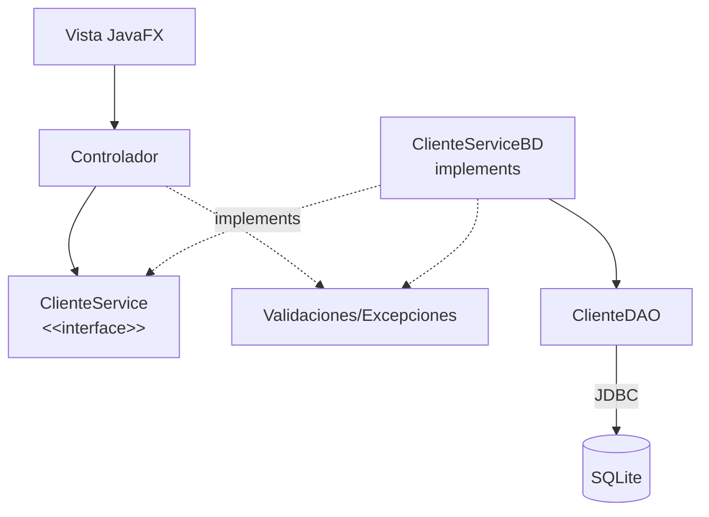

# S11 - Validación de datos y pruebas del flujo principal

## 1. Introducción

Tiempo: 20 min.

### 1.1 Propósito

Fortalecer la calidad del producto mediante validaciones, excepciones controladas y pruebas manuales del flujo principal.

### 1.2 Resultado de aprendizaje

El estudiante valida entradas desde la GUI, controla errores frecuentes y prueba escenarios normales, inválidos y límite.

### 1.3 Producto de sesión

GUI y persistencia validadas con matriz mínima de pruebas del flujo principal.

### 1.4 Motivación de la sesión

Un CRUD que solo funciona con datos perfectos todavía no está listo. El usuario puede dejar campos vacíos, escribir texto dónde va un número o intentar eliminar sin seleccionar.

Pregunta guía:

```text
Cómo hacemos que la aplicación falle menos y avise mejor?
```

### 1.5 Ubicación en el curso

- Unidad: U2.
- Avance de sesión: estabilizacion previa a la evaluación U2.

## 2. Explica

Tiempo: 25 min.

### 2.1 Conceptos clave

- Validación de formularios.
- Mensajes al usuario.
- Excepciones personalizadas o controladas.
- Validaciones del servicio.
- Manejo de errores de persistencia.
- Pruebas manuales.
- Casos validos, inválidos y límite.

Regla métodológica de la sesión:

```text
El controlador valida presencia y formato inmediato de la vista.
El servicio valida reglas del flujo.
El DAO reporta errores de persistencia.
El usuario debe recibir mensajes claros.
```

### 2.2 Flujo de validación



## 3. Aplica: actividad práctica guiada

Tiempo: 2h.

1. Validar campos obligatorios.
2. Validar tipos numéricos cuándo corresponda.
3. Validar rangos.
4. Mostrar alertas claras.
5. Controlar seleccion nula en tabla.
6. Ubicar reglas del flujo principal en el servicio.
7. Controlar errores de DAO desde la implementación persistente.
8. Probar escenarios normales.
9. Probar escenarios inválidos.
10. Registrar una matriz mínima de pruebas.

Matriz sugerida:

| Caso | Datos | Resultado esperado | Resultado obtenido |
|---|---|---|---|
| Registro valido | Campos completos | Guarda y refresca tabla | |
| Registro inválido | Nombre vacio | Muestra alerta | |
| Edición valida | Fila seleccionada | Actualiza SQLite | |
| Eliminación sin seleccionar | Sin fila | Muestra alerta | |
| Error de persistencia | BD no disponible | Mensaje controlado | |

## 4. Crea: actividad autónoma

Fuera del aula, cada estudiante consolida el aprendizaje documentando pruebas del flujo principal y preparando una evidencia individual.

Tiempo: 2h fuera del aula.

### 4.1 Plantilla de evidencia individual

Entrega un PDF con el siguiente nombre:

```text
S11_Equipo##_ApellidoNombre.pdf
```

Ejemplo:

```text
S11_Equipo03_QuispeAna.pdf
```

El PDF debe usar esta estructura. La primera sección define el trabajo autónomo; completa las demás con tus evidencias.

#### 4.1.1 Datos del estudiante

- Nombre:
- Equipo:
- Sesión: S11 - Validación de datos y pruebas del flujo principal
- Rol o aporte realizado:
- Link de GitHub:

#### 4.1.2 Trabajo autónomo realizado

Completa y evidencia estas tareas:

1. Documentar pruebas del flujo principal.
2. Probar al menos dos casos válidos.
3. Probar al menos dos casos inválidos.
4. Evidenciar una alerta o mensaje al usuario.
5. Evidenciar una validación ubicada en el servicio.
6. Evidenciar un error controlado de persistencia o selección.
7. Registrar una corrección aplicada.

#### 4.1.3 Evidencia técnica

Incluye capturas o salidas con una breve explicación debajo de cada una:

- Matriz de pruebas.
- Capturas de alertas.
- Un error controlado.
- Una validación ubicada en el servicio.
- Una corrección aplicada.
- Evidencia de que el flujo principal queda operativo.

#### 4.1.4 Error o hallazgo

Describe al menos un error, diferencia o hallazgo técnico:

- Qué ocurrió.
- Cómo lo diagnosticaste.
- Cómo lo corregiste o qué aprendiste.

Ejemplos válidos:

- El formulario aceptaba datos vacíos.
- La tabla permitía eliminar sin selección.
- El DAO lanzaba un error sin mensaje claro.
- Una validación estaba duplicada en controlador y servicio.

#### 4.1.5 Reflexión técnica breve

Responde en 5 a 8 líneas:

```text
Por qué probar casos inválidos es tan importante como probar casos correctos?
```

### 4.2 Criterios mínimos de aceptación

La evidencia individual se considera completa si:

- El archivo respeta el nombre `S11_Equipo##_ApellidoNombre.pdf`.
- Incluye evidencias técnicas legibles.
- Presenta matriz de pruebas.
- Muestra casos válidos e inválidos.
- Muestra alertas o mensajes al usuario.
- Muestra una validación ubicada en el servicio.
- Explica una corrección aplicada.
- No contiene solo pantallazos: cada evidencia tiene una descripción breve.

## 5. Cierre evaluativo

Tiempo: 20 min.

Esta sección conecta el resultado de aprendizaje de la sesión con el producto que debe evidenciar cada estudiante.

### 5.1 Resultados esperados

- La GUI valida datos antes de guardar.
- Los errores se comunican al usuario.
- El servicio concentra validaciones del flujo y excepciones controladas.
- Existen pruebas manuales documentadas.
- El flujo principal queda listo para evaluación U2.

### 5.2 Evidencia del producto de sesión

Cada estudiante entrega un PDF individual siguiendo la plantilla de la sección 4.1.

Nombre del archivo:

```text
S11_Equipo##_ApellidoNombre.pdf
```

La evidencia debe demostrar:

- Producto de sesión construido.
- Aporte individual verificable.
- Validaciones y pruebas documentadas.
- Reflexión técnica breve.

La revisión se realiza con los criterios mínimos de aceptación de la sección 4.2 y la rúbrica de la sección 5.4.

### 5.3 Preguntas de defensa y reflexión

1. Qué validaciones implementaste?
2. Qué validación pertenece al controlador y cuál al servicio?
3. Qué errores controlaste?
4. Qué caso límite probaste?
5. Cómo sabes que el flujo principal funciona?
6. Qué caso inválido te ayudó a encontrar un problema real?

### 5.4 Rúbrica de evaluación

| Dimensión | Peso | 3 - Logro destacado | 2 - Logro | 1 - Proceso | 0 - Inicio | Puntuación obtenida |
|---|---:|---|---|---|---|---:|
| 1. Validaciones | 2 | Validaciones claras en controlador y servicio según responsabilidad. | Validaciones principales funcionales. | Validaciones parciales. | No evidencia validaciones. | |
| 2. Manejo de errores | 2 | Errores controlados con mensajes claros al usuario. | Errores principales controlados. | Control parcial de errores. | No controla errores. | |
| 3. Matriz de pruebas | 2 | Matriz cubre casos válidos, inválidos y límite. | Matriz cubre casos principales. | Matriz incompleta. | No presenta matriz. | |
| 4. Corrección aplicada | 2 | Evidencia problema, causa y corrección funcional. | Evidencia corrección principal. | Corrección poco clara. | No evidencia corrección. | |
| 5. Error o hallazgo | 1 | Analiza error/hallazgo, causa, solución y aprendizaje técnico. | Explica un problema y una solución. | Menciona un problema sin análisis. | No presenta error ni hallazgo. | |
| 6. Reflexión y orden | 1 | PDF ordenado, evidencias legibles y reflexión precisa. | Evidencias suficientes y reflexión clara. | Evidencias incompletas o reflexión superficial. | PDF desordenado o sin reflexión. | |

Puntuación acumulada = suma de (`Peso` * `Puntuación obtenida`) = ____.

Nota final = (`Puntuación acumulada` / 30) * 20 = ____.

Para usar la rúbrica con IA, solicita:

```text
Evalúa el PDF usando la rúbrica de la sesión.
Para cada dimensión selecciona la puntuación obtenida usando la escala Inicio=0, Proceso=1, Logro=2, Logro destacado=3.
Justifica brevemente cada puntuación.
Calcula la puntuación acumulada con la fórmula: suma de (Peso * Puntuación obtenida).
Calcula la nota final sobre 20 con la fórmula: (Puntuación acumulada / 30) * 20.
Indica 2 fortalezas y 2 recomendaciones.
```

