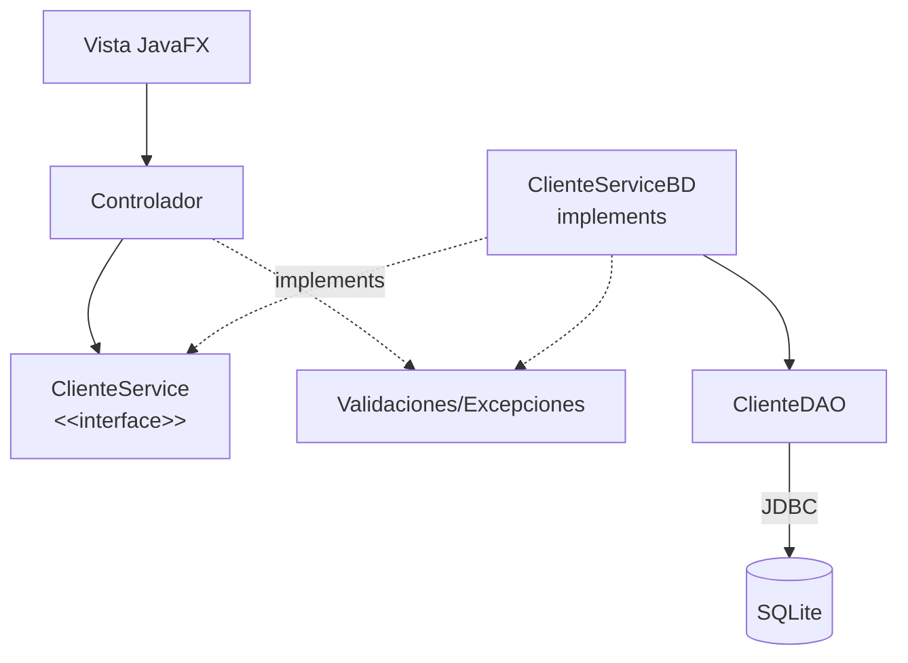

# S11 - Validación de datos y pruebas del flujo principal

## 1. Introducción

Tiempo: 20 min.

### 1.1 Propósito

Fortalecer la calidad del producto mediante validaciones, excepciones controladas y pruebas manuales del flujo principal.

### 1.2 Resultado de aprendizaje

El estudiante valida entradas desde la GUI, controla errores frecuentes y prueba escenarios normales, inválidos y límite.

### 1.3 Producto de sesión

GUI y persistencia validadas con matriz mínima de pruebas del flujo principal.

### 1.4 Motivación de la sesión

Un CRUD qué solo funcióna con datos perfectos todavía no está listo. El usuario puede dejar campos vacios, escribir texto dónde va un número o intentar eliminar sin seleccionar.

Pregunta guía:

```text
Cómo hacemos que la aplicación falle menos y avise mejor?
```

### 1.5 Ubicación en el curso

- Unidad: U2.
- Avance de sesión: estabilizacion previa a la evaluación U2.

## 2. Explica

Tiempo: 25 min.

### 2.1 Conceptos clave

- Validación de formularios.
- Mensajes al usuario.
- Excepciones personalizadas o controladas.
- Validaciones del servicio.
- Manejo de errores de persistencia.
- Pruebas manuales.
- Casos validos, inválidos y límite.

Regla métodológica de la sesión:

```text
El controlador valida presencia y formato inmediato de la vista.
El servicio valida reglas del flujo.
El DAO reporta errores de persistencia.
El usuario debe recibir mensajes claros.
```

### 2.2 Flujo de validación



## 3. Aplica: actividad practica guíada

Tiempo: 2h.

1. Validar campos obligatorios.
2. Validar tipos numéricos cuándo corresponda.
3. Validar rangos.
4. Mostrar alertas claras.
5. Controlar seleccion nula en tabla.
6. Ubicar reglas del flujo principal en el servicio.
7. Controlar errores de DAO desde la implementacion persistente.
8. Probar escenarios normales.
9. Probar escenarios inválidos.
10. Registrar una matriz mínima de pruebas.

Matriz sugerida:

| Caso | Datos | Resultado esperado | Resultado obtenido |
|---|---|---|---|
| Registro valido | Campos completos | Guarda y refresca tabla | |
| Registro inválido | Nombre vacio | Muestra alerta | |
| Edición valida | Fila seleccionada | Actualiza SQLite | |
| Eliminación sin seleccionar | Sin fila | Muestra alerta | |
| Error de persistencia | BD no disponible | Mensaje controlado | |

## 4. Crea: actividad autónoma

Tiempo: 2h fuera del aula.

Documenta pruebas del flujo principal.

Entrega evidencia breve con:

- Matriz de pruebas.
- Capturas de alertas.
- Un error controlado.
- Una validación ubicada en el servicio.
- Una corrección aplicada.

## 5. Cierre evaluativo

Tiempo: 20 min.

### 5.1 Resultados esperados

- La GUI valida datos antes de guardar.
- Los errores se comúnican al usuario.
- El servicio concentra validaciones del flujo y excepciones controladas.
- Existen pruebas manuales documentadas.
- El flujo principal queda listo para evaluación U2.

### 5.2 Preguntas de defensa

1. Qué validaciones implementaste?
2. Qué validación pertenece al controlador y cuál al servicio?
3. Qué errores controlaste?
4. Qué caso límite probaste?
5. Cómo sabes qué el flujo principal funcióna?
