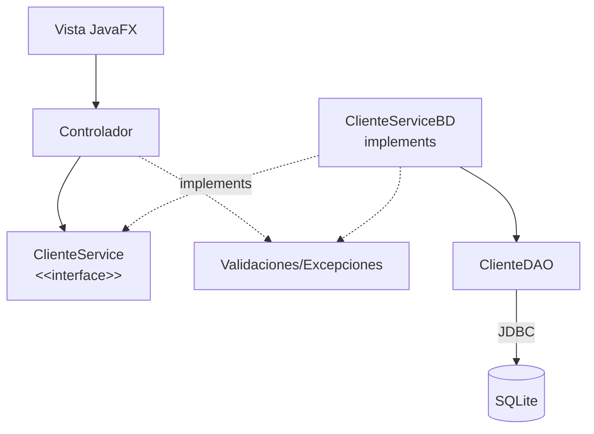

# S11 - Validacion de datos y pruebas del flujo principal

## 1. Introduccion

Tiempo: 20 min.

### 1.1 Proposito

Fortalecer la calidad del producto mediante validaciones, excepciones controladas y pruebas manuales del flujo principal.

### 1.2 Resultado de aprendizaje

El estudiante valida entradas desde la GUI, controla errores frecuentes y prueba escenarios normales, invalidos y limite.

### 1.3 Producto de sesion

GUI y persistencia validadas con matriz minima de pruebas del flujo principal.

### 1.4 Motivacion de la sesion

Un CRUD que solo funciona con datos perfectos todavia no esta listo. El usuario puede dejar campos vacios, escribir texto donde va un numero o intentar eliminar sin seleccionar.

Pregunta guia:

```text
Como hacemos que la aplicacion falle menos y avise mejor?
```

### 1.5 Ubicacion en el curso

- Unidad: U2.
- Avance de sesion: estabilizacion previa a la evaluacion U2.

## 2. Explica

Tiempo: 25 min.

### 2.1 Conceptos clave

- Validacion de formularios.
- Mensajes al usuario.
- Excepciones personalizadas o controladas.
- Validaciones del servicio.
- Manejo de errores de persistencia.
- Pruebas manuales.
- Casos validos, invalidos y limite.

Regla metodologica de la sesion:

```text
El controlador valida presencia y formato inmediato de la vista.
El servicio valida reglas del flujo.
El DAO reporta errores de persistencia.
El usuario debe recibir mensajes claros.
```

### 2.2 Flujo de validacion



## 3. Aplica: actividad practica guiada

Tiempo: 2h.

1. Validar campos obligatorios.
2. Validar tipos numericos cuando corresponda.
3. Validar rangos.
4. Mostrar alertas claras.
5. Controlar seleccion nula en tabla.
6. Ubicar reglas del flujo principal en el servicio.
7. Controlar errores de DAO desde la implementacion persistente.
8. Probar escenarios normales.
9. Probar escenarios invalidos.
10. Registrar una matriz minima de pruebas.

Matriz sugerida:

| Caso | Datos | Resultado esperado | Resultado obtenido |
|---|---|---|---|
| Registro valido | Campos completos | Guarda y refresca tabla | |
| Registro invalido | Nombre vacio | Muestra alerta | |
| Edicion valida | Fila seleccionada | Actualiza SQLite | |
| Eliminacion sin seleccionar | Sin fila | Muestra alerta | |
| Error de persistencia | BD no disponible | Mensaje controlado | |

## 4. Crea: actividad autonoma

Tiempo: 2h fuera del aula.

Documenta pruebas del flujo principal.

Entrega evidencia breve con:

- Matriz de pruebas.
- Capturas de alertas.
- Un error controlado.
- Una validacion ubicada en el servicio.
- Una correccion aplicada.

## 5. Cierre evaluativo

Tiempo: 20 min.

### 5.1 Resultados esperados

- La GUI valida datos antes de guardar.
- Los errores se comunican al usuario.
- El servicio concentra validaciones del flujo y excepciones controladas.
- Existen pruebas manuales documentadas.
- El flujo principal queda listo para evaluacion U2.

### 5.2 Preguntas de defensa

1. Que validaciones implementaste?
2. Que validacion pertenece al controlador y cual al servicio?
3. Que errores controlaste?
4. Que caso limite probaste?
5. Como sabes que el flujo principal funciona?
