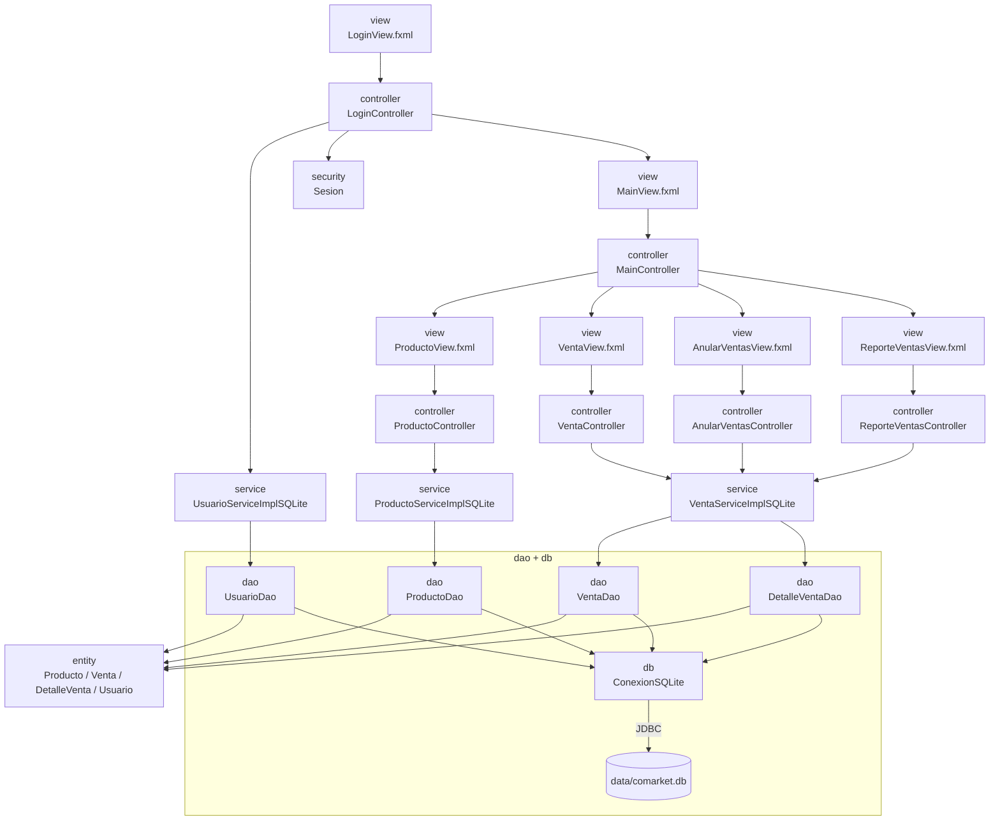

# S12 - Aplicaciones de escritorio por capas y gestión de datos persistentes (Evaluación U2)

## 1. Introducción

Tiempo: 20 min.

### 1.1 Propósito

Validar la aplicación de escritorio por capas con GUI, DAO, SQLite, operaciones persistentes, relaciones entre objetos, seguridad básica, consultas y pruebas.

### 1.2 Resultado de aprendizaje

El estudiante demuestra que puede construir, ejecutar, probar y defender una aplicación JavaFX organizada por capas, con persistencia relacional y operaciones sobre objetos relacionados.

### 1.3 Producto de sesión

Producto U2 integrado: GUI JavaFX, controladores, servicios, entidades, DAO, SQLite, relación muchos a muchos, relación uno a muchos, seguridad básica, consultas y evidencias de pruebas.

### 1.4 Motivación de la sesión

Una aplicación de escritorio se evalúa por el flujo completo: el usuario ingresa, opera pantallas, el controlador delega, el servicio coordina, el DAO persiste y las consultas muestran información consistente.

Preguntas para los estudiantes:

1. Qué evidencia demuestra que la GUI funciona integrada con SQLite?
2. Qué parte puedes defender individualmente?
3. Qué revisas cuando una operación no aparece en una consulta?

### 1.5 Ubicación en el curso

- Unidad: U2 - Aplicación de escritorio con persistencia de datos.
- Producto de unidad: aplicación de escritorio funcional con arquitectura por capas, interfaz gráfica y persistencia en base de datos relacional.
- Carpeta de trabajo: `comarket-desk`.
- Avance de sesión: evaluación integradora antes de la integración final en U3.

## 2. Explica

Tiempo: 15 min.

### 2.1 Conceptos clave

- Integración GUI-persistencia.
- Arquitectura por capas.
- DAO y JDBC.
- Relación muchos a muchos mediante detalle.
- Relación uno a muchos asociada al usuario.
- Seguridad básica.
- Consultas integradas.
- Pruebas manuales.

### 2.2 Arquitectura real del producto U2



### 2.3 Criterios mínimos de cierre U2

- Login funcional con usuario admin.
- Sesión activa visible en ventana principal.
- CRUD persistente de productos en SQLite.
- Registro de venta con cabecera y detalle.
- Asociación de venta al usuario autenticado.
- Anular ventas con detalle, estado, usuario y anulación.
- Reporte de ventas con filtros (cliente, fecha, usuario, estado).
- Consistencia total cabecera vs detalle validada.
- Matriz de pruebas funcionales completa.

## 3. Aplica: evaluación práctica

Tiempo: 3h.

### 3.1 Ejecutar la aplicación y autenticar

1. Ejecutar comarket-desk.
2. Ingresar con admin / 123456.
3. Confirmar que la ventana principal muestra el usuario autenticado.

### 3.2 Demostrar CRUD persistente de productos

1. Registrar un producto nuevo.
2. Editar el producto.
3. Eliminar un producto según el flujo disponible.
4. Confirmar que los cambios se mantienen al recargar la pantalla.

### 3.3 Demostrar venta con cabecera y detalle

1. Registrar una venta con al menos dos detalles.
2. Verificar validaciones (cantidad mayor a cero y stock suficiente).
3. Confirmar que la venta queda asociada al usuario autenticado.

### 3.4 Demostrar anulación de ventas

1. Abrir Anular ventas.
2. Seleccionar una venta y mostrar su detalle.
3. Verificar que se muestra el usuario que registró la venta.
4. Anular una venta activa.
5. Verificar cambio de estado a ANULADA y reposición de stock.

### 3.5 Demostrar reporte de ventas y consistencia

1. Abrir Reporte de ventas.
2. Probar filtros por cliente, rango de fechas, usuario y estado.
3. Seleccionar una venta filtrada y mostrar detalle.
4. Verificar total mostrado y diferencia de consistencia.

### 3.6 Ejecutar matriz final de pruebas U2

| Caso | Evidencia esperada | Resultado obtenido |
|---|---|---|
| Login correcto e incorrecto | Control de acceso funcional | |
| CRUD de productos | Persistencia correcta en GUI | |
| Registro de venta | Cabecera y detalle guardados | |
| Usuario en venta | Venta asociada a admin | |
| Anular ventas | Maestro-detalle operativo, usuario visible y anulación | |
| Anulación | Estado ANULADA y stock repuesto | |
| Reporte con filtros | Filtrado correcto por criterios | |
| Consistencia | Total cabecera coincide con detalle | |

Nota metodológica:

```text
En el estado actual del proyecto, el cierre U2 se sustenta con pruebas funcionales manuales.
No hay suite automatizada en src/test para este producto.
```

## 4. Crea: evidencia individual

Tiempo: 4h fuera del aula.

### 4.1 Plantilla de evidencia individual

Entrega un PDF con el siguiente nombre:

```text
S12_Equipo##_ApellidoNombre.pdf
```

#### 4.1.1 Datos del estudiante

- Nombre:
- Equipo:
- Sesión: S12 - Aplicaciones de escritorio por capas y gestión de datos persistentes (Evaluación U2)
- Rol o aporte realizado:
- Link de GitHub:

#### 4.1.2 Trabajo autónomo realizado

1. Ordenar evidencias de U2.
2. Registrar aporte individual.
3. Corregir observaciones.
4. Preparar defensa técnica.
5. Documentar flujo integrado.

#### 4.1.3 Evidencia técnica

- Capturas de GUI.
- Evidencia de registros en SQLite.
- Código o descripción de DAO.
- Código o descripción de servicios.
- Evidencia de seguridad básica.
- Evidencia de relación muchos a muchos.
- Evidencia de relación uno a muchos.
- Consulta integrada.
- Matriz mínima de pruebas.
- Aporte individual.

#### 4.1.4 Error o hallazgo

Describe un problema de integración y cómo lo diagnosticaste.

#### 4.1.5 Reflexión técnica breve

Explica cómo fluye una operación desde la vista hasta SQLite.

### 4.2 Criterios mínimos de aceptación

- PDF con nombre correcto.
- Evidencia de aplicación JavaFX funcionando.
- CRUD persistente demostrado.
- Operación con detalle demostrada.
- Seguridad básica demostrada.
- Consulta integrada demostrada.
- Validaciones demostradas.
- Aporte individual verificable.

## 5. Cierre evaluativo

Tiempo: 20 min.

### 5.1 Resultados esperados

- Producto U2 ejecutado.
- Persistencia demostrada.
- Relaciones entre objetos explicadas.
- Seguridad básica operativa.
- Consultas integradas funcionando.
- Validaciones y pruebas documentadas.
- Evidencia individual entregada.

### 5.2 Evidencia del producto de sesión

Cada estudiante entrega un PDF individual siguiendo la plantilla de la sección 4.1.

### 5.3 Preguntas de defensa y reflexión

1. Cómo fluye una operación desde la vista hasta SQLite?
2. Qué responsabilidad tiene el controlador?
3. Qué responsabilidad tiene el servicio?
4. Qué responsabilidad tiene el DAO?
5. Cómo se guarda una operación con detalles?
6. Qué relación se asocia al usuario?
7. Qué consulta integrada implementaste?
8. Qué mejorarás en U3?

### 5.4 Rúbrica de evaluación

| Dimensión | Peso | 3 - Logro destacado | 2 - Logro | 1 - Proceso | 0 - Inicio | Puntuación obtenida |
|---|---:|---|---|---|---|---:|
| 1. GUI funcional | 2 | GUI completa, clara y conectada al flujo principal. | GUI principal funcional. | GUI parcial o inestable. | No ejecuta GUI. | |
| 2. Capas y responsabilidades | 2 | `controller`, `service`, `entity` y `dao` bien separados. | Separación suficiente. | Mezclas importantes. | No separa. | |
| 3. Persistencia y relaciones | 2 | CRUD simple, detalle y relaciones persistentes funcionando. | Persistencia principal funcional. | Persistencia incompleta. | No persiste. | |
| 4. Seguridad y consultas | 2 | Login, usuario asociado y consultas integradas funcionando. | Funcionalidad principal presente. | Funcionalidad parcial. | No evidencia. | |
| 5. Evidencia individual | 1 | Evidencia clara, ordenada y verificable. | Evidencia suficiente. | Evidencia incompleta. | No entrega. | |
| 6. Defensa técnica | 1 | Responde con precisión y criterio. | Responde adecuadamente. | Responde parcialmente. | No sustenta. | |
